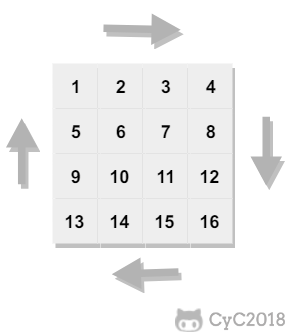

<!-- TOC -->

## 算法基础

- [x] 数组
- [x] 指针
- [x] 字符串
- [x] 顺序表
- [x] 链表
- [x] 栈
- [x] 队列
- [x] 树
- [ ] 图
- [x] 排序
- [x] 查找
- [x] 递归
- [x] 回溯
- [ ] 贪心
- [ ] 动态规划

#### 99乘法表(MultiplicationTable)

```c
#include <stdio.h>
int main() {
    int i, j;
    for (i = 1; i <= 9; i++) {
        for (j = 1; j <= i; j++) {
            printf("%d*%d=%-2d ", j, i, j * i);
        }
        printf("\n");
    }

    return 0;
}
```

```c
// 方法二：
#include <iostream>
#include <cstdio>
using namespace std;

void MultiplicationTable() {
    for (int i = 1; i <= 9; i++) {
        for (int j = 1; j <= i; j++) {
            cout << j << "*" << i << "=" << j*i << " ";
            if (j == 2 && (i == 3 || i == 4)) {
                cout << " ";
            }
        } 
        cout << "\n";
    }
}

int main() {
    MultiplicationTable();
    getchar();
    return 0;
}
```

#### 杨辉三角(YangHuiTrangle)

```c
/**
 * Creation         :       2019.04.04 21:12
 * Last Reversion   :       2019.03.04 21:25
 * Author           :       Lingyong Smile {smilelingyong@163.com}
 * File Type        :       cpp
 * -----------------------------------------------------------------
 * BFSShortestPath(骑士最短路径)
 * 问题描述：
 *    杨慧三角(YangHuiTriangleI)
 * 思路：
 *    先定义一个二维数组：a[N][N]，略大于要打印的行数。再令两边的数为1,
 * 即当每行的第一个数和最后一个数为1。a[i][0]=a[i][i-1]=1，n为行数。除
 * 两边的数外，任何一个数为上两顶数之和，即a[i][j]=a[i-1][j-1]+a[i-1][j]。
 * 最后输出杨辉三角。

请输入要打印的行数：10
10行杨辉三角如下：
                                1
                             1     1
                          1     2     1
                       1     3     3     1
                    1     4     6     4     1
                 1     5    10    10     5     1
              1     6    15    20    15     6     1
           1     7    21    35    35    21     7     1
        1     8    28    56    70    56    28     8     1
     1     9    36    84   126   126    84    36     9     1
 * -----------------------------------------------------------------
 * Crop right @ 2019 Lingyong Smile {smilelingyong@163.com}
 */
#include <stdio.h>
#define N 14
int main() {
    int i, j, k, n = 0, a[N][N];        // 定义二维数组a[14][14]
    while (n <= 0 || n >= 13) {         // 控制打印的行数不要太大，过大会造成显示不规范
        printf("请输入要打印的行数：");
        scanf("%d", &n);
    }
    printf("%d行杨辉三角如下：\n", n);
    for (i = 1; i <= n; i++)
        a[i][1] = a[i][i] = 1;          // 两边的数令它为1，因为现在循环从1开始，就认为a[i][1]为第一个数
            
    for (i = 3; i <= n; i++)
        for (j = 2; j <= i - 1; j++)
            a[i][j] = a[i - 1][j - 1] + a[i - 1][j];      // 除两边的数外都等于上两顶数之和
                     
    for (i = 1; i <= n; i++) {
        for (k = 1; k <= n - i; k++)
            printf("   ");              // 这一行主要是在输出数之前打上空格占位，让输出的数更美观
        for (j = 1; j <= i; j++)        // j<=i的原因是不输出其它的数，只输出我们想要的数
            printf("%6d", a[i][j]);
        printf("\n");                   // 当一行输出完以后换行继续下一行的输出
    }
    printf("\n");
    return 0;
}
```

#### 水仙花数(DaffodiNumber)

```c
/**
水仙花数
	打印出所有的"水仙花数"，所谓"水仙花数"是指一个三位数，其各位数字立方和等于该数本身。
	例如：153是一个"水仙花数"，因为153=1的三次方＋5的三次方＋3的三次方。
*/
#include <stdio.h>

void DaffodilNumber() {
    int a, b, c;
    for (int i = 100; i <= 999; i++) {
        a = i / 100;
        b = (i - a * 100) / 10;  // equals to: b = (a % 100) / 10;
        c = i % 10;
        if ((a * a * a + b * b * b + c * c * c) == i) {
            printf("%d ", i);
        }
    }
}

int main() {
    DaffodilNumber();
    return 0;
}
```

#### 完全平方数(CompleteSquareNum)

```c++
/**
 * CompleteSquareNum(完全平方数+)
 *      按要求输出：在三位整数(100至999)中寻找符合条件的整数并依次从小到大存入数组中；
 * 他既是完全平方数,又是两位数字相同，例如144,676等
 */
#include <stdio.h>
#include <math.h>

int IsSquare(int num) {
    int sqr = (int)(sqrt(num * 1.0));
    return (sqr*sqr == num || (sqr+1)*(sqr+1) == num);
}

int IsTwoSame(int num) {
    int digit0, digit1, digit2;
    digit0 = num%10;
	digit1 = (num/10)%10;
	digit2 = (num/100)%10;
    return (digit0==digit1 || digit0==digit2 || digit1==digit2);
}

int main() {   
    int a = 0, b = 0, c = 0; 
    for(int i = 100; i <= 999; i++)
        if (IsSquare(i) && IsTwoSame(i)) 
            printf("%d\n", i);
    return 0;
}
```

#### 闰年 (LeapYear)

```c
/**
闰年 
	闰年满足以下条件①②之一即可
	①能被4整除，但不能被100整除
	②能被400整除
*/
#include <stdio.h>

int LeapYear(int n) {
    if ((n % 4 == 0 && n % 100 != 0) || n % 400 == 0) 
        return 1;
    else
        return 0;
}

int main(){
    int year;
    printf("Please input a year number:");
    while(scanf("%d", &year) != EOF){
        if(LeapYear(year))
            printf("%d is a leap year!\n", year);
        else
            printf("%d is not a leap year!\n", year);
        printf("Please input a year number:");
    }
    return 0;
}
```

#### 质数 (PrimeNumber)

```c
/**
质数 
	输入一个数，判断其是否是质数 
	如果是合数，那么它的最小质因数肯定小于等于他的平方根 	
*/
#include <stdio.h>

int PrimeNumber(int n) {
    for(int i = 2; i * i <= n; i++)
        if (n % i == 0) 
            return 0;
    return 1;
}

int main() {
    int n;
    printf("Please input a int number:");
    while(scanf("%d", &n) != EOF){
        if (PrimeNumber(n))
            printf("%d is a prime number!\n", n);
        else
            printf("%d is not a prime number!\n", n);
        printf("Please input a int number:");
    }
    return 0;
}
```

#### 正整数分解(PosIntDecomposite)

```c
/**
 * Creation         :       2019.04.09 11:03
 * Last Reversion   :       2019.04.09 11:23
 * Author           :       Lingyong Smile {smilelingyong@163.com}
 * File Type        :       cpp
 * -----------------------------------------------------------------
 * 正整数分解(PosIntDecomposite)
 * 问题描述：
 *    将一个正整数分解质因数。例如：输入 90,打印出 90=2*3*3*5。
 * 思路：
 *    对 n 进行分解质因数，应先找到一个最小的质数 k，然后按下述步骤完成：
 * (1)如果这个质数恰等于 n，则说明分解质因数的过程已经结束，打印出即可。
 * (2)如果 n>k，但 n 能被 k 整除，则应打印出 k 的值，并用 n 除以 k 的商,
 *    作为新的正整数 n, 重复执行第一步。
 * (3)如果 n 不能被 k 整除，则用 k+1 作为 k 的值,重复执行第一步。
 * -----------------------------------------------------------------
 * Crop right @ 2019 Lingyong Smile {smilelingyong@163.com}
 */
#include <stdio.h>
int main() {
    int n, i;
    printf("Please input a int number:");
    scanf("%d", &n);
    printf("%d = ", n);
    if (n == 1)
        printf("1");
    for (i = 2; i <= n; i++) {
        while (n % i == 0) {
            printf("%d", i);
            n /= i;
            if (n != 1)
                printf(" * ");
        }
    }
    printf("\n");
    return 0;
}
```

#### 正负数交换

```c++
/**
 * PosAndNegExchange(正负交换)
 *      在一个整型数组a中既有负数又有正数，编写一个算法，将a中所有负数移到正数之前，
 * 要求其时间复杂度为O(n)，n为数组长度，并且只使用常数个辅助空间.
 */
#include <stdio.h>
#define N 1000

void PosAndNegExchange(int a[], int n) {
    int i, j, temp;
    for (i = 0, j = n - 1; i <= j;) {
        if (a[i] < 0)
            i++;
        else if (a[j] >= 0)
            j--;
        else {
            temp = a[i];
            a[i] = a[j];
            a[j] = temp;
        }
    }
}

int main() {
    int a[N], n;
    printf("How many numbers: ");
    scanf("%d", &n);
    printf("Please input n int number: ");
    for (int i = 0; i < n; i++) scanf("%d", &a[i]);

    PosAndNegExchange(a, n);

    for (int i = 0; i < n; i++) printf("%d ", a[i]);
    printf("\n");
    return 0;
}
```

#### 三角形 (Triangle)

```c
#include <stdio.h>

void Triangle(int a, int b, int c) {
    int flag = 0;
    if (a + b > c && a + c > b && b + c > a) {
        if (a == b && b == c) {
            printf("等边");
            flag = 1;
        } else if (a == b || b == c || c == a) {
            printf("等腰");
            flag = 1;
        }
        
        if (a*a+b*b==c*c || a*a+c*c==b*b || b*b+c*c==a*a) {
            printf("直角");
            flag = 1;
        }
        if (!flag) {
            printf("一般");
        }
        printf("三角形\n");
    } else {
        printf("不是三角形\n");
    }
}

int main() {
    int a, b, c;
    printf("Please input the three sides of the triangle, separated by spaces: ");
    while (scanf("%d %d %d", &a, &b, &c) != EOF) {
        Triangle(a, b, c);
        printf("Please input the three sides of the triangle, separated by spaces: ");
    }
    return 0;
}
```

#### 斐波那契数列 (Factorial)

```c
/**
斐波那契数列
	斐波那契数列指的是这样一个数列：0, 1, 1, 2, 3, 5, 8, 13, 21, 34, 55, 89, 144, ...
	这个数列从第三项开始，每一项都等于前两项之和。
*/
#include <stdio.h>

int Fibonacci(int n) {
    if (n == 0) return 0;
    if (n == 1) return 1;
    int a = 0;
    int b = 1;
    int c = 1;
    for (int i = 2; i <= n; i++) {
        c = a + b;
        a = b;
        b = c;
    }
    return c;
}

int FibonacciRecursive(int n) {
    if (n == 0)
        return 0;
    else if (n == 1) 
        return 1;
    return FibonacciRecursive(n-2) + FibonacciRecursive(n-1);
}

int main() {
    int n;
    printf("Please input a int number:");
    while (scanf("%d", &n) != EOF) {
        printf("Fibonacci(%d) is %d\n", n, Fibonacci(n));
        printf("FibonacciRecursive(%d) is %d\n", n, FibonacciRecursive(n));
        printf("Please input a int number:");
    }
    return 0;
}
```


#### 汉诺塔

```c++
/*
汉诺塔问题 
	汉诺塔的算法就3个步骤：
	第一，把a上的n-1个盘通过b移动到c。
	第二，把a上的最下面的盘移到b。
	第三，因为n-1个盘全在c上了，所以把c当做a重复以上步骤就好了。
*/
#include <stdio.h>

int i = 1;
void Move(int i, int n, char a, char b) {
    printf("step %d : put %d from %c to %c\n", i, n, a, b);  // 将第 n个盘子由a移动到 b
}

void Hanoi(int n, char a, char b, char c) {
    if (n == 1) {
        Move(i++, n, a, b);
    } else {
        Hanoi(n - 1, a, c, b);  // 将前n-1个盘子由a借助b移动到c
        Move(i++, n, a, b);     // 然后将a剩余的第n个盘子移动到b
        Hanoi(n - 1, c, b, a);  // 再将c上n-1个盘子借助a移动到b,即可
    }
}

int main() {
    int n;
    printf("Please input a int number:");    
    scanf("%d", &n);
    Hanoi(n, 'a', 'b', 'c');    // 将n个盘子由 a借助c,移动到 b
    return 0;
}
```

> **Python**

```python
i = 1

def Move(i, n, a, b):
    print('step {} : put {} from {} to {}'.format(i, n, a, b))

def Hanoi(n, a, b, c):
    global i
    if n == 1:
        Move(i, n, a, b)
        i += 1
    else:
        Hanoi(n - 1, a, c, b)   # 将a上的前n-1个盘子，借助b移动到c
        Move(i, n, a, b)        # 将a上第n个盘子，移动到b
        i += 1
        Hanoi(n - 1, c, b, a)   # 将c上的前n-1个盘子，借助a移动到b

if __name__ == '__main__':
    n = int(input())
    Hanoi(n, 'a', 'b', 'c')
```

#### 公约公倍数 (MaxComDivisorMinComMultiple)

```c++
/**
 * Maximum common divisor and Least common multiple
 *      两个整数公有的倍数成为他们的公倍数，其中一个最小的公倍数是他们的最小公倍数
 *  求最小公倍数:
 *      最小公倍数 = 两整数的乘积 ÷ 最大公约数
 *  求最大公约数：
 *  （一）辗转相除法
 *      有两整数 a 和 b：
 *          ① a % b 得余数 c
 *          ② 若 c = 0，则 b 即为两数的最大公约数
 *          ③ 若 c ≠0，则 a=b， b=c，再回去执行 ①
 *      例如求 27 和 15 的最大公约数过程为：
 *          27÷15 余 12 ， 15÷12 余 3 ， 12÷3 余 0 因此， 3 即为最大公约数（自己动手画一下就明白了）
 * */

#include <stdio.h>
void MaxComDivisorMinComMultiple(int a, int b) {
    int A, B, c;
    A = a, B = b;
    while ((c = a % b) != 0) {
        a = b;
        b = c;
    }
    printf("Maximum common divisor is : %d\n", b);
    printf("Minimum common multiple is : %d\n", A * B / b);
}

int main() {
    int a, b;
    printf("Please input two int number:");
    while (scanf("%d %d", &a, &b) != EOF) {
        MaxComDivisorMinComMultiple(a, b);
        printf("Please input two int number:");
    }
    return 0;
}
```

> **Python**

```python

```


#### 十进制转任意进制(DecimalToArbitrary)

```c
#include <stdio.h>
#define N 1000

/**
 * @brief DecimalChange: 十进制转换为任意进制
 * @param int n: 十进制数
 * @param int B: 需要转换成的进制(注意：16进制需要特别处理)
 */
void DecimalChange(int n, int B) {
    int res[N], i = 0;
    while (n / B != 0) {   // 即利用栈的思想
        res[i++] = n % B;  // 把余数存入数组之中
        n = n / B;
    }
    res[i] = n % B;
    for (int j = i; j >= 0; j--) {  // 从栈依次取出余数
        if (res[j] < 10)
            printf("%d", res[j]);
        else 
            printf("%c", res[j] + 55);
    }
}

/**
 * @brief DecimalChange: 十进制转换为任意进制（回溯法）
 * @param int n: 十进制数
 * @param int B: 需要转换成的进制(注意：16进制需要特别处理)
 */
void DecimalChangeBackTracking(int n, int B) {
    int m = 0;
    if (n) {
        DecimalChangeBackTracking(n / B, B);
        m = n % B;
        if (m < 10) 
            printf("%d", m);        // 小于10直接输出
        else
            printf("%c", m + 55);   // 大于10转换成字符输出
    }
}

int main() {
    int n, B;
    printf("Please input decimal and target radix:");
    while(scanf("%d %d", &n, &B) != EOF){
        DecimalChange(n, B);
        printf("\n");
        DecimalChangeBackTracking(n, B);
        printf("\nPlease input Decimal and Target radix:");
    }
}
```

#### 进制相互转换(ArbitraryDecimalTransform)

```C++
#include <stdio.h>
#include <stdlib.h>
#include <string.h>

int NumToTen(char a[], int B);  // 将输入的数字转换成十进制数
void TenChange(int m, int B);  	// 将转换好了的十进制数转换为所需进制数

/**
 * @brief NumToTen: 将输入的数字转换成十进制数
 * @param a: 待转换的数		
 * @param B: 待转换数所属进制类别
 * @return sum: 返回转换为十进制的数
 */
int NumToTen(char a[], int B) {
    int len, i, num;
    int sum = 0;
    len = strlen(a);  // 求得字符串长度
    for (i = 0; i < len; i++) {
        if (a[i] >= '0' && a[i] <= '9')
            num = a[i] - '0';
        else if (a[i] >= 'A' && a[i] <= 'F')
            num = a[i] - 'A' + 10;
        sum = sum * B + num;
    }
    return sum;
}

/**
 * @brief TenChange: 将十进制转换为任意进制
 * @param m: 十进制数
 * @param B: 转换成
 */ 
void TenChange(int n, int B) {
    int m;
    if (n) {
        TenChange(n / B, B);
        m = n % B;
        if (m < 10)
            printf("%d", m);  		// 小于10直接输出
        else
            printf("%c", m + 55);  	// 大于10转换成字符输出
    }
}
int main() {
    int B, b;
    char a[20];
    printf("请输入待转换数的进制（2-16）：");
    do {
        scanf("%d", &B);
    } while (B < 2 || B > 16);
    printf("请输入待转换数：");
    getchar();
    gets(a);               	 //将输入的n进制数存放在数组a中
    int n = NumToTen(a, B);  //将输入的数字转换成十进制数
    printf("请输入需要转成几进制数（2-16）：");
    do {
        scanf("%d", &b);
    } while (B < 2 || B > 16);
    printf("%d进制数 %s 转换为 %d进制数的结果为：", B, a, b);
    TenChange(n, b);  //将十进制数转换为所需进制数
    printf("\n");
    return 0;
}
```

> **Python**

```python
def NumToTen(a, B):
    """
    将输入的数字转换成十进制数
    :param a:   待转换的数
    :param B:   待转换数所属进制类别
    :return:    返回转换为十进制的数
    """
    sum = 0
    for i in range(len(a)):
        if '0' <= a[i] <= '9':
            num = int(a[i])
        elif 'A' <= a[i] <= 'F':
            num = int(a[i]) - ord('A') + 10
        sum = sum * B + num
    return sum

def TenChange(n, B):
    """
    将十进制转换为任意进制
    :param n: 十进制数
    :param B: 转换成目标进制
    """
    m = 0
    if n:
        TenChange(n // B, B)
        m = n % B
        if m < 10:
            print(m, end='')
        else:
            print('%c'.format(m + 55), end='')


if __name__ == '__main__':
    a, B = input().split()      # 输入待转换的数，和其所属进制类别
    B = int(B)
    K = int(input())            # 要转换成的进制
    n = NumToTen(a, B)
    TenChange(n, K)
```

> **Reference**: 
>
> - [二分幂，快速幂，矩阵快速幂，快速乘](https://blog.csdn.net/MosBest/article/details/69264953#commentBox)
> - [算法初步：快速乘，快速幂，矩阵快速幂](https://www.cnblogs.com/zoe-mine/p/6901167.html)

#### 二分幂(Pow)

```c++
/** 
 * 二分幂 Pow
 *      比如求 a^n，如果知道了 a^(n/2) 次方的话，再来个平方就可以了。
 *  即：
 *      如果n是偶数，则 A=a^(n/2);     A=A*A
 *      如果n是奇数，则 A=a^((n-1)/2); A=a*A*A
 */
#include <stdio.h>
/**
 * @brief Pow:  求a的n次幂
 * @param int a
 * @param int n
 * @return 
 */ 
long long int Pow(int a, int n) {
    if (n == 0)  return 1;
    if (n == 1)  return a;
    long long int ans = Pow(a, n/2);
    ans *= ans;
    if (n % 2 == 1)
        ans *= a;
    return ans;
}

int main() {
    int a, n;
    printf("Please input a and n of the formula a^n to be calculated: ");
    while(scanf("%d %d", &a, &n) != EOF){
        printf("%d^%d = %lld\n", a, n, Pow(a, n));
        printf("Please input a and n of the formula a^n to be calculated: ");
    }
    return 0;
}
```

#### 快速幂(Pow3)

基本原理是二进制，要知道，任何一个整数n，都能用二进制来表示。
例如： $a^{156}$, 其中 $156_{10} = 10011100_{2} $，那么： 
$$
\begin{equation}
\begin{aligned}
A &=  a^{156} \\
&= a^{10011100} \\
&= a^{{2^7}*1 + {2^6}*0 + {2^5}*0 + {2^4}*1 + {2^3}*1 + {2^2}*1 + {2^1}*0 + {2^0}*0} \\
&= a^{{2^7}*1} * a^{{2^6}*0} * a^{{2^5}*0} * a^{{2^4}*1} * a^{{2^3}*1} * a^{{2^2}*1}  * a^{{2^1}*0} * a^{{2^0}*0}
\end{aligned}
\end{equation}
$$

**典例：**


```c++
/**
 * 快速幂 Pow3
 *      基本原理是二进制，要知道，任何一个整数n，都能用二进制来表示。
 *  那么对于 a^n，我们将n用二进制来表示。
 *      例如： a^156, 其中156(10) = 10011100(2)，那么：
 *  A = a^156 = a^(10011100)
 *    = a^((2^7)*1 + (2^6)*0 + (2^5)*0 +	 (2^4)*1 + (2^3)*1 + (2^2)*1 + (2^1)*0 + (2^0)*0)
 *    = a^((2^7)*1) * a^((2^6)*0) * a^((2^5)*0) * a^((2^4)*1) * a^((2^3)*1) * a^((2^2)*1)  * a^((2^1)*0) * a^((2^0)*0)
 *  (看一下手机中的推到过程就明白了) 
 */
#include <stdio.h> 

/**
 * @brife Pow3 快速幂求 a^b
 * @param int a
 * @param int b
 * @return 
 */ 
long long int Pow3(int a, int b) {
    long long int ans = 1;
    long long int base = a;
    while(b != 0){
        if (b & 1) {	// 奇偶判断
            ans *= base;
        }
        base *= base;
        b /= 2; 		// equal to b >>= 1
    }
    return ans;
}

int main() {
    int a, n;
    printf("Please input a and n of the formula a^n to be calculated: ");
    while(scanf("%d %d", &a, &n) != EOF){
        printf("%d^%d = %lld\n", a, n, Pow3(a, n));
        printf("Please input a and n of the formula a^n to be calculated: ");
    }
    return 0;
}
```

#### [leetcode-50-快速幂](https://leetcode-cn.com/problems/powx-n/submissions/)

> 实现 pow(x, n) ，即计算 x 的 n 次幂函数。
> 示例 1:
> 输入: 2.00000, 10
> 输出: 1024.00000
>
> 示例 2:
> 输入: 2.10000, 3
> 输出: 9.26100
>
> 示例 3:
> 输入: 2.00000, -2
> 输出: 0.25000
> 解释: 2-2 = 1/22 = 1/4 = 0.25

```c
const int int_min = -1 << 31;
const int int_max = 1 << 31 - 1;

double myPow(double x, int n) {
    int flag = 0;
    // 对n取的是负最小值的处理，即比如 x^n = 2^(-2147483648) 时，
    // 直接转换为-n = 2147483648 > 2147483647 = int_max，溢出了
    // 对于负的最小值，我们可以先求 (1/x)^(2147483647) * (1/x)
    if (n == int_min) {     
        flag = 1;
        n = n + 1;
    }
        
    if (n < 0) {
        x = 1.0 / x;    
        n = -n;
    }
    double ans = 1;
    double base = x;
    while (n) {
        if (n & 1) {
            ans *= base;
        } 
        base *= base;
        n >>= 1;
    }
    return flag == 1 ? ans * x : ans;
}
```


#### 快速幂取模(PowMod)

```c++
#include <stdio.h>
/**
 * @brife PowMod 快速幂取模 (a^b)%c = ((a%c)^b)%c
 * @param int a
 * @param int b
 * @param int c
 * @return 
 */ 
long long int PowMod(int a, int b, int c) {
    long long ans = 1;
    long long base = a % c;
    while(b){
        if (b & 1)
            ans = (ans * base) % c;
        base = (base * base) % c;
        b /= 2;     // b >>= 1;
    }
    return ans;
}

int main() {
    int a, b, c;
    printf("Please intpu a b c of (a^b)%%c: ");
    while(scanf("%d %d %d", &a, &b, &c) != EOF) {
        printf("(%d^%d) %% %d = %lld\n", a, b, c, PowMod(a, b, c));
        printf("Please intpu a b c of (a^b)%%c: ");
    }
    return 0;
}
```

#### 矩阵快速幂(MatrixMod)

> 例题：超级斐波拉契数列：求斐波拉契数列第一亿项的值（取模）

斐波拉契数列定义：
$$
F_n = F_{n-1} + F_{n-2}  \\
F_0 = 1, F_1 = 1; \\
例如：1, 1, 2, 3, 5, 8, ...
$$
进行矩阵变换：
$$
\begin{equation}
\begin{aligned}

\begin{bmatrix} F_{n} \\ F_{n-1} \end{bmatrix} 
&= \begin{bmatrix} 1 & 1 \\ 1 & 0 \end{bmatrix}^{ 1}  \begin{bmatrix} F_{n-1} \\ F_{n-2} \end{bmatrix}  \\
&= \begin{bmatrix} 1 & 1 \\ 1 & 0 \end{bmatrix}^2  \begin{bmatrix} F_{n-2} \\ F_{n-3} \end{bmatrix} \\ 
& \  ... \  \\ 
&= \begin{bmatrix} 1 & 1 \\ 1 & 0 \end{bmatrix}^{n-1}  \begin{bmatrix} F_{1} \\ F_{0} \end{bmatrix}  \\
&= \begin{bmatrix} 1 & 1 \\ 1 & 0 \end{bmatrix}^{n-1}  \begin{bmatrix} 1 \\ 1 \end{bmatrix}

\end{aligned}
\end{equation}
$$

自己手动画一遍即可明白，这样求 $a_n$ 就相当于右边矩阵的 $n-1$ 次幂，可以直接通过快速幂来求解，代码和快速幂类似，只是实数乘法变成了矩阵乘法。

```c
/**
 * Creation         :       2019.03.31 15:06
 * Last Reversion   :       2019.04:01 14:29
 * Author           :       Lingyong Smile {smilelingyong@163.com}
 * File Type        :       cpp
 * -----------------------------------------------------------------
 * 题目描述：
 *    超级斐波拉契数列：求斐波拉契数列第一亿项的值（取模）
 * -----------------------------------------------------------------
 * Crop right @ 2019 Lingyong Smile {smilelingyong@163.com}
 */
#include <cstdio>
#include <cstring>
#include <iostream>
using namespace std;

const int N = 2, M = 2, P = 2;  //矩阵1: N*P； 矩阵2: P*M
const int MOD = 100000007;
typedef struct Mat {
    long long data[N][N];
} Mat;

Mat A = {1, 1, 1, 0};
Mat I = {1, 0, 0, 1};   // 单位阵

/**
 * 矩阵乘法定义
 */
Mat Multi(Mat a, Mat b) {
    Mat res;
    for (int i = 0; i < N; i++)
        for (int j = 0; j < M; j++) {
            res.data[i][j] = 0;  
            for (int k = 0; k < P; k++)
                res.data[i][j] += (a.data[i][k] * b.data[k][j] % MOD);  //取模
            res.data[i][j] %= MOD;                                      //取模
        }
    return res;
}

/**
 * 矩阵快速幂
 */ 
Mat PowMatrix(Mat a, int b) {
    Mat ans = I, base = a;
    while (b) {
        if (b & 1) 
            ans = Multi(ans, base);
        base = Multi(base, base);
        b >>= 1;                //  b /= 2;
    }
    return ans;
}

int main() {
    int n;
    scanf("%d", &n);
    Mat res = PowMatrix(A, n); 
    printf("%lld", res.data[0][0]);
    return 0;
}
```

#### 矩阵快速幂变种

$$
① F_n = a*F_{n-1} + b*F_{n-2}
$$


构造矩阵：
$$
\begin{equation}
\begin{aligned}

\begin{bmatrix} F_{n} \\ F_{n-1} \end{bmatrix} 
&= \begin{bmatrix} a & b \\ 1 & 0 \end{bmatrix}^{ 1}  \begin{bmatrix} F_{n-1} \\ F_{n-2} \end{bmatrix}  \\
&= \begin{bmatrix} a & b \\ 1 & 0 \end{bmatrix}^2  \begin{bmatrix} F_{n-2} \\ F_{n-3} \end{bmatrix} \\ 
& \  ... \  \\ 
&= \begin{bmatrix} a & b \\ 1 & 0 \end{bmatrix}^{n-1}  \begin{bmatrix} F_{1} \\ F_{0} \end{bmatrix}  \\

\end{aligned}
\end{equation}
$$

$$
② F_{n} = a_1*F_{n-1} + a_2* F_{n-2} + a_3*F_{n-3} + a_4*F_{n-4} + a_5*F_{n-5}
$$

构造矩阵：
$$
\begin{equation}
\begin{aligned}

\begin{bmatrix} F_{n} \\ F_{n-1} \\ F_{n-2} \\ ... \\ F_{n-m+1} \end{bmatrix} 
&= \begin{bmatrix} 
a_1 & a_2 & a_3 & ...  &a_m \\ 
1 \\ 
& 1  \\ 
& &... \\
& & & 1 & 0 \\ 
\end{bmatrix}^{ 1} 
\begin{bmatrix} F_{n-1} \\ F_{n-2} \\ F_{n-3} \\ ...  \\ F_{n-m} \end{bmatrix}  \\

& \  ... \  \\ 
&= \begin{bmatrix} 
a_1 & a_2 & a_3 & ...  &a_m \\ 
1 \\ 
& 1  \\ 
& &... \\
& & & 1 & 0 \\ 
\end{bmatrix}^{n-m+1} 
\begin{bmatrix} F_{m-1} \\ F_{m-2} \\ F_{m-3} \\ ...  \\ F_{0} \end{bmatrix}  \\

\end{aligned}
\end{equation}
$$

#### 快速乘

求 $a*b%m$ , 当 $a*b$ 结果很大，乘完后可能会溢出。 可以用二进制来实现快速乘算法。 以前十进制的乘法是： $123*567=123*5*100 + 123*6*10 + 123 * 7 * 1 $
这里 $100，10，100100 $ 都是十进制 的进制位数。那么如果考虑二进制的话，我们任选其他任意二进制数，就有 
$$
1001101 * 11010 = 1001101 * 2^{4} * 1 + 1001101 * 2^{3} * 1  + 1001101 * 2^{2} * 0 +1001101 * 2^{1} * 1 + 1001101 * 2^{0} * 0
$$
我们对上面的每一个加项进行取模，在加起来，就不会溢出了。

```c
/**
 * Creation         :       2019.03.04 11:39
 * Last Reversion   :       2019.03.04 11:39
 * Author           :       Lingyong Smile {smilelingyong@163.com}
 * File Type        :       c
 * -----------------------------------------------------------------
 * 快速乘取模 PowModMatirx
 *      思想是类似的
 * -----------------------------------------------------------------
 * Reference: https://blog.csdn.net/MosBest/article/details/69264953
 * -----------------------------------------------------------------
 * Crop right @ 2019 Lingyong Smile {smilelingyong@163.com}
 */
#include <cstdio>
#define ll long long int

ll PowModMatirx(ll a, ll n, ll mod) {
    int sum = 0;
    ll base = 1;
    ll ans = a;
    while (n) {
        if (n & 1) {
            sum = (sum + ans * base) % mod;
        }
        base = (base * 2) % mod;
        n /= 2;
    }
    return sum;
}

int main() {
    ll a, n, mod;
    printf("Please input the int num of a n mod: \n");
    scanf("%lld %lld %lld", &a, &n, &mod);
    printf("%lld * %lld %% %lld = %lld\n", a, n, mod, PowModMatirx(a, n, mod));
    return 0;
}
```

#### 阶乘 (factorial)

```c++
/**
 * 	求1-20阶乘：
 * */   
int Factorial(int n) {
    if (n == 0 || n == 1)
        return 1;
    else
        return n * Factorial(n - 1);
}
```

#### 大数相加(BigNumAdd)

```c++
/**
 * 大数相加
 *      思路1：模拟手工加法，先将两个数倒叙存储在两个数组中，比如：
 * s1 = "123";    n1 = {3, 2, 1};
 * s2 = '45678';  n2 = {8, 7, 6, 5, 4};
 * 然后就可以将 n1 和 n2，从低位开始相加，进位提前加入下一位。最后倒序输出即可。
 */

#include <stdio.h>
#include <string.h>
#define MAXN 10000

void BigNumAdd(char s1[], char s2[], int n1[], int n2[], int sum[], int idx) {
    // 将两个大整数逆序，存放在新的数组中
    int len1, len2, len, i, j;
    len1 = strlen(s1);
    len2 = strlen(s2);
    for (i = len1 - 1, j = 0; i >= 0; i--) n1[j++] = s1[i] - '0';
    for (i = len2 - 1, j = 0; i >= 0; i--) n2[j++] = s2[i] - '0';

    // 两个大整数相加，debug理解一下
    len = len1 > len2 ? len1 : len2;
    for (i = 0; i < len; i++) {
        sum[i] = sum[i] + n1[i] + n2[i];
        if (sum[i] > 9) {
            sum[i + 1] += sum[i] / 10;  // 保存进位
            sum[i] %= 10;               // 取余
        }
    }

    // 处理最高位的进位，如果最高位有进位，则len++，用于打印输出
    if (sum[len] > 0) len++;

    // 打印输出结果
    printf("Case %d: %s + %s = ", idx + 1, s1, s2);
    for (i = len - 1; i >= 0; i--) printf("%d", sum[i]);
    printf("\n\n");
}

int main() {
    int T;
    char s1[MAXN], s2[MAXN];
    int n1[MAXN], n2[MAXN];
    int sum[MAXN * 2];
    printf("Please input test case num: \n");
    scanf("%d", &T);

    for (int i = 0; i < T; i++) {
        printf("Please input two big number: \n");
        scanf("%s %s", s1, s2);
        memset(n1, 0, sizeof(n1));  // 将数组元素都初始化为0
        memset(n2, 0, sizeof(n2));
        memset(sum, 0, sizeof(sum));
        BigNumAdd(s1, s2, n1, n2, sum, i);
    }
}
```

#### 大数相乘(BigNumMul)

```c++
/**
 * 大数相乘
 *      思路1：模拟手工乘法，先将两个数倒序存储在两个数组中，比如：
 * s1 = "999";   n1 = {9, 9, 9};
 * s2 = '99';    n2 = {9, 9};
 *        9    9    9 
 *  x          9    9
 * ---------------------
 *        (81)(81)(81)  <---- 第1趟: 999×9的每一位结果 
 *    (81)(81)(81)      <---- 第2趟: 999×9的每一位结果 
 * ---------------------
 *  (81)(162)(162)(81)  <---- 这里就是相对位的和，还没有累加进位
 * 然后进行进位处理即可
 */
#include <stdio.h>
#include <string.h>
#define N 1000

void BigNumMul(char s1[], char s2[], int n1[], int n2[], int mul[], int idx) {
    int len1, len2, len, i, j, pre;
    len1 = strlen(s1);
    len2 = strlen(s2);
    for (i = len1 - 1, j = 0; i >= 0; i--) n1[j++] = s1[i] - '0';
    for (i = len2 - 1, j = 0; i >= 0; i--) n2[j++] = s2[i] - '0';

    len = len1 + len2;

    // 手工乘法，进位先不处理
    for (i = 0; i < len1; i++)
        for (j = 0; j < len2; j++) 
            mul[i + j] += n1[i] * n2[j];
    // 处理进位
    for (i = 0; i < len; i++) {
        pre = mul[i] / 10;
        mul[i+1] += pre;
        mul[i] %= 10;
    }
    // 处理最高位的进位
    if (mul[len] > 9) 
        len++;
    // 打印输出
    printf("Case %d: %s * %s = ", i, s1, s2);        
    for(i = len-1; i >= 0; i--)
        printf("%d", mul[i]);
    printf("\n");
}

int main() {
    int T;
    char s1[N], s2[N];
    int n1[N], n2[N], mul[N * N];
    printf("Please input the num of cese: \n");
    scanf("%d", &T);
    for (int i = 0; i < T; i++) {
        printf("Please input two number: \n");
        scanf("%s %s", &s1, &s2);
        memset(n1, 0, sizeof(n1));
        memset(n2, 0, sizeof(n2));
        memset(mul, 0, sizeof(mul));
        BigNumMul(s1, s2, n1, n2, mul, i);
    }
    return 0;
}
```

#### 约瑟环问题(JosephRingProblem)

```c
#include <iostream>
#include <vector>
using namespace std;

int main() {
    int n, m;
    cin >> n >> m;  
    vector<int> a;                  // 标志数组，出队了就将其标志为-1
    vector<int> b;                  // 用来存储每次出队的数
    for (int i = 0; i < n; i++) {   // 这里我们将报数从0开始，最后保存的时候+1即可
        a.push_back(i);
    }
    int i = -1, step = 0, count = n;
    while (count > 0) {
        i++;                        // 当前报到的下标，也即每个人的数
        if (i >= n)                 // 转到最后一个后一个即回到起点
            i = 0;
        if (a[i] == -1) continue;   // 跳过被删除的对象
        step++;                     // 报号计数器
        if (step == m) {            // 报号到m个
            b.push_back(a[i] + 1);  
            a[i] = -1;              // 将该数标志为-1，即将这个数出队
            step = 0;               // 报号计数器重新置为0
            count--;                // 人数-1
        }
    }
    for (int i = 0; i < n; i++) {
        cout << b[i] << endl;
    }
    return 0;
}
```

#### 连续最长数字串

```c
/**
 * Creation         :       2019.04.10 11:45
 * Last Reversion   :       2019.04.10 12:05
 * Author           :       Lingyong Smile {smilelingyong@163.com}
 * File Type        :       cpp
 * -----------------------------------------------------------------
 * StrLongestNumberStr(求字符串中连续出现最长的数字串)
 * 题目描述
 *    设计一个程序，输入一个字符串，则输出此字符串中连续出现最长的数字
 * 串及其开始的下标。
 * 例如：
 *    输入： ab125ef1234567
 *    输出： 1234567 开始位置为： 8
 * -----------------------------------------------------------------
 * Crop right @ 2019 Lingyong Smile {smilelingyong@163.com}
 */
#include <stdio.h>
#include <string.h>
#include <stdlib.h>
int main() {
    char a[100];
    int now, sum, max_len, key, len_a = 0;
    int len[100] = {0};                 // 数组len记录每个位置是连续数字的最大长度
    scanf("%s", &a);
    len_a = strlen(a);
    for (int i = 0; i < len_a; i++) {
        sum = 0;
        now = i;
        while (a[i] >= '0' && a[i] <= '9') {
            sum++;
            i++;
        }
        i = now;
        len[i] = sum;
    }

    max_len = 0;
    for (int i = 0; i < len_a; i++) {
        if (max_len < len[i])
            max_len = len[i];           // 记录连续数字的最大长度
    }
    for (int i = 0; i < len_a; i++) {
        if (len[i] == max_len) {
            key = i;
            for (int j = 0; j < max_len; j++) {
                printf("%c", a[key++]);
            }
            printf("\n开始位置为：%d", key);
            printf("\n最大长度为：%d\n", max_len);
        }
    }
    return 0;
}
```

#### 最长公共子串

```c
/**
 * Creation         :       2019.04.10 12:05
 * Last Reversion   :       2019.04.10 12:
 * Author           :       Lingyong Smile {smilelingyong@163.com}
 * File Type        :       cpp
 * -----------------------------------------------------------------
 * CommonStrLength(最长公共子串)
 * 题目描述b
 *    给定任意俩组字符串 S1 和 S2，请编程输出他们间的最大相同子串。例如：
 * S1=12abc78
 * S2=7bc2
 * 则输出为： bc (字符串数组)
 * -----------------------------------------------------------------
 * Crop right @ 2019 Lingyong Smile {smilelingyong@163.com}
 */
#include <stdio.h>
#include <string.h>
#include <stdlib.h>
int main() {
    char a[100], b[100];    // 存放字符串数组
    int i, j, sum, max, max_len, now, key, len_a, len_b;
    int len[100] = {0};     // 存放 每个字符 a[i]与 b 串所匹配的最长子串长度
    scanf("%s %s", &a, &b);
    if (strlen(a) < strlen(b)) {
        char temp[100];
        strcpy(temp, a);
        strcpy(a, b);
        strcpy(b, temp);
    }
    len_a = strlen(a);
    len_b = strlen(b);
    
    for (i = 0; i < len_a; i++) {
        now = i;                    // 保存当前用于匹配的a[i]
        max = 0;                    // 保存与a[i]匹配的最大长度
        for (j = 0; j < len_b; j++) {
            sum = 0;                // 每当不匹配了，就将sum清零
            while (a[i] == b[i] && a[i] != '\0') {  // 若匹配成功，a b 均后移继续匹配
                i++;
                j++;
                sum++;
                if (max < sum) {
                    max = sum;
                }
            }
            i = now;                // 断了，又重a[i]开始匹配
        }
        len[now] = max;
    }

    max_len = 0;
    key = 0;
    for (i = 0; i < len_a; i++) {   // 最大匹配长度          
        if (max_len < len[i]) {
            max_len = len[i];
        }
    }

    for (i = 0; i < len_a; i++) {   // 若有多个一样长的最大相同子串，则都打印
        if (len[i] == max_len) {
            key = i;
            for (int j = 0; j < max_len; j++) {
                printf("%c", a[key++]);
            }
            printf(" ");
        }
    }
    return 0;
}
```

#### 


### 剑指offer

#### [03-数组中重复的数字](https://www.nowcoder.com/practice/623a5ac0ea5b4e5f95552655361ae0a8?tpId=13&tqId=11203&tPage=1&rp=1&ru=/ta/coding-interviews&qru=/ta/coding-interviews/question-ranking)

> 题目描述
> 在一个长度为n的数组里的所有数字都在0到n-1的范围内。数组中某些数字是重复的，
> 但不知道有几个数字是重复的。也不知道每个数字重复几次。请找出数组中任意一个重复的数字。
> 例如，如果输入长度为7的数组{2,3,1,0,2,5,3}，那么对应的输出是第一个重复的数字2。
> 思路： 
>    （方法一）：两重循环，每次将第i个，与后面的进行比较，直到找到重复的，或遍历完成。时间复杂度 O(n^2)
>    （方法二）：因为是从0到n-1，如果不重复，那么每个下标和其数应该相等，如果不等，
> 我们就将当前数，交换到其应该在的下标位置。如果，此时要交换的两个数相等，则说明有重复数字。
> 否则遍历完整个序列都不会有重复数字。自己举个例子打一遍即可： [0 1 2 4 3 3] 和 [0 1 2 5 3 4]

要求时间复杂度 O(N)，空间复杂度 O(1)。因此不能使用排序的方法，也不能使用额外的标记数组。对于这种数组元素在 [0, n-1] 范围内的问题，可以将值为 i 的元素调整到第 i 个位置上进行求解。以 (2, 3, 1, 0, 2, 5) 为例，遍历到位置 4 时，该位置上的数为 2，但是第 2 个位置上已经有一个 2 的值了，因此可以知道 2 重复：


```c++
bool DuplicateLLY(int numbers[], int length, int *duplication) {
    int i, j;
    for (i = 0; i < length - 1; i++) {
        for (j = i + 1; j < length; j++) {
            if (numbers[i] == numbers[j]) {
                *duplication = numbers[i];
                return true;
            }
        }
    }
    return false;
}

/* 书中的解法3 */
bool Duplicate(int numbers[], int length, int *duplication) {
    int i, temp;
    for (i = 0; i < length; i++) {
        while (numbers[i] != i) {
            if (numbers[i] == numbers[numbers[i]]) {
                *duplication = numbers[i];
                return true;
            }
            temp = numbers[i];
            numbers[i] = numbers[numbers[i]];
            numbers[temp] = temp;
        }
    }
    return false;
}
```

> **Python**

```python
def duplicateIII(self, numbers, duplication):
    """
        开辟一个长度为n的bool数组has_num，来记录每个位置的数字是否出现过，比如当前数字是5，则把has_num[5]+=1,
        如果下次还出现了5，则可判断有重复数字了。
    """
    has_num = [x * 0 for x in range(0, 100)]
    for each in numbers:
        if has_num[each]:
            duplication[0] = each
            return True
        else:
            has_num[each] += 1
    return False

def duplicateIV(self, numbers, duplication):
    """
        每次将不存在的元素放入res，然后如果放入的已经在res中，则说明存在重复的
    """
    res = []
    for each in numbers:
        if each in res:
            duplication[0] = each
            return True
        else:
            res.append(each)
    return False
```

#### [04-二维数组中的查找](https://www.nowcoder.com/practice/abc3fe2ce8e146608e868a70efebf62e?tpId=13&tqId=11154&tPage=1&rp=1&ru=%2Fta%2Fcoding-interviews&qru=%2Fta%2Fcoding-interviews%2Fquestion-ranking)

> 题目描述
> 在一个二维数组中（每个一维数组的长度相同），每一行都按照从左到右递增的顺序排序，每一列都按照从上到下递增的顺序排序。请完成一个函数，输入这样的一个二维数组和一个整数，判断数组中是否含有该整数。
> 例如：
>
>      1   2   8   9
>      2   4   9   12
>      4   7   10  13
>      6   8   11  15
> 如果查找数字 7，则返回true
> 如果查找数字 5，则放回false
> Reference: 
>    - https://blog.csdn.net/a819825294/article/details/52088732
>    - https://blog.csdn.net/duan19920101/article/details/50617190

```c++
#include <iostream>
#include <cstdlib>
#include <vector>
#include <cstdio>
using namespace std;

#define N 100

/**
 * 使用下标法访问vector二维数组
 */ 
bool FindSub(int target, vector<vector<int> > array) {
    int i, j;
    for (i = 0; i < array.size(); i++) 
        for (j = 0; j < array[0].size(); j++)
            if(array[i][j] == target)
                return true;
    return false;
}

/**
 * 使用迭代器方位vector二维数组
 */ 
bool FindIterator(int target, vector<vector<int> > array) {
    vector<int>::iterator it;
    vector<vector<int> >::iterator iter;
    for (iter = array.begin(); iter != array.end(); iter++) 
        for (it = (*iter).begin(); it != (*iter).end(); it++)
            if (*it == target)
                return true;
    return false;
}

/**
 * 方法三： 矩阵是有序的，从左下角来看，向上数字递减，向右数字递增，
 * 因此从左下角开始查找，当要查找数字比左下角数字大时。右移要
 * 查找数字比左下角数字小时，上移
 * 时间复杂度： O(n^2)
 */ 
bool FindSubII(int target, vector<vector<int> > array) {
    int row = array.size();
    int col = array[0].size();
    for (int i = row - 1, j = 0; i >= 0 && j < col; ) {
        if (target == array[i][j]) 
            return true;
        if (target < array[i][j]) 
            i--;
        else if (target > array[i][j]) 
            j++;
    }
    return false;
}

int main() {
    int row, col, target, i, j;
    printf("Please input the array row num: ");
    scanf("%d", &row);
    printf("Please input the array col num: ");
    scanf("%d", &col);

    vector<vector<int> > array(row); // 由vector实现的二维数组，可以通过resize()的形式改变行、列值
    for (i = 0; i < row; i++)
        array[i].resize(col);       // 得到一个row行col列的数组

    printf("Please input the array: \n");
    for (i = 0; i < array.size(); i++)
        for (j = 0; j < array[0].size(); j++) 
            scanf("%d", &array[i][j]);  // 利用下标访问

    printf("Please input the target number: \n");
    scanf("%d", &target);

    if (FindSubII(target, array))
        printf("true.\n");
    else
        printf("false.\n");

    return 0;
}
```

> **Python**

```python
def FindII(self, target, array):
    """
    方法二：利用二维数组排序的规则，进行遍历
    :param target:  要查找的数字
    :param array:   要查找的二维列表
    :return:        是否存在，True or False
    """
    rows = len(array)
    cols = len(array[0])
    i = rows - 1  # 从最左下角开始遍历
    j = 0
    while i >= 0 and j < cols:
        if target == array[i][j]:  # 相等，返回找到的结果
            return True
        if target < array[i][j]:  # target更小，则往上一行移动
            i = i - 1
            continue
        if target > array[i][j]:  # target更大，则往左一列移动
            j = j + 1
            continue
    return False
```

#### [05-替换空格](https://www.nowcoder.com/practice/4060ac7e3e404ad1a894ef3e17650423?tpId=13&tqId=11155&tPage=1&rp=1&ru=%2Fta%2Fcoding-interviews&qru=%2Fta%2Fcoding-interviews%2Fquestion-ranking)

> 题目描述
> 请实现一个函数，将一个字符串中的每个空格替换成“%20”。例如，当字符串为We
> Are Happy。 则经过替换之后的字符串为We%20Are%20Happy。

```c++
#include <stdio.h>
#include <stdlib.h>
#include <string.h>

/**
 * @brief:重新开辟一个新的字符串数组用来备份原来的字符串数组，然后再将替换后的一一覆盖原来的字符串数组
 *        时间复杂度O(n), 空间复杂度O(n)
 */
void replaceSpace(char *str, int length) {
    if (str == NULL || length <= 0) return;

    char *des = (char *)malloc(sizeof(char) * length);
    strcpy(des, str);

    for (int i = 0; i < length; i++) {
        if (*(des + i) == ' ') {
            *str++ = '%';
            *str++ = '2';
            *str++ = '0';
        } else {
            *str++ = *(des + i);
        }
    }
    *str = '\0';
    free(des);
}

/**
 * @brief: 使用的指针的方式遍历，在原有的字符串上进行修改，先计算替换后的字符串长度，然后设置两个指针，分别指向替换前字符串的末尾p1，和替换后字符串的末尾p2
 *         然后从后往前做替换：
 *              如果p1指向的内容不是空格，则将p1指向的内容复制到p2，p1--; p2--;；
 *              如果p1直线的内容是空格，则将空格替换成%20，p2边替换边--; p1--;
 *         直至遍历完整个数组。
 */ 
void replaceSpace2(char *str, int length) {
    if (str == NULL || length <= 0) return;

    int i, spaceNum = 0, newLength = 0;
    int pOri = 0, pNew = 0;     // 分别指向原来的字符串末尾和替换后字符串末尾

    // 计算替换后的字符串长度
    for (i = 0; i < length; i++)
        if (*(str+i) == ' ')    // 注意这里不要写成str++; 这是错误的，很容易错！
            spaceNum++;
    newLength = length + 2 * spaceNum;
    pOri = length;
    pNew = newLength;

    while (pOri >= 0) {
        if (*(str+pOri) != ' ') {
            *(str+pNew) = *(str+pOri);
            pOri--;
            pNew--; 
        } else {
            *(str+pNew--) = '0';
            *(str+pNew--) = '2';
            *(str+pNew--) = '%';
            pOri--;
        }
    }
}

/**
 * 使用数组下标的形式遍历
 */ 
void replaceSpace3(char *str, int length) {
    if (str == NULL || length <= 0) return;

    int i, spaceNum = 0, newLength = 0;
    int pOri = 0, pNew = 0;  // 分别指向原来的字符串末尾和替换后字符串末尾

    // 计算替换后的字符串长度
    for (i = 0; i < length; i++)
        if (str[i] == ' ') 
            spaceNum++;
    newLength = length + 2 * spaceNum;
    pOri = length;
    pNew = newLength;

    while (pOri >= 0) {
        if (str[pOri] != ' ') {
            str[pNew--] = str[pOri--];
        } else {
            str[pNew--] = '0';
            str[pNew--] = '2';
            str[pNew--] = '%';
            pOri--;
        }
    }
}

int main() {
    char str[] = "We Are Happy ";
    replaceSpace2(str, strlen(str));
    printf("%s\n", str);
    return 0;
}
```

> **Python**

```python
def replaceSpace(self, s):
    """
    方法一：使用split将s字符串按空格进行分割，然后再使用join函数，让字符串之间使用%20进行连接
    """
    return "%20".join(list(s.split(" ")))

def replaceSpace(self, s):
    """
    方法二：使用python内置的string.replace函数
    """
    return s.replace(' ', '%20')

def replaceSpaceIII(self, s):
    """
    方法三：使用的指针的方式遍历，在原有的字符串上进行修改，先计算替换后的字符串长度，然后设置两个指针，
    分别指向替换前字符串的末尾p1，和替换后字符串的末尾p2，然后从后往前做替换：
        如果p1指向的内容不是空格，则将p1指向的内容复制到p2，p1--; p2--;；
        如果p1直线的内容是空格，则将空格替换成%20，p2边替换边--; p1--;
        直至遍历完整个数组。
    """
    if s == "":
        return ""

    s_new = ''
    for i in range(len(s)):
        if s[i] != ' ':
            s_new += s[i]   # 字符串string追加使用 += 即可
        else:
            s_new += '%20'
    return s_new

def replaceSpaceIV(self, s):
    """
    方法四：使用list来保存新的字符串，最后在将list转换为string
    """
    str_list = []
    for i in range(len(s)):
        if s[i] != ' ':
            str_list.append(s[i])
        else:
            str_list.append('%20')
    return "".join(str_list)
```

#### [06-从尾到头打印链表](https://www.nowcoder.com/practice/d0267f7f55b3412ba93bd35cfa8e8035?tpId=13&tqId=11156&tPage=1&rp=1&ru=%2Fta%2Fcoding-interviews&qru=%2Fta%2Fcoding-interviews%2Fquestion-ranking)

> 题目描述
> 输入一个链表，按链表值从尾到头的顺序返回一个ArrayList。

```c++
#include <cstdio>
#include <vector>
#include <stack>
#include <cstdlib>
using namespace std;

typedef struct ListNode{
    int val;
    struct ListNode *next;
    ListNode(int x) :
        val(x), next(NULL) {
    }
} ListNode;
    
/**
 * 使用栈的方式，逆序存储单链表
 */ 
vector<int> printListFromTailToHead(ListNode* head) {
    vector<int> res;
    stack<int> s;
    ListNode *p = head;     // 注意，题目默认不含头节点
    while (p != NULL) {
        s.push(p->val);
        p = p->next;
    }
    while (!s.empty()) {
        res.push_back(s.top());
        s.pop();
    }
    return res;
}

/**
 * 创建单链表（头插法）
 */ 
void ListCreate(ListNode* &L) {
    int x;
    L = (ListNode*)malloc(sizeof(ListNode));
    L->next = NULL;
    ListNode* s;
    scanf("%d", &x);
    while (x != 9999) {
        s = (ListNode*)malloc(sizeof(ListNode));
        s->val = x;
        s->next = L->next;
        L->next = s;
        scanf("%d", &x);
    }
}

/**
 * 尾插法
 */ 
ListNode* ListCreate2(ListNode* &L) {
    ListNode *s, *r;
    int x;
    L = (ListNode*)malloc(sizeof(ListNode));
    L->next = NULL;
    r = L;              // r为表尾指针
    scanf("%d", &x);
    while (x != 9999) {
        s = (ListNode*)malloc(sizeof(ListNode));
        s->val = x;
        r->next = s;    
        r = s;          // 指向新的表尾节点
        scanf("%d", &x);
    }
    r->next = NULL;     // 尾节点指针置空
    return L;
}

/**
 * 打印单链表
 */ 
void ListPrint(ListNode* &L){
    ListNode* p = L->next;
    while (p != NULL) {
        printf("%d ", p->val);
        p = p->next;
    }
    printf("\n");
}

int main() {
    ListNode *L;
    ListCreate2(L);
    ListPrint(L);

    vector <int> res = printListFromTailToHead(L);
    printf("The result is :\n");
    for (int i = 0; i < res.size(); i++)
        printf("%d ", res[i]);
    printf("\n");
    return 0;
}
```

> **Python**

```python
class ListNode:
    def __init__(self, x):
        self.val = x
        self.next = None

def printListFromTailToHead(self, listNode):
    """
    方法一：使用栈
    :param listNode:    原始链表
    :return:            返回翻转之后的链表
    """
    result = []
    if listNode is None:
        return result
    while listNode:
        result.append(listNode.val)
        listNode = listNode.next
    return result[::-1]     # 顺序相反操作，返回的是列表序列 list
```

#### [07-重建二叉树](https://www.nowcoder.com/practice/8a19cbe657394eeaac2f6ea9b0f6fcf6?tpId=13&tqId=11157&rp=1&ru=/ta/coding-interviews&qru=/ta/coding-interviews/question-ranking) 

> 题目描述
> 输入某二叉树的前序遍历和中序遍历的结果，请重建出该二叉树。
> 假设输入的前序遍历和中序遍历的结果中都不含重复的数字。例如输入
> 前序遍历序列 {1,2,4,7,3,5,6,8} 和
> 中序遍历序列 {4,7,2,1,5,3,8,6}，则重建二叉树并返回。

```c++
#include <cstdio>
#include <cstdlib>
#include <cstring>
#include <iostream>
#include <vector>
using namespace std;

typedef struct TreeNode {
    int val;
    TreeNode *left;
    TreeNode *right;
}TreeNode;

/**
 * 先序中序生成树
 */ 
TreeNode *reConstructBinaryTreeCore(vector<int> pre, int pre_s, int pre_e, vector<int> vin, int vin_s,int vin_e) {
    if (vin_s > vin_e)     
        return NULL;

    int key;
    TreeNode *s = (TreeNode*)malloc(sizeof(TreeNode));  
    s->left = s->right = NULL;

    for (int i = vin_s; i <= vin_e; i++) {
        if (vin[i] == pre[pre_s]) {
            key = i;
            break;
        }
    }
    s->val = vin[key];
    s->left  = reConstructBinaryTreeCore(pre, pre_s+1, pre_s+key-vin_s, vin, vin_s, key-1);
    s->right = reConstructBinaryTreeCore(pre, pre_s+key-vin_s+1, pre_e, vin, key+1, vin_e);
    return s;
}

TreeNode *reConstructBinaryTree(vector<int> pre, vector<int> vin) {
    return reConstructBinaryTreeCore(pre, 0, pre.size()-1, vin, 0, vin.size()-1);
}

/**
 * 先序遍历
 */ 
void PreOrder(TreeNode *p) {
    if (p) {
        printf("%d", p->val);
        PreOrder(p->left);
        PreOrder(p->right);
    } 
}

int main() {
    int preArray[] = {1, 2, 4, 7, 3, 5, 6, 8};
    int vinArray[] = {4, 7, 2, 1, 5, 3, 8, 6};
    vector<int> pre (preArray, preArray + sizeof(preArray) / sizeof(int));
    vector<int> vin (vinArray, vinArray + sizeof(vinArray) / sizeof(int));
    TreeNode *T = NULL;
    T = reConstructBinaryTree(pre, vin);
    
    printf("The pre order is = ");
    PreOrder(T);
    printf("\n");

    return 0;
}
```

> **Python**

```python
class TreeNode:
    def __init__(self, x):
        self.val = x
        self.left = None
        self.right = None

class Solution:
    def reConstructBinaryTree(self, pre, tin):
        """
        前序中序构建二叉树，并返回树的根节点，很巧妙的方法
        """
        if not pre or not tin:
            return None
        root = TreeNode(pre.pop(0))
        index = tin.index(root.val)
        root.left = self.reConstructBinaryTree(pre, tin[:index])
        root.right = self.reConstructBinaryTree(pre, tin[index + 1:])
        return root

    def reConstructBinaryTreeII(self, pre, tin):
        """
        常规方法
        """
        return self.reConstructBinaryCore(pre, 0, len(pre)-1, tin, 0, len(tin)-1)

    def reConstructBinaryCore(self, pre, pre_s, pre_e, tin, tin_s, tin_e):
        if tin_s > tin_e:
            return None
        key = 0
        for i in range(tin_s, tin_e+1):
            if tin[i] == pre[pre_s]:
                key = i
                break
        root = TreeNode(tin[key])
        root.left = self.reConstructBinaryCore(pre, pre_s+1, pre_s+key-tin_s, tin, tin_s, key-1)
        root.right = self.reConstructBinaryCore(pre, pre_s+key-tin_s+1, pre_e, tin, key+1, tin_e)
        return root

    def PreOrder(self, p):
        if p:
            print(p.val, end=' ')
            self.PreOrder(p.left)
            self.PreOrder(p.right)

if __name__ == '__main__':
    solution = Solution()
    pre = [1, 2, 4, 7, 3, 5, 6, 8]
    tin = [4, 7, 2, 1, 5, 3, 8, 6]

    # T = solution.reConstructBinaryTree(pre, tin)
    T = solution.reConstructBinaryTreeII(pre, tin)
    solution.PreOrder(T)
```

#### [08-二叉树的下一个节点](https://www.nowcoder.com/practice/9023a0c988684a53960365b889ceaf5e?tpId=13&tqId=11210&tPage=1&rp=1&ru=/ta/coding-interviews&qru=/ta/coding-interviews/question-ranking)

> 题目描述
> 给定一个二叉树和其中的一个结点，请找出中序遍历顺序的下一个结点并且返回。
> 注意，树中的结点不仅包含左右子结点，同时包含指向父结点的指针。

① 如果一个节点的右子树不为空，那么该节点的下一个节点是右子树的最左节点；


② 否则，向上找第一个左链接指向的树包含该节点的祖先节点。


```c++
#include <cstdio>
#include <cstdlib>

typedef struct TreeLinkNode {
    int val;
    struct TreeLinkNode *left;
    struct TreeLinkNode *right;
    struct TreeLinkNode *pre;
} TreeLinkNode;

/**
 * 思路：
 * 1. 如果一个节点的右子树不为空，那么该节点的下一个节点是右子树的最左节点；
 * 2. 如果一个节点的右子树为空，则找第一个当前节点是父节点左孩子的节点
 *      (1) 如果该节点是它父节点的左子节点，那么它的下一个节点就是它的父节点
 *      (2) 如果该节点右子树为空，并且它还是它父节点的右子节点，我们需要沿着指向父节点
 *          的指针一直向上遍历，直到找到一个是它父节点的左子节点的节点。如果这样的节点存在，
 *          那么这个节点的父节点就是我们要找的下一个节点。
 */ 
TreeLinkNode *GetNext(TreeLinkNode *pNode) {
    if (pNode == NULL)
        return NULL;
    if (pNode->right != NULL) {     // 如果有右子树，则找右子树的最左节点
        pNode = pNode->right;
        while (pNode->left != NULL)
            pNode = pNode->left;
        return pNode;
    } 
    while (pNode->pre != NULL) {   // 没右子树，则找第一个当前节点是父节点左孩子的节点
        if (pNode->pre->left == pNode)
            return pNode->pre;
        pNode = pNode->pre;
    }
    return NULL;                    // 退到了根节点仍没找到，则返回 NULL
}
```

#### [09-两个栈实现队列](https://www.nowcoder.com/practice/54275ddae22f475981afa2244dd448c6?tpId=13&tqId=11158&tPage=1&rp=1&ru=/ta/coding-interviews&qru=/ta/coding-interviews/question-ranking)

> 题目描述
> 用两个栈来实现一个队列，完成队列的Push和Pop操作。 队列中的元素为int类型。


```c++
#include <cstdio>
#include <cstdlib>
#include <iostream>
#include <stack>
using namespace std;

stack<int> stack1;
stack<int> stack2;

/* 这列不用考虑栈满的情况 */
void push(int node) {
    stack1.push(node);       // S1用于进栈
}

int pop() {
    int data;
    if (stack2.empty()) {    // S2空，S1非空，将S1出栈压入S2
        while(!stack1.empty()){
            stack2.push(stack1.top());
            stack1.pop();
        }
    }           
    data = stack2.top();     // S2 非空的时候，直接出栈即可
    stack2.pop();
    return data;
}

int main() {
    push(1);
    push(2);
    push(3);
    printf("%d\n", pop());
    printf("%d\n", pop());
    printf("%d\n", pop());
    
    return 0;
}
```

#### [10.1-斐波拉契数列](https://www.nowcoder.com/practice/c6c7742f5ba7442aada113136ddea0c3?tpId=13&tqId=11160&tPage=1&rp=1&ru=/ta/coding-interviews&qru=/ta/coding-interviews/question-ranking)

> 题目描述
> 大家都知道斐波那契数列，现在要求输入一个整数n，请你输出斐波那契数列的第n项（从0开始，第0项为0）n<=39

```C++
int Fibonacci(int n) {
    if (n == 0) return 0;
    if (n == 1) return 1;
    int a = 0;
    int b = 1;
    int c;
    for (int i = 2; i <= n; i++) {
        c = a + b;
        a = b;
        b = c;
    }
    return c;
}
```

#### [10.2-青蛙跳台阶](https://www.nowcoder.com/practice/8c82a5b80378478f9484d87d1c5f12a4?tpId=13&tqId=11161&tPage=1&rp=1&ru=/ta/coding-interviews&qru=/ta/coding-interviews/question-rankingg)

> 题目描述
> 一只青蛙一次可以跳上1级台阶，也可以跳上2级。求该青蛙跳上一个n级的台阶总共有多少种跳法（先后次序不同算不同的结果）


思路：

当 n = 1 时，只有一种跳法：


 

当 n = 2 时，有两种跳法：


跳 n 阶台阶，可以先跳 1 阶台阶，再跳 n-1 阶台阶；或者先跳 2 阶台阶，再跳 n-2 阶台阶。而 n-1 和 n-2 阶台阶的跳法可以看成子问题，该问题的递推公式为：


```c++
/**
 * 思路：
 *    把n级台阶的跳法看成n的函数，记为f(n)。当 n>2 时，第一次跳的时候就有两种不同的选择:
 * 一是第一次只跳1级，此时跳法数目等于后面剩下的n-1级台阶的跳法数目，即为f(n-1);
 * 二是第一次跳2级，此时跳法数目等于后面剩下的n-2级台阶的跳法数目，即为f(n-2)。
 * 因此，n级台阶的不同跳法的总数f(n)=f(n-1)+f(n-2)。分析到这里，我们不难看出这实际上就是斐波那契数列了。
 */ 
int JumpFloor(int number) {
    if (number == 1) return 1;
    if (number == 2) return 2;
    int a = 1, b = 2, c, i;
    for (i = 3; i <= number; i++) {
        c = a + b;
        a = b;
        b = c;
    }
    return b;
}
```

#### [10.3-变态跳台阶](https://www.nowcoder.com/practice/22243d016f6b47f2a6928b4313c85387?tpId=13&tqId=11162&tPage=1&rp=1&ru=/ta/coding-interviews&qru=/ta/coding-interviews/question-ranking)

> 题目描述
> 一只青蛙一次可以跳上 1 级台阶，也可以跳上 2 级... 它也可以跳上 n 级。求该青蛙跳上一个 n 级的台阶总共有多少种跳法。

```c++
/**
 * 方法一：数学归纳出公式
 *    用数学归纳法可知：f(n) = 2^{n-1}
 * 可以直接使用快速幂来计算。
 */ 
int JumpFloorII(int number) {
    number--;
    int ans = 1;
    int base = 2;
    while (number) {
        if (number & 1) 
            ans *= base;
        base *= base;
        number /= 2;
    }
    return ans;
}

/**
 * 方法二：动态规划
 * （没看懂，后面要多看几遍！）
 */ 
int JumpFloorIIDP(int number) {
    int *dp = new int[number];
    for (int i = 0; i < number; i++) 
        dp[i] = 1;
    for (int i = 1; i < number; i++) {
        for (int j = 0; j < i; j++) {
            dp[i] += dp[j];
        }
    }
    return dp[number - 1];    
}
```

#### [10.4-矩形覆盖](https://www.nowcoder.com/practice/72a5a919508a4251859fb2cfb987a0e6?tpId=13&tqId=11163&tPage=1&rp=1&ru=/ta/coding-interviews&qru=/ta/coding-interviews/question-ranking)

>题目描述
>我们可以用2x1的小矩形横着或者竖着去覆盖更大的矩形。请问用n个2x1的小矩形无重叠地覆盖一个2xn的大矩形，总共有多少种方法？


思路：

当 n 为 1 时，只有一种覆盖方法：


当 n 为 2 时，有两种覆盖方法：


要覆盖 2\*n 的大矩形，可以先覆盖 2\*1 的矩形，再覆盖 2\*(n-1) 的矩形；或者先覆盖 2\*2 的矩形，再覆盖 2\*(n-2) 的矩形。而覆盖 2\*(n-1) 和 2\*(n-2) 的矩形可以看成子问题。该问题的递推公式如下：


```c++
/**
 * 思路：依旧是斐波拉契数列思想
 */ 
int RectCover(int number) {
    if (number <= 2) 
        return number;
    int a = 1, b = 2, c, i;
    for (i = 3; i <= number; i++) {
        c = a + b;
        a = b;
        b = c;
    }
    return b;
}
```

#### [11-旋转数组的最小数字](https://www.nowcoder.com/practice/9f3231a991af4f55b95579b44b7a01ba?tpId=13&tqId=11159&tPage=1&rp=1&ru=/ta/coding-interviews&qru=/ta/coding-interviews/question-ranking)

>题目描述
>把一个数组最开始的若干个元素搬到数组的末尾，我们称之为数组的旋转。 输入一个
>递增排序的数组的一个旋转，输出旋转数组的最小元素。 例如数组{3,4,5,1,2}为{1,2,3,4,5}
>的一个旋转，该数组的最小值为1。 NOTE：给出的所有元素都大于0，若数组大小为0，请返回0

```c++
#include <cstdio>
#include <iostream>
#include <vector>
using namespace std;

/**
使用二分查找的思想：
    mid = low + (high - low) / 2
需要考虑三种情况：
(1)array[mid] > array[high]:
    出现这种情况的array类似[3,4,5,6,0,1,2]，此时最小数字一定在mid的右边。
        low = mid + 1
(2)array[mid] == array[high]:
    出现这种情况的array类似 [1,0,1,1,1] 或者[1,1,1,0,1]，此时最小数字不好判断在mid左边，还是右边,这时只好一个一个试, high--,因为是升序的
        high = high - 1
(3)array[mid] < array[high]:
    出现这种情况的array类似[2,2,3,4,5,6,6],此时最小数字一定就是array[mid]或者在mid的左边。因为右边必然都是递增的。
        high = mid
    注意这里有个坑：如果待查询的范围最后只剩两个数，那么mid 一定会指向下标靠前的数字
        比如 array = [4,6]
        array[low] = 4; array[mid] = 4; array[high] = 6;
    如果high = mid - 1，就会产生错误， 因此high = mid
    但情形(1)中low = mid + 1就不会错误
 */ 
int MinNumberInRotateArray(vector<int> rotateArray) {
    int low = 0, high = rotateArray.size() - 1, mid;
    while (low < high) {
        mid = (low + high) / 2;
        if (rotateArray[mid] > rotateArray[high])
            low = mid + 1;
        else if (rotateArray[mid] == rotateArray[high])
            high--;
        else
            high = mid;
    }
    return rotateArray[low];
}

/**
 * 思想：直接遍历
 * 因为是将生序数组的前面一段放到了后面一段，所以只要找到数组升序段末尾即可，
 * （1）如果末尾不是最后一个元素，则下一个元素则是最小的元素；
 * （2）如果末尾是最后一个元素，则说明该数组已经是生序的，返回第一个元素即可。
 */ 
int MinNumberInRotateArrayLLY(vector<int> rotateArray) {
    if (rotateArray.empty())
        return 0;
    for (int i = 0; i < rotateArray.size() - 1; i++) {
        if (rotateArray[i + 1] < rotateArray[i]) {
            return rotateArray[i + 1];
        }
    }
    return rotateArray[0];
}

int main() {
    int n, x, i, res = 0;
    vector<int> a;
    printf("Please intpu a int number n: \n");
    scanf("%d", &n);
    for (i = 0; i < n; i++) {
        scanf("%d", &x);
        a.push_back(x);
    }
    res = MinNumberInRotateArrayLLY(a);
    if (res)
        printf("The min num is %d\n", res);
    else
        printf("The intpu array is empty.\n");
    return 0;
}
```

> **Python**

```python
def minNumberInRotateArray(self, rotateArray):
    """
    方法一：
    使用二分查找的思想：
        mid = low + (high - low) / 2
    需要考虑三种情况：
    (1)array[mid] > array[high]:
        出现这种情况的array类似[3,4,5,6,0,1,2]，此时最小数字一定在mid的右边。
            low = mid + 1
    (2)array[mid] == array[high]:
        出现这种情况的array类似 [1,0,1,1,1] 或者[1,1,1,0,1]，此时最小数字不好判断在mid左边，还是右边,这时只好一个一个试, high--,因为是升序的
            high = high - 1
    (3)array[mid] < array[high]:
        出现这种情况的array类似[2,2,3,4,5,6,6],此时最小数字一定就是array[mid]或者在mid的左边。因为右边必然都是递增的。
            high = mid
        注意这里有个坑：如果待查询的范围最后只剩两个数，那么mid 一定会指向下标靠前的数字
            比如 array = [4,6]
            array[low] = 4; array[mid] = 4; array[high] = 6;
        如果high = mid - 1，就会产生错误， 因此high = mid
        但情形(1)中low = mid + 1就不会错误
    """
    low, high = 0, len(rotateArray) - 1
    while low < high:
        mid = (low + high) // 2
        if rotateArray[mid] > rotateArray[high]:
            low = mid + 1
        elif rotateArray[mid] == rotateArray[high]:
            high -= 1
        else:
            high = mid
    return rotateArray[low]

def minNumberInRotateArrayII(self, rotateArray):
    """
    方法二：直接遍历，找到第一个不是递增的数，没有则返回第一个数
    """
    for i in range(len(rotateArray) - 1):
        if rotateArray[i] > rotateArray[i + 1]:
            return rotateArray[i+1]
    return rotateArray[0]
```

#### [12-矩阵中的路径*](#[12-矩阵中的路径*](https://www.nowcoder.com/practice/c61c6999eecb4b8f88a98f66b273a3cc?tpId=13&tqId=11218&tPage=1&rp=1&ru=/ta/coding-interviews&qru=/ta/coding-interviews/question-ranking))

> 题目描述
> ​        请设计一个函数，用来判断在一个矩阵中是否存在一条包含某字符串所有字符
> 的路径。路径可以从矩阵中的任意一个格子开始，每一步可以在矩阵中向左，向右，
> 向上，向下移动一个格子。如果一条路径经过了矩阵中的某一个格子，则之后不能
> 再次进入这个格子。 例如上图：abtgcfcsjdeh 这样的3 X 4 矩阵中包
> 含一条字符串"bfce"的路径，但是矩阵中不包含"abfb"路径，因为字符串的第一
> 个字符b占据了矩阵中的第一行第二个格子之后，路径不能再次进入该格子。
> 输入：
> 3
> 4
> abtgcfcsjdeh
> bfce
> abfb
> 输出：
> 1
> 0


```c++
#include <iostream>
#include <cstring>  
#include <string>   
using namespace std;

#define MAX_SIZE 1000
/**
 * 思想：
 *    当矩阵坐标中为(row, col)的格子和路径字符串中下标为pathLength的字符串一样时，并且
 * 该格子未被访问时，则从4个相邻的格子(row, col-1)、(row, col+1)、(row-1, col)、(row+1, col)
 * 中去定位路径字符串中下标为pathLength+1的字符。
 *    如果4个相邻的格子都没有匹配字符串中下标为pathLength+1的字符，则表明当前路径字符串中
 * 下标为pathLength的字符在矩阵中定位不正确，我们需要回到前一个字符(pathLength-1)，然后重新定位。
 *    一直重复这个过程，直到路径字符串上的所有字符都在矩阵中找到合适的位置（此时 str[pathLength] == '\0'）
 */ 
bool Judge(const char *matrix, int rows, int cols, int row, int col, 
                const char *str, int pathLength, bool *visited) {
    if (str[pathLength] == '\0')                    // 遍历完路径字符串，说明路径字符串上的所有字符都在矩阵中找到合适的位置了
        return true;
    
    bool hasPath = false;
    int index = row * cols + col;  
    if (row >= 0 && row < rows && col >= 0 && col < cols 
            && matrix[index] == str[pathLength]
                && !visited[index]) {    // str[pathLength]字符找到了
        visited[index] = true;           // 并将找到的这个矩阵元素标识为已访问
        hasPath = Judge(matrix, rows, cols, row, col-1, str, pathLength+1, visited)
               || Judge(matrix, rows, cols, row, col+1, str, pathLength+1, visited)  
               || Judge(matrix, rows, cols, row-1, col, str, pathLength+1, visited) 
               || Judge(matrix, rows, cols, row+1, col, str, pathLength+1, visited);
        // 没有匹配，回退上一个位置
        visited[index] = false;
    }
    return hasPath;
}

bool hasPath(char *matrix, int rows, int cols, char *str) {
    if (matrix == NULL || rows < 1 || cols < 1 || str == NULL) 
        return false;
    bool *visited = new bool[rows * cols];  // 创建一个bool类型的动态数组，返回数组的第一个元素类型的指针
    memset(visited, 0, rows * cols);        // 将bool数组元素都初始化为0，即false

    int pathLength = 0;                     // 路径字符串下标
    for (int row = 0; row < rows; ++row) {
        for (int col = 0; col < cols; ++col) {
            if (Judge(matrix, rows, cols, row, col, str, pathLength, visited)) {
                return true;
            }
        }
    }

    delete[] visited;
    return false;
}

int main() {
    char matrix[MAX_SIZE], str[MAX_SIZE];
    int rows, cols, res;
    printf("Please input the row number:\n");
    scanf("%d", &rows);
    printf("Please input the col number:\n");
    scanf("%d", &cols);
    getchar();          // 读取缓冲区中的回车
    printf("Please input the matrix:\n");
    gets(matrix);       // 或者直接使用 scanf("%s", matrix); 更加方便，如果不存在字符串中有空格的情况
    printf("Please input the search path:\n");
    // getchar();          // 读取缓冲区中的回车
    gets(str);
    res = hasPath(matrix, rows, cols, str);
    if (res) {
        printf("Matirx has this path!\n");
    } else {
        printf("Matirx do not has this path!\n");
    }
    getchar();
    return 0;
}
```

> **Python**

```python
def hasPath(self, matrix, rows, cols, path):
    """
    方法一：使用DFS
    """
    visited = [[0 for _ in range(cols)] for _ in range(rows)]
    for i in range(rows):
        for j in range(cols):
            if self.Judge(matrix, rows, cols, i, j, path, 0, visited):
                return True
    return False

def Judge(self, matrix, rows, cols, row, col, path, path_len, visited):
    if path_len >= len(path):
        return True
    has_path = False
    index = row * cols + col
    if 0 <= row < rows and 0 <= col < cols and matrix[index] == path[path_len] and visited[row][col] == 0:
        visited[row][col] = 1
        has_path = self.Judge(matrix, rows, cols, row + 1, col, path, path_len + 1, visited) \
                or self.Judge(matrix, rows, cols, row - 1, col, path, path_len + 1, visited) \
                or self.Judge(matrix, rows, cols, row, col + 1, path, path_len + 1, visited) \
                or self.Judge(matrix, rows, cols, row, col - 1, path, path_len + 1, visited)
        visited[row][col] = 0
    return has_path
```

#### [13-机器人的运动范围*](#[13-机器人的运动范围*](https://www.nowcoder.com/practice/6e5207314b5241fb83f2329e89fdecc8?tpId=13&tqId=11219&tPage=1&rp=1&ru=/ta/coding-interviews&qru=/ta/coding-interviews/question-ranking))

> 题目描述
> 地上有一个m行和n列的方格。一个机器人从坐标0, 0的格子开始移动，每一次只能
> 向左，右，上，下四个方向移动一格，但是不能进入行坐标和列坐标的数位之和大于k
> 的格子。 例如，当k为18时，机器人能够进入方格（35,37），因为3+5+3+7 = 18。
> 但是，它不能进入方格（35,38），因为3+5+3+8 = 19。请问该机器人能够达到多少个格子？
>
> 思路：
> ​        回溯的思想（类似于DFS深度优先搜索，先序遍历，结合国际象棋看）

```c++
#include <stdio.h>
#include <stdlib.h>

/**
 * 计算整数各位之和
 */
int GetDigistSum(int number) {
    int sum = 0;
    while (number) {
        sum += (number % 10);
        number /= 10;
    }
    return sum;
}

/**
 * DFS 深度优先遍历
 */ 
int Moving(int threshold, int rows, int cols, int x, int y, int *visited) {
    int count = 0;
    if (x >= 0 && x < rows && y >= 0 && y < cols 
            && (GetDigistSum(x) + GetDigistSum(y)) <= threshold 
                && visited[x * cols + y] == 0) {
        visited[x * cols + y] = 1;
        count = 1 + Moving(threshold, rows, cols, x-1, y, visited)
                  + Moving(threshold, rows, cols, x+1, y, visited)
                  + Moving(threshold, rows, cols, x, y-1, visited)
                  + Moving(threshold, rows, cols, x, y+1, visited);
    }
    return count;
}

/**
 * 初始化访问标志矩阵，并从 (0, 0) 开始遍历
 */ 
int MovingCount(int threshold, int rows, int cols) {
    if (threshold < 0 || rows < 0 || cols < 0)
        return 0;
    int *visited = (int*)malloc(sizeof(int) * rows * cols);
    for (int i = 0; i < rows * cols; i++) 
        *(visited + i) = 0;
    int count = Moving(threshold, rows, cols, 0, 0, visited);
    free(visited);
    return count;
}

int main() {
    int rows, cols, threshold = 18;
    scanf("%d %d", &rows, &cols);
    scanf("%d", &threshold);
    printf("%d\n", MovingCount(threshold, rows, cols));
    return 0;
}
```

> **Python**

```python
def movingCount(self, threshold, rows, cols):
    visited = [[0 for _ in range(cols)] for _ in range(rows)]
    return self.moving(rows, cols, 0, 0, threshold, visited)

def moving(self, rows, cols, row, col, threshold, visited):
    count = 0
    if 0 <= row < rows and 0 <= col < cols and (self.getSum(row) + self.getSum(col) <= threshold) and visited[row][col] == 0:
        visited[row][col] = 1
        count = 1 + self.moving(rows, cols, row + 1, col, threshold, visited) \
                  + self.moving(rows, cols, row - 1, col, threshold, visited) \
                  + self.moving(rows, cols, row, col + 1, threshold, visited) \
                  + self.moving(rows, cols, row, col + 1, threshold, visited)
    return count

def getSum(self, n):
    cnt = 0
    while n:
        cnt += n % 10
        n //= 10
    return cnt
```

#### [14-剪绳子*](#[14-剪绳子*](https://leetcode.com/problems/integer-break/description/))

```c++
/**
 * Creation         :       2019.04.05 17:09
 * Last Reversion   :       2019.04.05 22:00
 * Author           :       Lingyong Smile {smilelingyong@163.com}
 * File Type        :       cpp
 * -----------------------------------------------------------------
 * IntegerBreak(剪绳子)
 * 题目描述
 *    给定一根长度为n的绳子，请把绳子剪成m段（m、n都是整数，n>1并且m>1），
 * 每段绳子的长度记为k[0],k[1],…,k[m]。请问k[0]* k[1] * … *k[m]可能的最大乘积是多少？
 * 例子：
 *    例如，当绳子的长度是8时，我们把它剪成长度分别为2、3、3的三段，此时得到的最大乘积是18。
 * 
 * 思路：
 *    问题是求最优解；
 *    整体的问题的最优解是依赖各个子问题的最优解；
 *    子问题之间还有互相重叠的更小的子问题；
 *    为避免子问题的重复计算，我们存储子问题的最优解。从上往下分析问题，从下往上求解问题。
 *    上面的几个条件可以看出，属于动态规划问题。
 * 对于第一刀，我们有n-1种可能的选择，
 *                  f(n)
 *            /       |            \
 *    f(1)*f(n-1)   f(2)*f(n-2)  ... f(n-1)*f(1)
 *     /      /       |    |           \       \
 * 
 * 可推导出 f(n) = max{ f(i) * f(n-i) }, 0 < i < n; 为递推公式
 * 并且 f(i) * f(n-i) = f(n-i) * f(i)，即只需要分析前面一半即可。
 * 
 * -----------------------------------------------------------------
 * Crop right @ 2019 Lingyong Smile {smilelingyong@163.com}
 */
#include <stdio.h>
#include <stdlib.h>
#include <string.h>
#include <math.h>
#define max(a, b) (((a) > (b)) ? (a) : (b))


/**
 * 思路：
 *    递推公式为 (n) = max{ f(i) * f(n-i) }, 0 < i < n;
 * 分析好递推出口，然后就可以从下往上求解并保存中间结果(中间的重叠子问题)。
 */ 
int maxProductAfterCuttingDP(int n) {
    if (n < 2) 
        return 0;
    if (n == 2)
        return 1;
    if (n == 3)
        return 2;
    // dp[] 数组存放从下往上计算的子问题的最优解。dp[i]表示把长度为i的绳子剪成若干段各段长度乘积的最大值，即 f(i)
    int *dp = (int*)malloc(sizeof(int) * (n + 1));  // 注意这里多开辟了一个空间，是为了让下标对应好
    dp[0] = 0;                                      // 分析递归出口
    dp[1] = 1;
    dp[2] = 2;
    dp[3] = 3;

    for (int i = 4; i <= n; i++) {
        dp[i] = 0;
        for (int j = 1; j <= i/2; j++) {            // 剪完前面的一半就够了，后面的一半和前面是对称的 
            dp[i] = max(dp[i], dp[j] * dp[i-j]);    // 让 dp[i] 保存所有的 f(j)*f(i-j) 中的最大值, 其中 1<=j<=i，自己分析一遍即明白了
        }
    }
    int res = dp[n];                                // 获取最后结果
    free(dp);
    return res;
}

int maxProductAfterCuttingGreedy(int n) {
    if (n < 2)
        return 0;
    if (n == 2)
        return 1;
    if (n == 3)
        return 2;
    // 尽可能多的剪成长度为3的绳子段
    int timesOf3 = n / 3;
    // 当绳子最后剩下的长度为 4 的时候，不能再减去长度为 3 的绳子段
    // 此时应该把绳子剪成长度为2的两段，因为 2x2 > 3x1
    if (n - timesOf3 * 3 == 1)
        timesOf3 -= 1;
    int timesOf2 = (n - timesOf3 * 3) / 2;
    return (int)(pow(3, timesOf3)) * (int)(pow(2, timesOf2));

}

int main() {
    int n;
    while (~scanf("%d", &n) && n != -999) {
        printf("%d\n", maxProductAfterCuttingDP(n));
        printf("%d\n", maxProductAfterCuttingGreedy(n));
    }
    return 0;
}
```

> **Python**

```python
def maxProductAfterCuttingDP(self, n):
    """
    方法一：动态规划
    递推公式为 (n) = max{ f(i) * f(n-i) }, 0 < i < n;
    分析好递推出口，然后就可以从下往上求解并保存中间结果(中间的重叠子问题)。
    :param n:   输入绳子的长度 int
    :return:    返回最大的剪绳子后的乘积长度
    """
    if n < 2:
        return 0
    if n == 2:
        return 1
    if n == 3:
        return 2
    dp = [0] * (n + 1)
    dp[0] = 0
    dp[1] = 1
    dp[2] = 2
    dp[3] = 3
    for i in range(4, n + 1):
        for j in range(1, i // 2 + 1):
            dp[i] = max(dp[i], dp[j] * dp[i - j])
    return dp[n]
```

#### [15-二进制中 1 的个数*](#[15-二进制中 1 的个数*](https://www.nowcoder.com/practice/8ee967e43c2c4ec193b040ea7fbb10b8?tpId=13&tqId=11164&tPage=1&rp=1&ru=/ta/coding-interviews&qru=/ta/coding-interviews/question-ranking))

> 输入一个整数，输出该数二进制表示中1的个数。其中负数用补码表示。

```c++
#include <stdio.h>

/**
 * 方法三：巧妙思想
 *    把一个整数减去1，再和原整数做与运算，会把该整数最右边的1变成0。那么一个
 * 整数的二进制表示中有多少个1，就可以进行多少次这样的操作。
 *    例如： 1100, 减去1后，为1011，然后将1100与1011做与运算，得到1000。即把该
 * 整数最右边的1变成了0。
 */ 
int NumberOf1Nice(int n) {
    int count = 0;
    while (n) {
        ++count;
        n = n & (n - 1);    // 这个非常常用，一定要会！
    }
    return count;
}   

/**
 * 方法二：常规解法
 *    为了避免死循环，我们不移动n，而是先把n与1与运算，判断n的最低位是不是1。然后把
 * flag=1左移一位得到flag=2，再用flag与n与操作，即可判断n的倒数第二位是不是1。
 * 以此类推。（这个解法中，循环的次数等于整数二进制的位数，32位的整数需要循环32次）
 */ 
int NumberOf1(int n) {
    int count = 0;
    unsigned int flag = 1;
    while (flag) {
        if (n & flag)
            count++;
        flag <<= 1;     // flag 左移一位
    }
    return count;
}

/**
 * 方法一：直接与1按位与，右移操作。
 *    先判断整数二进制表示中最右边一位是不是1，接着把输入的整数右移一位，此时原来处于
 * 倒数第二位的就被移动到最右边了，再判断是不是1；这样每次移动一位，直到整数变成0。
 * （但是，可能会造成死循环，输入负数可能会有问题，负数由补码表示，最高位符号位为1）
 */ 
int NumberOf1Error(int n) {
    int count = 0;
    while (n) {
        if (n & 1) 
            count++;
        n >>= 1;        // n 右移一位
    }
    return count;
}

int main() {
    int n;
    while (~scanf("%d", &n)) {
        printf("%d\n", NumberOf1Error(n));
        printf("%d\n", NumberOf1(n));
        printf("%d\n", NumberOf1Nice(n));
    }
    return 0;
}
```

> **Python**

```python
def NumberOf1(self, n):
    """
    方法一：位运算
       把一个整数减去1，再和原整数做与运算，会把该整数最右边的1变成0。那么一个
    整数的二进制表示中有多少个1，就可以进行多少次这样的操作。
       例如： 1100, 减去1后，为1011，然后将1100与1011做与运算，得到1000。即把该
    整数最右边的1变成了0。
    """
    count = 0
    if n < 0:       # python的int是无限精度的，c++的int是32为的，所以python的负数相当于前面有无限个1，要对python的负数做处理
        n = n & 0xffffffff
    while n:
        count += 1
        n &= (n - 1)
    return count
```

#### [16-数值的整数次方*](#[16-数值的整数次方*](https://www.nowcoder.com/practice/1a834e5e3e1a4b7ba251417554e07c00?tpId=13&tqId=11165&tPage=1&rp=1&ru=/ta/coding-interviews&qru=/ta/coding-interviews/question-ranking))

> 题目描述
> 给定一个double类型的浮点数base和int类型的整数exponent。求base的exponent次方。
> 思路：
> 快速幂

```c++
#include <stdio.h>
#include <math.h>

double Power(double base, int exponent) {
    if (base == 0)                      // 底数为0的情况
        return 0;
    if (exponent == 0)                  // 指数为0的情况
        return 1;
    int e = abs(exponent);              // 处理指数为负数情况
    double ans = 1;
    while (e) {
        if (e & 1) {
            ans *= base;
        }
        base *= base;
        e >>= 1;                        // b左移一位，即相当于b /= 2;
    }
    return exponent < 0 ? 1/ans : ans;  // 处理指数为负数情况
}

int main() {
    double a;
    int n;
    scanf("%lf %lf", &a, &n);                       // 注意double类型输入要用%lf 
    printf("%lf^%lf = %lf\n", a, n, Power(a, n));   // 注意double类型输出用%f或%lf都行，因为在执行时，C自动将float型的参数转换成double型。
    return 0;
}
```

> **Python**

```python
def Power(self, base, exponent):
    if base == 0:       # 底数为0的情况
        return 0
    if exponent == 0:   # 指数为0的情况
        return 1
    e = abs(exponent)   # 处理指数为负数情况
    ans = 1.0
    while e:
        if e & 1:
            ans *= base
        base *= base
        e >>= 1         # b左移一位，即相当于b /= 2;
    return ans if exponent > 0 else 1 / ans     # 处理指数为负数情况
```

#### 17-打印从 1 到最大的 n 位数 (全排列)(多做几遍！)

> 输入数字 n，按顺序打印出从 1 到最大的 n 位十进制数。比如输入 3，则打印出 1、2、3 一直到最大的 3 位数即 999。

```c++
#include <stdio.h>
#include <string.h>
#include <stdlib.h>

/**
 * 方法一：大数相加 Todo
 */ 

/**
 * 方法二：全排列
思路：n位所有十进制数，其实就是n个从0到9的全排列。即，我们可以通过把数字的每一位都从0到9排列一遍，就
得到了所有的十进制数。只是在打印的时候，排在前面的0不打印罢了。
 */ 
void PrintNumber(char *number) {
    int isBegining0 = 1;
    int nLength = strlen(number);

    for (int i = 0; i < nLength; i++) {
        if (isBegining0 && number[i] != '0') 
            isBegining0 = 0;
        if (!isBegining0)               // 碰到第一个非0字符才开始打印，因为0036前面的0不应该打印
            printf("%c", number[i]);
    }
    printf("\t");
}

void Print1ToMaxOfNdigitsRecursively(char *number, int length, int index) {
    if (index == length - 1) {
        PrintNumber(number);
        return;
    }
    for (int i = 0; i < 10; i++) {
        number[index + 1] = i + '0';
        Print1ToMaxOfNdigitsRecursively(number, length, index + 1);
    }
}

void Print1ToMaxOfNdigits(int n) {
    if (n <= 0)
        return;
    char *number = (char*)malloc(sizeof(char) * (n + 1));
    number[n] = '\0';

    for (int i = 0; i < 10; i++) {
        number[0] = i + '0';
        Print1ToMaxOfNdigitsRecursively(number, n, 0);
    }
    free(number);
}

#include <stdio.h>
int main() {
    int n;
    scanf("%d", &n);
    Print1ToMaxOfNdigits(n);
    return 0;
}
```

> 给定一个排序链表，删除所有重复的元素，使得每个元素只出现一次。
>
> 示例 1:
>
> 输入: 1->1->2
> 输出: 1->2
> 示例 2:
>
> 输入: 1->1->2->3->3
> 输出: 1->2->3

```c++
/**
 * 方法一：使用一个指针，简洁明了
 */ 
ListNode* deleteDuplicates(ListNode* head) {
    ListNode *cur = head;
    while (cur && cur->next) {
        if (cur->val == cur->next->val) {
            cur->next = cur->next->next;
        } else {
            cur = cur->next;
        }
    }
    return head;
}
```

```c++
/**
 * 方法二：递归方法
 * 首先我们判断是否至少有两个结点，若不是的话，直接返回head。否则对head->next调用递归函数，
 * 并赋值给head->next。这里可能比较晕，我们先看后面一句，返回的时候，head结点先跟其身后的
 * 结点进行比较，如果值相同，那么返回后面的一个结点，当前的head结点就被跳过了，而如果不同的
 * 话，还是返回head结点。我们发现了，进行实质上的删除操作是在最后一句进行了，再来看第二句，
 * 我们对head后面的结点调用递归函数，那么就应该suppose返回来的链表就已经没有重复项了，此时
 * 接到head结点后面，再第三句的时候再来检查一下head是否又duplicate了，实际上递归一直走到了
 * 末尾结点，再不断的回溯回来，进行删除重复结点，
 */ 
ListNode* deleteDuplicatesII(ListNode* head) {
    if (!head || !head->next) return head;
    head->next = deleteDuplicates(head->next);
    return (head->val == head->next->val) ? head->next : head;
}
```

#### [18-删除链表中重复元素](#[leetcode-82-删除链表中重复元素II[offer-18]](https://leetcode-cn.com/problems/remove-duplicates-from-sorted-list-ii/))

> deleteDuplicatesII-删除链表中重复元素II **（Python中写好了创建单链表的方法）**
>
> 给定一个排序链表，删除所有含有重复数字的节点，只保留原始链表中 没有重复出现 的数字。
>
> 示例 1:
>
> 输入: 1->2->3->3->4->4->5
> 输出: 1->2->5
> 示例 2:
>
> 输入: 1->1->1->2->3
> 输出: 2->3

```c++
#include <iostream>
using namespace std;

typedef struct ListNode {
    int val;
    ListNode* next;
    ListNode(int x) : val(x), next(NULL) {}
} ListNode;

/**
 * 头插法创建单链表：返回不太头结点的单链表（输入回车结束）
 * 【这里使用的C++方式创建单链表】
 */ 
ListNode *ListCreateHead(ListNode *L) {
    ListNode *s;
    int x;
    L = new ListNode(-1);
    cin >> x;
    while (true) {
        s = new ListNode(x);
        s->next = L->next;
        L->next = s;
        if (getchar() == '\n')
            break;
        cin >> x;
    }
    return L->next;
}

/**
 * 尾插法创建单链表: 返回不带头节点的单链表（输入9999结束）
 * (使用带头节点的单链表，然后返回头节点的next）
 * 【这里使用的是C语言方式创建单链表】
 */
ListNode* ListCreateTail(ListNode*& L) {
    ListNode *s, *r;
    int x;
    L = (ListNode*)malloc(sizeof(ListNode));
    L->next = NULL;
    r = L;              // r为表尾指针
    cin >> x;
    while (x != 9999) {
        s = (ListNode*)malloc(sizeof(ListNode));
        s->val = x;
        r->next = s;
        r = s;          // 指向新的表尾节点
        cin >> x;
    }
    r->next = NULL;     // 尾节点指针置空
    L = L->next;
    return L;
}

/**
 * 打印输出单链表，不带头结点的单链表
 */
void ListPrint(ListNode*& L) {
    ListNode* p = L;
    while (p != NULL) {
        cout << p->val << " ";
        p = p->next;
    }
    cout << endl;
}


/**
 * 方法一：增加一个头节点，然后使用三指针
 */ 
ListNode* deleteDuplication(ListNode *head) {
    if (head == NULL || head->next == NULL)
        return head;
    ListNode *header = new ListNode(-1);
    header->next = head;
    ListNode *pre = header, *cur = head, *last = NULL;
    while (cur && cur->next) {
        last = cur->next;
        if (cur->val == last->val) {
            while (last && cur->val == last->val) {
                last = last->next;
            }
            pre->next = last;
            cur = last;
        } else {
            pre = cur;
            cur = last;
        }
    }
    return header->next;
}


/**
 * 方法二：递归方法，要好好理解一下（没看太明白）
 */ 
ListNode* deleteDuplication2(ListNode* head) {
    if (head == NULL) 
        return NULL;
    if (head != NULL && head->next == NULL) 
        return head;

    ListNode* current;

    if (head->next->val == head->val) {
        current = head->next->next;
        while (current != NULL && current->val == head->val)
            current = current->next;
        return deleteDuplication(current);
    } else {
        current = head->next;
        head->next = deleteDuplication(current);
        return head;
    }
}

int main() {
    ListNode* L;
    L = ListCreateTail(L);  // 尾插法创建单链表，输入9999结束
    // L = ListCreateHead(L);  // 头插法创建单链表，输入回车结束
    ListPrint(L);
    L = deleteDuplication(L);
    ListPrint(L);
    return 0;
}
```

#### [21-调整数组顺序，使奇数位于偶数前面](https://www.nowcoder.com/practice/beb5aa231adc45b2a5dcc5b62c93f593?tpId=13&tqId=11166&tPage=1&rp=1&ru=/ta/coding-interviews&qru=/ta/coding-interviews/question-ranking)

>输入一个整数数组，实现一个函数来调整该数组中数字的顺序，使得所有的奇数位于
>数组的前半部分，所有的偶数位于数组的后半部分，并保证奇数和奇数，偶数和偶数之间
>的相对位置不变。

```c++
/**
 * 思路：新建一个数组b，遍历一遍数组a，把奇数存入数组b，
 * 然后再遍历一遍a，把偶数存入数组b，最后用b覆盖元数组即可。
 */ 
void reOrderArray(vector<int> &array) {
    vector<int> b;
    for (int i = 0; i < array.size(); i++) 
        if (array[i] % 2 == 1)
            b.push_back(array[i]);
    for (int i = 0; i < array.size(); i++)
        if (array[i] % 2 == 0)
            b.push_back(array[i]);
    array = b;
}

/**
 * 方法二：类似冒泡排序，从后往前开始遍历，前偶后奇就交换（自己手动Debug一下就明白了）
 */ 
void reOrderArrayII(vector<int> &array) {
    for (int i = 0; i < array.size(); i++) {
        for (int j = array.size() - 1; j > i; j--) {
            if (array[j - 1] % 2 == 0 && array[j] % 2 == 1) {
                int temp = array[j - 1];
                array[j - 1] = array[j];
                array[j] = temp;
            }
        }
    }
}
```

> **Python**

```python
def reOrderArray(self, nums):
    """
    方法一：使用另一个数字，遍历两遍，第一遍把奇数加入，第二遍把偶数加入
    时间复杂度为：O(n)
    """
    res = []
    for v in nums:
        if v % 2 == 1:
            res.append(v)
    for v in nums:
        if v % 2 == 0:
            res.append(v)
    return res

def reOrderArrayII(self, nums):
    """
    方法二：类似冒泡排序，从后往前开始遍历，前偶后奇就交换（自己手动Debug一下就明白了）
    """
    for i in range(len(nums)):
        for j in range(i + 1, len(nums))[::-1]:     # 或者用 for j in range(len(nums) - 1, i, -1):
            if nums[j - 1] % 2 == 0 and nums[j] % 2 == 1:
                nums[j - 1], nums[j] = nums[j], nums[j - 1]
    return nums
```

#### [22-链表中倒数第K个节点*](https://www.nowcoder.com/practice/529d3ae5a407492994ad2a246518148a?tpId=13&tqId=11167&tPage=1&rp=1&ru=/ta/coding-interviews&qru=/ta/coding-interviews/question-ranking)

> 题目描述
> 输入一个链表，输出该链表中倒数第k个结点。
> 思想
> 使用快慢指针

```c++
ListNode* FindKthToTailII(ListNode* pListHead, unsigned int k) {
    if (!pListHead || k < 1)
        return NULL;
    ListNode *fast = pListHead, *slow = pListHead;

    for (int i = 0; i < k - 1; i++) {
        if (fast->next)
            fast = fast->next;
        else
            return NULL;
    }
    while (fast->next) {
        fast = fast->next;
        slow = slow->next;
    }
    return slow;
}
```

#### [23-链表环的入口节点](https://www.nowcoder.com/practice/253d2c59ec3e4bc68da16833f79a38e4?tpId=13&tqId=11208&tPage=1&rp=1&ru=/ta/coding-interviews&qru=/ta/coding-interviews/question-ranking)

```c++
/**
 * 链表中环的入口：
 *    先确定一个链表中包含环，然后再计算环的长度，然后就可以按照[offer-23]思想，找到环的入口。
 * 我们通过用两个指针，一个指针slow步长为１，一个指针fast步长为2，这样如果存在环的话，肯定会相遇。
 * 当相遇的时候fast走了2x个节点，slow走了x个节点，fast比slow多走了一个环n，即2x = x + n, 即　x = n; 
 * 然后就可以按照[offer-23]的思想找环的路口，先让一个走ｎ个节点，然后第二个再开始走，他们相遇时的节点就是环的路口节点。
 *                  ____________________
 *                 |                    |
 *                 V                    |
 *  [1]--->[2]--->[3]--->[4]--->[5]--->[6]
 */ 
/**
 * 方法一：使用快慢指针
 */ 
ListNode* EntryNodeOfLoop(ListNode *head) {
    ListNode *fast = head, *slow = head;
    while (fast && fast->next) {
        fast = fast->next->next;
        slow = slow->next;
        if (slow == fast) break;
    } 
    if (!fast || !fast->next) return NULL;  // 遍历到了NULL，说明不存在环
    // 当fast 和 slow相遇时，此时fast已近比slow多走了 x = n即环的长度，
    // 此时slow再从head开始走，当fast和slow相遇时，即是环的入口，即倒数第n个节点
    slow = head;
    while (fast != slow) {
        fast = fast->next;
        slow = slow->next;
    }
    return slow;
}

/**
 * 判断一个链表是否有环：使用快慢指针
 */
bool hasCycle(ListNode *head) {
    if (!head || head->next == NULL) return false;
    ListNode *fast = head, *slow = head;
    while (fast && fast->next) {
        fast = fast->next->next;
        slow = slow->next;
        if (fast == slow) 
            return true;
    }
    return false;
}
```

#### [24-反转链表](https://www.nowcoder.com/practice/75e878df47f24fdc9dc3e400ec6058ca?tpId=13&tqId=11168&tPage=1&rp=1&ru=/ta/coding-interviews&qru=/ta/coding-interviews/question-ranking)

```c++
/**
 * 方法一： 使用尾插法
 * 尾插法创建单链表：注意这里使用的是不带头结点的单链表
 * （也可以使用带头节点的单链表，然后返回头节点的next即可）
 */ 
ListNode* ListCreate2(ListNode* &L) {
    ListNode *s, *r;
    int x;
    L = (ListNode*)malloc(sizeof(ListNode));
    r = L;
    scanf("%d", &x);
    if (x != 999) {
        L->val = x;
        L->next = NULL;
    }
    scanf("%d", &x);
    while (x != 9999) {
        s = (ListNode*)malloc(sizeof(ListNode));
        s->val = x;
        r->next = s;          // 指向新的表尾节点
        r = s;          
        scanf("%d", &x);
    }
    r->next = NULL;
    return L;
}

/**
 * 方法二：使用栈的思想
 */ 
ListNode* ReverseList(ListNode* pHead) {
    struct ListNode *p = pHead;
    if (p == NULL)
        return NULL;
    stack<int> s;
    while (p != NULL) {
        s.push(p->val);
        p = p->next;
    }
    p = pHead;
    while (!s.empty()) {
        p->val = s.top();
        s.pop();
        p = p->next;
    }
    return pHead;
}

/**
 * 方法三：指针翻转即可
 * 因为如果把第i个节点的指针指向前一个节点，则i的下一个节点j则会丢之，没有指针指向它了。
 * 为此，我们遍历的时候，需要3个指针，分别指向当前节点，上一节点，和下一节点。并且要细心处理下一节点
 */ 
ListNode* ReverseList2(ListNode* pHead) {
    ListNode *pReverse = NULL;  // 反转后返回的头指针
    ListNode *pNow = pHead;     // 遍历的当前节点
    ListNode *pPre = NULL;      // 上一节点
    ListNode *pNext = NULL;     // 下一节点
    while (pNow != NULL) {      // 如果当前节点不为空，即没有遍历到尾节点后的NULL
        pNext = pNow->next;     // 获取下一节点的指针
        if (pNext == NULL)      // 如果下一节点为空了，则说明已当前节点是最后一个节点，返回
            pReverse = pNow;
        pNow->next = pPre;      // 当前节点指针翻转
        pPre = pNow;            // 遍历下一节点
        pNow = pNext;
    }
    return pReverse;
}
```

#### [25-合并两个排序链表](#[leetcode-21-和并两个排序的链表[offer-25]](https://leetcode-cn.com/problems/merge-two-sorted-lists/))

> 输入两个单调递增的链表，输出两个链表合成后的链表，当然我们需要合成后的链表满足单调不减规则。

```c++
/**
 * 方法一：简单高效版本
 */ 
ListNode* Merge(ListNode* pHead1, ListNode* pHead2) {
    ListNode *C = new ListNode(-1), *p = C;
    while (pHead1 && pHead2) {
        if (pHead1->val < pHead2->val) {
            p->next = pHead1;
            pHead1 = pHead1->next;  
        } else {
            p->next = pHead2;
            pHead2 = pHead2->next;
        }
        p = p->next;
    }
    if (pHead1) p->next = pHead1;
    if (pHead2) p->next = pHead2;
    return C->next;
}

/**
 * 方法二：自己的写法，太冗余了
 * 合并两个升序的链表(迭代方法)
 */ 
ListNode* MergeII(ListNode* pHead1, ListNode* pHead2) {
    ListNode *C, *s, *p;
    C = (ListNode*)malloc(sizeof(ListNode));
    C->next = NULL;
    p = C;
    while(pHead1 != NULL && pHead2 != NULL) {
        s = (ListNode*)malloc(sizeof(ListNode));
        if (pHead1->val <= pHead2->val) {
            s->val = pHead1->val;
            pHead1 = pHead1->next;
        } else {
            s->val = pHead2->val;
            pHead2 = pHead2->next;
        }
        p->next = s;
        p = s;
    }
    while (pHead1 != NULL) {
        s = (ListNode*)malloc(sizeof(ListNode));
        s->val = pHead1->val;
        p->next = s;
        p = s;
        pHead1 = pHead1->next;
    }
    while (pHead2 != NULL) {
        s = (ListNode*)malloc(sizeof(ListNode));
        s->val = pHead2->val;
        p->next = s;
        p = s;
        pHead2 = pHead2->next;
    }
    p->next = NULL;
    return C->next;
}

/**
 * 合并两个升序的链表(递归方法)
 * (不熟悉，多看几遍)
 */ 
ListNode* MergeIII(ListNode* pHead1, ListNode* pHead2) {
    if (pHead1 == NULL)
        return pHead2;
    if (pHead2 == NULL)
        return pHead1;
    ListNode *pMerge = NULL;
    if (pHead1->val <= pHead2->val) {
        pMerge = pHead1;
        pMerge->next = Merge(pHead1->next, pHead2);
    } else {
        pMerge = pHead2;
        pMerge->next = Merge(pHead1, pHead2->next);
    }
    return pMerge;
}
```

#### [26-树的子结构](https://www.nowcoder.com/practice/6e196c44c7004d15b1610b9afca8bd88?tpId=13&tqId=11170&tPage=1&rp=1&ru=/ta/coding-interviews&qru=/ta/coding-interviews/question-ranking)

> 输入两棵二叉树A，B，判断B是不是A的子结构。（ps：我们约定空树不是任意一个树的子结构）

```c++
typedef struct TreeNode {
    int val;
    struct TreeNode *left;
    struct TreeNode *right;
} TreeNode;


bool DoesAHaveB(TreeNode *A, TreeNode *B) {
    // 如果Tree2已经遍历完了都能对应的上，返回true
    if (B == NULL) 
        return true;
    // 如果Tree2还没有遍历完，Tree1却遍历完了。返回false
    if (A == NULL) 
        return false;
    // 如果其中有一个点没有对应上，返回false
    if (A->val != B->val)
        return false;
    return DoesAHaveB(A->left, B->left) && DoesAHaveB(A->right, B->right);
}

/**
 * 判断B树是否是A的子结构
 */ 
bool HasSubtree(TreeNode *A, TreeNode *B) {
    bool res = false;
    // 当Tree1和Tree2都不为零的时候，才进行比较。否则直接返回false
    if (A && B) {
        // 如果找到了对应Tree2的根节点的点
        if (A->val == B->val)
            // 以这个根节点为为起点判断是否包含Tree2
            res = DoesAHaveB(A, B);
        // 如果找不到，那么就再去root的左儿子当作起点，去判断时候包含Tree2
        if (!res)
            res = HasSubtree(A->left, B);
        // 如果还找不到，那么就再去root的右儿子当作起点，去判断时候包含Tree2
        if (!res) 
            res = HasSubtree(A->right, B);
    }
    return res;
}
```

#### [27-二叉树的镜像](https://www.nowcoder.com/practice/564f4c26aa584921bc75623e48ca3011?tpId=13&tqId=11171&tPage=1&rp=1&ru=/ta/coding-interviews&qru=/ta/coding-interviews/question-ranking)

> 题目描述
>  操作给定的二叉树，将其变换为源二叉树的镜像。
>
> 输入描述:
>     二叉树的镜像定义：
>           源二叉树
>              8
>            /   \
>           6     10
>          / \    / \
>         5   7  9   11
>           镜像二叉树
>              8
>            /   \
>          10     6
>         / \    / \
>        11  9  7   5

```c++
typedef struct TreeNode {
    int val;
    struct TreeNode *left;
    struct TreeNode *right;
} TreeNode;

void Mirror(TreeNode *pRoot) {
    if (pRoot) {
        TreeNode *temp = (TreeNode *)malloc(sizeof(TreeNode));
        temp = pRoot->left;
        pRoot->left = pRoot->right;
        pRoot->right = temp;
        Mirror(pRoot->left);
        Mirror(pRoot->right);
    }
}
```

#### [28-对称的二叉树](https://www.nowcoder.com/practice/ff05d44dfdb04e1d83bdbdab320efbcb?tpId=13&tqId=11211&tPage=1&rp=1&ru=/ta/coding-interviews&qru=/ta/coding-interviews/question-ranking)

> 请实现一个函数，用来判断一颗二叉树是不是对称的。注意，如果一个二叉树同此二叉树的镜像是同样的，定义其为对称的。

```python
bool isSymmetricalCore(TreeNode *pRoot1, TreeNode *pRoot2) {
    if (pRoot1 == NULL && pRoot2 == NULL)
        return true;
    if (pRoot1 == NULL || pRoot2 == NULL)
        return false;
    if (pRoot1->val != pRoot2->val)
        return false;
    return isSymmetricalCore(pRoot1->left, pRoot2->right) && isSymmetricalCore(pRoot1->right, pRoot2->left);
}

bool isSymmetrical(TreeNode *pRoot) {
    return isSymmetricalCore(pRoot, pRoot);
}
```

#### [29-顺时针打印矩阵](https://www.nowcoder.com/practice/9b4c81a02cd34f76be2659fa0d54342a?tpId=13&tqId=11172&tPage=1&rp=1&ru=/ta/coding-interviews&qru=/ta/coding-interviews/question-ranking)

> 输入一个矩阵，按照从外向里以顺时针的顺序依次打印出每一个数字，例如，如果输入如下4 X 4矩阵： 1 2 3 4 5 6 7 8 9 10 11 12 13 14 15 16 则依次打印出数字1,2,3,4,8,12,16,15,14,13,9,5,6,7,11,10.



```c++
/**
思路：相当于一圈圈打印矩阵
*/
vector<int> printMatrix(vector<vector<int> > matrix) {
    int row = matrix.size();
    int col = matrix[0].size();
    vector<int> res;

    // 输入的二维数组非法，返回空的数组
    if (row == 0 || col == 0)
        return res;
    // 定义四个关键变量，表示左上和右下的打印范围，自己画个图就明白了
    int left = 0, top = 0, right = col - 1, bottom = row - 1;
    while (left <= right && top <= bottom) {
        // left to right
        for (int i = left; i <= right; i++) 
            res.push_back(matrix[top][i]);
        // top to bottom
        for (int i = top+1; i <= bottom; i++) 
            res.push_back(matrix[i][right]);
        // right to left
        if (top != bottom)  // 如果该圈不止一行，才需要right to left
            for (int i = right-1; i >= left; i--) 
                res.push_back(matrix[bottom][i]);
        // bottom to top
        if (left != right)  // 如果该圈不止一列，才需要bottom to top
            for (int i = bottom-1; i > top; i--)    // 注意这里是 > top
                res.push_back(matrix[i][left]); 
        left++, top++, right--, bottom--;
    }
    return res;
}
```

> **Python**

```python
# matrix类型为二维列表，需要返回列表
def printMatrix(self, matrix):
    if len(matrix) == 0:
        return []

    res = []
    row = len(matrix)
    col = len(matrix[0])
    # 定义四个关键变量，表示左上和右下的打印范围，自己画个图就明白了
    left, top, right, bottom = 0, 0, col - 1, row - 1
    while left <= right and top <= bottom:
        # left to right
        for i in range(left, right + 1):
            res.append(matrix[top][i])
        # top to bottom
        for i in range(top + 1, bottom + 1):
            res.append(matrix[i][right])
        # right to left
        if top != bottom:
            for i in range(left, right)[::-1]:
                res.append(matrix[bottom][i])
        # bottom to top
        if left != right:
            for i in range(top + 1, bottom)[::-1]:
                res.append(matrix[i][left])
        left += 1
        top += 1
        right -= 1
        bottom -= 1
    return res
```

#### [30包含min函数的栈](https://www.nowcoder.com/practice/4c776177d2c04c2494f2555c9fcc1e49?tpId=13&tqId=11173&tPage=1&rp=1&ru=/ta/coding-interviews&qru=/ta/coding-interviews/question-ranking)

> 包含min函数的栈
> 题目描述
> 定义栈的数据结构，请在该类型中实现一个能够得到栈中所含最小元素的min函数
> （时间复杂度应为O（1））。
> 思路：（看剑指offer的那张表就可以轻易明白）
> 看到这个问题, 我们最开始可能会想, 添加一个成员变量用于保存最小元素, 每次压栈时如果压栈元素比当前最小元素更小, 就更新最小元素. 但是这样会有一个问题, 如果最小元素被弹出了呢, 如何获得下一个最小元素呢? 
> 分析到这里可以发现, 仅仅添加一个成员变量存放最小元素是不够的, 我们需要在最小元素弹出后还能得到次小元素, 次小的弹出后, 还要能得到次次小的. 
> 因此, 用另一个栈来保存这些元素是再合适不过的了. 我们叫它**最小元素栈**. 
> 每次压栈操作时, 如果压栈元素比当前最小元素更小, 就把这个元素压入最小元素栈, 原本的最小元素就成了次小元素. 同理, 弹栈时, 如果弹出的元素和最小元素栈的栈顶元素相等, 就把最小元素的栈顶弹出.
> （看一遍这个表格就明白了！）
>
> 

```c++
stack<int> stack1, stack2;

/**
 * 每次输入一个数据，数据栈和辅助站都要压入数据
 * 数据栈压入输入的数据；辅助栈压入当前最小的元素
 * 这样保证每次pop出一个数据时，辅助栈顶都是当前最小的元素
 */ 
void push(int value) {
    stack1.push(value);                 // 数据栈压入输入的数据
    if (stack2.empty()) {
        stack2.push(value);
    } else if (value <= stack2.top()) { // 辅助栈压入此时最小的元素
        stack2.push(value);
    } else if (value > stack2.top()) {  // 辅助栈压入此时最小的元素
        stack2.push(stack2.top());
    }
}
void pop() {
    stack1.pop();
    stack2.pop();
}
int top() {
    return stack1.top();
}
int min() {
    return stack2.top();
}
```

#### [31-栈的压入弹出序列](https://www.nowcoder.com/practice/d77d11405cc7470d82554cb392585106?tpId=13&tqId=11174&rp=1&ru=/ta/coding-interviews&qru=/ta/coding-interviews/question-ranking)

> 输入两个整数序列，第一个序列表示栈的压入顺序，请判断第二个序列是否可能为
> 该栈的弹出顺序。假设压入栈的所有数字均不相等。例如序列1,2,3,4,5是某栈的压入顺序，
> 序列4,5,3,2,1是该压栈序列对应的一个弹出序列，但4,3,5,1,2就不可能是该压栈序列的
> 弹出序列。（注意：这两个序列的长度是相等的）


```c++
bool IsPopOrder(vector<int> pushV, vector<int> popV) {
    if (pushV.size() == 0)
        return false;
    stack<int> stk;
    // 用于表示弹出序列的位置 
    int pop_idx = 0;
    for (int i = 0; i < pushV.size(); i++) {
        stk.push(pushV[i]);
        while (!stk.empty() && stk.top() == popV[pop_idx]) {
            // 辅助栈出栈
            stk.pop();
            // 弹出序列向后一位
            pop_idx++;
        }
    }
    return stk.empty(); // 若辅助栈不为空，则说明不存在该出栈顺序
}
```

> **Python**

```python
def IsPopOrder(self, pushV, popV):
    """
    【思路】借用一个辅助的栈，遍历压栈顺序，先将第一个放入栈中，这里是1，
    然后判断栈顶元素是不是出栈顺序的第一个元素，这里是4，很显然1≠4，所以
    我们继续压栈，直到相等以后开始出栈，出栈一个元素，则将出栈顺序向后移动
    一位，直到不相等，这样循环等压栈顺序遍历完成，如果辅助栈还不为空，说明
    弹出序列不是该栈的弹出顺序。
    举例：
    入栈1,2,3,4,5
    出栈4,5,3,2,1
    首先1入辅助栈，此时栈顶1≠4，继续入栈2
    此时栈顶2≠4，继续入栈3
    此时栈顶3≠4，继续入栈4
    此时栈顶4＝4，出栈4，弹出序列向后一位，此时为5，,辅助栈里面是1,2,3
    此时栈顶3≠5，继续入栈5
    此时栈顶5=5，出栈5,弹出序列向后一位，此时为3，,辅助栈里面是1,2,3
    ….
    依次执行，最后辅助栈为空。如果不为空说明弹出序列不是该栈的弹出顺序。
    """
    stk = []
    pos_idx = 0
    for i in range(len(pushV)):
        stk.append(pushV[i])
        while len(stk) > 0 and stk[-1] == popV[pos_idx]:
            stk.pop()
            pos_idx += 1
    return len(stk) == 0
```

#### [32-从上往下打印二叉树](https://www.nowcoder.com/practice/7fe2212963db4790b57431d9ed259701?tpId=13&tqId=11175&tPage=1&rp=1&ru=/ta/coding-interviews&qru=/ta/coding-interviews/question-ranking)

> 从上往下打印出二叉树的每个节点，同层节点从左至右打印。

```c++
#include <cstdio>
#include <iostream>
#include <queue>
#include <vector>
using namespace std;

typedef struct TreeNode {
    int val;
    struct TreeNode *left;
    struct TreeNode *right;
} TreeNode;

/**
 * 思想：层次遍历
 */ 
vector<int> PrintFromTopToBottom(TreeNode *root) {
    TreeNode *p = root;
    vector<int> res;
    if (p == NULL) 
        return res;
    
    queue<TreeNode*> que;
    que.push(p);
    while (!que.empty()) {
        p = que.front();
        res.push_back(p->val);
        que.pop();

        if (p->left)
            que.push(p->left);
        if (p->right)
            que.push(p->right);
    }
    return res;
}
```

#### [32-03按之之行顺序打印二叉树](https://www.nowcoder.com/practice/7fe2212963db4790b57431d9ed259701?tpId=13&tqId=11175&tPage=1&rp=1&ru=/ta/coding-interviews&qru=/ta/coding-interviews/question-ranking)

> 请实现一个函数按照之字形打印二叉树，即第一行按照从左到右的顺序打印，第二层按照从右至左的顺序打印，第三行按照从左到右的顺序打印，其他行以此类推。

```c++
/**
 * 之字形打印二叉树
 * 思想：使用两个栈。
 * 当我们在打印某一层节点时，把下一层的子节点保存到相应的栈里。
 * 如果当前打印的是奇数层（第一层、第三层），则先保存左子节点再保存右子节点到第一个栈
 * 如果当前打印的是偶数层（第二层、第四层），则先保存右子节点再保存左子节点到第一个栈
 * （自己画图理一下就清楚了）
 */ 
vector<vector<char> > Print(TreeNode* pRoot) {
    TreeNode *p = pRoot;
    vector<vector<char> > res;
    if (p) {
        vector<TreeNode*> A;
        vector<TreeNode*> B;
        A.push_back(p);
        while (!A.empty() || !B.empty()) {
            if (!A.empty()) {
                vector<char> layer_data;
                while (!A.empty()) {
                    p = A.back();       // 获取栈尾元素
                    layer_data.push_back(p->val);
                    A.pop_back();       // 栈尾元素出栈
                    if (p->left)
                        B.push_back(p->left);
                    if (p->right)
                        B.push_back(p->right);
                }
                res.push_back(layer_data);
            } else {
                vector<char> layer_data;
                while (!B.empty()) {
                    p = B.back();
                    B.pop_back();
                    layer_data.push_back(p->val);
                    if (p->right)
                        A.push_back(p->right);
                    if (p->left)
                        A.push_back(p->left);
                }
                res.push_back(layer_data);
            }
        }
    }
    return res;
}
```

#### [33-二叉搜索树的后序遍历](https://www.nowcoder.com/practice/a861533d45854474ac791d90e447bafd?tpId=13&tqId=11176&tPage=1&rp=1&ru=/ta/coding-interviews&qru=/ta/coding-interviews/question-ranking)

> 输入一个整数数组，判断该数组是不是某二叉搜索树的后序遍历的结果。
> 如果是则输出Yes,否则输出No。假设输入的数组的任意两个数字都互不相同。
> 例如： 2 1 4 3 6 9 7 5 
> 结果： Right
> 思路：
> BST的后序序列的合法序列是，对于一个序列S，最后一个元素是x （也就是根），
> 如果去掉最后一个元素的序列为T，那么T满足：T可以分成两段，前一段（左子树）小于x，
> 后一段（右子树）大于x，且这两段（子树）都是合法的后序序列。完美的递归定义。
> 如果存在前一段中有数字大于x，或者后一段中有数字小于x，则说明不符合。

```c++
bool IsEndOrd(vector<int> sequence, int start, int end) {
    if (end <= start) 
        return true;
    // 二叉搜索树中左子树节点的值小于根节点的值，找到分界点
    int i = start;
    for (; i < end; i++) {
        if (sequence[i] > sequence[end]) {
            break;
        }
    }
    // 二叉树右子树节点值大于根节点的值
    for (int j = i; j < end; j++) {
        if (sequence[j] < sequence[end]) {
            return false;
        }
    }
    // 递归判断左右子树是否是二叉搜索树
    return IsEndOrd(sequence, start, i - 1) && IsEndOrd(sequence, i, end - 1);
}

bool VerifySquenceOfBST(vector<int> sequence) {
    if (sequence.size() == 0)
        return false;
    else
        return IsEndOrd(sequence, 0, sequence.size() - 1);
}
```

#### [34-二叉树中和为某一值的路径](https://www.nowcoder.com/practice/b736e784e3e34731af99065031301bca?tpId=13&tqId=11177&tPage=1&rp=1&ru=/ta/coding-interviews&qru=/ta/coding-interviews/question-ranking)

> 输入一颗二叉树的根节点和一个整数，打印出二叉树中结点值的和为输入整数的所有路径。
> 路径定义为从树的根结点开始往下一直到叶结点所经过的结点形成一条路径。
> (注意: 在返回值的list中，数组长度大的数组靠前)

```c++
vector<vector<int> > res;

void FindPathDFS(TreeNode *root, int expectNumber, vector<int> &path, int currentSum) {
    currentSum += root->val;
    path.push_back(root->val);

    // 如果是叶节点，并且路径上节点值的和等于输入的值，则打印出这条路径
    if (currentSum == expectNumber && (root->left == NULL && root->right == NULL)) {
        res.push_back(path);
    }
    // 如果不是叶子节点，则遍历它的子节点
    if (root->left != NULL) {
        FindPathDFS(root->left, expectNumber, path, currentSum);
    }
    if (root->right != NULL) {
        FindPathDFS(root->right, expectNumber, path, currentSum);
    }
    // 返回父节点之前，在路上删除当前节点
    path.pop_back();
}

/**
 * 思想：使用先序遍历 DFS
 */ 
vector<vector<int> > FindPath(TreeNode *root, int expectNumber) {
    if (root == NULL) 
        return res;
    vector<int> path;
    int currentSum = 0;
    FindPathDFS(root, expectNumber, path, currentSum);
    return res;
}
```

#### [35-复杂链表的复制](https://www.nowcoder.com/practice/f836b2c43afc4b35ad6adc41ec941dba?tpId=13&tqId=11178&tPage=1&rp=1&ru=/ta/coding-interviews&qru=/ta/coding-interviews/question-ranking)

> 输入一个复杂链表（每个节点中有节点值，以及两个指针，一个指向下一个节点，
> 另一个特殊指针指向任意一个节点），返回结果为复制后复杂链表的head。
> （注意，输出结果中请不要返回参数中的节点引用，否则判题程序会直接返回空）

```c++
typedef struct RandomListNode {
    int label;
    struct RandomListNode *next, *random;
}RandomListNode;


/**
 * 书上使用的技巧：
 *      第一步，在每个节点的后面插入复制的节点。
 *      第二步，对复制节点的 random 链接进行赋值。
 *      第三步，拆分链表。
 */ 
RandomListNode* Clone(RandomListNode *pHead) {

    if (!pHead)
        return NULL;
    // 首先在每个节点后面插入复制的节点s
    RandomListNode *L = NULL, *p = pHead, *s;
    while (p != NULL) {
        s = (RandomListNode*)malloc(sizeof(RandomListNode));
        s->label = p->label;
        s->next = p->next;
        p->next = s;
        p = s->next;    // 指向下一个节点
    }
    s->next = NULL;
    
    // 对复制节点的random进行赋值
    p = pHead;
    while (p != NULL) {
        s = p->next;
        if (p->random != NULL) {
            s->random = p->random->next;
        } 
        p = s->next;
    }
    
    // 拆分链表:自己画图理解一下
    p = pHead;
    L = p->next;
    while (p->next != NULL) {
        s = p->next;
        p->next = s->next;
        p = s;
    }
    return L;
}
```

#### [36-二叉搜索树与双向链表（待做）](https://www.nowcoder.com/practice/947f6eb80d944a84850b0538bf0ec3a5?tpId=13&tqId=11179&tPage=1&rp=1&ru=/ta/coding-interviews&qru=/ta/coding-interviews/question-ranking)

> 输入一棵二叉搜索树，将该二叉搜索树转换成一个排序的双向链表。要求不能创建任何新的结点，只能调整树中结点指针的指向。

```c++

```

#### [37-序列化二叉树（待做）](https://www.nowcoder.com/practice/947f6eb80d944a84850b0538bf0ec3a5?tpId=13&tqId=11179&tPage=1&rp=1&ru=/ta/coding-interviews&qru=/ta/coding-interviews/question-ranking)

> 请实现两个函数，分别用来序列化和反序列化二叉树

```c++

```

#### [38-全排列](https://www.nowcoder.com/practice/fe6b651b66ae47d7acce78ffdd9a96c7?tpId=13&tqId=11180&tPage=1&rp=1&ru=/ta/coding-interviews&qru=/ta/coding-interviews/question-ranking)

> 实现字符串的全排列

```c++
/**
 * 交换两个字符串
 */ 
void Swap(char *a, char *b) {
    char c = *a;
    *a = *b;
    *b = c;
}

/*
思路：递归法，问题转换为先固定第一个字符，求剩余字符的排列；求剩余字符排列时跟原问题一样。
(1) 遍历出所有可能出现在第一个位置的字符（即：依次将第一个字符同后面所有字符交换）；
(2) 固定第一个字符，求后面字符的排列（即：在第1步的遍历过程中，插入递归进行实现）。
需要注意的几点：
(1) 先确定递归结束的条件，例如本题中可设begin == str.size() - 1; 
(2) 形如 aba 或 aa 等特殊测试用例的情况，vector在进行push_back时是不考虑重复情况的，需要自行控制；
(3) 输出的排列可能不是按字典顺序排列的，可能导致无法完全通过测试用例，考虑输出前排序，或者递归之后取消复位操作。
*/
void FullyArrange(string str, int index, int str_len) {
    if (index == str_len && find(res.begin(), res.end(), str) == res.end()) {   // 如果res中不存在str，才添加；避免aa和aa重复添加的情况
        res.push_back(str);
    } else {
        for (int j = index; j < str_len; j++) {
            Swap(&str[index], &str[j]);
            FullyArrange(str, index + 1, str_len);
            Swap(&str[index], &str[j]);
        }
    }
}

vector<string> Permutation(string str) {
    if (str.empty())
        return res;
    FullyArrange(str, 0, str.size());
    sort(res.begin(), res.end());
    return res;
}
```

#### [39-数组中出现次数超过一半的数字]()

> 数组中有一个数字出现的次数超过数组长度的一半，请找出这个数字。例如输入一个长度为9的数组{1,2,3,2,2,2,5,4,2}。由于数字2在数组中出现了5次，超过数组长度的一半，因此输出2。如果不存在则输出0。

```c++
/**
 * 方法一：
 * 使用map来记录每个数字出现的次数，时间复杂度为 O(n)
 */ 
int MoreThanHalfNumSolution(vector<int> numbers) {
    map<int, int> map_num;
    int thresh_hold = numbers.size() / 2;
    for (int i = 0; i < numbers.size(); i++) {
        map_num[numbers[i]]++;
        if (map_num[numbers[i]] > thresh_hold) {    // 如果出现超过一半的数字，则返回该数字
            return numbers[i];
        } 
    }
    return 0;
}
```

```c
/**
 * 方法二：
 * 先排序，若存在超过一半的数字，则中位数一定是该数字，否则不存在
 */ 
void QuickSort(vector<int> a, int l, int r) {
    int key;
    int i = l, j = r;
    if (l < r) {
        key = a[l];
        while (i < j) {
            while (i < j && a[j] > key) j--;
            if (i < j) {
                a[i] = a[j];
                i++;
            }
            while (i < j && a[i] < key) i++;
            if (i < j) {
                a[j] = a[i];
                j--;
            }
        }
        a[i] = key;
        QuickSort(a, l, i - 1);
        QuickSort(a, i + 1, r);
    }
}

int MoreThanHalfNumSolution2(vector<int> numbers) {
    int len = numbers.size();
    if (len <= 0) {
        return 0;
    }
    QuickSort(numbers, 0, len-1);   // 或者直接使用 sort() 函数
    
    int res = numbers[len / 2];
    int times = 0;
    for (int i = 0; i < len; i++) {
        if (numbers[i] == res)
            times++;
    }
    if (times > len / 2)
        return res;
    else 
        return 0;
}
```

```c
/**
 * 方法三：基于快排中partition思想，从无序数组中寻找第 k = n/2 大的数字
 * 首先用partition将数组分为两部分，得到分界点下标pos，然后分三种情况：
 * （1）pos == k-1 则找到第 k 大的值，arr[pos]
 * （2）pos > k-1  则第 k 大的值在左边部分的数组
 * （3）pos < k-1  则第 k 大的值再右边部分数组
 */ 
int Partition(vector<int> &a, int l, int r) {
    int i = l, j = r, key;
    if (l < r) {
        key = a[l];
        while (i < j) {
            while (i < j && a[j] > key) j--;
            if (i < j) 
                a[i++] = a[j];
            while (i < j && a[i] < key) i++;
            if (i < j) 
                a[j--] = a[i];
        }
        a[i] = key;
    }
    return i;
}

int CheckMoreThanHalf(vector<int> &numbers, int target) {
    if (target == -1) return 0;
    int times = 0;
    int thres_hold = numbers.size() / 2;
    for (int i = 0; i < numbers.size(); i++) {
        if (numbers[i] == target) 
            times++;
        if (times > thres_hold) 
            return target;
    }
    return 0;
}

int MoreThanHalfNumSolution3(vector<int> numbers) {
    int len = numbers.size();
    if (len <= 0) return 0;
    int l = 0, r = len - 1, pos, target;
    int k = len / 2;
    pos = Partition(numbers, l, r);
    while (k != pos) {
        if (pos > k) {
            r = pos - 1;
            pos = Partition(numbers, l, r);
        } else {
            l = pos + 1;
            pos = Partition(numbers, l, r);
        }
    }
    target = numbers[pos];
    return CheckMoreThanHalf(numbers, target);
}
```

#### [40-最小的K个数](https://www.nowcoder.com/practice/6a296eb82cf844ca8539b57c23e6e9bf?tpId=13&tqId=11182&tPage=1&rp=1&ru=/ta/coding-interviews&qru=/ta/coding-interviews/question-ranking)

> 输入n个整数，找出其中最小的K个数。例如输入4,5,1,6,2,7,3,8这8个数字，则最小的4个数字是1,2,3,4,。

```c
/**
 * 方法一：
 *    先升序排序，然后取前k个数 
 * 时间复杂度：O(nlogn)
 */ 
vector<int> GetLeastNumbersSolution(vector<int> input, int k) {
    if (k <= 0 || k > input.size())  return {};
    vector<int> res;
    sort(input.begin(), input.end());
    res.assign(input.begin(), input.begin() + k);
    return res;
}
```

```c
/**
 * 方法二：
 *    大根堆方法，取前k个数，构建大根堆res，然后将后面的数，依次与堆顶比较，如果比堆顶小，则将其与堆顶交换（具体的交换方法是，先将堆顶出堆，然后
 * 将小的数加入，重新构造大根堆）
 * 时间复杂度：O(nlogk)
 */ 
vector<int> GetLeastNumbersSolution2(vector<int> input, int k) {
    int len = input.size();
    if (len <= 0 || k <= 0 || k > len) {
        return vector<int>();
    }
    // 取前k个构建大根堆
    vector<int> res(input.begin(), input.begin() + k);
    make_heap(res.begin(), res.end());
    
    for (int i = k; i < len; i++) {
        if (res[0] > input[i]) {
            // 弹出堆顶元素
            pop_heap(res.begin(), res.end());   // 交换*first和*(last-1)， 然后把[first, last-1)建成一个max heap. 也就是说把堆顶的最大元素交换到区间尾，然后把除了尾部的元素的剩余区间重新调整成堆。
            res.pop_back();                     // 删除最后一个元素，即原来的堆顶元素
            // 先在容器中加入，再push，构建大根堆
            res.push_back(input[i]);            
            push_heap(res.begin(), res.end());
        }
    }
    // 使其从小到大输出，调用该函数后，就不是大根堆的结构了
    sort_heap(res.begin(), res.end());
    return res;
}
```

```c
/**
 * 方法三：
 *    小根堆方法
 * 时间复杂度 O(nlogn)
 */ 
static bool Comp(const int &a,const int &b) {   // 牛客网，需要加上static才能通过
    return a > b;
}

vector<int> GetLeastNumbersSolution3(vector<int> input, int k) {
    if (k <= 0 || k > input.size())  return {};
    vector<int> res;

    // 构建小根堆
    make_heap(input.begin(), input.end(), Comp);
    for (int i = 0; i < k; i++) {
        res.push_back(input[0]);                        // 小根堆，堆顶元素
        pop_heap(input.begin(), input.end(), Comp);     // 将堆顶元素移动到末尾，然后将现在的[first, last-1]元素重新构造一个堆    
        input.pop_back();                               // 删除原堆顶元素
    }
    return res;
}
```

```c
/**
 * 方法四：(这个方法不熟，要补充学习)
 *    红黑树：multiset集合，利用仿函数改变排序顺序
 * 时间复杂度O（nlogk）
 */ 
vector<int> GetLeastNumbersSolution4(vector<int> input, int k) {
    if (k <= 0 || k > input.size())  return {};
    
    // 仿函数中的greater<T> 模板，从大到小排序
    multiset<int, greater<int> > res;
    vector<int>::iterator vec_it;
    for (vec_it = input.begin(); vec_it != input.end(); vec_it++) {
        // 将前k个元素插入集合
        if (res.size() < k)
            res.insert(*vec_it);
        else {
            // 第一个元素是最大值
            multiset<int, greater<int> >::iterator greatest_it = res.begin();
            // 如果后续元素 < 第一个元素，删除第一个，加入当前元素
            if (*vec_it < *(res.begin())) {
                res.erase(greatest_it);
                res.insert(*vec_it);
            }
        }
    }
    return vector<int>(res.begin(), res.end());
}
```

> **Python**

```python
def GetLeastNumbers_Solution(self, tinput, k):
    """
    方法一：先升序排序，然后取前k个即可
    时间复杂度：O(nlogn)
    :param tinput:  输入的数组
    :param k:       int
    :return:        返回前k个的list
    """
    if k <= 0 or k > len(tinput):
        return []
    tinput.sort()
    return tinput[:k]

def GetLeastNumbers_SolutionII(self, tinput, k):
    """
    方法二：使用堆排序，构建小根堆
    时间复杂度：O(nlogn)
    """
    if k <= 0 or k > len(tinput):
        return []
    import heapq
    heapq.heapify(tinput)   # 将所有数据够建小根堆
    res = []
    for i in range(k):
        res.append(heapq.heappop(tinput))   # 每次取出堆顶元素
        heapq.heapify(tinput)               # 将剩余的元素重新构成小根堆
    return res

def GetLeastNumbers_SolutionIII(self, tinput, k):
    """
    方法三：先取前k个构造大根堆，然后遍历剩余的元素，将其与堆顶元素比较，
    如果比堆顶元素小，则将堆顶元素删除，插入当前这个元素，然偶重新调整为大根堆，
    这样，遍历完所有元素，剩下的k个元素，就是最小的k个元素了
    时间复杂度为：O(nlogk)

    (注意：由于python中不能直接构建大根堆，所以这里可以通过每次插入一个x的相反数-x，
    然后再调用python的heapify()函数构建小根堆，取出的时候再把负号去掉即可。即达到
    构建了大根对的目的)
    比如，原来的list是：list = [1, 2, 5, 4, 7]，构建小根堆是 [1, 2, 5, 4, 7]
    然后我们先取反，即-list = [-1, -2, -5, -4, -7]，构建小根堆是 [-7, -4, -5, -1, -2]
    我们再把对应的元素取出得到 [7, 4, 5, 1, 2] 即达到构建了大根堆的效果)
    """
    if k <= 0 or k > len(tinput):
        return []
    import heapq
    res = tinput[:k]            # 取出前k个
    res_op = [-x for x in res]  # 对前k个元素取反，用于创建大根堆
    heapq.heapify(res_op)
    for i in range(k, len(tinput)):
        if -tinput[i] > res_op[0]:
            heapq.heappop(res_op)               # 弹出后会将剩余的自动调整为小根堆
            heapq.heappush(res_op, -tinput[i])  # 插入一个新的元素，并调整为小根堆
            # heapq.heapify(res_op)
    return sorted([-x for x in res_op])
```

#### [41-数据流中的中位数](https://www.nowcoder.com/practice/9be0172896bd43948f8a32fb954e1be1?tpId=13&tqId=11216&tPage=1&rp=1&ru=/ta/coding-interviews&qru=/ta/coding-interviews/question-ranking)

> 如何得到一个数据流中的中位数？如果从数据流中读出奇数个数值，那么中位数就是所有数值排序之后位于中间的数值。如果从数据流中读出偶数个数值，那么中位数就是所有数值排序之后中间两个数的平均值。我们使用Insert()方法读取数据流，使用GetMedian()方法获取当前读取数据的中位数。

```c
/* -------------------- 方法一，每次插入重新排序 ----------------- */
// vector<int> res = {1, 2, 3, 4, 5};  // C++ 11才能使用
vector<int> res;

void Insert(int num) {
    res.push_back(num);
    sort(res.begin(), res.end());
}

double GetMedian() { 
    int len = res.size();
    if (len & 1) {
        return (double)(res[len / 2]);
    } else {
        return (double)((res[len/2] + res[len/2 - 1]) / 2.0);
    }
}
```

```c
/* -------------------- 方法二，使用大根堆小根堆实现 ----------------- */
/* 优先队列，函数原型 template < class T, class Container = vector<T>, class Compare = less<typename Container::value_type> > 
它的模板声明带有三个参数，priority_queue<Type, Container, Functional>
Type 为数据类型， Container 为保存数据的容器，Functional 为元素比较方式。
Container 必须是用数组实现的容器，比如 vector, deque 但不能用 list. STL里面默认用的是 vector. 比较方式默认用 operator< , 所以如果你把后面俩个参数缺省的话，优先队列就是大顶堆，队头元素最大。
*/
priority_queue<int, vector<int>, less<int>> p;      // 小根堆
priority_queue<int, vector<int>, greater<int>> q;   // 大根堆

/**
 * 用一个大顶堆和一个小顶堆，维持大顶堆的数都小于等于小顶堆的数，且两者的个数相等或差1。
 * 即大顶堆的最大数，都比小顶堆的最小数小，即保证容器左边的数都小于右边的数，即使左右两边未排序
 * 可以得到
 * 平均数就在两个堆顶的数之中。
 */ 
void Insert2(int num) {
    if (p.empty() || num <= p.top())
        p.push(num);
    else 
        q.push(num);
    if (p.size() == q.size() + 2) {
        q.push(p.top());    // 每次插入大顶堆q的是当前小顶堆中最小的数
        p.pop();
    }
    if (p.size() + 1 == q.size()) {
        p.push(q.top());    // 每次插入小顶堆p的是当前大顶堆中最大的数
        q.pop();
    }
}

double GetMedian2() {
    return p.size() == q.size() ? (p.top() + q.top()) / 2.0 : p.top();
}
```

> **Python**

```python
class Solution:

    def __init__(self):
        self.arr = []

    def Insert(self, num):
        """
        插入函数
        """
        self.arr.append(num)
        self.arr.sort()

    def GetMedian(self, num):
        """
        获取中位数
        """
        length = len(self.arr)
        if length % 2 == 1:
            return self.arr[length // 2]
        return (self.arr[length // 2] + self.arr[length // 2 - 1]) / 2.0


if __name__ == '__main__':
    solution = Solution()
    solution.Insert(1)
    solution.Insert(4)
    solution.Insert(3)
    solution.Insert(5)
    solution.Insert(0)
    print(solution.GetMedian(0))
```

#### [42-连续子数组的最大和](https://www.nowcoder.com/practice/459bd355da1549fa8a49e350bf3df484?tpId=13&tqId=11183&tPage=1&rp=1&ru=/ta/coding-interviews&qru=/ta/coding-interviews/question-ranking)

> 输入一个整型数组，数组里面有正数也有负数。数组中一个或多个整数组成一个子数组。求所有子数组的和的最大值。要求时间复杂度为 O(n)
> 例如:{6,-3,-2,7,-15,1,2,2},连续子向量的最大和为8(从第0个开始,到第3个为止)

```c
/**
 * 方法一：
 *    举例分析数组的规律.
 * 当前面的连续数字加起来 cur_sum <= 0，则我们记录当前连续最大和为 cur_sum = array[i]
 * 若前面连续数字最大和 cur_sum > 0，则我们记录当前连续最大和为 cur_sum = cur_sum + array[i]
 * 遍历每个元素的同时，更新最大和
 */
int FindGreatestSumOfSubArray(vector<int> array) {
    if (array.size() <= 0) 
        return 0;
    int cur_sum = 0;    
    int greatest_sum = 0x80000000;      // int的最大负数
    for (int i = 0; i < array.size(); i++) {
        if (cur_sum <= 0) {
            cur_sum = array[i];         // 记录当前最大值
        } else {
            cur_sum += array[i];
        }
        if (cur_sum > greatest_sum) {   // 当array[i]为正数时，加上之前的最大值并更新最大值
            greatest_sum = cur_sum;
        }
    }
    return greatest_sum;
}

/**
 * 方法二：
 *    动态规划方法
 * 定义状态：      dp[i]: 表示到i这个位置，所有连续子向量的最大和。
 * 状态转移方程：   dp[i] = max(d[i-1] + array[i], array[i])
 * 即表示：
 * （1）当以第 i-1 个数字结尾的所有连续子向量和dp[i-1]小于0，此时不考虑用前面的，
 * 直接用array[i]做为该位置的连续子向量最大和
 * （2）当以第 i-1 个数字结尾的所有连续子向量最大和dp[i-1]大于0，则更新dp[i]=d[i-1]+array[i]
 */ 
 int FindGreatestSumOfSubArray(vector<int> array) {
    int len = array.size();
    int *dp = new int[len];
    dp[0] = array[0];
    int greatest_sum = 0x80000000;   // int的最大负数
    for (int i = 1; i < len; i++) {
        // if (dp[i-1] < 0) {
        //     dp[i] = array[i];
        // } else {
        //     dp[i] = dp[i-1] + array[i];
        // } 
        /* 等价于上面注释的部分 */
        dp[i] = max(dp[i-1] + array[i], array[i]);
        greatest_sum = greatest_sum < dp[i] ? dp[i] : greatest_sum;
    }
    delete []dp;
    return greatest_sum;
}
```

> **Python**

```python
def FindGreatestSumOfSubArray(self, array):
    """
    方法一： 举例分析数组的规律.
    当前面的连续数字加起来cur_sum <= 0，则我们记录当前连续最大和为 cur_sum = array[i]
    若前面连续数字最大和cur_sum > 0，则我们记录当前连续最大和为 cur_sum = cur_sum + array[i]
    遍历每个元素的同时，更新最大和
    :param array:   输入的数组
    :return:        返回连续子数组的最大和
    """
    if len(array) <= 0:
        return 0
    cur_sum = 0
    greatest_sum = -1 << 31
    for i in range(len(array)):
        if cur_sum <= 0:
            cur_sum = array[i]
        else:
            cur_sum += array[i]
        if cur_sum > greatest_sum:
            greatest_sum = cur_sum
    return greatest_sum

def FindGreatestSumOfSubArrayII(self, array):
    """
    方法二： 动态规划方法
    定义状态：      dp[i]: 表示到i这个位置，所有连续子向量的最大和。
    状态转移方程：   dp[i] = max(d[i-1] + array[i], array[i])
    即表示：
    （1）当以第 i-1 个数字结尾的所有连续子向量和dp[i-1]小于0，此时不考虑用前面的，
    直接用array[i]做为该位置的连续子向量最大和
    （2）当以第 i-1 个数字结尾的所有连续子向量最大和dp[i-1]大于0，则更新dp[i]=d[i-1]+array[i]
    """
    size = len(array)
    greatest_sum = -1 << 31
    dp = [1] * size
    dp[0] = array[0]
    for i in range(1, size):
        dp[i] = max(dp[i-1] + array[i], array[i])
        greatest_sum = max(greatest_sum, dp[i])
    return greatest_sum
```

#### [43-1~n整数中1出现的次数](https://www.nowcoder.com/practice/bd7f978302044eee894445e244c7eee6?tpId=13&tqId=11184&rp=1&ru=/ta/coding-interviews&qru=/ta/coding-interviews/question-ranking)

> 求出1~13的整数中1出现的次数,并算出100~1300的整数中1出现的次数？为此他特别数了一下1~13中包含1的数字有1、10、11、12、13因此共出现6次,但是对于后面问题他就没辙了。ACMer希望你们帮帮他,并把问题更加普遍化,可以很快的求出任意非负整数区间中1出现的次数（从1 到 n 中1出现的次数）

```c
/**
 * 判断整数每一位是否为1
 */ 
int NumberOf1(int x) {
    int one_num = 0;
    while (x) {
        if (x % 10 == 1) {
            one_num++;
        }
        x /= 10;
    }
    return one_num;
}

/**
 * 方法一：
 *    累加1～n中每个整数1出现的次数。
 * 时间复杂度 O(nlogn)
 */ 
int NumberOf1Between1AndN_Solution(int n) {
    int sum = 0;
    for (int i = 1; i <= n; i++) {
        sum += NumberOf1(i);
    }
    return sum;
}
```

> **Python**

```python
def NumberOf1Between1AndN_Solution(self, n):
    """
    方法一：常规方法，统计 1～n 每个数字中1的个数
    时间复杂度为： O(n^2)
    """
    sum = 0
    for i in range(1, n+1):
        sum += self.NumberOf1(i)
    return sum

def NumberOf1(self, n):
    """
    统计n这个数字中有多少个1
    """
    count = 0
    while n:
        if n % 10 == 1:
            count += 1
        n //= 10
    return count
```

#### 44-数字序列中的某一位数字（麻烦，多复习）

> 数字以 0123456789101112131415... 的格式序列化到一个字符串中，求这个字符串的第 index 位。在这个序列中，第5位（从0开始计数）是5，第13位是1，第19位是4，等等。请写一个函数，求任意第n为对应的数字。

```c
/**
 * m 位的数字总共有多少个
 * 1 => 10
 * 2 => 90
 * 3 => 900
 */ 
int CountOfIntegers(int digits) {
    if (digits == 1)
        return 10;
    int count = (int) pow(10, digits - 1);
    return 9 * count;
}

/**
 * 计算m位数字的第一个数字
 * 1 => 0
 * 2 => 10
 * 3 => 100
 */ 
int BeginNumber(int digits) {
    if (digits == 1)
        return 0;
    return (int) pow(10, digits-1);
}

/**
 * 找到的那一位数字位于某m位数之中后，再找出那一位数字
 * （这里用例子中的811位于3位数之中，然后找出位于哪个三位数字，并且位于这个三位数字中的第几位）
 */ 
int DigitAtIndex(int index, int digits) {
    int number = BeginNumber(digits) + index / digits;  // 找到该index 811这个数字位于3位数字中的哪个数字，(三位数起始位置)100 + 811/3 = 370，即位于370这个数字之中
    int index_from_right = digits - index % digits;     // 并且 811 = 270x3 + 1，所以是370这个数字中的第1位（最左边的为第0位），即可通过不断除以10，得到每一位，
                                                        // 输出位于第 digits - 1 = 3 - 1 = 2(从右往左的第2位，最右边为第1位)
    for (int i = 1; i < index_from_right; i++)
        number /= 10;
    return number % 10;
}

/**
 * 整体思路
 *    序列的前10位是0~9这10个只有一"位的数字。显然第1001 位在这10个数字之后，因此这10个数字可以直接跳过。
 * 我们再从后面紧跟着的序列中找第991 (991=1001-10) 位的数字。
 *    接下来180位数字是90个10~99的两位数。由于991>180，所以第991位在所有的两位数之后。
 * 我们再跳过90个两位数，继续从后面找881(881=991-180)位。
 *    接下来的2700位是900个100~999的三位数。由于811<2700，所以第811位是某个三位数中的一位。
 * 由于811=270X3+1,这意味着第811位是从100开始的第270个数字即370的中间一位，也就是7。
 */ 
int GetDigitAtIndex(int index) {
    if (index < 0)
        return -1;
    int digits = 1;     // 用来表示几位数字
    while (true) {
        int numbers = CountOfIntegers(digits);  // 计算当前digits位的数共有多少个
        if (index < numbers * digits)
            return DigitAtIndex(index, digits);
        index -= digits * numbers;
        digits++;
    }
    return -1;
}
```

> **Python**

```python
def CountOfInteger(self, digits):
    """
    统计digits位数共有多少个
    m 位的数字总共有多少个
    1 => 10
    2 => 90
    3 => 900
    :param digits:  表示几位数
    :return:        返回digits位的数的总数
    """
    if digits == 1:
        return 10
    return int(9 * pow(10, digits - 1))

def BeginNumber(self, digits):
    """
    计算m位数字的第一个数字
    1 => 0
    2 => 10
    3 => 100
    """
    if digits == 1:
        return 0
    return int(pow(10, digits - 1))

def DigitAtIndex(self, index, digits):
    """
    找到的那以为数字位于某m位数字之中后，再找出那一位数字
    （这里用例子中的811位于3位数之中，然后找出位于哪个三位数字，并且位于这个三位数字中的第几位）
    """
    number = self.BeginNumber(digits) + index // digits  # 找到该index 811这个数字位于3位数字中的哪个数字，(三位数起始位置)100 + 811/3 = 370，即位于370这个数字之中
    index_from_right = digits - index % digits

    for i in range(1, index_from_right):
        number //= 10
    return number % 10

def PrintMinNumber(self, numbers):
    return self.GetDigitAtIndex(numbers)

def GetDigitAtIndex(self, index):
    """
    方法一：慢慢分析，分解即可
        序列的前10位是0~9这10个只有一"位的数字。显然第1001 位在这10个数字之后，因此这10个数字可以直接跳过。
     我们再从后面紧跟着的序列中找第991 (991=1001-10) 位的数字。
        接下来180位数字是90个10~99的两位数。由于991>180，所以第991位在所有的两位数之后。`
     我们再跳过90个两位数，继续从后面找881(881=991-180)位。
        接下来的2700位是900个100~999的三位数。由于811<2700，所以第811位是某个三位数中的一位。
     由于811=270X3+1,这意味着第811位是从100开始的第270个数字即370的中间一位，也就是7。
    """
    if index < 0:
        return -1
    digits = 1  # 用来表示几位数字
    while True:
        numbers = self.CountOfInteger(digits)  # 计算当前digits位的数共有多少
        if index < numbers * digits:
            return int(self.DigitAtIndex(index, digits))
        index -= digits * numbers
        digits += 1
    return -1
```

#### [45-把数组排成最小的数（常考复习）](https://www.nowcoder.com/practice/8fecd3f8ba334add803bf2a06af1b993?tpId=13&tqId=11185&rp=1&ru=/ta/coding-interviews&qru=/ta/coding-interviews/question-ranking)

> 题目描述
> 输入一个正整数数组，把数组里所有数字拼接起来排成一个数，打印能拼接出的所有
> 数字中最小的一个。例如输入数组 {3，32，321} ，则打印出这三个数字能排成的最小数字为321323。
> 思想：
> (1) 使用全排列
> (2) 先升序排序，然后再将其连接起来

```c
/* ----------------------------- 方法一：使用全排列 ------------------------------- */
void Swap(int &a, int &b) {
    int temp = a;
    a = b;
    b = temp;
}

void FullyArrange(vector<int> &data, int index, string &min_val, bool &first_time) {
    if (index == data.size()) {
        string s = "";
        for (int i = 0; i < data.size(); i++) {
            s += to_string(data[i]);
        }
        // 更新最小值
        if (first_time) {
            min_val = s;
            first_time = false;
        }
        if (min_val > s)
            min_val = s;
    } else {
        for (int j = index; j < data.size(); j++) {
            Swap(data[index], data[j]);
            FullyArrange(data, index + 1, min_val, first_time);
            Swap(data[index], data[j]);
        }
    }
}

string PrintMinNumber(vector<int> numbers) {
    if (numbers.size() == 0)
        return "";
    string min_val = "";
    bool first_time = true;
    FullyArrange(numbers, 0, min_val, first_time);
    return min_val;
}

/* ----------------------------- 方法二：使用数值规律 ------------------------------- */
/*
  对vector容器内的数据进行排序，按照 将a和b转为string后
  按 a＋b < b+a，则 a 排在在前的规则排序,
  如 2 21 因为 212 < 221 所以 排序后为 21 2 
  to_string() 可以将int 转化为string
*/
static bool cmp(int a, int b) {
    string A = "";
    string B = "";
    A += to_string(a);      // 注意 to_string 是C++11的特性
    A += to_string(b);
    B += to_string(b);
    B += to_string(a);
    return A < B;
}

string PrintMinNumber2(vector<int> numbers) {
    string answer = "";
    sort(numbers.begin(), numbers.end(), cmp);
    for (int i = 0; i < numbers.size(); i++) {
        answer += to_string(numbers[i]);
    }
    return answer;
}
```

> **Python**

```python
from functools import cmp_to_key

def PrintMinNumber(self, numbers):
    """
    方法一：先排序，然后再不断加进来
    """
    if not numbers:
        return ""
    numbers = list(map(str, numbers))
    # numbers.sort(cmp=lambda x, y: cmp(x + y, y + x))  # python2 使用这句
    numbers.sort(key=cmp_to_key(lambda x, y: (int(x + y) - int(y + x))))    # python3 使用这句
    return "".join(numbers).lstrip('0') or '0'      # 截掉坐标的多余的0
```

#### [46-把数字翻译成字符串](https://leetcode-cn.com/problems/decode-ways/)

> 题目描述
> 一条包含字母 A-Z 的消息通过以下方式进行了编码：
> 'A' -> 1
> 'B' -> 2
> ...
> 'Z' -> 26
> 给定一个只包含数字的非空字符串，请计算解码方法的总数。
>
> 示例 1:
> 输入: "12"
> 输出: 2
> 解释: 它可以解码为 "AB"（1 2）或者 "L"（12）。
>
> 示例 2:
> 输入: "226"
> 输出: 3
> 解释: 它可以解码为 "BZ" (2 26), "VF" (22 6), 或者 "BBF" (2 2 6) 

```c
/**
 * 方法一：动态规划，其实就是约束版的 f(n) = f(n-1) + f(n-2)
 * 实际上有两个约束条件：
 *  (1) 0不能单独解码
 *  (2) 两位数必须在1到26之间
 * 
 * 定义状态：
 * dp[i]：表示s从0开始，长度为 i 的子串的解码方式数量，所以最终答案为 dp[n]
 * 如何求解 dp[i]？通过枚举最后一个字母对应1位还是2位，将dp[i]转换为规模更小的子问题
 *  (1) 初始化 dp[i] 全为0
 *  (2) 枚举最后一个字母对应1位 （要求s[i-1] != '0',即前一位不能为0，因为0无法单独解码），那么有 dp[i] += dp[i-1]
 *  (3) 枚举最后一个字母对应2位（要求 i > 1 且 s[i-2] 和 s[i-1] 组成的字符串在 ”10“到”26“的范围内）
 * 那么有 dp[i] += dp[i-2]
 */ 
int NumDecodings(string s) {
    if (s.size() == 0 || (s.size() == 1 && s[0] == '0'))
        return 0;
    if (s.size() == 1)
        return 1;
    vector<int> dp(s.size() + 1, 0);
    dp[0] = 1;
    // 从1～n依次计算dp[i]
    for (int i = 1; i <= s.size(); i++) {
        // 考虑单个字母，单个字母不能为0，因为0无法单独解码
        if (s[i - 1] > '0') 
            dp[i] += dp[i - 1];
        // 考虑两个字母，保证两个字母组成的字符串在 "10"到"26"的范围内
        if (i > 1 && (s[i-2] == '1' || (s[i-2] == '2' && s[i-1] <= '6')))  
            dp[i] += dp[i - 2];
    }
    return dp[s.size()];
}
```

> **Python**

```python
def NumDecodings(self, s):
    """
    方法一：动态规划，其实就是约束版的 f(n) = f(n-1) + f(n-2)
    实际上有两个约束条件：
     (1) 0不能单独解码
     (2) 两位数必须在1到26之间

    定义状态：
    dp[i]：表示s从0开始，长度为 i 的子串的解码方式数量，所以最终答案为 dp[n]
    如何求解 dp[i]？通过枚举最后一个字母对应1位还是2位，将dp[i]转换为规模更小的子问题
     (1) 初始化 dp[i] 全为0
     (2) 枚举最后一个字母对应1位 （要求s[i-1] != '0',即前一位不能为0，因为0无法单独解码），那么有 dp[i] += dp[i-1]
     (3) 枚举最后一个字母对应2位（要求 i > 1 且 s[i-2] 和 s[i-1] 组成的字符串在 ”10“到”26“的范围内）
    那么有 dp[i] += f[i-2]
    :param s:   输入的数字字符串
    :return:    放回存在的解码个数
    """
    size = len(s)
    if size == 0 or (size == 1 and s[0] == '0'):
        return 0
    if size == 1:
        return 1
    dp = [0] * (size + 1)
    dp[0] = 1
    for i in range(1, size + 1):
        if s[i-1] > '0':        # 考虑单个字符
            dp[i] += dp[i-1]
        if i > 1 and ('10' <= s[i-2:i] <= '26'):
            dp[i] += dp[i-2]
    return dp[size]
```

#### 47-礼物最大值

> 题目描述
> 在一个m*n的棋盘的每一格都放有一个礼物，每个礼物都有一定的价值（价值大于0）。
> 你可以从棋盘的左上角开始拿格子里的礼物，并每次向左或者向下移动一格，知道到达棋盘的右下角。
> 给定一个棋盘及其上面的礼物，请计算你最多能拿多少价值的礼物？
>
>     1   10  3   8
>     12  2   9   6
>     5   7   4   11
>     3   7   16  5
> 在这个棋盘中，按照（1，12，5，7，7，16，5）= 53 的顺序可以拿到总价值最大的礼物。

```c
/**
 * 方法一：动态规划
 * 我们有两种可能途径到达坐标为(i, j)的格子：通过 (i-1, j) 或者 (i, j-1)
 * 所以 dp(i, j) = max(dp(i-1, j), dp(i, j-1)) + gift[i, j]，
 * gift[i, j] 表示坐标为(i, j)的格子里礼物的价值
 */ 
int getMaxValue(const int *values, int rows, int cols) {
    if (values == NULL || rows <= 0 || cols <= 0)
        return 0;
    vector<vector<int>> max_vals(rows, vector<int>(cols));  // 初始化二维数组
    for (int i = 0; i < rows; i++) {
        for (int j = 0; j < cols; j++) {
            int left = 0;
            int up = 0;
            if (i > 0) 
                up = max_vals[i-1][j];
            if (j > 0) 
                left = max_vals[i][j-1];
            max_vals[i][j] = max(left, up) + values[i * cols + j];
        }
    }
    int max_val = max_vals[rows - 1][cols - 1];
    return max_val;
}

/**
 * 方法二：动态规划 (没有太理解，可以先不看)
 * 上面使用了和棋盘同样大小的数组，这里可以只使用和列数相同的数组大小
 * Reference： https://blog.csdn.net/dugudaibo/article/details/79678890
 */ 
int getMaxValue(const int *values, int rows, int cols) {
    if (values == NULL || rows <= 0 || cols <= 0)
        return 0;
    vector<int> max_vals(cols);
    for (int i = 0; i < rows; i++) {
        for (int j = 0; j < cols; j++) {
            int left = 0;
            int up = 0;
            if (i > 0)
                up = max_vals[j];
            if (j > 0)
                left = max_vals[j - 1];
            max_vals[j] = max(left, up) + values[i * cols + j];
        }
    }
    int max_val = max_vals[cols - 1];
    return max_val;
}
```

> **Python**

```python
def getMaxValue(self, values, rows, cols):
    if not values or rows <= 0 or cols <= 0:
        return 0
    max_vals = [[0] * rows for _ in range(cols)]
    for i in range(rows):
        for j in range(cols):
            left = 0
            up = 0
            if i > 0:
                up = max_vals[i-1][j]
            if j > 0:
                left = max_vals[i][j-1]
            max_vals[i][j] = max(left, up) + values[i * cols + j]
    max_val = max_vals[rows - 1][cols - 1]
    return max_val
```

#### [48-无重复字符的最长子串](https://leetcode-cn.com/problems/longest-substring-without-repeating-characters/)

> 给定一个字符串，请你找出其中不含有重复字符的 **最长子串 **的长度。示例 1:
> 输入: "abcabcbb"
> 输出: 3 
> 解释: 因为无重复字符的最长子串是 "abc"，所以其长度为 3。
>
> 示例 2:
> 输入: "bbbbb"
> 输出: 1
> 解释: 因为无重复字符的最长子串是 "b"，所以其长度为 1。

```c
/**
 * 方法一：常规方法，不断往后遍历即可
 * 时间复杂度： O(n^3)
 * 子串有 O(n^2)，然后还要 O(n)的时间判断一个字符串中是否包含重复字符
 */ 
int LongestSubString(string str) {
    int max_len = 0, cur_len, now;
    set<char> cur_str;
    for (int i = 0; i < str.size(); i++) {
        cur_str.clear();
        cur_len  = 0;
        now = i;
        while (i < str.size() && cur_str.find(str[i]) == cur_str.end()) {
            cur_str.insert(str[i]);
            cur_len++;
            i++;
        }
        max_len = max(max_len, cur_len);
        i = now;
    }
    return max_len;
}
```

> 方法二：[滑动窗口](https://leetcode-cn.com/problems/longest-substring-without-repeating-characters/solution/hua-jie-suan-fa-3-wu-zhong-fu-zi-fu-de-zui-chang-z/)

```c
/**
 * 方法二：滑动窗口法
 * 定义一个map数据结构，存储(k, v)，其中key值为字符，value值为该key值下一个不重复的位置，即当前位置 + 1
 * 定义不重复子串开始位置为 start，结束位置为 end
 * 随着 end 不断遍历向后，会遇到与 [start, end] 区间内字符相同的字符，此时将字符做为key，获取其对应value值，
 * 来更新 start，此时 [start, end]，此时 [start, end] 区间内不存在重复字符
 * map 和 结果 res 会在每次遍历的同时更新 
 * （结合下面的动态图，自己理解一遍即可）
 */ 
int lengthOfLongestSubstringII(string s) {
    int char_map[256] = {0}, res = 0, start = 0;
    for (int end = 0; end < s.size(); end++) {
        if (char_map[s[end]] != 0) {
            start = max(char_map[s[end]], start);
        }
        res = max(res, end - start + 1);
        char_map[s[end]] = end + 1;
    }
    return res;
}

int main() {
    string str;
    cin >> str;
    cout << lengthOfLongestSubstring(str) << endl;
    cout << lengthOfLongestSubstringII(str) << endl;
    return 0;
}
```

> **Python**

```python
def LongestSubString(self, str):
    """
    方法一：常规方法，不断往后遍历即可
    时间复杂度： O(n^3)
    子串有 O(n^2)，然后还要 O(n)的时间判断一个字符串中是否包含重复字符
    """
    max_len = 0
    cur_str = []
    for i in range(len(str)):
        cur_str.clear()
        cur_len = 0
        now = i
        while i < len(str) and str[i] not in cur_str:
            cur_str.append(str[i])
            cur_len += 1
            i += 1
        max_len = max(max_len, cur_len)
        i = now
    return max_len

def LongestSubStringII(self, str):
    """
    方法二：滑动窗口
    定义一个map数据结构，存储(k, v)，其中key值为字符，value值为该key值下一个不重复的位置，即当前位置 + 1
    定义不重复子串开始位置为 start，结束位置为 end
    随着 end 不断遍历向后，会遇到与 [start, end] 区间内字符相同的字符，此时将字符做为key，获取其对应value值，
    来更新 start，此时 [start, end]，此时 [start, end] 区间内不存在重复字符
    map 和 结果 res 会在每次遍历的同时更新
    （结合下面的动态图，自己理解一遍即可）
    """
    char_map = [0] * 256
    res = 0
    start = 0
    for end in range(len(str)):
        if char_map[ord(str[end])] != 0:    # ord()函数，将char转int， chr()函数，将int转char
            start = max(start, char_map[ord(str[end])])
        res = max(res, end - start + 1)
        char_map[ord(str[end])] = end + 1
    return res
```

#### [49-丑数]()

>  把只包含质因子2、3和5的数称作丑数（Ugly Number）。例如6、8都是丑数，但14不是，因为它包含质因子7。 习惯上我们把1当做是第一个丑数。求按从小到大的顺序的第N个丑数。

```c
/**
 * 方法一：
 *    不断分解判断是否为丑数（时间复杂度太高，超时，无法通过）
 */ 
bool IsUgly(int num) {
    while (num % 2 == 0)
        num /= 2;
    while (num % 3 == 0)
        num /= 3;
    while (num % 5 == 0)
        num /= 5;
    return num == 1 ? true : false;
}

int GetUglyNumber(int index) {
    if (index < 0)
        return 0;
    int number = 0, count = 0;
    while (count < index) {
        ++number;
        if (IsUgly(number)) {
            count++;
        }
    }
    return number;
}

/**
 * 方法二：（创建数组保存已经找到的丑数，用空间换时间）
通俗易懂的解释：
首先从丑数的定义我们知道，一个丑数的因子只有2,3,5，那么丑数p = 2 ^ x * 3 ^ y * 5 ^ z，
换句话说一个丑数一定由另一个丑数乘以2或者乘以3或者乘以5得到，那么我们从1开始乘以2,3,5，
就得到2,3,5三个丑数，在从这三个丑数出发乘以2,3,5就得到4，6,10,6，9,15,10,15,25九个丑数，
我们发现这种方法会得到重复的丑数，而且我们题目要求第N个丑数，这样的方法得到的丑数也是无序的。
那么我们可以维护三个队列：
（1）丑数数组： 1
乘以2的队列：2
乘以3的队列：3
乘以5的队列：5
选择三个队列头最小的数2加入丑数数组，同时将该最小的数乘以2,3,5放入三个队列；
（2）丑数数组：1,2
乘以2的队列：4
乘以3的队列：3，6
乘以5的队列：5，10
选择三个队列头最小的数3加入丑数数组，同时将该最小的数乘以2,3,5放入三个队列；
（3）丑数数组：1,2,3
乘以2的队列：4,6
乘以3的队列：6,9
乘以5的队列：5,10,15
选择三个队列头里最小的数4加入丑数数组，同时将该最小的数乘以2,3,5放入三个队列；
（4）丑数数组：1,2,3,4
乘以2的队列：6，8
乘以3的队列：6,9,12
乘以5的队列：5,10,15,20
选择三个队列头里最小的数5加入丑数数组，同时将该最小的数乘以2,3,5放入三个队列；
（5）丑数数组：1,2,3,4,5
乘以2的队列：6,8,10，
乘以3的队列：6,9,12,15
乘以5的队列：10,15,20,25
选择三个队列头里最小的数6加入丑数数组，但我们发现，有两个队列头都为6，所以我们弹出两个队列头，同时将12,18,30放入三个队列；
……………………
疑问：
1.为什么分三个队列？
丑数数组里的数一定是有序的，因为我们是从丑数数组里的数乘以2,3,5选出的最小数，一定比以前未乘以2,3,5大，同时对于三个队列内部，按先后顺序乘以2,3,5分别放入，所以同一个队列内部也是有序的；
2.为什么比较三个队列头部最小的数放入丑数数组？
因为三个队列是有序的，所以取出三个头中最小的，等同于找到了三个队列所有数中最小的。
实现思路：
我们没有必要维护三个队列，只需要记录三个指针显示到达哪一步；“|”表示指针,arr表示丑数数组；
（1）1
|2
|3
|5
目前指针指向0,0,0，队列头arr[0] * 2 = 2,  arr[0] * 3 = 3,  arr[0] * 5 = 5
（2）1 2
2 |4
|3 6
|5 10
目前指针指向1,0,0，队列头arr[1] * 2 = 4,  arr[0] * 3 = 3, arr[0] * 5 = 5
（3）1 2 3
2| 4 6
3 |6 9
|5 10 15
目前指针指向1,1,0，队列头arr[1] * 2 = 4,  arr[1] * 3 = 6, arr[0] * 5 = 5
………………
 */ 

int GetUglyNumberII(int index) {
    // 0-6的丑数分别为0-6
    if (index < 7)
        return index;
    if (index < 7)
        return index;
    // p2, p3, p5分别为三个队列的指针，new_num为从队列头选出来的最小数
    int p2 = 0, p3 = 0, p5 = 0, new_num = 1;
    vector<int> arr;
    arr.push_back(new_num);
    while (arr.size() < index) {
        // 选出三个队列头最小的数
        new_num = min(arr[p2] * 2, min(arr[p3] * 3, arr[p5] * 5));
        if (new_num == arr[p2] * 2)
            ++p2;
        if (new_num == arr[p3] * 3)
            ++p3;
        if (new_num == arr[p5] * 5)
            ++p5;
        arr.push_back(new_num);
    }
    return new_num;
}
```

> **Python**

```python
def GetUglyNumber_Solution(self, index):
    """
    方法一：依次判断每个数是否为丑数，知道找到第index个丑数
    时间复杂度太高，超时，无法通过
    :param index:   丑数的序号
    :return:        返回第index个丑数
    """
    count = 0
    num = 0
    while count < index:
        num += 1
        if self.IsUglyNumber(num):
            count += 1
    return num

def IsUglyNumber(self, num):
    """
    判断num是否是丑数
    """
    while num % 2 == 0:
        num //= 2
    while num % 3 == 0:
        num //= 3
    while num % 5 == 0:
        num //= 5
    return num == 1

def GetUglyNumber_SolutionII(self, index):
    """
    方法二：（创建数组保存已经找到的丑数，用空间换时间）
    通俗易懂的解释：
    首先从丑数的定义我们知道，一个丑数的因子只有2,3,5，那么丑数p = 2 ^ x * 3 ^ y * 5 ^ z，
    换句话说一个丑数一定由另一个丑数乘以2或者乘以3或者乘以5得到，那么我们从1开始乘以2,3,5，
    就得到2,3,5三个丑数，在从这三个丑数出发乘以2,3,5就得到4，6,10,6，9,15,10,15,25九个丑数，
    我们发现这种方法会得到重复的丑数，而且我们题目要求第N个丑数，这样的方法得到的丑数也是无序的。
    那么我们可以维护三个队列：
    （1）丑数数组： 1
    乘以2的队列：2
    乘以3的队列：3
    乘以5的队列：5
    选择三个队列头最小的数2加入丑数数组，同时将该最小的数乘以2,3,5放入三个队列；
    （2）丑数数组：1,2
    乘以2的队列：4
    乘以3的队列：3，6
    乘以5的队列：5，10
    选择三个队列头最小的数3加入丑数数组，同时将该最小的数乘以2,3,5放入三个队列；
    （3）丑数数组：1,2,3
    乘以2的队列：4,6
    乘以3的队列：6,9
    乘以5的队列：5,10,15
    选择三个队列头里最小的数4加入丑数数组，同时将该最小的数乘以2,3,5放入三个队列；
    （4）丑数数组：1,2,3,4
    乘以2的队列：6，8
    乘以3的队列：6,9,12
    乘以5的队列：5,10,15,20
    选择三个队列头里最小的数5加入丑数数组，同时将该最小的数乘以2,3,5放入三个队列；
    （5）丑数数组：1,2,3,4,5
    乘以2的队列：6,8,10，
    乘以3的队列：6,9,12,15
    乘以5的队列：10,15,20,25
    选择三个队列头里最小的数6加入丑数数组，但我们发现，有两个队列头都为6，所以我们弹出两个队列头，同时将12,18,30放入三个队列；
    ……………………
    疑问：
    1.为什么分三个队列？
    丑数数组里的数一定是有序的，因为我们是从丑数数组里的数乘以2,3,5选出的最小数，一定比以前未乘以2,3,5大，同时对于三个队列内部，按先后顺序乘以2,3,5分别放入，所以同一个队列内部也是有序的；
    2.为什么比较三个队列头部最小的数放入丑数数组？
    因为三个队列是有序的，所以取出三个头中最小的，等同于找到了三个队列所有数中最小的。
    实现思路：
    我们没有必要维护三个队列，只需要记录三个指针显示到达哪一步；“|”表示指针,arr表示丑数数组；
    （1）1
    |2
    |3
    |5
    目前指针指向0,0,0，队列头arr[0] * 2 = 2,  arr[0] * 3 = 3,  arr[0] * 5 = 5
    （2）1 2
    2 |4
    |3 6
    |5 10
    目前指针指向1,0,0，队列头arr[1] * 2 = 4,  arr[0] * 3 = 3, arr[0] * 5 = 5
    （3）1 2 3
    2  |4 6
    3  |6 9
    |5 10 15
    目前指针指向1,1,0，队列头arr[1] * 2 = 4,  arr[1] * 3 = 6, arr[0] * 5 = 5
    ………………
    """
    if index < 7:
        return index
    arr = [1]
    p2 = 0
    p3 = 0
    p5 = 0
    while len(arr) < index:
        new_num = min(arr[p2] * 2, min(arr[p3] * 3, arr[p5] * 5))
        if new_num == arr[p2] * 2:
            p2 += 1
        if new_num == arr[p3] * 3:
            p3 += 1
        if new_num == arr[p5] * 5:
            p5 += 1
        arr.append(new_num)
    return new_num
```

#### [50-第一个只出现一次的字符 (重要！)](https://www.nowcoder.com/practice/1c82e8cf713b4bbeb2a5b31cf5b0417c?tpId=13&tqId=11187&rp=2&ru=/ta/coding-interviews&qru=/ta/coding-interviews/question-ranking)

> 在一个字符串(0<=字符串长度<=10000，全部由字母组成)中找到第一个只出现一次的字符,并返回它的位置, 如果没有则返回 -1（需要区分大小写）

```c
/**
 * 方法一：
 *    从头开始扫描这个字符串中的每个字符。当访问到某个字符时，拿这个字符和后面的每个字符想比较，
 * 如果在后面没有发现重复的字符，则该字符就是只出现一次的字符。
 * 时间复杂度：
 *    O(n^2)
 */ 
int FirstNotRepeatingChar(string str) {
    
}

/**
 * 方法二：
 *    使用map进行存储，并用str[i]做为下标访问，找第一个次数为1的，这样就没有用排序的结构
 */ 
int FirstNotRepeatingCharIII(string str) {
    // 将字符存储与map中，统计每个字符出现的次数
    map<char, int> char_num;
    for (int i = 0; i < str.size(); i++) {
        char_num[str[i]]++;
    }
    for (int i = 0; i < str.size(); i++) {
        if (char_num[str[i]] == 1)
            return i;
    }
    return -1;
}

/**
 * 方法三： (这个方法非常重要，常考！)
 *    自己建立一个Hash表，下标为ASCII码，值为次数。字符char占一个字节，8个bit位，
 * 因此总共有256种可能。于是可以创建一个长度为256的数字，每个字母根据其ASCII码作为
 * 数组的下标，出现的次数为值。第一次遍历进行存储，第二次遍历即可找到次数为1的。
 * 时间复杂度为：　O(n)
 */ 
int FirstNotRepeatingCharIII(string str) {
    vector<int> char_num(256, 0);
    for (int i = 0; i < str.size(); i++) {
        char_num[str[i]]++;
    }
    for (int i = 0; i < str.size(); i++) {
        if (char_num[str[i]] == 1)
            return i;
    }
    return -1;
}
```

> **Python**

```python
def FirstNotRepeatingChar(self, s):
    """
    方法一：使用 map (dict)
    使用map进行存储，并用str[i]做为下标访问，找第一个次数为1的，这样就没有用排序的结构
    时间复杂度为：O(n)
    :param s:       输入的字符串
    :return:        返回第一个只出现一个的字符下标，没有则返回-1
    """
    size = len(s)
    dict_c = dict()
    for char in s:
        if char not in dict_c.keys():
            dict_c[char] = 1
        else:
            dict_c[char] += 1
    for i in range(size):
        if dict_c[s[i]] == 1:
            return i
    return -1

def FirstNotRepeatingCharII(self, s):
    """
    方法二：创建一个位数组，对应每个字符，然后对每个字符进行统计，最后输出第一个为1的字符下标
    时间复杂度为：O(n)
    """
    bit_map = [0] * 256
    for char in s:
        bit_map[ord(char)] += 1
    for i in range(len(s)):
        if bit_map[ord(s[i])] == 1:
            return i
    return -1
```

#### [51-数组中的逆序对（常考的一题！）](https://www.nowcoder.com/practice/96bd6684e04a44eb80e6a68efc0ec6c5?tpId=13&tqId=11188&tPage=2&rp=2&ru=/ta/coding-interviews&qru=/ta/coding-interviews/question-ranking)

> InversePairs (数组中的逆序对)
> 在数组中的两个数字，如果前面一个数字大于后面的数字，则这两个数字组成一个逆序对。
> 输入一个数组,求出这个数组中的逆序对的总数P。并将P对1000000007取模的结果输出。 
> 即输出P%1000000007
>
> 输入描述:
> 题目保证输入的数组中没有的相同的数字
>
> 数据范围：
> 	对于%50的数据,size<=10^4
> 	对于%75的数据,size<=10^5
> 	对于%100的数据,size<=2*10^5
>
> 示例1：
> 输入
> 1,2,3,4,5,6,7,0
> 输出
> 7

> 看到这个题目，我们的第一反应是顺序扫描整个数组。每扫描到一个数组的时候，逐个比较该数字和它后面的数字的大小。如果后面的数字比它小，则这两个数字就组成了一个逆序对。假设数组中含有n个数字。由于每个数字都要和O(n)这个数字比较，因此这个算法的时间复杂度为O(n^2)。  
>
> 我们以数组{7,5,6,4}为例来分析统计逆序对的过程。每次扫描到一个数字的时候，我们不拿ta和后面的每一个数字作比较，否则时间复杂度就是O(n^2)，因此我们可以考虑先比较两个相邻的数字。  
>
>     
>
>   (a) 把长度为4的数组分解成两个长度为2的子数组；  
>
>    (b) 把长度为2的数组分解成两个成都为1的子数组；   
>
> ​    (c) 把长度为1的子数组  **合并、排序并统计逆序对**  ；    
>
>    (d) 把长度为2的子数组合并、排序，并统计逆序对；   
>
> ​     在上图（a）和（b）中，我们先把数组分解成两个长度为2的子数组，再把这两个子数组分别拆成两个长度为1的子数组。接下来一边合并相邻的子数组，一边统计逆序对的数目。在第一对长度为1的子数组{7}、{5}中7大于5，因此（7,5）组成一个逆序对。同样在第二对长度为1的子数组{6}、{4}中也有逆序对（6,4）。由于我们已经统计了这两对子数组内部的逆序对，因此需要把这两对子数组  **排序**  如上图（c）所示，  **以免在以后的统计过程中再重复统计。**     
>
> 接下来我们统计两个长度为2的子数组子数组之间的逆序对。合并子数组并统计逆序对的过程如下图如下图所示。   
>
> 我们先用两个指针分别指向两个子数组的末尾，并每次比较两个指针指向的数字。如果第一个子数组中的数字大于第二个数组中的数字，则构成逆序对，并且逆序对的数目等于第二个子数组中剩余数字的个数，如下图（a）和（c）所示。如果第一个数组的数字小于或等于第二个数组中的数字，则不构成逆序对，如图b所示。每一次比较的时候，我们都把较大的数字从后面往前复制到一个辅助数组中，确保 **辅助数组（记为copy）** 中的数字是递增排序的。在把较大的数字复制到辅助数组之后，把对应的指针向前移动一位，接下来进行下一轮比较。   
>
>       
>
> 过程：先把数组分割成子数组，先统计出子数组内部的逆序对的数目，然后再统计出两个相邻子数组之间的逆序对的数目。在统计逆序对的过程中，还需要对数组进行排序。如果对排序算法很熟悉，我们不难发现这个过程实际上就是归并排序。参考代码如下：  

```c++
int InverseParisCore(vector<int> &data, int l, int r, vector<int> &copy) {
	
	if (l == r) return 0;
	int mid = (l + r) / 2;
	long long left_count = InverseParisCore(data, l, mid, copy);
	long long right_count = InverseParisCore(data, mid + 1, r, copy);
	int count = 0;
	int i = mid, j = r;
	int idx = r;
	while (i >= l && j > mid) {
		if (data[i] > data[j]) {
			count += j - mid;
			copy[idx--] = data[i--];
			if (count >= 1000000007) {
				count %= 1000000007;
			}
		} else {
			copy[idx--] = data[j--];
		}
	}
	while (i >= l) {
		copy[idx--] = data[i--];
	}
	while (j > mid) {
		copy[idx--] = data[j--];
	}
	for (int k = l; k <= r; k++) {
		data[k] = copy[k];
	}
	return (left_count + right_count + count) % 1000000007;
}

int InversePairs(vector<int> data) {
	int length = data.size();
    if (length <= 0) return 0;
	vector<int> copy(length, 0);
	return InverseParisCore(data, 0, length - 1, copy);
}
```

> **Python**

```python

```

#### [53-1-数字在排序数组中出现的次数](https://www.nowcoder.com/practice/70610bf967994b22bb1c26f9ae901fa2?tpId=13&tqId=11190&tPage=1&rp=1&ru=/ta/coding-interviews&qru=/ta/coding-interviews/question-ranking)

> 统计一个数字在排序数组中出现的次数

```c++
/**
 * 方法一：有序，直接遍历
 * 时间复杂度： O(n)
 */ 
int GetNumberOfK(vector<int> data ,int k) {
    int count = 0;
    for (int i = 0; i < data.size(); ) {
        while (data[i] == k) {
            count++;
            i++;
        }
        if (data[i] > k)
            break;
        i++;
    }
    return count;
}

/* ------------------------------------------------------------- */

/**
 * 二分查找
 */ 
int BinarySearch(vector<int> data, double key) {
    int l = 0, r = data.size() - 1, mid;
    while (l <= r) {
        mid = (l + r) / 2;
        if (data[mid] < key) {
            l = mid + 1;
        } else {
            r = mid - 1;
        }
    }
    return l;
}

/**
 * 方法二：使用二分查找，查找k+0.5的索引 和 k-0.5的索引，然后相减即可
 */ 
int GetNumberOfKII(vector<int> data ,int k) {
    return BinarySearch(data, k+0.5) - BinarySearch(data, k-0.5);
}

/* ------------------------------------------------------------- */

/**
 * 查找第一个大于等于k的数
 */ 
int BinarySearchIII(vector<int> &data, int k) {
    int l = 0, r = data.size() - 1, mid;
    while (l != r) {            // 注意这里是 != 
        mid = (l + r) / 2;
        if (data[mid] < k) {
            l = mid + 1;
        } else {
            r = mid;
        }
    }
    return l;
}

/**
 * 查找最后一个小于等于k的数
 */ 
int BinarySearchIV(vector<int> data, int k) {
    int l = 0, r = data.size() - 1, mid;
    while (l <= r) {
        mid = (l + r) / 2;
        if (data[mid] <= k) {
            l = mid + 1;
        } else {
            r = mid - 1;
        }
    }
    return r;
}

/**
 * 方法三：使用两次二分查找
 * 先查找第一个大于等于k的索引，然后再查找最后一个小于等于k的索引
 */ 
int GetNumberOfKIII(vector<int> data ,int k) {
    return BinarySearchIV(data, k) - BinarySearchIII(data, k) + 1;
}


int main() {
    vector<int> data = {1, 2, 2, 2, 3, 4, 5, 6, 10,1};
    int k = 2;
    cout << GetNumberOfK(data, k) << endl;
    cout << GetNumberOfKII(data, k) << endl;
    cout << GetNumberOfKIII(data, k) << endl;
    return 0;
}
```

> **Python**

```python

```

#### 53-2- 0 ~ n-1 中缺失的数字

> 一个长度为 n-1 的递增排序数组中的所有数字都是唯一的，并且每个数字都在范围0 ～ n-1 之内。在范围 0 ～ n-1 内的 n 个数字中有且只有一个数字不在该数组中，请找出这个数字。

```c++
/**
 * 方法一：直接遍历，首先判断第一个和最后一个，如果不是对应的，则直接返回
 * 对应的，则继续递增遍历，找到断点就是那个数字。
 * 时间复杂度： O(n^2)
 *  0  1  2  3
 * {0, 1, 2}
 */ 
int MissingNumber(vector<int> &nums) {
    if (nums.size() <= 1)
        return -1;
    for (int i = 0; i < nums.size() - 1; i++) {
        if (nums[i+1] - nums[i] > 1)
            return nums[i] + 1;
    }
}

/**
 * 方法二：二分查找
 * 因为 0 ～ n-1 数字再数组中是排序的，因此数组开始的一些数字与它们的下标相同。
 * 如果不在数组中的那个数字记为m，那么所有比m小的数字的下标都与它们的值相同。
 * 比m大的值 x 的下标为 x-1.
 * (即将问题转换成在排序数组中查找出第一个值和下标不相等的元素)
 * 基于二分查找：
 * （1）nums[mid] == mid, 中间元素的值和下标相等，则右半部分继续查找
 * （2）nums[mid] != mid && nums[mid-1] == (mid-1)，中间元素的值和下标不等，
 * 并且其前一个元素的下标和值相等，则说明这个就是缺失的元素
 * （3）nums[mid] != mid && nums[mid-1] != (mid-1)，左半部分继续查找
 */
int MissingNumberII(vector<int> &nums) {
    int l = 0, r = nums.size() - 1, mid;
    while (l <= r) {
        mid = (l + r) / 2;
        if (nums[mid] == mid) {
            l = mid + 1;
        } else {
            if (nums[mid - 1] == (mid - 1)) {
                return mid - 1;
            } else {
                r = mid - 1;
            }
        }
    } 
    return l;   
}
```

> **Python**

```python

```

#### [56-数组中只出现一次的数](https://www.nowcoder.com/practice/e02fdb54d7524710a7d664d082bb7811?tpId=13&tqId=11193&tPage=2&rp=2&ru=/ta/coding-interviews&qru=/ta/coding-interviews/question-ranking)

> 一个整型数组里除了两个数字之外，其他的数字都出现了两次。请写程序找出这两个只出现一次的数字。

```c++
/**
 * 找到第一个1所在的位数
 */ 
int FindFirstOne(int bit_res) {
    int index = 0;
    while (((bit_res & 1) == 0) && index < 32) {
        bit_res >>= 1;
        index++;
    }
    return index;
}

/**
 * 用于将数组分成两组，每组都含有一个只出现一次的
 */ 
bool IsBitOne(int target, int index) {
    return ((target >> index) & 1) == 1;
}

/*
首先：位运算中异或的性质：两个相同数字异或=0，一个数和0异或还是它本身。
当只有一个数出现一次时，我们把数组中所有的数，依次异或运算，最后剩下的就是落单的数，因为成对儿出现的都抵消了。
依照这个思路，我们来看两个数（我们假设是AB）出现一次的数组。我们首先还是先异或，剩下的数字肯定是A、B异或的结果，
这个结果的二进制中的1，表现的是A和B的不同的位。我们就取第一个1所在的位数，假设是第3位，接着把原数组分成两组，
分组标准是第3位是否为1。如此，相同的数肯定在一个组，因为相同数字所有位都相同，而不同的数，肯定不在一组。然后把
这两个组按照最开始的思路，依次异或，剩余的两个结果就是这两个只出现一次的数字。
*/
void FindNumsAppearOnce(vector<int> data, int *num1,int *num2) {
    int size = data.size();
    if (size == 2) {
        *num1 = data[0];
        *num2 = data[1];
        return;
    }
    int bit_res = 0;
    for (int i = 0; i < size; i++) {
        bit_res ^= data[i];
    }
    int index = FindFirstOne(bit_res);
    for (int i = 0; i < size; i++) {
        if (IsBitOne(data[i], index)) {
            *num1 ^= data[i];
        } else {
            *num2 ^= data[i];
        }
    }
}
```

#### [57-1-和为S的两个数](https://www.nowcoder.com/practice/390da4f7a00f44bea7c2f3d19491311b?tpId=13&tqId=11195&tPage=3&rp=3&ru=/ta/coding-interviews&qru=/ta/coding-interviews/question-ranking)

> 输入一个递增排序的数组和一个数字S，在数组中查找两个数，使得他们的和正好是S，如果有多对数字的和等于S，输出两个数的乘积最小的。

```c++
/**
 * 方法一：暴力，两层循环，每次找到一对和为sum的，就与res中的比较积，如果当前的更小
 * 则清除res中的，把当前的两个数加入。直到遍历完全。
 * 时间复杂度：O(n^2) [加了剪枝处理就通过了]
 */ 
vector<int> FindNumbersWithSum(vector<int> array,int sum) {
    if (array.size() < 2) return {};
    vector<int> res;
    for (int i = 0; i < array.size() - 1; i++) {
        if (i > 0 && array[i] == array[i-1]) continue;  // 增加剪枝处理
        for (int j = i + 1; j < array.size(); j++) {
            if (array[i] + array[j] == sum) {
                if (res.empty()) {
                    res.push_back(array[i]);
                    res.push_back(array[j]);
                } else {
                    if (array[i] * array[j] < res[0] * res[1]) {
                        res.clear();
                        res.push_back(array[i]);
                        res.push_back(array[j]);
                    }
                }
            }
        }
    }
    return res;
}

/**
 * 方法二：使用头尾两个指针处理
 * 排序数组，和相等的两个数，头尾相差越远，其乘积越小，所以从两端开始遍历，找到了两个和为s的，
 * 此时就是乘积最小的，中间的都不需要判断了。
 * 时间复杂度为： O(n)
 */ 
vector<int> FindNumbersWithSumIII(vector<int> array, int sum) {
    if (array.size() < 2) return {};
    int left = 0, right = array.size() - 1, cur_sum;
    vector<int> res;
    while (left < right) {
        if (left > 0 && array[left] == array[left - 1]) {
            left++;
            continue;   // 剪枝处理 
        } 
        cur_sum = array[left] + array[right];
        if (cur_sum < sum) {
            left++;
        } else if (cur_sum == sum) {
            res.push_back(array[left]);
            res.push_back(array[right]);
            break;  // 退出循环
        } else {
            right--;
        }
    }
    return res;
}
```

> **Python**

```python

```

#### [57-2-和为S的连续正数序列](https://www.nowcoder.com/practice/c451a3fd84b64cb19485dad758a55ebe?tpId=13&tqId=11194&tPage=1&rp=1&ru=/ta/coding-interviews&qru=/ta/coding-interviews/question-ranking)

> 小明很喜欢数学,有一天他在做数学作业时,要求计算出9~16的和,他马上就写出了正确答案是100。但是他并不满足于此,他在想究竟有多少种连续的正数序列的和为100(至少包括两个数)。没多久,他就得到另一组连续正数和为100的序列:18,19,20,21,22。现在把问题交给你,你能不能也很快的找出所有和为S的连续正数序列? Good Luck!

```c++
/**
 * 方法一：使用左右两个指针，因为最少要两个数，所以设置初始left=1, right=2
 * 然后进行计算: 例如：sum = 9
 * (1) 若数组中的和 cur_sum 小于 sum，则再加上右边一个数，得到[1, 2, 3]
 *  ...                                                [1, 2, 3, 4]
 * (2) 若数组中的和 cur_sum 大于 sum，则减去最左边的一个数，得到 [2, 3, 4]
 * (3) 若数组中的和 cur_sum 等于 sum，则添加进out，结果集合，继续加上右边的一个数进行判断
 */ 
vector<vector<int> > FindContinuousSequence(int sum) {
    if (sum < 3) return {};
    int left = 1, right = 2, cur_sum = 3;
    vector<int> res = {1, 2};
    vector<vector<int>> out;
    while (res[res.size()-1] + res[res.size()-2] <= sum) {
        if (cur_sum < sum) {
            right++;
            res.push_back(right);
            cur_sum += right;
        } else if (cur_sum > sum) {
            cur_sum -= res[0];
            res.erase(res.begin());
            left++;
        } else {
            out.push_back(res);
            right++;
            res.push_back(right);
            cur_sum += right;
        }
    }
    return out;
}
```

> **Python**

```python

```

#### [58-1-翻转单词顺序](https://www.nowcoder.com/practice/3194a4f4cf814f63919d0790578d51f3?tpId=13&tqId=11197&tPage=1&rp=1&ru=/ta/coding-interviews&qru=/ta/coding-interviews/question-ranking)

> 牛客最近来了一个新员工Fish，每天早晨总是会拿着一本英文杂志，写些句子在本子上。同事Cat对Fish写的内容颇感兴趣，有一天他向Fish借来翻看，但却读不懂它的意思。例如，“student. a am I”。后来才意识到，这家伙原来把句子单词的顺序翻转了，正确的句子应该是“I am a student.”。Cat对一一的翻转这些单词顺序可不在行，你能帮助他么？

```c++
/**
 * 方法一：先翻转整个字符串，然后再将每个单词翻转即可
 */ 
string ReverseSentence(string str) {
    reverse(str.begin(), str.end());
    int i = 0, l, r, length = str.size();
    while (i < length) {
        l = i;
        r = i;
        while (i < length && str[i] != ' ') {
            r++;
            i++;
        } 
        reverse(str.begin() + l, str.begin() + r);
        i++;
    }
    return str;
}
```

> **Python**

```python

```

#### [58-2-左旋转字符串](https://www.nowcoder.com/practice/12d959b108cb42b1ab72cef4d36af5ec?tpId=13&tqId=11196&rp=1&ru=/ta/coding-interviews&qru=/ta/coding-interviews/question-ranking)

> 汇编语言中有一种移位指令叫做循环左移（ROL），现在有个简单的任务，就是用字符串模拟这个指令的运算结果。对于一个给定的字符序列S，请你把其循环左移K位后的序列输出。例如，字符序列S=”abcXYZdef”,要求输出循环左移3位后的结果，即“XYZdefabc”。是不是很简单？OK，搞定它！

```c++
/**
 * 方法一：先将需要前 n 位翻转，然后再将后面的翻转，最后将整体翻转即可。
 */ 
string LeftRotateString(string str, int n) {
    int length = str.size();
    if (length == 0) return "";
    if (n > length) 
        n %= length;
    reverse(str.begin(), str.begin() + n);
    reverse(str.begin() + n, str.end());
    reverse(str.begin(), str.end());
    return str;
}
```

#### [59-滑动窗口的最大值](https://www.nowcoder.com/practice/1624bc35a45c42c0bc17d17fa0cba788?tpId=13&tqId=11217&tPage=1&rp=1&ru=/ta/coding-interviews&qru=/ta/coding-interviews/question-ranking)

> 给定一个数组和滑动窗口的大小，找出所有滑动窗口里数值的最大值。例如，如果输入数组{2,3,4,2,6,2,5,1}及滑动窗口的大小3，那么一共存在6个滑动窗口，他们的最大值分别为{4,4,6,6,6,5}； 针对数组{2,3,4,2,6,2,5,1}的滑动窗口有以下6个： {[2,3,4],2,6,2,5,1}， {2,[3,4,2],6,2,5,1}， {2,3,[4,2,6],2,5,1}， {2,3,4,[2,6,2],5,1}， {2,3,4,2,[6,2,5],1}， {2,3,4,2,6,[2,5,1]}。

```c++
/**
 * 方法一：遍历即可
 * 时间复杂度： O(num * size)
 */ 
vector<int> maxInWindows(const vector<int>& num, unsigned int size) {
    int length = num.size();
    if (length == 0 || size <= 0 || length < size) 
        return {};
    vector<int> res;
    for (int i = 0; i < length - size + 1; i++) {
        res.push_back(MaxValue(num, i, i + size));
    }
    return res;
}

int MaxValue(const vector<int> &num, int l, int r{
    int max_val = num[l];
    for (int i = l + 1; i < r; i++) {
        max_val = max(max_val, num[i]);
    }
    return max_val;
}

/**
 * 方法二：使用双端队列 
 * 时间复杂度： O(n)
 */ 
vector<int> maxInWindowsII(const vector<int>& num, unsigned int size) {
    vector<int> res;
    deque<int> s;
    int length = num.size();
    if (length == 0 || size <= 0 || length < size) return {};
    for (unsigned int i = 0; i < num.size(); ++i) {
        while (s.size() && num[s.back()] <= num[i])     // 从后面依次弹出队列中比当前num值小的元素，同时也能保证队列首元素为当前窗口最大值下标
            s.pop_back();
        while (s.size() && i - s.front() + 1 > size)    // 当当前窗口移出队首元素所在的位置，即队首元素坐标对应的num不在窗口中，需要弹出
            s.pop_front(); 
        s.push_back(i);                                 // 把每次滑动的num下标加入队列
        if (size && i + 1 >= size)                      // 当滑动窗口首地址i大于等于size时才开始写入窗口最大值
            res.push_back(num[s.front()]);
    }
    return res;
}
```

> **Python**

```python
def maxInWindows(self, nums, size):
    """
    方法一：遍历即可 时间复杂度为：O(n^2) C++写的话为超时！
    """
    length = len(nums)
    res = []
    if length == 0 or size <= 0 or length < size:    # 边界判断
        return []
    for i in range(length - size + 1):
        res.append(max(nums[i:i+size]))
    return res

def maxInWindowsII(self, nums, size):
    """
    方法二：使用双端队列，时间复杂度为 O(n)
    """
    from collections import deque
    s = deque()     # 使用双端队列
    length = len(nums)
    res = []
    if length == 0 or size <= 0 or length < size:
        return []
    for i in range(length):
        while len(s) and nums[s[-1]] <= nums[i]:    # 从后面一次弹出队列中比当前nums值小的元素，同时也保证队首元素为当前窗口最大值下标
            s.pop()
        while len(s) and i - s[0] + 1 > size:       # 当当前窗口移除对首袁术所在的位置，即队首元素坐标对应的nums不在窗口中，需要弹出
            s.popleft()
        s.append(i)                                 # 每次滑动的nums下标加入队列中
        if size and i + 1 >= size:                  # 当滑动窗口首地址i大于等于size时，才开始写入窗口最大值
            res.append(nums[s[0]])
    return res
```

> **Python**

```python

```

#### [60-n个骰子的点数-(巩固！)]()

> 把n个骰子扔在地上，所有骰子朝上一面的点数之和为 s 。输入 n，打印出 s 的所有可能的值 出现的概率。

```c++
#include <cmath>
#include <iostream>
#include <vector>
using namespace std;
int CountNumber(int n, int s);

int g_max_val = 6;

/**
 *  @param start:       起始数字
 *  @param cur_num:     现在是第几个骰子
 *  @param sum:         点数和为多少
 *  @param vec_prob:    idx为： 点数和 - start，没当递归到一个数字的时候， vec就将当前的 vec_prob ++
 */ 
void ProbabilityRec(int start, int cur_num, int sum, vector<int> &vec_prob) {
    if (cur_num == 1) {
        vec_prob[sum - start]++;
    } else {
        for (int i = 1; i <= g_max_val; i++) {
            ProbabilityRec(start, cur_num - 1, i + sum, vec_prob);
        }
    }
}

void Probability(int n, vector<int> &vec_prob) {
    for (int i = 1; i <= g_max_val; i++) {
        ProbabilityRec(n, n, i, vec_prob);
    }
}

/**
方法一： （递归方法）
思想：求出n个骰子的点数和，可以先把n个骰子分为两堆：第一堆只有一个，另一堆有n-1个。
单独的那一个有可能出现 1 ~ 6 的点数。然后计算 1 ～ 6 的每一种点数和剩下的 n-1
个骰子 来计算点数和。接下来把剩下的 n-1 个骰子仍然分成两堆：第一堆只有一个，第二堆有 n-2 个。
把上一轮那个单独的骰子的点数和这一轮单独的骰子点数相加，再和剩下的 n-2个骰子计算点数和。
其实就是递归的思想。递归出口就是最后只剩下一个骰子。（自己Debug一遍就可以理解）
 */
void PrintProbability(int n) {
    if (n < 1) return;
    int max_sum = n * g_max_val;
    vector<int> vec_prob(max_sum - n + 1, 0);   // 开辟一个长度为6n-n+1大小的数组，并初始化为0，存放所有点数之和（6 ～ 6n）

    Probability(n, vec_prob);                   // 递归调用

    int total = pow((double)g_max_val, n);      // 所有点数的排列数为 6^n
    for (int i = n; i <= max_sum; i++) {        // 打印输出，每一种点数和的概率
        double ratio = (double)vec_prob[i - n] / total;
        cout << i << " " << ratio << " " << endl;
    }
}

/**
方法二： 动态规划（递归实现）
定义状态：F(n, s) 表示n个骰子点数的和为s的排列总数。
确定状态转移方程：n 个骰子点数和为s的种类数只与 n-1个骰子的和有关。因为骰子有6个点数
那么第n个骰子可能出现1到6的点数。所以第n个骰子的点数为1的话，F(n, s) = F(n-1,s-1)， 
当第n个骰子点数为2的话，F(n, s) = F(n-1, s-2),...,依次类推。在n-1个骰子的基础上，
再增加一个骰子出现点数和为s的结果只有这6种情况。那么有
F(n, s) = F(n - 1, s - 1) + F(n - 1, s - 2) + F(n - 1, s - 3) 
        + F(n - 1, s - 4) + F(n - 1, s - 5) + F(n - 1, s - 6) 
F(n, s) = 0, s < 0 or s > 6n 时
 */
void PrintProbabilityII(int n) {
    int total = pow((double)g_max_val, n);
    for (int i = n; i <= g_max_val * n; i++) {
        cout << i << " " << (double)CountNumber(n, i) / total << endl;
    }
}

/**
 * 计算n个骰子某次投掷点数和为s的出现次数
 */
int CountNumber(int n, int s) {
    // n个骰子点数之和范围在n到6n之间，否则数据不合法
    if (s < n || s > n * g_max_val) return 0;
    // 当有一个骰子时，一次骰子点数为s(1 <= s <= 6)的次数当然是1
    if (n == 1)
        return 1;
    else
        return CountNumber(n - 1, s - 6) + CountNumber(n - 1, s - 5) +
               CountNumber(n - 1, s - 4) + CountNumber(n - 1, s - 3) +
               CountNumber(n - 1, s - 2) + CountNumber(n - 1, s - 1);
}

/**
方法三：动态规划（非递归实现）
dp(c,k) = dp(c-1,k-1) + dp(c-1,k-2) + dp(c-1,k-3)
        + dp(c-1,k-4) + dp(c-1,k-5) + dp(c-1,k-6)
        （注意当 k < 6时的处理越界问题）
出口：dp[1][1] = dp[1][2] = dp[1][3] = dp[1][4] = dp[1][5] = dp[1][6] = 1
状态转移方程为：dp[c][k] = sum(dp[c-1][k-m]) (1 <= m <= 6 && m < k)
 */
void PrintProbabilityIII(int n) {
    if (n <= 0) return;
    // 结果可能性总数
    
    vector<int> vec_prob(n * 6 - n + 1, 0);

    // dp[c][k] c 个骰子朝上一面的点数之和为 k 的次数
    vector<vector<int>>dp(n + 1, vector<int>(6 * n + 1, 0));
    // 初始化 dp[1][1...6]
    for (int x = 1; x <= 6; x++) 
        dp[1][x] = 1;
    // 执行计算
    for (int i = 2; i <= n; i++) {
        for (int j = 2; j <= 6 * n; j++) {
            int sum = 0;
            for (int m = 1; m < j && m <= 6; m++) {
                sum += dp[i - 1][j - m];
            }
            dp[i][j] = sum;
        }
    }
    // 统计结果，并输出
    int total = pow((double)6, n);
    for (int k = n; k <= 6 * n; k++) {
        double ratio = (double) dp[n][k] / total;
        cout << k << " " << ratio << " " << endl;

    }
}

int main() {
    int n = 4;
    PrintProbability(4);
    cout << endl;
    PrintProbabilityII(4);
    cout << endl;
    PrintProbabilityIII(4);
    return 0;
}
```

> **Python**

```python

```

#### [61-扑克牌中的顺序](https://www.nowcoder.com/practice/762836f4d43d43ca9deb273b3de8e1f4?tpId=13&tqId=11198&tPage=3&rp=3&ru=/ta/coding-interviews&qru=/ta/coding-interviews/question-ranking)

> LL今天心情特别好,因为他去买了一副扑克牌,发现里面居然有2个大王,2个小王(一副牌原本是54张^_^)...他随机从中抽出了5张牌,想测测自己的手气,看看能不能抽到顺子,如果抽到的话,他决定去买体育彩票,嘿嘿！！“红心A,黑桃3,小王,大王,方片5”,“Oh My God!”不是顺子.....LL不高兴了,他想了想,决定大\小 王可以看成任何数字,并且A看作1,J为11,Q为12,K为13。上面的5张牌就可以变成“1,2,3,4,5”(大小王分别看作2和4),“So Lucky!”。LL决定去买体育彩票啦。 现在,要求你使用这幅牌模拟上面的过程,然后告诉我们LL的运气如何， 如果牌能组成顺子就输出true，否则就输出false。为了方便起见,你可以认为大小王是0。

```c++
/**
方法一：思想如下
1、如果输入为空，返回false
2、除了王的任何某个特定数值的牌出现两张或者更多，那么一定凑不齐顺子。
思路，先统计王的数量，再把牌排序，如果后面一个数比前面一个数大于1以上，那么中间的
差值就必须用王来补了。看王的数量够不够，如果够就返回true，否则返回false。
 */ 
bool IsContinuous(vector<int> numbers) {
    int length = numbers.size();
    if (length <= 0) return false;
    sort(numbers.begin(), numbers.end());   // 先排序
    
    int zero_num = 0, zero_need = 0;        // zero_num 统计0的个数，zero_need需要0的个数
    for (int i = 0; i < length; i++) {
        if (numbers[i] == 0) 
            zero_num++;
        else if (i + 1 < length) {
            if (numbers[i] == numbers[i + 1]) { // 如果有两个一样的数字，则肯定不存在顺子
                return false;
            } else {
                zero_need += numbers[i + 1] - numbers[i] - 1;   // 统计需要0的个数
            }
        }
    }
    if (zero_need > zero_num) return false;
    return true;
}
```

> **Python**

```python

```

#### [62-孩子们的游戏-圆圈中最后剩下的数-(巩固！)](https://www.nowcoder.com/practice/f78a359491e64a50bce2d89cff857eb6?tpId=13&tqId=11199&tPage=3&rp=3&ru=/ta/coding-interviews&qru=/ta/coding-interviews/question-ranking)

> 0, 1, ..., n-1 这 n 个数字排成一个圆圈，从数字 0 开始，每次从这个圆圈里删除第 m 个数字。求这个圆圈里剩下的最后一个数字。

```c++
/**
 * 方法一：直接遍历即可 （借助一个数组）
 * 时间复杂度：O(n*m)
 */ 
int LastRemaining_Solution(int n, int m) {
    if (n < 1 || m < 1) return -1;
    
    // 每个人的编号
    vector<int> a;
    for (int i = 0; i < n; i++) {
        a.push_back(i);
    }

    // 开始游戏，循环报数，终止条件是只剩下一个小孩
    int i = -1, step = 0, count = n;
    while (count > 0) {
        i++;                        // 当前报到的下标，也即每个人的数
        if (i >= n)                 // 转到最后一个后一个即回到起点
            i = 0;
        if (a[i] == -1) continue;   // 跳过被删除的对象
        step++;                     // 报号计数器
        if (step == m) {            // 报号到m个
            a[i] = -1;              // 将这个数出队
            step = 0;               // 报号计数器重新置为0
            count--;                // 人数-1
        }
    }
    return i;
}

/**
方法三：找规律，其实就是动态规划
我们知道第一个人(编号一定是m%n-1) 出列之后，剩下的n-1个人组成了一个新的约瑟夫环（以编号为k = m % n的人开始）:
k  k+1  k+2  ... n-2, n-1, 0, 1, 2, ... k-2并且从k开始报0
现在我们把他们的编号做一下转换：
k     --> 0
k+1   --> 1
k+2   --> 2
...
...
k-2   --> n-2
k-1   --> n-1
变换后就完完全全成为了(n-1)个人报数的子问题，假如我们知道这个子问题的解： 例如x是最终的胜利者，那么根据上面这个
表把这个x变回去不刚好就是n个人情况的解吗.变回去的公式很简单，相信大家都可以推出来：左边 x'=(x+k)%n

令f[i]表示i个人玩游戏报m退出最后胜利者的编号，最后的结果自然是f[n]。
递推公式
        f[1]=0;
        f[i]=(f[i-1]+m)%i;  (i>1)
有了这个公式，我们要做的就是从1-n顺序算出f[i]的数值，最后结果是f[n]。 因为实际生活中编号总是从1开始，我们输出f[n]+1。
 */ 
int LastRemaining_SolutionIII(int n, int m) {
    if (n < 1 || m < 1) 
        return -1;
    int last = 0;
    for (int i = 2; i <= n; i++) {
        last = (last + m) % i;
    }
    return last;
}

/**
 * 方法三的递归版本
 */ 
int LastRemaining_SolutionIV(int n, int m) {
    if (n < 1 || m < 1) 
        return -1;
    if (n == 1)
        return 0;
    else 
        return (LastRemaining_SolutionIV(n - 1, m) + m) % n;
}
```

> **Python**

```python

```

#### [64-不使用乘法等实现累加](https://www.nowcoder.com/practice/7a0da8fc483247ff8800059e12d7caf1?tpId=13&tqId=11200&tPage=3&rp=3&ru=%2Fta%2Fcoding-interviews&qru=%2Fta%2Fcoding-interviews%2Fquestion-ranking)

> 求1+2+3+...+n，要求不能使用乘除法、for、while、if、else、switch、case等关键字及条件判断语句（A?B:C）。

```c++
/**
 * 方法一：需利用逻辑与的短路特性实现递归终止
 */ 
int Sum_Solution(int n) {
    int ans = n;
    ans && (ans += Sum_Solution(n - 1));    // 当asn = 0时，&&结果为0，结束递归
    return ans;
}
```

#### [65-不使用加减乘除做加法](https://www.nowcoder.com/practice/59ac416b4b944300b617d4f7f111b215?tpId=13&tqId=11201&tPage=3&rp=3&ru=/ta/coding-interviews&qru=/ta/coding-interviews/question-ranking)

> 写一个函数，求两个整数之和，要求在函数体内不得使用+、-、*、/四则运算符号。

```c++
/**
首先看十进制是如何做的： 5+7=12，三步走
第一步：相加各位的值，不算进位，得到2。
第二步：计算进位值，得到10. 如果这一步的进位值为0，那么第一步得到的值就是最终结果。
第三步：重复上述两步，只是相加的值变成上述两步的得到的结果2和10，得到12。

同样我们可以用三步走的方式计算二进制值相加： 5-101，7-111 
第一步：相加各位的值，不算进位，得到010，二进制每位相加就相当于各位做异或操作，101^111。
第二步：计算进位值，得到1010，相当于各位做与操作得到101，再向左移一位得到1010，(101&111)<<1。
第三步：重复上述两步， 各位相加 010^1010=1000，进位值为100=(010&1010)<<1。
       继续重复上述两步：1000^100 = 1100，进位值为0，跳出循环，1100为最终结果。
*/     
int Add(int num1, int num2) {
    while (num2 != 0) {
        int temp = num1 ^ num2;
        num2 = (num1 & num2) << 1;
        num1 = temp;
    }
    return num1;
}
```

> 不使用新的变量交换两个变量的值。

```c++
// 基于加法
a = a + b
b = a - b
a = a - b

// 基于异或
a = a ^ b
b = a ^ b
a = a ^ b
```

> **Python**

```python

```

#### [66-构建乘积数组](https://www.nowcoder.com/practice/94a4d381a68b47b7a8bed86f2975db46?tpId=13&tqId=11204&tPage=3&rp=3&ru=/ta/coding-interviews&qru=/ta/coding-interviews/question-ranking)

> 给定一个数组A[0,1,...,n-1],请构建一个数组B[0,1,...,n-1],其中B中的元素`B[i]=A[0]*A[1]*...*A[i-1]*A[i+1]*...*A[n-1]`。不能使用除法。

**B[i]的值可以看作下图的矩阵中每行的乘积。**
下三角用连乘可以很容求得，上三角，从下向上也是连乘。 

因此我们的思路就很清晰了，先算下三角中的连乘，即我们先算出B[i]中的一部分，然后倒过来按上三角中的分布规律，把另一部分也乘进去。 


```c++
vector<int> multiply(const vector<int>& A) {
    int length = A.size();
    if (length <= 0) return {};
    vector<int> B(length, 0);
    // 计算下三角
    B[0] = 1;
    for (int i = 1; i < length; i++) {
        B[i] = B[i - 1] * A[i - 1];
    }
    // 计算上三角
    int temp = 1;
    for (int j = length - 2; j >= 0; j--) {
        temp *= A[j + 1];
        B[j] *= temp;
    }
    return B;
}
```

> **Python**

```python

```

#### [67-将字符转换为整数](https://www.nowcoder.com/practice/1277c681251b4372bdef344468e4f26e?tpId=13&tqId=11202&tPage=3&rp=3&ru=/ta/coding-interviews&qru=/ta/coding-interviews/question-ranking)

> 将一个字符串转换成一个整数(实现Integer.valueOf(string)的功能，但是string不符
> 合数字要求时返回0)，要求不能使用字符串转换整数的库函数。 数值为0或者字符串不是一个
> 合法的数值则返回0。
>
> 输入描述:
> 输入一个字符串,包括数字字母符号,可以为空
>
> 输出描述:
> 如果是合法的数值表达则返回该数字，否则返回0
>
> 示例1
> 输入
> +2147483647
>    1a33
>
> 输出
> 2147483647
> ​    0

```c++
/**
 * 方法一：对第一位进行判断，看其是否是符号位，然后对后面的数字不断计算即可，若后面出现了不是数字的字符，则返回0
 * 注意：这里没有做溢出判断(直接看leetcode-8即可)
 */ 
int StrToInt(string str) {
    if (str.empty()) return 0;
    int length = str.size();
    int sum = 0, i = 0, sign = 1;
    if (str[0] == '+' || str[0] == '-') {
        if (str[0] == '-')
            sign = -1;
            i++;
    }
    for (; i < length; i++) {
        if (str[i] >= '0' && str[i] <= '9') {
            sum = sum * 10 + (str[i] - '0');
        } else {
            return 0;
        }
    }
    return sign * sum;
}
```

> **Python**

```python

```

------

### 回溯

#### 八皇后(EightQueen)

> 问题描述：
> 即在一个8*8的矩形格子中排放8个皇后,要满足的条件包括:
> 任意两个皇后都不能在同一行/列/对角线(斜率等于1/-1).
> 要求编程给出所有第一行第一列有皇后的解
> (注：解的输出用8个数字表示,如：基本解{1,5,8,6,3,7,2,4},其中'1'表示
> 第一行第一列即(1,1)处有皇后, 后同)
>
> 思路：
> 跟穷举查不多，我们依次在每一行放一个皇后，而一行有八列，所以我们在放置一个皇后时，就要马上判断皇后放置的
> 列是否符合条件，如果符合，我们就放置下一个皇后，如果不符合，我们就尝试着将皇后放置在下一列，接着像刚才一样
> 判断皇后放置的列是否合法...如此循环，直到最后一列为止。

```c
#include <stdio.h>
#include <math.h>
#define N 8
int queen[N] = {0}, sum = 0;        // 数组queen[N]的下标表示皇后所在的行，queen[N]其值表示皇后所在的列

void Paint(){	                    // 打印八皇后图表形式 
	for (int i = 0; i < N; i++) {
		for (int j=0; j < N; j++) {
			if(queen[i] == j)
				printf("■ ");       // 输出皇后 
			else
				printf("□ ");
		}
		printf("\n");
	}
	printf("\n");
} 

void PrintfPutQueen() {	            // 输出所有皇后的坐标
	for (int i = 0; i < N; i++) {
		printf("(%d,%d) ", i, queen[i]);
	} 
	printf("\n");
}

int CanPlace(int row) {
	for (int j = 0; j < row; j++) {	// 将第 row 行皇后与前面所有行的皇后进行比较
		if(queen[row] == queen[j] || abs(queen[j]-queen[row]) == (row-j) )    // 检查横排和对角线上是否可以放置皇后 
			return 0;	            // 不能放置皇后 
	}
	return 1;	                    // 可以放置皇后 
} 

void PutQueen(int row) {
	if (row >= N) {	//皇后已经全部放完时 
		Paint();
		sum++;
//		return;
	} else {
		for (int i = 0;i < N; i++) { // 总共有N列，一列一列的试探放置皇后 
			queen[row] = i;          // 将第row行皇后放在第 i 列上面
			if (CanPlace(row)) {	 // 判断是否可以放置该皇后 
				PutQueen(row + 1);   // 放下一个行皇后 
			} 
		}
	}
}

int main() {
	PutQueen(0);					 //从横坐标为 0开始依次尝试
	printf("\nSum = %d\n",sum);
	return 0;
}
```

不使用全局变量方式：

```c++
#include <stdio.h>
#include <stdlib.h>
#define N 8

/**
 * 打印八皇后图表形式
 */
void Paint(int *queen) {
    for (int i = 0; i < N; i++) {
        for (int j = 0; j < N; j++) {
            if (queen[i] == j)
                printf("■ ");  // 输出皇后
            else
                printf("□ ");
        }
        printf("\n");
    }
    printf("\n");
}

/**
 * 输出所有皇后坐标
 */
void PrintfPutQueen(int *queen) {
    for (int i = 0; i < N; i++) {
        printf("(%d,%d) ", i, queen[i]);
    }
    printf("\n");
}

int CanPut(int row, int *queen) {
    for (int i = 0; i < row; i++) {  // 将第 row 行皇后与前面所有行的皇后进行比较
        if (queen[row] == queen[i] ||
            (abs(queen[row] - queen[i]) ==
             (row - i)))  // 检查横排和对角线上是否可以放置皇后
            return 0;     // 不能放置皇后
    }
    return 1;  // 可以放置皇后
}

/**
 * 放置皇后
 */
int PutQueen(int row, int *queen) {
    int sum = 0;
    if (row >= N) {  // 说明皇后都已经放好了
        Paint(queen);
        return 1;
    } else {
        for (int i = 0; i < N; i++) {  // 总共有N列，一列一列的试探放置皇后
            queen[row] = i;            // 将第row行皇后放置在第i列
            if (CanPut(row, queen)) {  // 判断是否可以放置该皇后
                sum += PutQueen(row + 1, queen);  // 放下一个行皇后
            }
        }
    }
    return sum;
}

int main() {
    // 数组queen[N]的下标表示皇后所在的行，queen[N]其值表示皇后所在的列
    int queen[N] = {0}, sum = 0;
    sum = PutQueen(0, queen);
    printf("Sum = %d\n", sum);
    return 0;
}
```

> **python**

```python
def PutQueen(row, N, queen):
    sum = 0
    if row >= N:
        Paint(queen, N)
        return 1
    else:
        for i in range(0, N):
            queen[row] = i
            if CanPut(row, queen):
                sum += PutQueen(row + 1, N, queen)
    return sum


def CanPut(row, queen):
    for i in range(row):
        if queen[i] == queen[row] or abs(queen[row] - queen[i]) == row - i:
            return 0
    return 1

def Paint(queen, N):
    for i in range(N):
        print('({}, {})'.format(i, queen[i]), end=' ')
    print()

if __name__ == '__main__':
    N = int(input())
    queen = [0 for _ in range(N)]
    sum = PutQueen(0, N, queen)
    print('Sum = ', sum)
```

#### 2n皇后(2nQueen)

> 问题描述：
> 给定一个n*n的棋盘，棋盘中有一些位置不能放皇后。
> 现在要向棋盘中放入n个黑皇后和n个白皇后，使任意的两个黑皇后都不在同一行、同一列或同一条对角线上，任意的两个白皇后都不在同一行、同一列或同一条对角线上。问总共有多少种放法？n小于等于8。  
>
> 思路：
> 其实就是在n皇后基础上改进的，按照n皇后思想，先放黑的，黑的都放好后再放白的，就是要多加一个
> 判断已经放了黑的的位置就不能再放白的了。
>
> 输入格式
> 　　输入的第一行为一个整数n，表示棋盘的大小。
> 　　接下来n行，每行n个0或1的整数
> （如果一个整数为1，表示对应的位置可以放皇后，如果一个整数为0，表示对应的位置不可以放皇后）
>
> 输出格式
> 　　输出一个整数，表示总共有多少种放法。
>
> 样例输入
> 4
> 1 1 1 1
> 1 1 1 1
> 1 1 1 1
> 1 1 1 1
> 样例输出
> 2
>
> 样例输入
> 4
> 1 0 1 1
> 1 1 1 1
> 1 1 1 1
> 1 1 1 1
> 样例输出
> 0

```c
#include <stdio.h>
#include <stdlib.h>
#include <math.h>

int white[10], black[10], a[10][10], sum = 0, N = 0;

int CanPlaceBlack(int row) {
    for (int i = 0; i < row; i++) {
        if (black[row] == black[i] || (abs(black[row] - black[i]) == (row - i)))
            return 0;
    }
    return 1;
}

int CanPlaceWhite(int row) {
    for (int i = 0; i < row; i++) {
        if (white[row] == white[i] || (abs(white[row] - white[i]) == (row - i))) 
            return 0;
    }
    return 1;
}

void PutWhite(int row) {
    if (row >= N) {
        sum++;
    } else {
        for (int i = 0; i < N; i++) {
            white[row] = i;
            if (a[row][i] == 0 || black[row] == white[row]) // 该位置不能放或者已经放了黑的
                continue;
            if (CanPlaceWhite(row)) {
                PutWhite(row + 1);
            }
        }
    }
}

void PutBlack(int row) {
    if (row >= N) {
        PutWhite(0);
    } else {
        for (int i = 0; i < N; i++) {
            black[row] = i;
            if (a[row][i] == 0)
                continue;
            if (CanPlaceBlack(row)) {
                PutBlack(row + 1);
            }
        }
    }
}

int main() {
    scanf("%d", &N);
    for (int i = 0; i < N; i++) {
        for (int j = 0; j < N; j++) {
            scanf("%d", &a[i][j]);
        }
    }
    PutBlack(0);
    printf("Sum = %d\n", sum);    
    return 0;
}
```

#### 国际象棋(InternationalChess)

> 题目描述：
> ​        假设国际象棋盘有5*5共有25个格子。设计一个程序，使棋子从初试位置（棋盘格编号为1的位置）开始跳马，能够把棋盘的格子全部走一遍，每个格子只允许走一次，要求：
> ​     （1）输出一个解（用二维数组来记录马跳的过程，即【步号，棋盘格编号】，左上角为第1步起点）
> ​     （2）求总共有多少解？
> 棋盘格编号为：
>    1   2   3   4   5
>    6   7   8   9   10
>    11  12  13  14  15
>    16  17  18  19  20
>    21  22  23  24  25
>
> 思想：
> ​        回溯思想 (和八皇后一个思路，都是要走完整个棋盘，即递归出口条件是类似的)

```c
#include <stdio.h>
int a[5][5];                                // 棋盘
int b[5][5] = {0};                          // 用于标记棋盘对应位置是否已走过
int step[25] = {0}, step_num = 0, sum = 0;  // 用于记录每步走过的位置，sum为总共有多少总跳法
                                           
void Init(int a[][5]) {                     // 初始化棋盘
    int k = 1;
    for (int i = 0; i < 5; i++) {
        for (int j = 0; j < 5; j++) {
            a[i][j] = k++;
        }
    }
}

/**
 * 判断该跳是否可行
 */
int Check(int x, int y) {
    if (x < 0 || x >= 5 || y < 0 || y >= 5 || b[x][y] == 1)  // 不要忘了判断该位置是否已走过
        return 0;
    else
        return 1;
}

/**
 * 探寻可走的路
 */
void Search(int x, int y) {
    if (Check(x, y)) {               // 如果该跳可行
        step[step_num++] = a[x][y];  // step下标从1开始
        if (step_num == 25) {        // 若25个均跳好了
            sum++;
            printf("\nThe %d Jump:\n", sum);
            for (int i = 0; i < step_num; i++) {
                printf("[%d,%d]\n", i + 1, step[i]);
            }
        }
        b[x][y] = 1;                // 标记该位置已经走过了
        Search(x + 1, y + 2);       // 递归调用，寻找下一跳
        Search(x + 1, y - 2);
        Search(x - 1, y + 2);
        Search(x - 1, y - 2);
        Search(x + 2, y + 1);
        Search(x + 2, y - 1);
        Search(x - 2, y + 1);
        Search(x - 2, y - 1);
        step_num--;                 // 若寻找的下一跳都不可行，取消这一步，回退到上一步
        b[x][y] = 0;                // 把这步设置标记未走过
    }
}

int main() {
    Init(a);                        // 初始化棋盘
    Search(0, 0);
    printf("\nSum = %d", sum);
    return 0;
}
```

> **python**


```python
a = [[0 for _ in range(5)] for _ in range(5)]
b = [[0 for _ in range(5)] for _ in range(5)]
step = [0 for _ in range(25)]
step_num = 0
sum = 0

def Init(a):
    k = 1
    for i in range(5):
        for j in range(5):
            a[i][j] = k
            k += 1

def Search(x, y):
    global step_num, step, a, b, sum    # 将这几个变量再函数中声明为全局变量
    if 0 <= x < 5 and 0 <= y < 5 and b[x][y] == 0:
        step[step_num] = a[x][y]
        step_num += 1
        if step_num == 25:
            sum += 1
            print('The {} Jump'.format(sum))
            for i in range(25):
                print('[{}, {}]'.format(i + 1, step[i]))
        b[x][y] = 1
        Search(x + 1, y + 2)
        Search(x + 1, y - 2)
        Search(x - 1, y + 2)
        Search(x - 1, y - 2)
        Search(x + 2, y + 1)
        Search(x + 2, y - 1)
        Search(x - 2, y + 1)
        Search(x - 2, y - 1)
        step_num -= 1
        b[x][y] = 0

if __name__ == '__main__':
    Init(a)
    Search(0, 0)
    print('Sum = ', sum)
```

#### 马跳日(HorseJump)

> 题目描述：
> ​        在半个中国象棋棋盘上,马在左下角(1, 1)处, 马走日字，而且只能往右走，
> 不能向左，可上可下，求从起点到(m, n)处有几种不同的走法（函数的递归调用）
> 其中，1<= m <=5， 1<= n <=9

```c
#include <stdio.h>

int horse(int x1, int y1, int x2, int y2) {
    int sum = 0;
    if (y1 > y2 || (y1 == y2 && x1 != x2))  // 起点和终点不能在同一列
        return 0;
    else if (x1 == x2 && y1 == y2)  		// 走到了终点，返回1，然后递归回去
        return 1;
    else {
        if (x1 - 1 >= 1 && y1 + 2 <= 9) sum += horse(x1 - 1, y1 + 2, x2, y2);
        if (x1 - 2 >= 1 && y1 + 1 <= 9) sum += horse(x1 - 2, y1 + 1, x2, y2);
        if (x1 + 2 <= 5 && y1 + 1 <= 9) sum += horse(x1 + 2, y1 + 1, x2, y2);
        if (x1 + 1 <= 5 && y1 + 2 <= 9) sum += horse(x1 + 1, y1 + 2, x2, y2);
        return sum;
    }
}

int main() {
    int m, n;
    printf("请输入目的地址：\n");
    scanf("%d %d", &m, &n);
    printf("目的结果数为%d\n", horse(1, 1, m, n));
    return 0;
}
```

> **python**

```python
def horse(x1, y1, x2, y2):
    sum = 0
    if 1 <= x1 <= x2 and x1 <= 5 and 1 <= y1 <= y2 and y1 <= 9:
        if x1 == x2 and y1 == y2:
            return 1
        else:
            sum = sum + horse(x1 - 1, y1 + 2, x2, y2) \
                      + horse(x1 + 1, y1 + 2, x2, y2) \
                      + horse(x1 - 2, y1 + 1, x2, y2) \
                      + horse(x1 + 2, y1 + 1, x2, y2)
    return sum

if __name__ == '__main__':
    m = int(input())
    n = int(input())
    print(horse(1, 1, m, n))
```

#### [leetcode-62-不同路径](https://leetcode-cn.com/problems/unique-paths/)

> 一个机器人位于一个 m x n 网格的左上角 （起始点在下图中标记为“Start” ）。
> 机器人每次只能向下或者向右移动一步。机器人试图达到网格的右下角（在下图中标记为“Finish”）。
> 问总共有多少条不同的路径？
>
> 说明：m 和 n 的值均不超过 100。
> 示例 1:
> 输入: m = 3, n = 2
> 输出: 3
>
> 解释:
> 从左上角开始，总共有 3 条路径可以到达右下角。
> 1. 向右 -> 向右 -> 向下
> 2. 向右 -> 向下 -> 向右
> 3. 向下 -> 向右 -> 向右
>
> 示例 2:
> 输入: m = 7, n = 3
> 输出: 28

```c++
/**
 * 方法二：动态规划
 * （1）定义状态： dp[i][j]：到达 i, j 的最多路径
 * （2）动态方程：dp[i][j] = dp[i-1][j] + dp[i][j-1]
 * 注意：对于第一行 dp[0][j]，或者是第一列 dp[i][0]，由于都是再边界，所以只能为1
 * 时间复杂度：O(m * n)
 * 空间复杂度：O(m * n)
 * 优化：因为我们每次只需要 dp[i-1][j],dp[i][j-1]
 */
int uniquePathsII(int m, int n) {
    vector<vector<int>> dp(m, vector<int>(n, 0));
    for (int i = 0; i < m; i++) {
        dp[i][0] = 1;
    }
    for (int j = 0; j < n; j++) {
        dp[0][j] = 1;
    }
    for (int i = 1; i < m; i++) {
        for (int j = 1; j < n; j++) {
            dp[i][j] = dp[i - 1][j] + dp[i][j - 1];
        }
    }
    return dp[m - 1][n - 1];
}

int Moving(int x, int y, int rows, int cols) {
    int sum = 0;
    if (x == rows - 1, y == cols - 1) {
        return 1;
    }
    if (x >= 0 && x < rows && y >= 0 && y < cols) {
        sum = sum + Moving(x + 1, y, rows, cols) 
                  + Moving(x, y + 1, rows, cols);
    }
    return sum;
}

/**
 * 方法一：DFS深度优先搜索
 * 时间复杂度：
 * 空间复杂度：
 * 严重超时！
 */
int uniquePaths(int m, int n) { 
    return Moving(0, 0, m, n); 
}
```

> **python**

```python
def uniquePathsII(self, m, n):
    dp = [[1] * n for _ in range(m)]
    # print(dp)
    for i in range(1, m):
        for j in range(1, n):
            dp[i][j] = dp[i-1][j] + dp[i][j-1]
            return dp[-1][-1]
```

#### [leetcode-63-不同路径II](https://leetcode-cn.com/problems/unique-paths-ii/)

> 一个机器人位于一个 m x n 网格的左上角 （起始点在下图中标记为“Start” ）。
> 机器人每次只能向下或者向右移动一步。机器人试图达到网格的右下角（在下图中标记为“Finish”）。
> 现在考虑网格中有障碍物。那么从左上角到右下角将会有多少条不同的路径？
> 网格中的障碍物和空位置分别用 1 和 0 来表示。
>
> 说明：m 和 n 的值均不超过 100。
> 示例 1:
> 输入:
> [
>   [0,0,0],
>   [0,1,0],
>   [0,0,0]
> ]
> 输出: 2
> 解释:
> 3x3 网格的正中间有一个障碍物。
> 从左上角到右下角一共有 2 条不同的路径：
> 1. 向右 -> 向右 -> 向下 -> 向下
> 2. 向下 -> 向下 -> 向右 -> 向右

```c++
/**
 * 动态规划
 */ 
int uniquePathsWithObstacles(vector<vector<int>>& obstacleGrid) {
    int m, n;
    m = obstacleGrid.size();
    n = obstacleGrid[0].size();
    if (obstacleGrid[m-1][n-1] == 1)                            // 如果终点是障碍物，则返回0
        return 0;
    vector<vector<long long>> dp(m, vector<long long>(n, 0));   // dp全初始化为0
    dp[0][0] = (obstacleGrid[0][0] == 1) ? 0 : 1;     // 将第一个元素dp[0][0] 标记，不是障碍为0，否则为1
    for (int j = 1; j < n; j++)                                 // 遍历第一行，如果为障碍物，则dp对应标记为0，否则标记为前一个dp元素，画图很容易理解    
         dp[0][j] = (obstacleGrid[0][j] == 1) ? 0 : dp[0][j-1];
    for (int i = 1; i < m; i++)                                 // 遍历第一行，如果为障碍物，则dp对应标记为0，否则标记为前一个dp元素，画图很容易理解
        dp[i][0] = (obstacleGrid[i][0] == 1) ? 0 : dp[i-1][0];
    for (int i = 1; i < m; i++) {
        for (int j = 1; j < n; j++) {
            if (obstacleGrid[i][j] == 1)                        // 从dp[1][1]开始遍历，如果只有一行的话，就不会执行进来 
                dp[i][j] = 0;                                   // 当前是障碍物,则dp对应为0
            else    
                dp[i][j] = dp[i-1][j] + dp[i][j-1];             // 当前不是障碍物，则为左 + 上之和
        }
    }
    return dp[m-1][n-1];
}
```

> **python**

```python
def uniquePathsWithObstaclesII(self, obstacleGrid):
    """
    方法二：动态规划 （上一题上加上约束）
    """
    m, n = len(obstacleGrid), len(obstacleGrid[0])
    if obstacleGrid[m-1][n-1] == 1:                             # 如果只有一个元素，并且是障碍物，则返回0
        return 0
    dp = [[0] * n for _ in range(m)]                            # dp全初始化为0
    dp[0][0] = 0 if obstacleGrid[0][0] == 1 else 1              # 将第一个元素dp[0][0] 标记，不是障碍为0，否则为1
    for j in range(1, n):                                       # 遍历第一行，如果为障碍物，则dp对应标记为0，否则标记为前一个dp元素，画图很容易理解
        dp[0][j] = 0 if obstacleGrid[0][j] == 1 else dp[0][j-1]  # 3目运算
    for i in range(1, m):                                       # 遍历第一行，如果为障碍物，则dp对应标记为0，否则标记为前一个dp元素，画图很容易理解
        dp[i][0] = 0 if obstacleGrid[i][0] == 1 else dp[i-1][0]

    # print(dp)
    for i in range(1, m):                                       # 从dp[1][1]开始遍历，如果只有一行的话，就不会执行进来
        for j in range(1, n):
            if obstacleGrid[i][j] == 1:                         # 当前是障碍物,则dp对应为0
                dp[i][j] = 0
            else:                                               # 当前不是障碍物，则为左 + 上之和
                dp[i][j] = dp[i-1][j] + dp[i][j-1]
    return dp[-1][-1]
```

#### [leetcode-64-最小路径和](https://leetcode-cn.com/problems/minimum-path-sum/)

> 给定一个包含非负整数的 m x n 网格，请找出一条从左上角到右下角的路径，使得路径上的数字总和为最小。
>
> 说明：每次只能向下或者向右移动一步。
> 示例:
> 输入:
> [
>   [1,3,1],
>   [1,5,1],
>   [4,2,1]
> ]
> 输出: 7
> 解释: 因为路径 1→3→1→1→1 的总和最小。

```c++
/**
    方法一：动态规划
    (1)定义状态：dp[i][j]：表示到[i, j]位置时的最小路径和
    (2)状态转移方程： dp[i][j] = grid[i][j] + min(dp[i][j-1], dp[i-1][j])
    (3)递归出口：初始化 dp[i][j] = 0 值全为0
 */ 
int minPathSum(vector<vector<int>>& grid) {
    int rows, cols;
    rows = grid.size();
    cols = grid[0].size();
    vector<vector<int>> dp(rows, vector<int>(cols, 0));
    dp[0][0] = grid[0][0];
    for (int j = 1; j < cols; j++) 
        dp[0][j] = dp[0][j-1] + grid[0][j];
    for (int i = 1; i < rows; i++)
        dp[i][0] = dp[i-1][0] + grid[i][0];
    for (int i = 1; i < rows; i++) {
        for (int j = 1; j < cols; j++) {
            dp[i][j] = grid[i][j] + min(dp[i-1][j], dp[i][j-1]);
        }
    }
    return dp[rows-1][cols-1];
}
```

> **python**

```python
    def minPathSum(self, grid):
        """
        方法一：动态规划
        (1)定义状态：dp[i][j]：表示到[i, j]位置时的最小路径和
        (2)状态转移方程： dp[i][j] = grid[i][j] + min(dp[i][j-1], dp[i-1][j])
        (3)递归出口：初始化 dp[i][j] = 0 值全为0
        """
        rows = len(grid)
        cols = len(grid[0])
        dp = [[0] * cols for _ in range(rows)]
        dp[0][0] = grid[0][0]
        for j in range(1, cols):
            dp[0][j] = dp[0][j-1] + grid[0][j]
        for i in range(1, rows):
            dp[i][0] = dp[i-1][0] + grid[i][0]
        for i in range(1, rows):
            for j in range(1, cols):
                dp[i][j] = grid[i][j] + min(dp[i-1][j], dp[i][j-1])
        return dp[-1][-1]
```

#### 骑士最短步数(BFS-骑士最短步数)

> 问题描述：
> ​        在一个8*8的矩形格子中找起始位置 start(x, y) 到 终点位置 end(x, y) 的最短路径。
> 输出最短的路径长度，并输出路径顺序点（这部分没有完成）
> 思路：
> ​        使用BFS思想(类似于层次遍历)，单源最短路径。

```c
#include <iostream>
using namespace std;
#include <queue>

typedef struct Point {
    int x;
    int y;
} Point;

// 定义马日跳
int direction[][2] = {{2, 1}, {2, -1}, {-2, 1}, {-2, -1},
                      {1, 2}, {1, -2}, {-1, 2}, {-1, -2}};

int BFS(Point start, Point end) {
    int step[8][8] = {0};                       // 存放起始点到达8x8网格每一点时刻走的步数
    Point cur, next;
    queue<Point> que;
    que.push(start);                            // 起始点入队
    while (!que.empty()) {                      // 当队列不为空
        cur = que.front();                      // 队首元素出队
        que.pop();
        if (cur.x == end.x && cur.y == end.y) {// 跳到终点时，返回当前走的路径长度，即为最短路径
            return step[cur.x][cur.y];
        }
        for (int i = 0; i < 8; i++) {           // 没跳到终点，继续遍历当前位置的下一跳
            next.x = cur.x + direction[i][0];
            next.y = cur.y + direction[i][1];
            if (next.x < 1 || next.x > 8 || next.y < 1 || next.y > 8) continue;
            if (step[next.x][next.y] == 0) {    // 若当前点未被访问，则将其加入队列
                step[next.x][next.y] = step[cur.x][cur.y] + 1;
                que.push(next);
            }
        }
    }
}

int main() {
    Point start, end;
    cin >> start.x >> start.y;
    cin >> end.x >> end.y;
    cout << "The shortest path length is " << BFS(start, end) << endl;
}
```

#### [12-矩阵中的路径*](https://www.nowcoder.com/practice/c61c6999eecb4b8f88a98f66b273a3cc?tpId=13&tqId=11218&tPage=1&rp=1&ru=/ta/coding-interviews&qru=/ta/coding-interviews/question-ranking)

> 题目描述
> ​        请设计一个函数，用来判断在一个矩阵中是否存在一条包含某字符串所有字符
> 的路径。路径可以从矩阵中的任意一个格子开始，每一步可以在矩阵中向左，向右，
> 向上，向下移动一个格子。如果一条路径经过了矩阵中的某一个格子，则之后不能
> 再次进入这个格子。 例如上图：abtgcfcsjdeh 这样的3 X 4 矩阵中包
> 含一条字符串"bfce"的路径，但是矩阵中不包含"abfb"路径，因为字符串的第一
> 个字符b占据了矩阵中的第一行第二个格子之后，路径不能再次进入该格子。
> 输入：
> 3
> 4
> abtgcfcsjdeh
> bfce
> abfb
> 输出：
> 1
> 0


```c++
#include <iostream>
#include <cstring>  
#include <string>   
using namespace std;

#define MAX_SIZE 1000
/**
 * 思想：
 *    当矩阵坐标中为(row, col)的格子和路径字符串中下标为pathLength的字符串一样时，并且
 * 该格子未被访问时，则从4个相邻的格子(row, col-1)、(row, col+1)、(row-1, col)、(row+1, col)
 * 中去定位路径字符串中下标为pathLength+1的字符。
 *    如果4个相邻的格子都没有匹配字符串中下标为pathLength+1的字符，则表明当前路径字符串中
 * 下标为pathLength的字符在矩阵中定位不正确，我们需要回到前一个字符(pathLength-1)，然后重新定位。
 *    一直重复这个过程，直到路径字符串上的所有字符都在矩阵中找到合适的位置（此时 str[pathLength] == '\0'）
 */ 
bool Judge(const char *matrix, int rows, int cols, int row, int col, 
                const char *str, int pathLength, bool *visited) {
    if (str[pathLength] == '\0')                    // 遍历完路径字符串，说明路径字符串上的所有字符都在矩阵中找到合适的位置了
        return true;
    
    bool hasPath = false;
    int index = row * cols + col;  
    if (row >= 0 && row < rows && col >= 0 && col < cols 
            && matrix[index] == str[pathLength]
                && !visited[index]) {    // str[pathLength]字符找到了
        visited[index] = true;           // 并将找到的这个矩阵元素标识为已访问
        hasPath = Judge(matrix, rows, cols, row, col-1, str, pathLength+1, visited)
               || Judge(matrix, rows, cols, row, col+1, str, pathLength+1, visited)  
               || Judge(matrix, rows, cols, row-1, col, str, pathLength+1, visited) 
               || Judge(matrix, rows, cols, row+1, col, str, pathLength+1, visited);
        // 没有匹配，回退上一个位置
        visited[index] = false;
    }
    return hasPath;
}

bool hasPath(char *matrix, int rows, int cols, char *str) {
    if (matrix == NULL || rows < 1 || cols < 1 || str == NULL) 
        return false;
    bool *visited = new bool[rows * cols];  // 创建一个bool类型的动态数组，返回数组的第一个元素类型的指针
    memset(visited, 0, rows * cols);        // 将bool数组元素都初始化为0，即false

    int pathLength = 0;                     // 路径字符串下标
    for (int row = 0; row < rows; ++row) {
        for (int col = 0; col < cols; ++col) {
            if (Judge(matrix, rows, cols, row, col, str, pathLength, visited)) {
                return true;
            }
        }
    }

    delete[] visited;
    return false;
}

int main() {
    char matrix[MAX_SIZE], str[MAX_SIZE];
    int rows, cols, res;
    printf("Please input the row number:\n");
    scanf("%d", &rows);
    printf("Please input the col number:\n");
    scanf("%d", &cols);
    getchar();          // 读取缓冲区中的回车
    printf("Please input the matrix:\n");
    gets(matrix);       // 或者直接使用 scanf("%s", matrix); 更加方便，如果不存在字符串中有空格的情况
    printf("Please input the search path:\n");
    // getchar();          // 读取缓冲区中的回车
    gets(str);
    res = hasPath(matrix, rows, cols, str);
    if (res) {
        printf("Matirx has this path!\n");
    } else {
        printf("Matirx do not has this path!\n");
    }
    getchar();
    return 0;
}
```

#### [13-机器人的运动范围*](https://www.nowcoder.com/practice/6e5207314b5241fb83f2329e89fdecc8?tpId=13&tqId=11219&tPage=1&rp=1&ru=/ta/coding-interviews&qru=/ta/coding-interviews/question-ranking)

> 题目描述
> ​        地上有一个m行和n列的方格。一个机器人从坐标0, 0的格子开始移动，每一次只能
> 向左，右，上，下四个方向移动一格，但是不能进入行坐标和列坐标的数位之和大于k
> 的格子。 例如，当k为18时，机器人能够进入方格（35,37），因为3+5+3+7 = 18。
> 但是，它不能进入方格（35,38），因为3+5+3+8 = 19。请问该机器人能够达到多少个格子？
>
> 思路：
> ​        回溯的思想（类似于DFS深度优先搜索，先序遍历，结合国际象棋看）

```c++
#include <stdio.h>
#include <stdlib.h>

/**
 * 计算整数各位之和
 */
int GetDigistSum(int number) {
    int sum = 0;
    while (number) {
        sum += (number % 10);
        number /= 10;
    }
    return sum;
}

/**
 * DFS 深度优先遍历
 */ 
int Moving(int threshold, int rows, int cols, int x, int y, int *visited) {
    int count = 0;
    if (x >= 0 && x < rows && y >= 0 && y < cols 
            && (GetDigistSum(x) + GetDigistSum(y)) <= threshold 
                && visited[x * cols + y] == 0) {
        visited[x * cols + y] = 1;
        count = 1 + Moving(threshold, rows, cols, x-1, y, visited)
                  + Moving(threshold, rows, cols, x+1, y, visited)
                  + Moving(threshold, rows, cols, x, y-1, visited)
                  + Moving(threshold, rows, cols, x, y+1, visited);
    }
    return count;
}

/**
 * 初始化访问标志矩阵，并从 (0, 0) 开始遍历
 */ 
int MovingCount(int threshold, int rows, int cols) {
    if (threshold < 0 || rows < 0 || cols < 0)
        return 0;
    int *visited = (int*)malloc(sizeof(int) * rows * cols);
    for (int i = 0; i < rows * cols; i++) 
        *(visited + i) = 0;
    int count = Moving(threshold, rows, cols, 0, 0, visited);
    free(visited);
    return count;
}

int main() {
    int rows, cols, threshold = 18;
    scanf("%d %d", &rows, &cols);
    scanf("%d", &threshold);
    printf("%d\n", MovingCount(threshold, rows, cols));
    return 0;
}
```

#### [leetcode-46-全排列](https://leetcode-cn.com/problems/permutations/)

> 123的全排列有123、132、213、231、312、321这六种。首先考虑213和321
> 这二个数是如何得出的。显然这二个都是123中的1与后面两数交换得到的。然后
> 可以将123的第二个数和每三个数交换得到132。同理可以根据213和321来得231
> 和312。因此可以知道——全排列就是从第一个数字起每个数分别与它后面的数字交
> 换。找到这个规律后，递归的代码就很容易写出来了


```c
#include <stdio.h>

/* 交换两个数据 */
void Swap(int* a, int* b) {
    int c = *a;
    *a = *b;
    *b = c;
}

void FullyArrange(int str[], int index, int str_size) {
    if (index == str_size) {
        /* 输出当前的排列 */
        for (int i = 0; i < str_size; i++) {
            printf("%d ", str[i]);
        }
        printf("\n");
    } else {
        for (int j = index; j < str_size; j++) {    // 第index个数分别与它后面的数字交换就能得到新的排列
            Swap(&str[index], &str[j]);
            FullyArrange(str, index + 1, str_size);
            Swap(&str[index], &str[j]);             // 保证每一层递归后保持上一层的顺序  
        }
    }
}
int main() {
    int a[] = {1, 2, 3};
    int str_size = sizeof(a) / sizeof(int);
    FullyArrange(a, 0, str_size);
    return 0;
}
```

#### [leetcode-47-全排列II](https://leetcode-cn.com/problems/permutations-ii/)

> 给定一个可包含重复数字的序列，返回所有不重复的全排列。
>
> 输入: [1,1,2]
> 输出:
> [
>   [1,1,2],
>   [1,2,1],
>   [2,1,1]
> ]

```c++
#include <iostream>
#include <vector>
#include <set>
using namespace std;

void Swap(int &a, int &b) {
    int temp = a;
    a = b;
    b = temp;
}

void permuteUniqueDFS(vector<int> &nums, int index, set<vector<int>> &res_set) {
    if (index == nums.size()) {
        res_set.insert(nums);
    }
    for (int i = index; i < nums.size(); i++) {
        Swap(nums[i], nums[index]);
        permuteUniqueDFS(nums, index + 1, res_set);
        Swap(nums[i], nums[index]);
    }
}

vector<vector<int>> permuteUnique(vector<int>& nums) {
    vector<vector<int>> res;
    set<vector<int>> res_set;
    permuteUniqueDFS(nums, 0, res_set);
    for (set<vector<int>>::iterator iter = res_set.begin(); iter != res_set.end(); iter++) {
        res.push_back(*iter);
    }
    return res;
}

int main() {
    vector<int> nums;
    int x;
    while (cin >> x && x != -1) {
        nums.push_back(x);
    }
    vector<vector<int>> res = permuteUnique(nums);
    for (int i = 0; i < res.size(); i++) {
        for (int j = 0; j < res[0].size(); j++) {
            cout << res[i][j] << " ";
        }
        cout << endl;
    }
    return 0;
}
```

#### [leetcode-77-组合](https://leetcode-cn.com/problems/combinations/)

> 给定两个整数 n 和 k，返回 1 ... n 中所有可能的 k 个数的组合。
>
> 输入: n = 4, k = 2
> 输出:
> [
>   [2,4],
>   [3,4],
>   [2,3],
>   [1,2],
>   [1,3],
>   [1,4],
> ]

```c++
#include <iostream>
#include <vector>
using namespace std;

/**
 * 像这种要求出所有结果的集合，一般都是用DFS调用递归来解(结合全排列等)
 */ 
void DFS(int n, int k, int level, vector<int> &out, vector<vector<int>> &res) {
    if (out.size() == k) {
        res.push_back(out);
        return;
    }
    for (int i = level; i <= n; i++) {
        out.push_back(i);
        DFS(n, k, i + 1, out, res);
        out.pop_back();
    }
}

vector<vector<int>> combine(int n, int k) {
    vector<vector<int>> res;
    vector<int> out;
    DFS(n, k, 1, out, res);
    return res;
}


int main() {
    int n, k;
    cin >> n >> k;
    vector<vector<int>> nums = combine(n, k);
    for (vector<vector<int>>::iterator iter = nums.begin(); iter != nums.end(); iter++) {
        vector<int>::iterator it = (*iter).begin();
        for (; it != (*iter).end(); it++) {
            cout << *it << " ";
        }
        cout << endl;
    }
    return 0;
}
```

#### [leetcode-17-电话号码字母组合](https://leetcode-cn.com/problems/letter-combinations-of-a-phone-number/)

> 给定一个仅包含数字 2-9 的字符串，返回所有它能表示的字母组合。
> 给出数字到字母的映射如下（与电话按键相同）。注意 1 不对应任何字母。
> 输入："23"
> 输出：["ad", "ae", "af", "bd", "be", "bf", "cd", "ce", "cf"].
>
> 思路：
> ​        我们用递归 Recursion 来解，我们需要建立一个字典，用来保存每个数字所代表的字符串，
> 然后我们还需要一个变量 level，记录当前生成的字符串的字符个数，实现套路和上述那些
> 题十分类似。在递归函数中我们首先判断 level，如果跟 digits 中数字的个数相等了，
> 我们将当前的组合加入结果 res 中，然后返回。否则我们通过 digits 中的数字到 dict
> 中取出字符串，然后遍历这个取出的字符串，将每个字符都加到当前的组合后面，并调用递归
> 函数即可

```c++
#include <iostream>
#include <string>
#include <vector>
using namespace std;

void letterCombinationsDFS(string &digist, vector<string> &dict, int index, string out, vector<string> &res) {
    if (index == digist.size()) {
        res.push_back(out);
        return;
    }
    string str = dict[digist[index] - '0'];
    for (int i = 0; i < str.size(); i++) {
        letterCombinationsDFS(digist, dict, index + 1, out + str[i], res);
    }
}

vector<string> letterCombinations(string digits) {
    if (digits.empty()) return {};
    vector<string> res;
    vector<string> dict{"", "", "abc", "def", "ghi", "jkl", "mno", "pqrs", "tuv", "wxyz"};
    letterCombinationsDFS(digits, dict, 0, "", res);
}

int main() {
    string digits;
    cin >> digits;
    vector<string> res = letterCombinations(digits);
    for (vector<string>::iterator iter = res.begin(); iter != res.end();
         iter++) {
        cout << *iter << endl;
    }
    return 0;
}
```

#### [leetcode-39-组合总和](https://leetcode-cn.com/problems/combination-sum/)

> 给定一个无重复元素的数组 candidates 和一个目标数 target ，找出 candidates 中所有可以使数字和为 target 的组合。
> candidates 中的数字可以无限制重复被选取。
>
> 说明：
> 所有数字（包括 target）都是正整数。
> 解集不能包含重复的组合。 
> 示例 1:
> 输入: candidates = [2,3,6,7], target = 7,
> 所求解集为:
> [
>   [7],
>   [2,2,3]
> ]
>
> 示例 2:
> 输入: candidates = [2,3,5], target = 8,
> 所求解集为:
> [
>   [2,2,2,2],
>   [2,3,3],
>   [3,5]
> ]
>
> 思路：和组合，排列的那些题目都是一个套路
> ​        需要另写一个递归函数，这里我们新加入三个变量，index记录当前的递归到的下标，out为一个解，res保存所有已经得到的解，每次调用新的递归函数时，此时的target要减去当前数组的的数

```c++
#include <iostream>
#include <vector>
#include <string>
using namespace std;

void combinationSumDFS(vector<int> candidates, int target, int index, vector<int> &out, vector<vector<int>> &res) {
    if (target < 0) return;
    if (target == 0) {
        res.push_back(out);
        return;
    }
    for (int i = index; i < candidates.size(); i++) {
        out.push_back(candidates[i]);
        combinationSumDFS(candidates, target - candidates[i], i, out, res);
        // 注意，这里传入的是 i 而不是 index，保证以前重复使用过的不再回溯使用，即保证没有重复的组合
        out.pop_back();     // 如果加上下一个之后大于target了，则回溯到上一步
    }

}

vector<vector<int>> combinationSum(vector<int>& candidates, int target) {
    vector<vector<int>> res;
    vector<int> out;
    combinationSumDFS(candidates, target, 0, out, res);
    return res;
}

int main() {
    vector<vector<int>> res;
    vector<int> candidates;
    int target, x;
    while (cin >> x && x != -1) {
        candidates.push_back(x);
    }
    cin >> target;
    res = combinationSum(candidates, target);
    for (int i = 0; i < res.size(); i++) {
        cout << "[";
        for (int j = 0; j < res[i].size(); j++) {
            cout << res[i][j] << " ";
        }
        cout << "]" << endl;
    }
    return 0;
}
```

#### [leetcode-40-组合总和II](https://leetcode-cn.com/problems/combination-sum/)

> 给定一个数组 candidates 和一个目标数 target ，找出 candidates 中所有可以使
> 数字和为 target 的组合。candidates 中的每个数字在每个组合中只能使用一次。
>
> 说明：
>
> 所有数字（包括目标数）都是正整数。
> 解集不能包含重复的组合。 
> 示例 1:
>
> 输入: candidates = [10,1,2,7,6,1,5], target = 8,
> 所求解集为:
> [
>   [1, 7],
>   [1, 2, 5],
>   [2, 6],
>   [1, 1, 6]
> ]
> 示例 2:
>
> 输入: candidates = [2,5,2,1,2], target = 5,
> 所求解集为:
> [
>   [1,2,2],
>   [5]
> ]
>
> 思路：和组合，排列的那些题目都是一个套路
> ​        需要另写一个递归函数，这里我们新加入三个变量，index记录当前的递归到的下标，
> out为一个解，res保存所有已经得到的解，每次调用新的递归函数时，此时的target
> 要减去当前数组的的数

```c++
#include <iostream>
#include <vector>
#include <algorithm>
using namespace std;

void combinationSum2DFS(vector<int> &candidates, int target, int index, vector<int> &out, vector<vector<int>> &res) {
    if (target < 0) return;
    if (target == 0) {
        res.push_back(out);
        return;
    }
    for (int i = index; i < candidates.size(); i++) {
        if (i > index && candidates[i] == candidates[i-1]) continue;   // 保证res中没有重复的
        out.push_back(candidates[i]);
        combinationSum2DFS(candidates, target - candidates[i], i + 1, out, res); 
        // i + 1，就不会重复使用当前数字了
        out.pop_back();
    }
}

vector<vector<int>> combinationSum2(vector<int>& candidates, int target) {
    vector<vector<int>> res;
    vector<int> out;
    sort(candidates.begin(), candidates.end());
    combinationSum2DFS(candidates, target, 0, out, res);
    return res;
}

int main() {
    vector<vector<int>> res;
    vector<int> candidates;
    int target, x;
    while (cin >> x && x != -1) {
        candidates.push_back(x);
    }
    cin >> target;
    res = combinationSum2(candidates, target);

    for (vector<vector<int>>::iterator iter = res.begin(); iter != res.end(); iter++) {
        cout << "[";
        for (vector<int>::iterator it = (*iter).begin(); it != (*iter).end(); it++) {
            cout << *it << " ";
        }
        cout << "]" << endl;
    }
    return 0;
}
```

#### [leetcode-216-组合总和III](https://leetcode-cn.com/problems/combination-sum-iii/)

> 找出所有相加之和为 n 的 k 个数的组合。组合中只允许含有 1 - 9 的正整数，并且每种组合中不存在重复的数字。
>
> 说明：
> 所有数字都是正整数。
> 解集不能包含重复的组合。 
>
> 示例 1:
> 输入: k = 3, n = 7
> 输出: [[1,2,4]]
>
> 示例 2:
> 输入: k = 3, n = 9
> 输出: [[1,2,6], [1,3,5], [2,3,4]]

```c++
#include <iostream>
#include <vector>
using namespace std;

void combinationSum3DFS(int k, int target, int index, vector<int> &out, vector<vector<int>> &res) {
    if (target < 0) return;
    if (target == 0 && out.size() == k) {
        res.push_back(out);
        return;
    }
    for (int i = index; i <= 9; i++) {
        out.push_back(i);
        combinationSum3DFS(k, target - i, i + 1, out, res); // 注意，这里要传入 i + 1,保证不使用重复的元素
        out.pop_back();
    }
}

vector<vector<int>> combinationSum3(int k, int n) {
    vector<vector<int>> res;
    vector<int> out;
    combinationSum3DFS(k, n, 1, out, res);
    return res;
}

int main() {
    int k, n;
    cin >> k >> n;
    vector<vector<int>> res = combinationSum3(k, n);
    for (vector<vector<int>>::iterator iter = res.begin(); iter != res.end(); iter++) {
        cout << "[";
        for (vector<int>::iterator it = (*iter).begin(); it != (*iter).end(); it++) {
            cout << *it << " ";
        }
        cout << "]" << endl;
    }
    return 0;
}
```

#### [leetcode-78-子集](https://leetcode-cn.com/problems/subsets/)

> 给定一组不含重复元素的整数数组 nums，返回该数组所有可能的子集（幂集）。
> 说明：解集不能包含重复的子集。
>
> 输入: nums = [1,2,3]
> 输出:
> [
>   [3],
>   [1],
>   [2],
>   [1,2,3],
>   [1,3],
>   [2,3],
>   [1,2],
>   []
> ]
>
> 思想：
> ​        其实就是将长度为0-nums.size() 长度的组合都列出来就可以。

```c++
#include <iostream>
#include <vector>
using namespace std;

void subsetsDFS(vector<int> &nums, int index, int target_size, vector<int> &out, vector<vector<int>> &res) {
    if (out.size() == target_size) {
        res.push_back(out);
        return;
    }
    for (int i = index; i < nums.size(); i++) {
        out.push_back(nums[i]);
        subsetsDFS(nums, i + 1, target_size, out, res);
        out.pop_back();
    }
}

vector<vector<int>> subsets(vector<int>& nums) {
    vector<vector<int>> res;
    vector<int> out;
    res.push_back({});
    for (int i = 1; i <= nums.size(); i++) {
        subsetsDFS(nums, 0, i, out, res);
    }
    return res;
}

int main() {
    vector<vector<int>> res;
    vector<int> nums;
    int x;
    while (cin >> x && x != -1) {
        nums.push_back(x);
    }
    res = subsets(nums);
    for (vector<vector<int>>::iterator iter = res.begin(); iter != res.end(); iter++) {
        cout << "[";
        for (vector<int>::iterator it = (*iter).begin(); it != (*iter).end(); it++) {
            cout << *it << " ";
        }
        cout << "]" << endl;
    }
    return 0;
}
```

#### [leetcode-36-有效的数独](https://leetcode-cn.com/problems/valid-sudoku/)

> 判断一个 9x9 的数独是否有效。只需要根据以下规则，验证已经填入的数字是否有效即可。
>
> 数字 1-9 在每一行只能出现一次。
> 数字 1-9 在每一列只能出现一次。
> 数字 1-9 在每一个以粗实线分隔的 3x3 宫内只能出现一次。
> 
>
> 上图是一个部分填充的有效的数独。
>
> 数独部分空格内已填入了数字，空白格用 '.' 表示。
> 示例 1:
> 输入:
> [
>   ["5","3",".",".","7",".",".",".","."],
>   ["6",".",".","1","9","5",".",".","."],
>   [".","9","8",".",".",".",".","6","."],
>   ["8",".",".",".","6",".",".",".","3"],
>   ["4",".",".","8",".","3",".",".","1"],
>   ["7",".",".",".","2",".",".",".","6"],
>   [".","6",".",".",".",".","2","8","."],
>   [".",".",".","4","1","9",".",".","5"],
>   [".",".",".",".","8",".",".","7","9"]
> ]
> 输出: true
>
> 说明:
>
> 一个有效的数独（部分已被填充）不一定是可解的。
> 只需要根据以上规则，验证已经填入的数字是否有效即可。
> 给定数独序列只包含数字 1-9 和字符 '.' 。
> 给定数独永远是 9x9 形式的。

```c++
/**
方法一：使用标志位
只需判断各行，格列，各3x3小正方形是否有重复数字即可。
我们可以通过设置3个标志矩阵，分别记录各行，各列，各小正方形是否出现过某个数字。
行列的标志比较好判断，只是小正方形的需要转换一下即可 board[i][j] ==> cell[3 * (i // 3) + j // 3)]
（注意：这里仅仅判断数独当前输入的是否有效，并没有判断该数独是否有解）
 */ 
bool isValidSudoku(vector<vector<char>> &board) {
    if (board.size() == 0)
        return 0;
    int m, n;
    m = board.size();
    n = board[0].size();
    vector<vector<int>> row_flag(m, vector<int>(n, 0));
    vector<vector<int>> col_flag(m, vector<int>(n, 0));
    vector<vector<int>> cell_flag(m, vector<int>(n, 0));
    for (int i = 0; i < m; i++) {
        for (int j = 0; j < n; j++) {
            int c = board[i][j] - '1';
            if (board[i][j] >= '1' && board[i][j] <= '9') {
                if (row_flag[i][c] || col_flag[c][j] || cell_flag[(i / 3) * 3 + j / 3][c]) 
                    return false;
                row_flag[i][c] = 1;
                col_flag[c][j] = 1;
                cell_flag[(i / 3) * 3 + j / 3][c] = 1;
            }
        }
    }
    return true;
}

int main() {
    vector<vector<char>> board = 
    {{'5','3','.','.','7','.','.','.','.'},
    {'6','.','.','1','9','5','.','.','.'},
    {'.','9','8','.','.','.','.','6','.'},
    {'8','.','.','.','6','.','.','.','3'},
    {'4','.','.','8','.','3','.','.','1'},
    {'7','.','.','.','2','.','.','.','6'},
    {'.','6','.','.','.','.','2','8','.'},
    {'.','.','.','4','1','9','.','.','5'},
    {'.','.','.','.','8','.','.','7','9'}};
    cout << isValidSudoku(board) << endl;
    return 0;
}
```

#### [leetcode-37-解数独](https://leetcode-cn.com/problems/sudoku-solver/)

> 编写一个程序，通过已填充的空格来解决数独问题。
>
> 一个数独的解法需遵循如下规则：
>
> 数字 1-9 在每一行只能出现一次。
> 数字 1-9 在每一列只能出现一次。
> 数字 1-9 在每一个以粗实线分隔的 3x3 宫内只能出现一次。
> 空白格用 '.' 表示。
> 
> 一个数独。
> 
>
> 答案被标成红色。
>
> Note:
>
> 给定的数独序列只包含数字 1-9 和字符 '.' 。
> 你可以假设给定的数独只有唯一解。
> 给定数独永远是 9x9 形式的。

```c++
#include <iostream>
#include <vector>
using namespace std;

/**
 * 判断该位置是否可以放置该ch数
 */ 
bool is_valid(vector<vector<char>> &board, int row, int col, int ch) {
    for (int i = 0; i < board.size(); i++) {
        int x = (row / 3 * 3 + i / 3);
        int y = (col / 3 * 3 + i % 3);
        if (board[i][col] == ch || board[row][i] == ch || board[x][y] == ch)
            return false;
    }
    return true;
}

/**
 * DFS
 */ 
bool DFS(vector<vector<char>> &board) {
    for (int i = 0; i < board.size(); i++) {
        for (int j = 0; j < board[0].size(); j++) {
            if (board[i][j] == '.') {
                for (int ch = '1'; ch <= '9'; ch++) {
                    if (is_valid(board, i, j, ch)) {
                        board[i][j] = ch;
                        if (DFS(board)) 
                            return true;
                        else 
                            board[i][j] = '.';
                    }
                }
                return false;
            }
        }
    }
    return true;
}

/**
 * 方法一：DFS 按照8皇后的思想，递归与回溯
 */ 
void solveSudoku(vector<vector<char>>& board) {
    if (board.size() == 0)
        return;
    DFS(board);
}


int main() {
    vector<vector<char>> board = 
    {{'5','3','.','.','7','.','.','.','.'},
    {'6','.','.','1','9','5','.','.','.'},
    {'.','9','8','.','.','.','.','6','.'},
    {'8','.','.','.','6','.','.','.','3'},
    {'4','.','.','8','.','3','.','.','1'},
    {'7','.','.','.','2','.','.','.','6'},
    {'.','6','.','.','.','.','2','8','.'},
    {'.','.','.','4','1','9','.','.','5'},
    {'.','.','.','.','8','.','.','7','9'}};
    solveSudoku(board);
    for (int i = 0; i < board.size(); i++) {
        for (int j = 0; j < board[0].size(); j++) {
            cout << board[i][j] << " ";
        }
        cout << endl;
    }
    return 0;
}
```

#### [leetcode-394-字符串解码](https://leetcode-cn.com/problems/decode-string/)

> DecodeString （字符串解码）
> 题目描述：
> 给定一个经过编码的字符串，返回它解码后的字符串。
> 编码规则为: k[encoded_string]，表示其中方括号内部的 encoded_string 正好重复 k
> 次。注意 k 保证为正整数。
> 你可以认为输入字符串总是有效的；输入字符串中没有额外的空格，且输入的方括号总是符合格式要求的。
> 此外，你可以认为原始数据不包含数字，所有的数字只表示重复的次数 k
> ，例如不会出现像 3a 或 2[4] 的输入。
>
> 示例:
> s = "3[a]2[bc]", 返回 "aaabcbc".
> s = "3[a2[c]]", 返回 "accaccacc".
> s = "2[abc]3[cd]ef", 返回 "abcabccdcdcdef".
>
> 思想：
> （结合剑指offer-17, leetcode-394是一类的题目）
> 括号的题目：
> （1）使用栈来做
> （2）使用递归

```c
#include <iostream>
#include <stack>
#include <string>
#include <vector>
using namespace std;

int is_digist(int x) {
    if (x >= '0' && x <= '9')
        return 1;
    else
        return 0;
}

string decode(string s, int &i) {
    string res = "";
    int n = s.size();
    while (i < n && s[i] != ']') {
        if (!is_digist(s[i])) {
            res += s[i++];
        } else {
            int cnt = 0;
            while (is_digist(s[i])) {
                cnt = cnt * 10 + s[i++] - '0';
            }
            i++;  // 跳过左括号
            string out = decode(s, i);
            i++;  // 跳过右括号
            while (cnt > 0) {
                res += out;
                cnt--;
            }
        }
    }
    return res;
}

/**
 * 方法一：使用递归来做DFS
 */
string decodeString(string s) {
    int i = 0;
    return decode(s, i);
}

/**
 * 方法二：使用栈来做
 * 使用两个栈，一个用来保存个数，一个用来保存字符串。遍历字符串：
 * ①遇到数字，更新cnt；
 * ②遇到左括号，把当前res压入字符串栈中，cnt压入数字串中；
 * ③遇到右括号，取出数字栈顶元素，存入变量k，然后给字符串栈的顶元素循环加上k个res字符串，然后取出栈顶存入res中；
 * ④遇到字母串，直接加入字符串res中即可
 */
string decodeStringII(string s) {
    string res = "";
    stack<int> s_num;
    stack<string> s_str;
    int cnt = 0;
    for (int i = 0; i < s.size(); i++) {
        if (s[i] >= '0' && s[i] <= '9') {
            cnt = 10 * cnt + s[i] - '0';
        } else if (s[i] == '[') {
            s_num.push(cnt);
            s_str.push(res);
            cnt = 0;
            res.clear();
        } else if (s[i] == ']') {
            int k = s_num.top();
            s_num.pop();
            for (int j = 0; j < k; j++) {
                s_str.top() += res;
            }
            res = s_str.top();
            s_str.pop();
        } else {
            res += s[i];
        }
    }
    return res;
}

int main() {
    string s;
    cin >> s;
    cout << decodeStringII(s) << endl;
    return 0;
}
```

### 求和

#### [leetcode-1-两数之和](https://leetcode-cn.com/problems/two-sum/)

> TwoSum(两数之和)
> 给定一个整数数组 nums 和一个目标值 target，请你在该数组中找出和为目标值的那 两个 整数，并返回他们的数组下标。
> 你可以假设每种输入只会对应一个答案。但是，你不能重复利用这个数组中同样的元素。
> 示例:
> 给定 nums = [2, 7, 11, 15], target = 9
> 因为 nums[0] + nums[1] = 2 + 7 = 9
> 所以返回 [0, 1]

```c
/**
 * 方法一：暴力求解，两层循环遍历
 * 时间复杂度：O(n^2)
 */ 
vector<int> twoSum(vector<int>& nums, int target) {
    vector<int> res;
    for (int i = 0; i < nums.size()-1; i++) {
        for (int j = i + 1; j < nums.size(); j++) {
            if (nums[i] + nums[j] == target) {
                res.push_back(i);
                res.push_back(j);
                return res;
            }
        }
    }
    return res;
}

/**
 * 方法二：使用HashMap
 * 先遍历一遍数组，将对应的 <key, idx> 存储起来，然后再遍历一遍数组，当前为 nums[i]
 * 则 和为target的另一半为 t = target-nums[i]，我们只要查看该 t 是否再HashMap中，
 * 如果存在，不是当前的 nums[i]，则说明找到，返回对应的两个下标即可。
 * 
 * 例如： [2, 4, 5]，target = 4 
 * 当nums[i] = 2时，t = target[nums[i]] = 2，也是2
 * 查找 data_map[2] == 0, 0 == i，说明就是当前的nums[i]，则不能使用，继续遍历
 * 下一个元素。
 * Reference：https://leetcode-cn.com/problems/two-sum/solution/jie-suan-fa-1-liang-shu-zhi-he-by-guanpengchn/
 */ 
vector<int> twoSumIII(vector<int>& nums, int target) { 
    unordered_map<int, int> data_map;
    vector<int> res;
    // 记录每个数字的下标，建立 <key, idx> 对应关系
    for (int i = 0; i < nums.size(); i++) {
        data_map[nums[i]] = i;     // 重复的数字会被覆盖，但没关系，题目说明只有唯一一个结果
    }

    // 从头开始遍历每个 nums[i]，如果 target-nums[i]在map中，并且不是当前这个nums[i]
    // 则说明找到了两个和为target的数，返回其对应下标
    for (int i = 0; i < nums.size(); i++) {
        int t = target - nums[i];
        if (data_map.count(t) && data_map[t] != i) {
            res.push_back(i);
            res.push_back(data_map[t]);
            break;
        }
    }
    return res;
}

/**
 * 方法三：以上的精简版
 */ 
vector<int> twoSumIV(vector<int>& nums, int target) { 
    unordered_map<int, int> m;
    for (int i = 0; i < nums.size(); i++) {
        if (m.count(target - nums[i])) {
            return {i, m[target - nums[i]]};
        }
        m[nums[i]] = i;
    }
    return {};
}
```

> **Python**

```python
def twoSumII(self, nums, target):
    """
    方法二：使用 dict
    先遍历一遍数组，将对应的 <key, idx> 存储起来，然后再遍历一遍数组，当前为 nums[i]
    则 和为target的另一半为 t = target-nums[i]，我们只要查看该 t 是否再HashMap中，
    如果存在，不是当前的 nums[i]，则说明找到，返回对应的两个下标即可。

    例如： [2, 4, 5]，target = 4
    当nums[i] = 2时，t = target[nums[i]] = 2，也是2
    查找 dicts[2] == 0, 0 == i，说明就是当前的nums[i]，则不能使用，继续遍历
    下一个元素。
    """
    size = len(nums)
    dicts = dict()
    for i in range(size):
        dicts[nums[i]] = i
    for i in range(size):
        t = target - nums[i]
        if t in dicts.keys() and dicts[t] is not i:
            return [i, dicts[t]]
    return []

def Sum(self, nums, target):
    size = len(nums)
    dicts = dict()
    for i in range(size):
        dicts[nums[i]] = i
    for i in range(size):
        t = target - nums[i]
        if t in dicts.keys() and dicts[t] is not i:
            return [i, dicts[t]]
    return []
```

#### [leetcode-2-两数相加](https://leetcode-cn.com/problems/add-two-numbers/)

> 给出两个 非空 的链表用来表示两个非负的整数。其中，它们各自的位数是按照 逆序 的方式存储的，并且它们的每个节点只能存储 一位 数字。
> 如果，我们将这两个数相加起来，则会返回一个新的链表来表示它们的和。
> 您可以假设除了数字 0 之外，这两个数都不会以 0 开头。
>
> 示例：
> 输入：(2 -> 4 -> 3) + (5 -> 6 -> 4)
> 输出：7 -> 0 -> 8
> 原因：342 + 465 = 807

```c++

```

> **Python**

```python

```


### 指针法

#### [leetcode-5-最长回文子串](#[leetcode-5-最长回文子串](https://leetcode-cn.com/problems/longest-palindromic-substring/))

#### [leetcode-15-三数之和](https://leetcode-cn.com/problems/3sum/)

> 给定一个包含 n 个整数的数组 nums，判断 nums 中是否存在三个元素 a，b，c ，使得 a + b + c = 0 ？ 找出所有满足条件且不重复的三元组。
> 注意：答案中不可以包含重复的三元组。
>
> 例如, 给定数组 nums = [-1, 0, 1, 2, -1, -4]，
> 满足要求的三元组集合为：
> [
>   [-1, 0, 1],
>   [-1, -1, 2]
> ]

```c
void DFS(vector<int> &nums, int index, int target, vector<int> &out,
         vector<vector<int>> &res) {
    if (out.size() == 3) {
        if (target == 0) {
            res.push_back(out);
            return;
        } else {
            return;
        }
    }
    for (int i = index; i < nums.size(); i++) {
        if (i > index && nums[i] == nums[i - 1])
            continue;  // 保证不重复使用nums[i]
        out.push_back(nums[i]);
        DFS(nums, i + 1, target - nums[i], out, res);
        out.pop_back();
    }
}

/**
 * 方法一：DFS思想
 * 时间复杂度：O(n^2) 超时！
 */ 
vector<vector<int>> threeSum(vector<int> &nums) {
    vector<vector<int>> res;
    vector<int> out;
    sort(nums.begin(), nums.end());  // 先排序
    DFS(nums, 0, 0, out, res);
    return res;
}

/**
 * 方法二：使用三指针来处理 (要多看多巩固几遍)
首先对数组进行排序，排序后固定一个数nums[i]，再使用左右指针指向nums[i]后面的两端，
数字分别为nums[L]和nums[R]，计算三个数的和sum判断是否满足为 0，满足则添加进结果集
如果nums[i]大于 0，则三数之和必然无法等于 0，结束循环
如果nums[i] == nums[i−1]，则说明该数字重复，会导致结果重复，所以应该跳过
当sum == 0 时，nums[L] == nums[L+1]则会导致结果重复，应该跳过，L++
当sum == 0 时，nums[R] == nums[R−1]则会导致结果重复，应该跳过，R--
时间复杂度：O(n^2)，n为数组长度
 * Reference：https://leetcode-cn.com/problems/3sum/solution/hua-jie-suan-fa-15-san-shu-zhi-he-by-guanpengchn/
 */ 
vector<vector<int>> threeSumII(vector<int> &nums) {
    vector<vector<int>> res;
    sort(nums.begin(), nums.end());
    int len = nums.size();
    if (nums.empty() || len < 3) return {};
    for (int i = 0; i < len; i++) {
        if (nums[i] > 0)  break;    // 如果当前数字大于0，则三数之和一定大于0，循环结束
        if (i > 0 && nums[i] == nums[i-1]) continue;    // 去重
        int L = i + 1;
        int R = len - 1;
        while (L < R) {
            int sum = nums[i] + nums[L] + nums[R];
            if (sum == 0) {
                vector<int> out = {nums[i], nums[L], nums[R]};
                res.push_back(out);
                while (L < R && nums[L] == nums[L + 1]) // 去重
                    L++;
                while (L < R && nums[R] == nums[R - 1]) // 去重
                    R--;
                L++;
                R--;
            } else if (sum < 0) {
                L++;
            } else if (sum > 0) {
                R--;
            }
        }
    }
    return res;
}
```

> **Python**

```python
def threeSum(self, nums):
    """
    方法二：使用三指针来处理 (要多看多巩固几遍)
    首先对数组进行排序，排序后固定一个数nums[i]，再使用左右指针指向nums[i]后面的两端，
    数字分别为nums[L]和nums[R]，计算三个数的和sum判断是否满足为 0，满足则添加进结果集
    如果nums[i]大于 0，则三数之和必然无法等于 0，结束循环
    如果nums[i] == nums[i−1]，则说明该数字重复，会导致结果重复，所以应该跳过
    当sum == 0 时，nums[L] == nums[L+1]则会导致结果重复，应该跳过，L++
    当sum == 0 时，nums[R] == nums[R−1]则会导致结果重复，应该跳过，R--
    时间复杂度：O(n^2)，n为数组长度
    Reference：https://leetcode-cn.com/problems/3sum/solution/hua-jie-suan-fa-15-san-shu-zhi-he-by-guanpengchn/
    :param nums:    输入的数组列表
    :return:        输出的结果结合
    """
    res = []
    size = len(nums)
    if size < 3:
        return []
    nums.sort()
    for i in range(size):
        if nums[i] > 0:
            break
        if i > 0 and nums[i] == nums[i-1]:
            continue
        L = i + 1
        R = size - 1
        while L < R:
            sum = nums[i] + nums[L] + nums[R]
            if sum == 0:
                res.append([nums[i], nums[L], nums[R]])
                while L < R and nums[L] == nums[L + 1]:
                    L += 1
                while L < R and nums[R] == nums[R - 1]:
                    R -= 1
                L += 1
                R -= 1
            elif sum < 0:
                L += 1
            elif sum > 0:
                R -= 1
    return res
```

#### [leetcode-16-最接近的三数之和](https://leetcode-cn.com/problems/3sum-closest/)

> 给定一个包括 n 个整数的数组 nums 和 一个目标值 target。找出 nums 中的三个整数，
> 使得它们的和与 target 最接近。返回这三个数的和。假定每组输入只存在唯一答案。
> 例如，给定数组 nums = [-1，2，1，-4], 和 target = 1.
> 与 target 最接近的三个数的和为 2. (-1 + 2 + 1 = 2).

```c
/**
 * 方法一：先排序，然后不断缩小范围
 * 排序后固定一个数 nums[i]，然后再使用左右指针指向nums[i]后面的两端
 * 数字分别为nums[L]和nums[R]，计算三个数之和sum，以及与target之间的差dist
 * （1）如果 dis == 0 的话，直接返回sum
 * （2）如果 dis > 0 的话，R-- 即让 sum 变大，dis变小 
 * （3）如果 dis < 0 的话，L-- 即让 sum 变小，dis变大
 * 如果找到更小的 abs(dis) 我们更新最终 min_sum = sum
 */ 
int threeSumClosest(vector<int>& nums, int target) {
    sort(nums.begin(), nums.end());
    int len = nums.size();
    if (len < 3) return 0;
    int sum, dis = 0, L, R, min_dis = 1 << 31 - 1, min_sum;
    for (int i = 0; i < len; i++) {
        L = i + 1;
        R = len - 1;
        while (L < R) {
            sum = nums[i] + nums[L] + nums[R];
            dis = sum - target;
            if (dis == 0) {
                return sum;
            } else if (dis > 0) {
                R--;
            } else if (dis < 0) {
                L++;
            }
            if (abs(dis) < min_dis) {
                min_dis = abs(dis);
                min_sum = sum;
            }
        }
    }
    return min_sum;
}
```

> **Python**

```python
def threeSumClosest(self, nums, target):
    """
    方法一：先排序，然后不断缩小范围
    排序后固定一个数 nums[i]，然后再使用左右指针指向nums[i]后面的两端
    数字分别为nums[L]和nums[R]，计算三个数之和sum，以及与target之间的差dist
    （1）如果 dis == 0 的话，直接返回sum
    （2）如果 dis > 0 的话，R-- 即让 sum 变大，dis变小
    （3）如果 dis < 0 的话，L-- 即让 sum 变小，dis变大
    如果找到更小的 abs(dis) 我们更新最终 min_sum = sum
    :param nums:        输入的数组列表
    :param target:      指定和
    :return:            返回最接近的和
    """
    nums.sort()
    size = len(nums)
    if size < 3:
        return 0
    min_dis = 1 << 31 - 1
    for i in range(size):
        L = i + 1
        R = size - 1
        while L < R:
            sum = nums[i] + nums[L] + nums[R]
            dis = sum - target
            if dis == 0:
                return sum
            elif dis > 0:
                R -= 1
            elif dis < 0:
                L += 1
            if abs(dis) < min_dis:
                min_dis = abs(dis)
                min_sum = sum
    return min_sum
```

#### [leetcode-18-四数之和](https://leetcode-cn.com/problems/4sum/submissions/)

> 给定一个包含 n 个整数的数组 nums 和一个目标值 target，判断 nums 中是否存在四个
> 元素 a，b，c 和 d ，使得 a + b + c + d 的值与 target 相等？找出所有满足条件
> 且不重复的四元组。
>
> 注意：
> 答案中不可以包含重复的四元组。
>
> 示例：
> 给定数组 nums = [1, 0, -1, 0, -2, 2]，和 target = 0。
> 满足要求的四元组集合为：
> [
>   [-1,  0, 0, 1],
>   [-2, -1, 1, 2],
>   [-2,  0, 0, 2]
> ]

```c
/**
 * 方法一：先排序，然后固定两个数，后面部分再使用两个指针，不断缩小指针范围
 * 注意其中去重的部分即可。
 */ 
vector<vector<int>> fourSum(vector<int>& nums, int target) {
    vector<vector<int>> res;
    int len = nums.size();
    if (len < 4) return {};
    sort(nums.begin(), nums.end());
    int L, R, sum;
    for (int i = 0; i < nums.size() - 3; i++) {
        if (i > 0 && nums[i] == nums[i - 1]) continue;          // 第一个去重
        for (int j = i + 1; j < nums.size() - 2; j++) {
            if (j - i > 1 && nums[j] == nums[j - 1]) continue;  // 第二个去重
            L = j + 1;
            R = len - 1;
            while (L < R) {
                sum = nums[i] + nums[j] + nums[L] + nums[R];
                if (sum == target) {
                    res.push_back({nums[i], nums[j], nums[L], nums[R]});
                    while (L < R && nums[L] == nums[L + 1]) L++;    // 去重
                    while (L < R && nums[R] == nums[R - 1]) R--;    // 去重
                    L++;
                    R--;
                } else if (sum < target) {
                    L++;
                } else if (sum > target) {
                    R--;
                }
            }
        }
    }
    return res;
}
```

> **Python**

```python
def fourSum(self, nums, target):
    """
    方法一：先排序，然后固定两个数，后面部分再使用两个指针，不断缩小指针范围
    注意其中去重的部分即可。
    :param nums:        输入的数组列表
    :param target:      目标和
    :return:            返回满足要求的集合
    """
    size = len(nums)
    if size < 4:
        return []
    nums.sort()
    res = []
    for i in range(size - 3):
        if i > 0 and nums[i] == nums[i - 1]:
            continue
        for j in range(i + 1, size - 2):
            if j > i + 1 and nums[j] == nums[j - 1]:
                continue
            L = j + 1
            R = size - 1
            while L < R:
                sum = nums[i] + nums[j] + nums[L] + nums[R]
                if sum == target:
                    res.append([nums[i], nums[j], nums[L], nums[R]])
                    while L < R and nums[L] == nums[L + 1]:
                        L += 1
                    while L < R and nums[R] == nums[R - 1]:
                        R -= 1
                    L += 1
                    R -= 1
                elif sum < target:
                    L += 1
                elif sum > target:
                    R -= 1
    return res
```

#### [leetcode-454-四数相加II（待做）](https://leetcode-cn.com/problems/4sum-ii/)

> 给定四个包含整数的数组列表 A , B , C , D ,计算有多少个元组 (i, j, k, l) ，
> 使得 A[i] + B[j] + C[k] + D[l] = 0。为了使问题简单化，所有的 A, B, C, D 
> 具有相同的长度 N，且 0 ≤ N ≤ 500 。所有整数的范围在 -228 到 228 - 1 之间，
> 最终结果不会超过 231 - 1 。

```c++

```

> **Python**

```python

```

#### [leetcode-75-颜色分类]()

> 颜色分类
> 给定一个包含红色、白色和蓝色，一共 n 个元素的数组，原地对它们进行排序，使得相同颜色的元素相邻，并按照红色、白色、蓝色顺序排列。
> 此题中，我们使用整数 0、 1 和 2 分别表示红色、白色和蓝色。
>
> 注意:
> 不能使用代码库中的排序函数来解决这道题。
>
> 示例:
> 输入: [2,0,2,1,1,0]
> 输出: [0,0,1,1,2,2]
>
> 进阶：
> 一个直观的解决方案是使用计数排序的两趟扫描算法。
> 首先，迭代计算出0、1 和 2 元素的个数，然后按照0、1、2的排序，重写当前数组。
> 你能想出一个仅使用常数空间的一趟扫描算法吗？

```python
def sortColors(self, nums):
    """
    方法二：使用三指针
    p0：0的最右边界
    p2：2的最左边界
    cur：当前考虑的元素  (手动Debug一遍下面的例子就明白了)

            p0               p2
            |                 |
    nums:  [1   0   2    1    1    2]
            |
           cur

    沿着数组移动cur指针
    若 nums[cur] == 0, 则将其与nums[p0] 互换
    若 nums[cur] == 2，则与nums[p2] 互换

    【具体算法】
    初始化0的最右边界：p0 = 0。在整个算法执行过程中 nums[idx < p0] = 0.
    初始化2的最左边界 ：p2 = n - 1。在整个算法执行过程中 nums[idx > p2] = 2.
    初始化当前考虑的元素序号 ：curr = 0.
    While curr <= p2 :
    若 nums[curr] = 0 ：交换第 curr个 和 第p0个 元素，并将指针都向右移。
    若 nums[curr] = 2 ：交换第 curr个和第 p2个元素，并将 p2指针左移 。
    若 nums[curr] = 1 ：将指针curr右移。
    """

    # p0 指向0的最右边界，对于所有 cur < p0 : nums[cur] = 0
    p0 = cur = 0
    # p2 指向2的最左边界，对于所有 cur > p2 : nums[cur] = 2
    p2 = len(nums) - 1
    while cur <= p2:
        if nums[cur] == 0:
            nums[p0], nums[cur] = nums[cur], nums[p0]
            p0 += 1
            cur += 1
        elif nums[cur] == 2:
            nums[cur], nums[p2] = nums[p2], nums[cur]
            p2 -= 1
        else:
            cur += 1
```


### 滑动窗口

#### [leetcode-3-无重复的最长子串](https://leetcode-cn.com/problems/longest-substring-without-repeating-characters/)

> 给定一个字符串，请你找出其中不含有重复字符的 最长子串 的长度。
>
> 示例 1:
> 输入: "abcabcbb"
>
> 输出: 3 
> 解释: 因为无重复字符的最长子串是 "abc"，所以其长度为 3。
>
> 示例 2:
> 输入: "bbbbb"
> 输出: 1
> 解释: 因为无重复字符的最长子串是 "b"，所以其长度为 1。
>
> 示例 3:
> 输入: "pwwkew"
> 输出: 3
> 解释: 因为无重复字符的最长子串是 "wke"，所以其长度为 3。
> 请注意，你的答案必须是 子串 的长度，"pwke" 是一个子序列，不是子串。

```c++
/*
方法一：滑动窗口（其实和自己写的方法是一样的）
什么是滑动窗口？
其实就是一个队列,比如例题中的 abcabcbb，进入这个队列（窗口）为 abc 满足题目要求，
当再进入 a，队列变成了 abca，这时候不满足要求。所以，我们要移动这个队列！

如何移动？
我们只要把队列的左边的元素移出就行了，直到满足题目要求！
一直维持这样的队列，找出队列出现最长的长度时候，求出解！
时间复杂度：O(n)O(n)
*/
int lengthOfLongestSubstring(string str) {
    if (str.size() == 0) return 0;
    unordered_set<char> lookup;
    int max_len = 0;
    int left = 0;
    for (int i = 0; i < str.size(); i++) {
        while (lookup.find(str[i]) != lookup.end()) {   // 当前为重复元素
            lookup.erase(str[left]);
            left ++;
        }
        max_len = max(max_len, i - left + 1);
        lookup.insert(str[i]);
    }
}

/**
 * 方法二：常规方法，不断往后遍历即可
 * 时间复杂度： O(n^3)
 * 子串有 O(n^2)，然后还要 O(n)的时间判断一个字符串中是否包含重复字符
 */ 
int lengthOfLongestSubstringIII(string str) {
    int max_len = 0, cur_len, start = 0, now;
    set<char> cur_str;
    for (int i = 0; i < str.size(); i++) {
        cur_str.clear();
        cur_len  = 0;
        now = i;
        while (i < str.size() && cur_str.find(str[i]) == cur_str.end()) {
            cur_str.insert(str[i]);
            cur_len++;
            i++;
        }
        max_len = max(max_len, cur_len);
        i = now;
    }
    return max_len;
}
```

> **Python**

```python
def lengthOfLongestSubstringIII(self, s):
    """
    方法三：使用滑动窗口，左右指针，套用模板
    （1）使用双指针，初始化 left = right = 0, 把索引闭区间 [left, right] 称为窗口
    （2）先不断的增加right指针，扩大窗口 [left, right]，同时记录当前窗口中每个字符出现的次数，
        如果某个字符次数超过1次，则说明有重复字符，然后就需要更新left左指针，缩小窗口范围，
        直到窗口中每个字符最多只出现一次
    （3）每次更新right，我们都需要更新当前最长不重复的最长子串
    """
    from collections import defaultdict
    str_dict = defaultdict(int)     # 作为计数器，记录窗口中字符出现次数
    left = 0
    right = 0
    max_len = 0
    counter = 0
    while right < len(s):
        if str_dict[s[right]] > 0:
            counter += 1
        str_dict[s[right]] += 1
        right += 1
        while counter > 0:
            if str_dict[s[left]] >= 2:
                counter -= 1
            str_dict[s[left]] -= 1
            left += 1
        max_len = max(max_len, right - left)
    return max_len

def lengthOfLongestSubstring(self, str):
    """
    方法一：使用滑动窗口
    """
    max_len = 0
    sub_str = []
    left = 0
    for i in range(len(str)):
        while str[i] in sub_str:
            del sub_str[0]
            left += 1
        sub_str.append(str[i])
        max_len = max(max_len, i - left + 1)
    return max_len

def lengthOfLongestSubstringII(self, str):
    """
    方法三：常规方法，不断往后遍历即可
    时间复杂度： O(n^3)
    子串有 O(n^2)，然后还要 O(n)的时间判断一个字符串中是否包含重复字符
    """
    max_len = 0
    for i in range(len(str)):
        cur_str = []
        cur_len = 0
        now = i
        while i < len(str) and str[i] not in cur_str:
            cur_str.append(str[i])
            cur_len += 1
            i += 1
        max_len = max(max_len, cur_len)
        i = now
    return max_len
```

#### [leetcode-159-至多包含两个不同字符的最长子串]()

> 给定一个字符串 s ，找出 至多 包含两个不同字符的最长子串 t 。
>
> 示例 1:
> 输入: "eceba"
> 输出: 3
> 解释: t 是 "ece"，长度为3。
>
> 示例 2:
> 输入: "ccaabbb"
> 输出: 5
> 解释: t 是 "aabbb"，长度为5。

```c++
/*
    方法一：滑动窗口 （参考Python版本注释）
*/
int lengthOfLongestSubstringTwoDistinct(string s) {
    unordered_map<char, int> str_map;
    int left = 0, right = 0, max_len = 0, counter = 0;
    while (right < s.size()) {
        if (str_map[s[right]] == 0) 
            counter++;
        str_map[s[right]]++;
        right++;
        while (counter > 2) {
            if (str_map[s[left]] == 1) 
                counter--;
            str_map[s[left]] --;
            left ++;
        }
        max_len = max(max_len, right - left);
    }
    return max_len;
}
```

> **Python**

```python
def lengthOfLongestSubstringTwoDistinct(self, s):
    """
    方法一：滑动窗口
    """
    from collections import defaultdict
    str_dict = defaultdict(int)
    left, right = 0, 0
    max_len = 0
    counter = 0  # 记录当前有多少种元素
    while right < len(s):
        if str_dict[s[right]] == 0:  # 当前滑窗不存在该元素
            counter += 1             # 即新加入一类元素，counter++
        str_dict[s[right]] += 1      # 并且将该元素个数 ++
        right += 1                   # 继续移动右指针，扩大窗口范围
        while counter > 2:           # 当窗口元素种类超过2类时，移动left指针，优化匹配范围
            if str_dict[s[left]] == 1:  # 当窗口中的该元素只有1个时，将其移出窗口，counter需要--
                counter -= 1
            str_dict[s[left]] -= 1      # 移动左指针，对应元素个数--
            left += 1
        max_len = max(max_len, right - left)    # 每次更新right都需要更新 max_len
    return max_len
```

#### [leetcode-340-至多包含K个不同字符的最长子串]()

```c++
/*
    方法一：滑动窗口（参考leetcode-159）
*/
int lengthOfLongestSubstringKDistinct(string s, int k) {
    unordered_map<char, int> str_map;
    int left = 0, right = 0, counter = 0, max_len = 0;
    while (right < s.size()) {
        if (str_map[s[right]] == 0)
            counter ++;
        str_map[s[right]] ++;
        right ++;
        while (counter > k) {
            if (str_map[s[left] == 1])
                counter--;
            str_map[s[left]]--;
            left ++;
        }
        max_len = max(max_len, right - left);
    }
    return max_len;
}
```

> **Python**

```python
def lengthOfLongestSubstringKDistinct(self, s, k):
    """
    方法一：滑动窗口（参考leetcode-159）
    """
    from collections import defaultdict
    str_dict = defaultdict(int)
    left, right, max_len, counter = 0, 0, 0, 0
    while right < len(s):
        if str_dict[s[right]] == 0:
            counter += 1
        str_dict[s[right]] += 1
        right += 1
        while counter > k:
            if str_dict[s[left]] == 1:
                counter -= 1
            str_dict[s[left]] -= 1
            left += 1
        max_len = max(max_len, right - left)
    return max_len
```

#### [leetcode-76-最小覆盖子串](https://leetcode-cn.com/problems/minimum-window-substring/)

> 给你一个字符串 S、一个字符串 T，请在字符串 S 里面找出：包含 T 所有字母的最小子串。
> 示例：
> 输入: S = "ADOBECODEBANC", T = "ABC"
> 输出: "BANC"
> 说明：
> 如果 S 中不存这样的子串，则返回空字符串 ""。
> 如果 S 中存在这样的子串，我们保证它是唯一的答案。

```c++
/*
    方法一：使用滑动窗口，左右指针，套用模板 （和python版本对应）
    （1）使用双指针，初始化 left = right = 0, 把索引闭区间 [left, right] 称为窗口
    （2）先不断的增加right指针，扩大窗口 [left, right]，同时记录当前窗口中每个字符出现的次数，
        直到窗口中的字符串符合要求（包含了T中的所有字符）
    （3）此时，我们停止增加right，转而不断增加left指针，缩小窗口[left, right]，
        直到窗口中的字符串不再符合要求（不包含T中的所有字符了）。同时，每次增加left，我们都要更新一轮结果
    （4）重负第2和第3步，直到right达到字符串S的末尾
    【第2步相当于在寻找一个可行解，然后第3步在优化这个可行解，最终找到最优解。指针轮流前进，窗口大小增增减减，窗口不断向右滑动】
ADOBECODEBANC
ABC    
*/
string minWindow(string s, string t) {
    string res = "";
    unordered_map<char, int> str_map;
    int left = 0, right = 0, min_len = 0x7fffffff, counter = 0;
    for (char c : t) str_map[c]++;
    while (right < s.size()) {
        if (str_map[s[right]] > 0) 
            counter++;
        str_map[s[right]]--;
        right ++;
        while (counter == t.size()) {
            if (min_len > right - left) {
                min_len = right - left;
                res = s.substr(left, min_len);
            }
            if (str_map[s[left]] == 0) {
                counter--;
            }
            str_map[s[left]]++;
            left++;
        }
    }
    return res;
}
```

> **Python**

```python
def minWindow(self, s, t):
    """
    方法一：使用滑动窗口，左右指针，套用模板
    （1）使用双指针，初始化 left = right = 0, 把索引闭区间 [left, right] 称为窗口
    （2）先不断的增加right指针，扩大窗口 [left, right]，同时记录当前窗口中每个字符出现的次数，
        直到窗口中的字符串符合要求（包含了T中的所有字符）
    （3）此时，我们停止增加right，转而不断增加left指针，缩小窗口[left, right]，
        直到窗口中的字符串不再符合要求（不包含T中的所有字符了）。同时，每次增加left，我们都要更新一轮结果
    （4）重负第2和第3步，直到right达到字符串S的末尾
    【第2步相当于在寻找一个可行解，然后第3步在优化这个可行解，最终找到最优解。指针轮流前进，窗口大小增增减减，窗口不断向右滑动】
    """
    from collections import defaultdict
    str_dict = defaultdict(int)
    for v in t:
        str_dict[v] += 1    # 统计T中每个字符出现的次数
    left, right = 0, 0
    min_len = float('inf')
    counter = 0
    res = ''
    while right < len(s):   # 不断移动右指针，扩大窗口
        if str_dict[s[right]] > 0:  # 若滑窗右指针元素存在于子串T中，则counter++，直到counter == len(t) 此时，说明滑动窗口中，已经包含T串全部文件
            counter += 1            # 统计当前窗口中包含的 T 串元素个数
        str_dict[s[right]] -= 1     # 对应的将 str_dict 中当前遍历的元素的个数 -1
        right += 1                  # 继续移动右指针，扩大窗口范围
        while counter == len(t):    # 当counter == len(t) 即滑动窗口中已经包含了所有的子串T元素，进而来移动左指针，缩小匹配范围
            if min_len > right - left:
                min_len = right - left
                res = s[left:right]
            if str_dict[s[left]] == 0:  # 说明此时的左指针元素是包含在T中的，即让滑窗中溢移除了一个T中的元素，为此我们要将对应的counter -= 1，包含T元素个数-1
                counter -= 1
            str_dict[s[left]] += 1      # str_dict[s[left]] += 1 表示，我们当前 s[left]的元素对应需要加入的个数
            left += 1                   # 移动左指针
    return res
```

#### [59-滑动窗口的最大值-leetcode-239](#[59-滑动窗口的最大值](https://www.nowcoder.com/practice/1624bc35a45c42c0bc17d17fa0cba788?tpId=13&tqId=11217&tPage=1&rp=1&ru=/ta/coding-interviews&qru=/ta/coding-interviews/question-ranking))

> 

```c++
/**
 * 方法一：遍历即可 （超时！）
 * 时间复杂度： O(num * size)
 */
vector<int> maxInWindows(const vector<int>& num, unsigned int size) {
    int length = num.size();
    if (length == 0 || size <= 0 || length < size) return {};
    vector<int> res;
    for (int i = 0; i < length - size + 1; i++) {
        res.push_back(MaxValue(num, i, i + size));
    }
    return res;
}

int MaxValue(const vector<int>& num, int l, int r) {
    int max_val = num[l];
    for (int i = l + 1; i < r; i++) {
        max_val = max(max_val, num[i]);
    }
    return max_val;
}

/**
 * 方法二：使用双端队列 
 * 时间复杂度为O(n)
 */
vector<int> maxInWindowsII(const vector<int>& num, unsigned int size) {
    vector<int> res;
    deque<int> s;
    int length = num.size();
    if (length == 0 || size <= 0 || length < size) return {};
    for (unsigned int i = 0; i < num.size(); ++i) {
        while (s.size() && num[s.back()] <= num[i])     // 从后面依次弹出队列中比当前num值小的元素，同时也能保证队列首元素为当前窗口最大值下标
            s.pop_back();
        while (s.size() && i - s.front() + 1 > size)    // 当当前窗口移出队首元素所在的位置，即队首元素坐标对应的num不在窗口中，需要弹出
            s.pop_front(); 
        s.push_back(i);                                 // 把每次滑动的num下标加入队列
        if (size && i + 1 >= size)                      // 当滑动窗口首地址i大于等于size时才开始写入窗口最大值
            res.push_back(num[s.front()]);
    }
    return res;
}
```

> **Python**

```python
def maxInWindows(self, num, size):
    """
    方法一：遍历即可
    """
    length = len(num)
    res = []
    if length == 0 or size <= 0 or length < size:    # 边界判断
        return []
    for i in range(length - size + 1):
        res.append(max(num[i:i+size]))
    return res

def maxInWindowsII(self, nums, size):
    """
    方法二：使用双端队列，时间复杂度为 O(n)
    """
    from collections import deque
    s = deque()     # 使用双端队列
    length = len(nums)
    res = []
    if length == 0 or size <= 0 or length < size:
        return []
    for i in range(length):
        while len(s) and nums[s[-1]] <= nums[i]:    # 从后面一次弹出队列中比当前nums值小的元素，同事也蹦保证队首元素为当前窗口最大值下标
            s.pop()
        while len(s) and i - s[0] + 1 > size:       # 当当前窗口移除对首袁术所在的位置，即队首元素坐标对应的nums不在窗口中，需要弹出
            s.popleft()
        s.append(i)                                 # 每次滑动的nums下标加入队列中
        if size and i + 1 >= size:                  # 当滑动窗口首地址i大于等于size时，才开始写入窗口最大值
            res.append(nums[s[0]])
    return res
```


### 动态规划

结合这个整理：https://github.com/CyC2018/CS-Notes/blob/master/notes/Leetcode%20%E9%A2%98%E8%A7%A3%20-%20%E5%8A%A8%E6%80%81%E8%A7%84%E5%88%92.md

#### [博客整理](https://smilelingyong.github.io/2019/04/09/Dynamic-programming/)

#### [14-剪绳子*](https://leetcode.com/problems/integer-break/description/)

```c++
/**
 * Creation         :       2019.04.05 17:09
 * Last Reversion   :       2019.04.05 22:00
 * Author           :       Lingyong Smile {smilelingyong@163.com}
 * File Type        :       cpp
 * -----------------------------------------------------------------
 * IntegerBreak(剪绳子)
 * 题目描述
 *    给定一根长度为n的绳子，请把绳子剪成m段（m、n都是整数，n>1并且m>1），
 * 每段绳子的长度记为k[0],k[1],…,k[m]。请问k[0]* k[1] * … *k[m]可能的最大乘积是多少？
 * 例子：
 *    例如，当绳子的长度是8时，我们把它剪成长度分别为2、3、3的三段，此时得到的最大乘积是18。
 * 
 * 思路：
 *    问题是求最优解；
 *    整体的问题的最优解是依赖各个子问题的最优解；
 *    子问题之间还有互相重叠的更小的子问题；
 *    为避免子问题的重复计算，我们存储子问题的最优解。从上往下分析问题，从下往上求解问题。
 *    上面的几个条件可以看出，属于动态规划问题。
 * 对于第一刀，我们有n-1种可能的选择，
 *                  f(n)
 *            /       |            \
 *    f(1)*f(n-1)   f(2)*f(n-2)  ... f(n-1)*f(1)
 *     /      /       |    |           \       \
 * 
 * 可推导出 f(n) = max{ f(i) * f(n-i) }, 0 < i < n; 为递推公式
 * 并且 f(i) * f(n-i) = f(n-i) * f(i)，即只需要分析前面一半即可。
 * 
 * -----------------------------------------------------------------
 * Crop right @ 2019 Lingyong Smile {smilelingyong@163.com}
 */
#include <stdio.h>
#include <stdlib.h>
#include <string.h>
#include <math.h>
#define max(a, b) (((a) > (b)) ? (a) : (b))

/**
 * 思路：
 *    递推公式为 (n) = max{ f(i) * f(n-i) }, 0 < i < n;
 * 分析好递推出口，然后就可以从下往上求解并保存中间结果(中间的重叠子问题)。
 */ 
int maxProductAfterCuttingDP(int n) {
    if (n < 2) 
        return 0;
    if (n == 2)
        return 1;
    if (n == 3)
        return 2;
    // dp[] 数组存放从下往上计算的子问题的最优解。dp[i]表示把长度为i的绳子剪（或不剪）成若干段各段长度乘积的最大值，即 f(i)
    int *dp = (int*)malloc(sizeof(int) * (n + 1));  // 注意这里多开辟了一个空间，是为了让下标对应好
    // 分析递归出口，当绳子长度小于等于3时，不剪的长度>剪后的长度乘积，即为我们的出口条件
    dp[0] = 0;     
    dp[1] = 1;	
    dp[2] = 2;
    dp[3] = 3;
	
    for (int i = 4; i <= n; i++) {
        dp[i] = 0;
        for (int j = 1; j <= i/2; j++) {            // 剪完前面的一半就够了，后面的一半和前面是对称的 
            dp[i] = max(dp[i], dp[j] * dp[i-j]);    // 让 dp[i] 保存所有的 f(j)*f(i-j) 中的最大值, 其中 1<=j<=i，自己分析一遍即明白了
        }
    }
    int res = dp[n];                                // 获取最后结果
    free(dp);
    return res;
}

int maxProductAfterCuttingGreedy(int n) {
    if (n < 2)
        return 0;
    if (n == 2)
        return 1;
    if (n == 3)
        return 2;
    // 尽可能多的剪成长度为3的绳子段
    int timesOf3 = n / 3;
    // 当绳子最后剩下的长度为 4 的时候，不能再减去长度为 3 的绳子段
    // 此时应该把绳子剪成长度为2的两段，因为 2x2 > 3x1
    if (n - timesOf3 * 3 == 1)
        timesOf3 -= 1;
    int timesOf2 = (n - timesOf3 * 3) / 2;
    return (int)(pow(3, timesOf3)) * (int)(pow(2, timesOf2));

}

int main() {
    int n;
    while (~scanf("%d", &n) && n != -999) {
        printf("%d\n", maxProductAfterCuttingDP(n));
        printf("%d\n", maxProductAfterCuttingGreedy(n));
    }
    return 0;
}
```

#### [leetcode-674-最长连续递增子序列的长度](https://leetcode-cn.com/problems/longest-continuous-increasing-subsequence/)

> 给定一个未经排序的整数数组，找到最长且连续的的递增序列。
>
> 示例 1:
> 输入: [1,3,5,4,7]
> 输出: 3
> 解释: 最长连续递增序列是 [1,3,5], 长度为3。
> 尽管 [1,3,5,7] 也是升序的子序列, 但它不是连续的，因为5和7在原数组里被4隔开。 
>
> 示例 2:
> 输入: [2,2,2,2,2]
> 输出: 1
> 解释: 最长连续递增序列是 [2], 长度为1。
>
> 注意：数组长度不会超过10000。

```c++
int FindLengthOfLCIS(vector<int> &nums) {
    if (nums.size() == 0)
        return 0;
    if (nums.size() == 1)
        return 1;
    int max_len = 1, count  = 1;
    for (int i = 0; i < nums.size() - 1; i++) {
        if (nums[i+1] > nums[i])
            count++;
        else 
            count = 1;
        max_len = count > max_len ? count : max_len;
    }
    return max_len;
}
```

> **Python**

```python
def lengthOfLIS(self, nums):
    """
    方法一：动态规划
    维护一个一维数组，其中dp[i]表示以nums[i]为结尾的最长递增子串的长度，对于每一个nums[i]，
    从第一个数再搜索到i，如果发现某个数小于nums[i]，则更新dp[i]，更新方法为dp[i]=max(dp[i], dp[j]+1)
    即比较当前dp[i]的值和那个小鱼num[i]的数的dp值加1的大小，不断更新dp数组，最后dp数组的最大值就是我们要
    返回的LIS的长度。
    我们从第一个
    :param nums:    输入的一维数组
    :return:        返回最长上升子序列
    """
    max_len = 0
    dp = [1] * len(nums)  # 表示到下标i位置，最长的上升子序列长度为dp[i]
    for i in range(len(nums)):
        for j in range(i):
            if nums[j] < nums[i]:
                dp[i] = max(dp[i], dp[j] + 1)
        max_len = max(max_len, dp[i])
    return max_len
```

#### [leetcode-300-最长上升子序列的长度](https://leetcode-cn.com/problems/longest-increasing-subsequence/)

> 给定一个无序的整数数组，找到其中最长上升子序列的长度。
>
> 示例:
> 输入: [10,9,2,5,3,7,101,18]
> 输出: 4 
>
> 解释: 最长的上升子序列是 [2,3,7,101]，它的长度是 4。

```c++
#define INF 0x7fffffff

/**
 * 方法一：动态规划
 * 时间复杂度：O(n^2)
 * 维护一个一维dp数组，其中dp[i]表示以nums[i]为结尾的最长递增子串的长度，对于每一个nums[i]，
 * 我们从第一个数再搜索到i，如果发现某个数小于nums[i]，我们更新dp[i]，更新方法为dp[i] = max(dp[i], dp[j] + 1)，
 * 即比较当前dp[i]的值和那个小于num[i]的数的dp值加1的大小，我们就这样不断的更新dp数组，到最后
 * dp数组中最大的值就是我们要返回的LIS的长度
 */ 
int lengthOfLIS(vector<int> &nums) {
    vector<int> dp(nums.size(), 1);    
    int max_len = 0;
    for (int i = 0; i < nums.size(); i++) {
        for (int j = 0; j < i; j++) {
            if (nums[i] > nums[j])
                dp[i] = max(dp[i], dp[j] + 1);
        }
        max_len = max(max_len, dp[i]);
    }
    return max_len;
}

/**
 * 二分查找：在有序数组 tail 中查找第 1 个大于等于 num 的那个数，试图让它变小。
 */ 
int BinarySearch(vector<int> data, int len, int x) {
    int l = 1, r = len, mid;
    while (l != r) {
        mid = (l + r) / 2;
        if (data[mid] < x)
            l = mid + 1;
        else 
            r = mid;
    }
    return l;
}

/**
 * 方法二：贪心 + 二分查找方法
 * 时间复杂度为 O(nlogn)
1、设置一个有序数组 tail，初始时为空；
2、在遍历数组 nums 的过程中，每来一个新数 num，如果这个数（严格）大于有序数组 tail 的最后一个元素，就把 num 放在有序数组 tail 的后面，否则进入第 3 点；
3、在有序数组 tail 中查找第 1 个大于等于 num 的那个数，试图让它变小。
4、遍历新的数 num 使用上述第 2 点或者第 3 点，直到遍历完整个数组 nums，最终有序数组 tail 的长度，就是所求的“最长上升子序列”的长度。

以上算法能够奏效的原因是：
1、如果前面的数越小，后面接上一个随机数，就会有更大的可能性构成一个更长的“上升子序列”。
2、可以认为是一种“贪心选择”的思想，只要让前面的数尽量小，在算法的执行过程中，第 2 点被执行的机会就更多。
在有序数组 tail 中找大于等于 num 的第 1 个数，可以使用“二分法”。下面看一个具体的例子，以理解算法的执行流程。
（结合参考的PPT，动态演示理解）
以下两点注意事项：
1、虽然有序数组 tail 是升序数组，但是这个数组并不是每时每刻都表示题目要求的那个“最长上升子序列”，这一点你可以在我上面的例子中找到例证；
2、“贪心算法”保证了算法流程的第 2 点有更多机会被执行。
 */
int lengthOfLIS(vector<int> &nums) {
    if (nums.size() == 0)
        return 0;
    if (nums.size() == 1)
        return 1;
    vector<int> low(nums.size()+1, INF);
    low[1] = nums[0];
    int len = 1;
    for (int i = 1; i < nums.size(); i++) {
        if (nums[i] > low[len]) 
            low[++len] = nums[i];
        else
            low[BinarySearch(low, len, nums[i])] = nums[i];
    }
    return len;
}

int main() {
    vector<int> nums = {10, 9, 2, 5, 3, 7, 101, 18};
    cout << "最长上升子序列长度为： " << lengthOfLIS(nums) << endl;
    return 0;
}
```

> **Python**

```python
def lengthOfLIS(self, nums):
    """
    方法一：动态规划
    维护一个一维数组，其中dp[i]表示以nums[i]为结尾的最长递增子串的长度，对于每一个nums[i]，
    从第一个数再搜索到i，如果发现某个数小于nums[i]，则更新dp[i]，更新方法为dp[i]=max(dp[i], dp[j]+1)
    即比较当前dp[i]的值和那个小鱼num[i]的数的dp值加1的大小，不断更新dp数组，最后dp数组的最大值就是我们要
    返回的LIS的长度。
    我们从第一个
    :param nums:    输入的一维数组
    :return:        返回最长上升子序列
    """
    max_len = 0
    dp = [1] * len(nums)  # 表示到下标i位置，最长的上升子序列长度为dp[i]
    for i in range(len(nums)):
        for j in range(i):
            if nums[j] < nums[i]:
                dp[i] = max(dp[i], dp[j] + 1)
        max_len = max(max_len, dp[i])
    return max_len
```

#### [leetcode-673-最长上升子序列的个数](https://leetcode-cn.com/problems/number-of-longest-increasing-subsequence/)

> 给定一个未排序的整数数组，找到最长递增子序列的个数。
>
> 示例 1:
> 输入: [1,3,5,4,7]
> 输出: 2
> 解释: 有两个最长递增子序列，分别是 [1, 3, 4, 7] 和[1, 3, 5, 7]。
>
> 示例 2:
> 输入: [2,2,2,2,2]
> 输出: 5
> 解释: 最长递增子序列的长度是1，并且存在5个子序列的长度为1，因此输出5。
> 注意: 给定的数组长度不超过 2000 并且结果一定是32位有符号整数。

```c++
/**
 * 方法一：动态规划 （先把leetcode-300做完再来做这题）
    len[i]是以nums[i]结尾的最长子序列的长度
    cnt[i]是以nums[i]结尾的最长子序列的总数
    (自己最好debug一遍，然后好理解)
 */ 
int FindNumberOfLIS(vector<int> &nums) {
    if (nums.size() == 0)
        return 0;
    if (nums.size() == 1)
        return 1;
    int max_len = 1, res = 0;
    vector<int> len(nums.size()+1, 1);      // len[i]是以nums[i]结尾的最长子序列的长度;
    vector<int> cnt(nums.size()+1, 1);      // cnt[i]是以nums[i]结尾的最长子序列的总数;
    for (int i = 1; i < nums.size(); i++) {
        for (int j = 0; j < i; j++) {
            if (nums[i] > nums[j]) {        // 只有在nums[i] > nums[j]的时候我们才处理，因为nums[i] < nums[j]，加入nums[j]不是递增子序列
                if (len[i] == len[j] + 1)   // 说明nums[i]这个数字可以加在以nums[j]结尾的递增序列后面
                    cnt[i] += cnt[j];       // 并且以nums[j]结尾的递增序列个数cnt[j]可以直接加到以nums[i]结尾的递增序列个数cnt[i]上
                else if (len[i] < len[j] + 1) {     // 如果len[i]小于len[j] + 1，说明我们找到了一条长度更长的递增序列
                    len[i] = len[j] + 1;    // 那么我们此时将len[i]更新为len[j]+1
                    cnt[i] = cnt[j];        // 并且原本的递增序列都不能用了，直接用cnt[j]来代替
                }
            }
        }
        max_len = max(max_len, len[i]);     // max_len = max_len < len[i] ? len[i] : max_len;
    }
    
    // 统计共有多少个最长递增子序列
    for (int i = 0; i < nums.size(); i++) {
        if (len[i] == max_len)
            res += cnt[i];
    }
    return res;
}
```

> **Python**

```python
def FindNumberOfLIS(self, nums):
    """
    动态规划：先做leetcode-300 然后再来做这题
    len[i]是以nums[i]结尾的最长子序列的长度
    cnt[i]是以nums[i]结尾的最长子序列的总数
    (自己最好debug一遍，然后好理解)（其实自己两重循环穷举一下也是可以出结果的）
    :param nums:    输入的一维列表
    :return:        返回最长上升子序列的个数
    """
    if len(nums) == 0:
        return 0
    if len(nums) == 1:
        return 1
    max_len = 1
    res = 0
    length = [1] * (len(nums) + 1)              # len[i]是以nums[i]结尾的最长子序列的长度;
    count = [1] * (len(nums) + 1)               # cnt[i]是以nums[i]结尾的最长子序列的总数;
    for i in range(1, len(nums)):
        for j in range(0, i):
            if nums[i] > nums[j]:               # 只有在nums[i] > nums[j]的时候我们才处理，因为nums[i] < nums[j]，加入nums[j]不是递增子序列
                if length[i] == length[j] + 1:  # 说明nums[i]这个数字可以加在以nums[j]结尾的递增序列后面
                    count[i] += count[j]        # 并且以nums[j]结尾的递增序列个数cnt[j]可以直接加到以nums[i]结尾的递增序列个数cnt[i]上
                if length[i] < length[j] + 1:   # 如果len[i]小于len[j] + 1，说明我们找到了一条长度更长的递增序列
                    length[i] = length[j] + 1   # 那么我们此时将len[i]更新为len[j]+1
                    count[i] = count[j]         # 并且原本的递增序列都不能用了，直接用cnt[j]来代替
        max_len = max(max_len, length[i])

    # 统计共有多少个最长递增子序列
    for i in range(len(nums)):
        if length[i] == max_len:
            res += count[i]
    return res
```

#### [最长公共子序列的长度](https://blog.csdn.net/hrn1216/article/details/51534607)

> **1. 基本概念：**
> 最长公共子序列（longest common sequence）和最长公共子串（longest common substring）不是一回事儿。什么是子序列呢？即一个给定的序列的子序列，就是将给定序列中零个或多个元素去掉之后得到的结果。什么是子串呢？给定串中任意个连续的字符组成的子序列称为该串的子串。给一个图再解释一下：
>
> 
>
> **2. 从下往上分析问题：**
>
> 以我在第1小节举的例子（S1={1,3,4,5,6,7,7,8}和S2={3,5,7,4,8,6,7,8,2}），并结合上图来说：
>
> （1）假如S1的最后一个元素 与 S2的最后一个元素相等，那么S1和S2的LCS就等于 {S1减去最后一个元素} 与 {S2减去最后一个元素} 的 LCS  再加上 S1和S2相等的最后一个元素。
>
> （2）假如S1的最后一个元素 与 S2的最后一个元素不等（本例子就是属于这种情况），那么S1和S2的LCS就等于 ： {S1减去最后一个元素} 与 S2 的LCS， {S2减去最后一个元素} 与 S1 的LCS 中的最大的那个序列。
>
> **3. 递归公式：**
>
> 假设我们用c[i,j]表示Xi 和 Yj 的LCS的长度（直接保存最长公共子序列的中间结果不现实，需要先借助LCS的长度）。其中X = {x1 ... xm}，Y ={y1...yn}，Xi = {x1 ... xi}，Yj={y1... yj}。可得递归公式如下：         

```python
def lengthOfLCS(nums1, nums2):
    m, n = len(nums1), len(nums2)
    dp = [[0 for _ in range(n + 1)] for _ in range(m + 1)]
    for i in range(1, m + 1):
        for j in range(1, n + 1):
            if nums1[i - 1] == nums2[j - 1]:
                dp[i][j] = dp[i - 1][j - 1] + 1
            else:
                dp[i][j] = max(dp[i - 1][j], dp[i][j - 1])
    return dp[m][n]
```

#### 最长公共子序列

> 递归的打印输出

```python
def lengthOfLCS(nums1, nums2):
    m, n = len(nums1), len(nums2)
    dp = [[0 for _ in range(n + 1)] for _ in range(m + 1)]
    for i in range(1, m + 1):
        for j in range(1, n + 1):
            if nums1[i - 1] == nums2[j - 1]:
                dp[i][j] = dp[i - 1][j - 1] + 1
            else:
                dp[i][j] = max(dp[i][j-1], dp[i-1][j])
    return dp


def pathLCS(nums1, nums2, i, j, path, dp, res_path):
    """
    方法一：从后往前，递归求解路径（结合第二篇博客中的图片，很容易理解）
    """
    while i > 0 and j > 0:
        if nums1[i - 1] == nums2[j - 1]:        # 当两个字符相等时，往左上角走
            path.append(nums1[i - 1])
            i -= 1
            j -= 1
        else:                                   # 不相等时，则需要通过dp数组来判断
            if dp[i - 1][j] > dp[i][j - 1]:     # 上面dp大于左边dp，则往大的走（因为dp生成就是这样生成的）
                i -= 1
            elif dp[i - 1][j] < dp[i][j - 1]:   # 上面dp小于左边dp，则往大的左边走
                j -= 1
            elif dp[i-1][j] == dp[i][j-1]:      # 相等的话，则左边上边都可以走，则递归调用，
                pathLCS(nums1, nums2, i - 1, j, path[:], dp, res_path)  # 注意，python中list默认使用引用传参数，我们这里的path需要使用值传递，
                pathLCS(nums1, nums2, i, j - 1, path[:], dp, res_path)  # 所以要通过path[:]方法，达到值传递的效果
                return
    path.reverse()
    res_path.add(''.join(path))


if __name__ == '__main__':
    nums1 = input()
    nums2 = input()
    dp = lengthOfLCS(nums1, nums2)
    path = []
    res_path = set()    # 这里使用set，因为可能会存在路径相同的
    pathLCS(nums1, nums2, len(nums1), len(nums2), path[:], dp, res_path)
    print(res_path)
```

#### [最长公共子串]()

> 子串

```python
def lengthOfLCS(nums1, nums2):
    """
    输出最长公共子串的长度
    动态规划：
    （1）定义状态
    dp[i][j]：表示nums1到i这个位置，和nums2到j这个位置，最长公共子串的长度
    （2）状态转移方程
              | = dp[i-1][j-1] + 1   , if   nums1[i-1] == nums2[j-1]
    dp[i][j]  |
              | = 0                  , elif nums1[i-1] ！= nums2[j-1]
    （3）和最长公共子序列仅在不相等的时候不同
    """
    n1, n2 = len(nums1), len(nums2)
    dp = [[0 for _ in range(n2 + 1)] for _ in range(n1 + 1)]
    max_len = 0
    for i in range(1, n1 + 1):
        for j in range(1, n2 + 1):
            if nums1[i-1] == nums2[j-1]:
                dp[i][j] = dp[i-1][j-1] + 1
            else:
                dp[i][j] = 0
            max_len = max(max_len, dp[i][j])

    # 根据dp数组，统计所有的最长公共子串
    res_path = set()
    for i in range(1, n1 + 1):
        for j in range(1, n2 + 1):
            if dp[i][j] == max_len:
                res_path.add(''.join(nums1[i-max_len:i]))

    return max_len, res_path


if __name__ == '__main__':
    nums1 = input().strip()
    nums2 = input().strip()
    max_len, res_path = lengthOfLCS(nums1, nums2)
    print(max_len)
    print(res_path)
```

#### [leetcode-5-最长回文子串](https://leetcode-cn.com/problems/longest-palindromic-substring/)

> 给定一个字符串 s，找到 s 中最长的回文子串。你可以假设 s 的最大长度为 1000。
>
> 示例 1：
> 输入: "babad"
> 输出: "bab"
> 注意: "aba" 也是一个有效答案。
>
> 示例 2：
> 输入: "cbbd"
> 输出: "bb"

```c++
/**
 * 是否是回文
 */ 
bool isPalindrome(const string str) {
    for (int i = 0, j = str.length()-1; i <= j; i++, j--) {
        if (str[i] != str[j])
            return false;
    }
    return true;
}

/**
 * 方法一：暴力法
 *    从长度为str.length()的子串开始找，判断其是否为回文字符串O(n)，如果不是，长度-1，再找
 * 时间复杂度： O(n^3)   [超时了！]
 */ 
string longestPalindrome(string s) {
    string res = "";
    for (int cur_len = s.length(); cur_len >= 0; cur_len--) {
        for (int i = 0; (i < s.length()) && (i + cur_len <= s.length()); i++) {
            res = s.substr(i, cur_len);
            if (isPalindrome(res))
                return res;
        }
    }
    return res;
}

/**
 * 方法二：中心扩展算法
 * i从0开始，然后以两种方式进行两边扩展，因为有奇数和偶数的区别：
 * （1）奇数情况：比如 aba，则需要遍历到i==1的时候，以这一个点进行中心扩展
 * （2）偶数情况：比如 abba，则需要遍历到i==1的时候，以s[i]和s[i+1]这两个点进行中心扩展，判断回文长度
 * 最终，返回最终计算的最长回文子串
 */ 
void searchPalindrome(string s, int left, int right, int &start, int &max_len) {
    while (left >= 0 && right < s.size() && s[left] == s[right]) {
        left--;
        right++;
    }
    if (max_len < right - left - 1) {
        start = left + 1;           // 更新最长回文子串的起始位置
        max_len = right - left - 1;
    }
}

string longestPalindromeII(string s) {
    if (s.size() < 2) return s;
    int n = s.size();
    int max_len = 0;    // 记录最长的回文子串长度
    int start = 0;      // 记录最长回文子串的起始位置
    for (int i = 0; i < n - 1; i++) {
        searchPalindrome(s, i, i, start, max_len);
        searchPalindrome(s, i, i+1, start, max_len);
    }
    return s.substr(start, max_len);
}

/**
 * 方法三：动态规划
 * (1)定义状态：二维数组dp，其中dp[l][r]表示字符串区间[l, r]是否为回文串，l，r分别是区间左右边界的索引
 * (2)找到”状态转移方程“
 * 
 * 首先我们要明确：
 * 1、当子串只包含 1 个字符，它一定是回文子串；
 * 2、当子串包含 2 个以上字符的时候：如果 s[l, r] 是一个回文串，例如 “abccba”，那么这个回文串两边各往里
 * 面收缩一个字符（如果可以的话）的子串 s[l + 1, r - 1] 也一定是回文串，即：如果 dp[l][r] == true 成
 * 立，一定有 dp[l + 1][r - 1] = true 成立。
 * 根据这一点，我们可以知道，给出一个子串 s[l, r] ，如果 s[i] != s[j]，那么这个子串就一定不是回文串。
 * 如果 s[i] == s[j] 成立，就接着判断 s[l + 1] 与 s[r - 1]，这很像中心扩散法的逆方法。
 * 即当 s[i] == s[j] 时，dp[l][r] 的值由 dp[l + 1][r - l] 决定。
 * 
 * 然后我们需要考虑：“原字符串去掉左右边界”的子串的边界情况：
 * 1、当原字符串的元素个数为 3 个的时候，如果左右边界相等，那么去掉它们以后，只剩下 1 个字符，
 * 它一定是回文串，故原字符串也一定是回文串；
 * 2、当原字符串的元素个数为 2 个的时候，如果左右边界相等，那么去掉它们以后，只剩下 0 个字符，
 * 显然原字符串也一定是回文串。
 * 
 * 把上面两点归纳一下，只要 s[l + 1, r - 1] 至少包含两个元素，就有必要继续做判断，否则直接
 * 根据左右边界是否相等就能得到原字符串的回文性。而“s[l + 1, r - 1] 至少包含两个元素”等价于
 * l + 1 < r - 1，整理得 l - r < -2，或者 r - l > 2
 * 
 * 综上：如果一个字符串左右边界相等，以下二者之一成立即可。
 * 1、去掉左右边界以后的字符串不构成区间，即 l - r >= -2，或者 r - l <= 2
 * 2、去掉左右边界以后的字符串是回文串，具体说，它的回文性决定了原字符串的回文性。
 * 
 * 整理得到状态转移方程：
 * dp[l][r] = (s[l] == s[r] && (r - l <= 2 || dp[l + 1][r - 1]))
 * 
 * 编码实现细节：因为要构成子串，l 一定小于等于 r
 */ 
string longestPalindromeIII(string s) {
    if (s.size() < 2) return s;
    int dp[s.size()][s.size()] = {0};
    int left = 0, right = 0, max_len = 1;
    for (int r = 1; r < s.size(); r++) {
        for (int l = 0; l < r; l++) {
            if (s[l] == s[r] && (r - l <= 2 || dp[l + 1][r - 1])) {
                dp[l][r] = 1;
                if (max_len < r - l + 1) {
                    max_len = r - l + 1;    // 更新最长回文子串长度，并更新回文起始结束位置
                    left = l;
                    right = r;
                }
            }
        }
    }
    return s.substr(left, max_len);
}

/**
 * 方法四：Manacher 算法 （后面要完善）
 */ 
```

> **Python**

```python
def longestPalindrome(self, s):
    """
    方法一：中心扩展法
    i从0开始，然后以两种方式进行两边扩展，因为有奇数和偶数的区别：
    （1）奇数情况：比如 aba，则需要遍历到i==1的时候，以这一个点进行中心扩展
    （2）偶数情况：比如 abba，则需要遍历到i==1的时候，以s[i]和s[i+1]这两个点进行中心扩展，判断回文长度
    最终，返回最终计算的最长回文子串
    :param s:   输入的字符串 string
    :return:    返回最长回文子串 string
    """
    if len(s) < 2:
        return s
    max_len = 0
    start = 0
    for i in range(len(s)):
        start, max_len = self.__searchPalindrome(s, i, i, start, max_len)
        start, max_len = self.__searchPalindrome(s, i, i + 1, start, max_len)
    return s[start:start+max_len]

def __searchPalindrome(self, s, left, right, start, max_len):
    while left >= 0 and right < len(s) and s[left] == s[right]:
        left -= 1
        right += 1
    if max_len < right - left - 1:
        max_len = right - left - 1
        start = left + 1
    return start, max_len
```


#### [leetcode-3-offer-48-无重复字符的最长子串](https://leetcode-cn.com/problems/longest-substring-without-repeating-characters/)

> 给定一个字符串，请你找出其中不含有重复字符的 **最长子串 **的长度。示例 1:
> 输入: "abcabcbb"
> 输出: 3 
> 解释: 因为无重复字符的最长子串是 "abc"，所以其长度为 3。
>
> 示例 2:
> 输入: "bbbbb"
> 输出: 1
> 解释: 因为无重复字符的最长子串是 "b"，所以其长度为 1。

```python
def lengthOfLongestSubstring(self, s):
    """
    方法一：使用滑动窗口（其实就是自己版本的优化版本）
    """
    max_len = 0
    sub_str = []
    left = 0
    for i in range(len(s)):
        while s[i] in sub_str:
            del sub_str[0]
            left += 1
        sub_str.append(s[i])
        max_len = max(max_len, i - left + 1)
    return max_len

def lengthOfLongestSubstringII(self, s):
    """
    方法二：自己常用方法，不断往后遍历即可
    时间复杂度： O(n^3)
    子串有 O(n^2)，然后还要 O(n)的时间判断一个字符串中是否包含重复字符
    """
    max_len = 0
    for i in range(len(s)):
        cur_str = []
        cur_len = 0
        now = i
        while i < len(s) and s[i] not in cur_str:
            cur_str.append(s[i])
            cur_len += 1
            i += 1
        max_len = max(max_len, cur_len)
        i = now
    return max_len

def lengthOfLongestSubstringIII(self, s):
    """
    方法三：使用滑动窗口，左右指针，套用模板
    （1）使用双指针，初始化 left = right = 0, 把索引闭区间 [left, right] 称为窗口
    （2）先不断的增加right指针，扩大窗口 [left, right]，同时记录当前窗口中每个字符出现的次数，
        如果某个字符次数超过1次，则说明有重复字符，然后就需要更新left左指针，缩小窗口范围，
        直到窗口中每个字符最多只出现一次
    （3）每次更新right，我们都需要更新当前最长不重复的最长子串
    """
    from collections import defaultdict
    str_dict = defaultdict(int)     # 作为计数器，记录窗口中字符出现次数
    left = 0
    right = 0
    max_len = 0
    counter = 0     # 记录窗口中有多少个重复字符
    while right < len(s):
        if str_dict[s[right]] > 0:
            counter += 1
        str_dict[s[right]] += 1
        right += 1
        while counter > 0:
            if str_dict[s[left]] >= 2:  # 将窗口左端的重复字符删除，然后counter--
                counter -= 1
            str_dict[s[left]] -= 1
            left += 1
        max_len = max(max_len, right - left)
    return max_len
```

#### [42-连续子数组的最大和](https://www.nowcoder.com/practice/459bd355da1549fa8a49e350bf3df484?tpId=13&tqId=11183&tPage=1&rp=1&ru=/ta/coding-interviews&qru=/ta/coding-interviews/question-ranking)

> 输入一个整型数组，数组里面有正数也有负数。数组中一个或多个整数组成一个子数组。求所有子数组的和的最大值。要求时间复杂度为 O(n)
> 例如:{6,-3,-2,7,-15,1,2,2},连续子向量的最大和为8(从第0个开始,到第3个为止)

```c
/**
 * 方法一：
 *    举例分析数组的规律.
 * 当前面的连续数字加起来cur_sum <= 0，则我们记录当前连续最大和为 cur_sum = array[i]
 * 若前面连续数字最大和cur_sum > 0，则我们记录当前连续最大和为 cur_sum = cur_sum + array[i]
 * 遍历每个元素的同时，更新最大和
 */
int FindGreatestSumOfSubArray(vector<int> array) {
    if (array.size() <= 0) 
        return 0;
    int cur_sum = 0;    
    int greatest_sum = 0x80000000;      // int的最大负数
    for (int i = 0; i < array.size(); i++) {
        if (cur_sum <= 0) {
            cur_sum = array[i];         // 记录当前最大值
        } else {
            cur_sum += array[i];
        }
        if (cur_sum > greatest_sum) {   // 当array[i]为正数时，加上之前的最大值并更新最大值
            greatest_sum = cur_sum;
        }
    }
    return greatest_sum;
}

/**
 * 方法二：
 *    动态规划方法
 * 定义状态：      dp[i]: 表示到i这个位置，所有连续子向量的最大和。
 * 状态转移方程：   dp[i] = max(d[i-1] + array[i], array[i])
 * 即表示：
 * （1）当以第 i-1 个数字结尾的所有连续子向量和dp[i-1]小于0，此时不考虑用前面的，
 * 直接用array[i]做为该位置的连续子向量最大和
 * （2）当以第 i-1 个数字结尾的所有连续子向量最大和dp[i-1]大于0，则更新dp[i]=d[i-1]+array[i]
 */ 
 int FindGreatestSumOfSubArray(vector<int> array) {
    int len = array.size();
    int *dp = new int[len];
    dp[0] = array[0];
    int greatest_sum = 0x80000000;   // int的最大负数
    for (int i = 1; i < len; i++) {
        // if (dp[i-1] < 0) {
        //     dp[i] = array[i];
        // } else {
        //     dp[i] = dp[i-1] + array[i];
        // } 
        /* 等价于上面注释的部分 */
        dp[i] = max(dp[i-1] + array[i], array[i]);
        greatest_sum = greatest_sum < dp[i] ? dp[i] : greatest_sum;
    }
    delete []dp;
    return greatest_sum;
}
```

#### [46-把数字翻译成字符串](https://leetcode-cn.com/problems/decode-ways/)

> 题目描述
> 一条包含字母 A-Z 的消息通过以下方式进行了编码：
> 'A' -> 1
> 'B' -> 2
> ...
> 'Z' -> 26
> 给定一个只包含数字的非空字符串，请计算解码方法的总数。
>
> 示例 1:
> 输入: "12"
> 输出: 2
> 解释: 它可以解码为 "AB"（1 2）或者 "L"（12）。
>
> 示例 2:
> 输入: "226"
> 输出: 3
> 解释: 它可以解码为 "BZ" (2 26), "VF" (22 6), 或者 "BBF" (2 2 6) 

```c
/**
 * 方法一：动态规划，其实就是约束版的 f(n) = f(n-1) + f(n-2)
 * 实际上有两个约束条件：
 *  (1) 0不能单独解码
 *  (2) 两位数必须在1到26之间
 * 
 * 定义状态：
 * dp[i]：表示s从0开始，长度为 i 的子串的解码方式数量，所以最终答案为 dp[n]
 * 如何求解 dp[i]？通过枚举最后一个字母对应1位还是2位，将dp[i]转换为规模更小的子问题
 *  (1) 初始化 dp[i] 全为0
 *  (2) 枚举最后一个字母对应1位 （要求s[i-1] != '0',即前一位不能为0，因为0无法单独解码），那么有 dp[i] += dp[i-1]
 *  (3) 枚举最后一个字母对应2位（要求 i > 1 且 s[i-2] 和 s[i-1] 组成的字符串在 ”10“到”26“的范围内）
 * 那么有 dp[i] += dp[i-2]
 */ 
int NumDecodings(string s) {
    if (s.size() == 0 || (s.size() == 1 && s[0] == '0'))
        return 0;
    if (s.size() == 1)
        return 1;
    vector<int> dp(s.size() + 1, 0);
    dp[0] = 1;
    // 从1～n依次计算dp[i]
    for (int i = 1; i <= s.size(); i++) {
        // 考虑单个字母，单个字母不能为0，因为0无法单独解码
        if (s[i - 1] > '0') 
            dp[i] += dp[i - 1];
        // 考虑两个字母，保证两个字母组成的字符串在 "10"到"26"的范围内
        if (i > 1 && (s[i-2] == '1' || (s[i-2] == '2' && s[i-1] <= '6')))  
            dp[i] += dp[i - 2];
    }
    return dp[s.size()];
}
```

#### 47-礼物最大值

> 题目描述
> 在一个m*n的棋盘的每一格都放有一个礼物，每个礼物都有一定的价值（价值大于0）。
> 你可以从棋盘的左上角开始拿格子里的礼物，并每次向右或者向下移动一格，直到到达棋盘的右下角。
> 给定一个棋盘及其上面的礼物，请计算你最多能拿多少价值的礼物？
>
> ```
> 1   10  3   8
> 12  2   9   6
> 5   7   4   11
> 3   7   16  5
> ```
>
> 在这个棋盘中，按照（1，12，5，7，7，16，5）= 53 的顺序可以拿到总价值最大的礼物。

```c
/**
 * 方法一：动态规划
 * 我们有两种可能途径到达坐标为(i, j)的格子：通过 (i-1, j) 或者 (i, j-1)
 * 所以 dp(i, j) = max(dp(i-1, j), dp(i, j-1)) + gift[i, j]，
 * gift[i, j] 表示坐标为(i, j)的格子里礼物的价值
 */ 
int getMaxValue(const int *values, int rows, int cols) {
    if (values == NULL || rows <= 0 || cols <= 0)
        return 0;
    vector<vector<int>> max_vals(rows, vector<int>(cols));  // 初始化二维数组
    for (int i = 0; i < rows; i++) {
        for (int j = 0; j < cols; j++) {
            int left = 0;
            int up = 0;
            if (i > 0) 
                up = max_vals[i-1][j];
            if (j > 0) 
                left = max_vals[i][j-1];
            max_vals[i][j] = max(left, up) + values[i * cols + j];
        }
    }
    int max_val = max_vals[rows - 1][cols - 1];
    return max_val;
}

/**
 * 方法二：动态规划 (没有太理解，可以先不看)
 * 上面使用了和棋盘同样大小的数组，这里可以只使用和列数相同的数组大小
 * Reference： https://blog.csdn.net/dugudaibo/article/details/79678890
 */ 
int getMaxValue(const int *values, int rows, int cols) {
    if (values == NULL || rows <= 0 || cols <= 0)
        return 0;
    vector<int> max_vals(cols);
    for (int i = 0; i < rows; i++) {
        for (int j = 0; j < cols; j++) {
            int left = 0;
            int up = 0;
            if (i > 0)
                up = max_vals[j];
            if (j > 0)
                left = max_vals[j - 1];
            max_vals[j] = max(left, up) + values[i * cols + j];
        }
    }
    int max_val = max_vals[cols - 1];
    return max_val;
}
```

#### [leetcode-91-字母解码](https://leetcode-cn.com/problems/decode-ways/)

> 题目描述
> 一条包含字母 A-Z 的消息通过以下方式进行了编码：
> 'A' -> 1
> 'B' -> 2
> ...
> 'Z' -> 26
> 给定一个只包含数字的非空字符串，请计算解码方法的总数。
>
> 示例 1:
> 输入: "12"
> 输出: 2
> 解释: 它可以解码为 "AB"（1 2）或者 "L"（12）。
>
> 示例 2:
> 输入: "226"
> 输出: 3
> 解释: 它可以解码为 "BZ" (2 26), "VF" (22 6), 或者 "BBF" (2 2 6) 


```c
/**
 * 方法一：动态规划，其实就是约束版的 f(n) = f(n-1) + f(n-2)
 * 实际上有两个约束条件：
 *  (1) 0不能单独解码
 *  (2) 两位数必须在1到26之间
 * 
 * 定义状态：
 * dp[i]：表示s从0开始，长度为 i 的子串的解码方式数量，所以最终答案为 dp[n]
 * 如何求解 dp[i]？通过枚举最后一个字母对应1位还是2位，将dp[i]转换为规模更小的子问题
 *  (1) 初始化 dp[i] 全为0
 *  (2) 枚举最后一个字母对应1位 （要求s[i-1] != '0',即前一位不能为0，因为0无法单独解码），那么有 dp[i] += dp[i-1]
 *  (3) 枚举最后一个字母对应2位（要求 i > 1 且 s[i-2] 和 s[i-1] 组成的字符串在 ”10“到”26“的范围内）
 * 那么有 dp[i] += f[i-2]
 */ 
int numDecodings(string s) {
    if (s.size() == 0 || (s.size() == 1 && s[0] == '0'))
        return 0;
    if (s.size() == 1)
        return 1;
    vector<int> dp(s.size() + 1, 0);
    dp[0] = 1;
    // 从1～n依次计算dp[i]
    for (int i = 1; i <= s.size(); i++) {
        // 枚举最后一个字母匹配的位数
        if (s[i - 1] > '0') 
            dp[i] += dp[i - 1];
        if (i > 1 && (s[i-2] == '1' || (s[i-2] == '2' && s[i-1] <= '6')))  // 等价于if (i > 1 && s.substr(i-2, 2) >= "10" && s.substr(i-2, 2) <= "26")
            dp[i] += dp[i - 2];
    }
    return dp[s.size()];
}
```

> **Python**

```python
def numDecodings(self, s):
    """
    方法一：动态规划，其实就是约束版的 f(n) = f(n-1) + f(n-2)
    实际上有两个约束条件：
     (1) 0不能单独解码
     (2) 两位数必须在1到26之间

    定义状态：
    dp[i]：表示s从0开始，长度为 i 的子串的解码方式数量，所以最终答案为 dp[n]
    如何求解 dp[i]？通过枚举最后一个字母对应1位还是2位，将dp[i]转换为规模更小的子问题
     (1) 初始化 dp[i] 全为0
     (2) 枚举最后一个字母对应1位 （要求s[i-1] != '0',即前一位不能为0，因为0无法单独解码），那么有 dp[i] += dp[i-1]
     (3) 枚举最后一个字母对应2位（要求 i > 1 且 s[i-2] 和 s[i-1] 组成的字符串在 ”10“到”26“的范围内）
    那么有 dp[i] += f[i-2]
    :param s:   输入的数字字符串
    :return:    放回存在的解码个数
    """
    size = len(s)
    if size == 0 or (size == 1 and s[0] == '0'):
        return 0
    if size == 1:
        return 1
    dp = [0] * (size + 1)
    dp[0] = 1
    for i in range(1, size + 1):
        # 处理一位
        if s[i-1] > '0':
            dp[i] += dp[i-1]
        # 处理两位
        if i >= 1 and ('10' <= s[i-2:i] <= '26'):
            dp[i] += dp[i-2]
    return dp[size]
```


#### [leetcode-32-最长有效括号](https://leetcode-cn.com/problems/longest-valid-parentheses/)

> 给定一个只包含 '(' 和 ')' 的字符串，找出最长的包含有效括号的子串的长度。
>
> 示例 1:
> 输入: "(()"
> 输出: 2
> 解释: 最长有效括号子串为 "()"
>
> 示例 2:
> 输入: ")()())"
> 输出: 4
> 解释: 最长有效括号子串为 "()()"

```c
int isValid(string s) {
    stack<char> stk;
    stk.push(s[0]);
    for (int i = 1; i < s.size(); i++) {
        if (!stk.empty() && stk.top() == '(' && s[i] == ')') {
            stk.pop();
        } else {
            stk.push(s[i]);
        }
    }
    return stk.empty();
}

/**
 * 方法一：暴力穷举
 * 每次取2的整数倍子串，进行判断是否是符合的连续括号字符，不断更新最长的符合括号长度
 * 时间复杂度： O(n^3) 超时，无法通过
 */
int longestValidParentheses(string s) {
    if (s.size() <= 1) return 0;
    int max_count = 0;
    for (int i = 0; i < s.size(); i++) {
        for (int j = i + 2; j <= s.size(); j += 2) {
            if (isValid(s.substr(i, j - i))) {
                max_count = max(max_count, j - i);
            }
        }
    }
    return max_count;
}
```

```c
/**
 * 方法二：括号问题，使用栈
 * 与找到每个可能的子字符串后再判断它的有效性不同，我们可以用栈在遍历给定字符串的
 * 过程中去判断到目前为止扫描的子字符串的有效性，同时能的都最长有效字符串的长度。
 * 我们首先将 -1 放入栈顶。
 * 对于遇到的每个 '(' ，我们将它的下标放入栈中。 对于遇到的每个')'
 * 我们弹出栈顶的元素并将当前元素的下标与弹出元素下标作差，得出当前有效括号字符串
 * 的长度。通过这种方法，我们继续计算有效子字符串的长度，并最终返回最长有效子字符串
 * 的长度。
 * Reference: https://leetcode-cn.com/problems/longest-valid-parentheses/solution/zui-chang-you-xiao-gua-hao-by-leetcode/
 */ 
int longestValidParenthesesII(string s) {
    int max_len = 0;
    stack<int> stk;
    stk.push(-1);
    for (int i = 0; i < s.length(); i++) {
        if (s[i] == '(') {
            stk.push(i);
        } else {
            stk.pop();
            if (stk.empty()) {
                stk.push(i);
            } else {
                max_len = max(max_len, i - stk.top());
            }
        }
    }
    return max_len;
}
```

```c
/**
 * 方法三：动态规划
 * 定义一个数组dp，dp[i]表示，从0到下标i位置的字符最长有效子字符串的长度。
 * 首先将dp数组全初始化为0。明确一下条件：
 *  （1）有效的子字符串一定以 ')'结尾 ，从而可知，
 * 以 '(' 结尾的子字符串对应的 dp 数组位置上的值必为0。所以我们只要更新 ')'
 * 对应的dp
 *
 * 为了求出dp数组，这里每两个字符检查一次，如果满足以下条件：
 *  （1）s[i] == ')' 且 s[i-1] == '('，形如：".....()"这样的
 *          dp[i] = dp[i-2] + 2
 * 即说明当前连续两个括号匹配，将有效子字符串长度增加2。(但要注意考虑边界i-2<0的处理)
 *  （2）s[i] == ')' 且 s[i-1] == ')'，形如：".....))"，我们可以推出：
 * 如果s[i-dp[i-1]-1] == '("，那么
 *          dp[i] = dp[i-1] + dp[i-dp[i-1]-2]+2
 * 如下：dp[7] = d[6] + dp[3] + 2，即描述的是dp[6]子串的最长长度 + (4-7)之前匹配
 * 的最长长度 dp[3] 加上 7这个位置匹配后会长度 + 2
 *
 *
 *    i  |   0   1   2   3   4   5   6   7
 *    c  |   (   )   )   (   (   (   )   )
 *    dp |   0   2   0   0   0   0   2   4
 */
int longestValidParenthesesIII(string s) {
    if (s.size() <= 1) return 0;
    int max_len = 0;
    vector<int> dp(s.size(), 0);
    for (int i = 1; i < s.size(); i++) {
        if (s[i] == ')' && s[i - 1] == '(') {
            dp[i] = (i - 2 >= 0 ? dp[i - 2] : 0) + 2;   // 这里对于 i == 1 时的匹配，则dp[1] = 0 + 2
        } else if (i - dp[i - 1] - 1 >= 0 && s[i] == ')' && s[i - dp[i - 1] - 1] == '(') {
            dp[i] = dp[i - 1] + ((i - dp[i - 1] - 2 >= 0) ? dp[i - dp[i - 1] - 2] : 0) + 2; // 对于小于0的dp，用0来处理
        }
        max_len = max(max_len, dp[i]);
    }
    return max_len;
}
```

#### [leetcode-53-最大和的连续子数组](https://leetcode-cn.com/problems/maximum-subarray/)

> 给定一个整数数组 nums，找到一个具有最大和的连续子数组（子数组最少包含一个元素），返回其最大和。
>
> 示例:
> 输入: [-2,1,-3,4,-1,2,1,-5,4],
> 输出: 6
> 解释: 连续子数组 [4,-1,2,1] 的和最大，为 6。

```c
/**
 * 方法一：动态规划
 * （1）定义状态： dp[i] 表示到下标 i 为止，最大的连续子数组和
 * （2）状态转移方程： dp[i] = max(dp[i-1] + nums[i], nums[i]) 
 * 表示到i这个位置，选 nums[i]，还是不选nums[i]，我们选结果大的更新dp[i]
 */ 
int maxSubArray(vector<int>& nums) {
    if (nums.size() <= 0) return 0;
    vector<int> dp(nums.size(), 0);
    dp[0] = nums[0];
    int sum = dp[0];
    for (int i = 1; i < nums.size(); i++) {
        dp[i] = max(dp[i-1] + nums[i], nums[i]);
        sum = max(sum, dp[i]);
    }
    return sum;
}
```

> **Python**

```python
def maxSubArray(self, nums):
    """
    方法一：动态规划
    （1）定义状态： dp[i] 表示到下标 i 为止，最大的连续子数组和
    （2）状态转移方程： dp[i] = max(dp[i-1] + nums[i], nums[i])
    表示到i这个位置，选 nums[i]，还是不选nums[i]，我们选结果大的更新dp[i]
    """
    if len(nums) == 0:
        return 0
    dp = [0] * len(nums)
    dp[0] = nums[0]
    sum = nums[0]
    for i in range(1, len(nums)):
        dp[i] = max(nums[i] + dp[i - 1], nums[i])
        sum = max(sum, dp[i])
    return sum
```

#### [leetcode-152-乘积最大子序列](https://leetcode-cn.com/problems/maximum-product-subarray/)

> 给定一个整数数组
> nums ，找出一个序列中乘积最大的连续子序列（该序列至少包含一个数）。
> 示例 1:
> 输入: [2,3,-2,4]
> 输出: 6
> 解释: 子数组 [2,3] 有最大乘积 6。
>
> 示例 2:
> 输入: [-2,0,-1]
> 输出: 0
> 解释: 结果不能为 2, 因为 [-2,-1] 不是子数组。

```c
/**
 * 方法一：暴力穷举
 * 时间复杂度： O(n^2) 超时！
 */ 
int maxProduct(vector<int> &nums) {
    if (nums.size() == 0) return 0;
    int max_mul = nums[0];
    for (int i = 0; i < nums.size(); i++) {
        int cur_mul = nums[i];
        max_mul = max(max_mul, cur_mul);
        for (int j = i + 1; j < nums.size(); j++) {
            cur_mul *= nums[j];
            max_mul = max(max_mul, cur_mul);
        }
    }
    return max_mul;
}


/**
 * 方法二：动态规划 在leetcode-53上改进
 * 遍历数组时计算当前最大值，不断更新
 * 令imax为当前最大值，则当前最大值为 imax = max(imax * nums[i], nums[i])
 * 由于存在负数，那么会导致最大的变最小的，最小的变最大的。因此还需要维护当前
 * 最小值imin，imin = min(imin * nums[i], nums[i])
 * 当负数出现时则imax与imin进行交换再进行下一步计算
 * 时间复杂度：O(n)
 */
int maxProductII(vector<int>& nums) {
    if (nums.size() == 0) return 0;
    int max_num = nums[0];
    int imax = 1, imin = 1;
    for (int i = 0; i < nums.size(); i++) {
        if (nums[i] < 0) {
            int temp = imax;
            imax = imin;
            imin = temp;
        }
        imax = max(imax * nums[i], nums[i]);
        imin = min(imin * nums[i], nums[i]);
        max_num = max(max_num, imax);
    }
    return max_num;
}
```

> **Python**

```python
def maxProductII(self, nums):
    """
    方法二：动态规划
    此时不能直接使用最大连续和的方式，由于会乘积会产生负数，这样会把最大的变为最小的，
    最小的变为最大的，所以我们这里维护两个值，当前第 i 个位置的最大值 imax 和 最小值 imin
    当nums[i]为负数时，我们交换一下 imax 和 imin，然后再进行后续的更新状态转移方程即可。
        imax = max(imax, imax * nums[i])
    """
    if len(nums) == 0:
        return 0
    max_num = -1 << 31
    imax = 1
    imin = 1
    for i in range(0, len(nums)):
        if nums[i] < 0:
            temp = imax
            imax = imin
            imin = temp
        imax = max(imax * nums[i], nums[i])
        imin = min(imin * nums[i], nums[i])
        max_num = max(max_num, imax)
    return max_num
```

#### [leetcode-628-三个数的最大乘积](https://leetcode-cn.com/problems/maximum-product-of-three-numbers/)

> 给定一个整型数组，在数组中找出由三个数组成的最大乘积，并输出这个乘积。
> 示例 1:
> 输入: [1,2,3]
> 输出: 6
>
> 示例 2:
> 输入: [1,2,3,4]
> 输出: 2

```c++
/**
 * 方法一：数学 排序
 * 不要上来就以为是动态规划，这个只是要求3个数最大乘积，所以可以先排序，由于存在负数，
 * 所以有以下两种情况：
 * （1）最大的三个正数：            nums[n-1] * nums[n-2] * nums[n-3]
 * （2）最大的正数 * 最小的两个负数： nums[n-1] * nums[0] * nums[1]
 * 然后取他们的最大值即可。
 */ 
int maximumProduct(vector<int>& nums) {
    sort(nums.begin(), nums.end());
    int n = nums.size();
    return max(nums[n-1] * nums[n-2] * nums[n-3], nums[n-1] * nums[0] * nums[1]);
}
```

> **Python**

```python
def maximumProduct(self, nums):
    nums.sort()
    return max(nums[-1] * nums[-2] * nums[-3], nums[0] * nums[1] * nums[-1])
```


#### [leetcode-72-编辑距离](https://leetcode-cn.com/problems/edit-distance/submissions/)

> MinDistance(编辑距离)
> 给定两个单词 word1 和 word2，计算出将 word1 转换成 word2 所使用的最少操作数 。
> 你可以对一个单词进行如下三种操作：
> 插入一个字符
> 删除一个字符
> 替换一个字符
>
> 示例 1:
> 输入: word1 = "horse", word2 = "ros"
> 输出: 3
>
> 解释:
> horse -> rorse (将 'h' 替换为 'r')
> rorse -> rose (删除 'r')
> rose -> ros (删除 'e')
>
> 示例 2:
> 输入: word1 = "intention", word2 = "execution"
> 输出: 5
>
> 解释:
> intention -> inention (删除 't')
> inention -> enention (将 'i' 替换为 'e')
> enention -> exention (将 'n' 替换为 'x')
> exention -> exection (将 'n' 替换为 'c')
> exection -> execution (插入 'u')

```c++
/*
思路：动态规划
dp[i][j]代表 word1到 i 位置转换成word2到 j 位置需要最少步数，所以：
当 word1[i] == word2[j]，dp[i][j] = dp[i-1][j-1]
当 word1[i] != word2[j], dp[i][j] = min(dp]i-1][j-1], dp[i-1][j], dp[i][j-1])
其中，dp[i-1][j-1] 表示替换操作，dp[i-1][j]
表示删除操作，dp[i][j-1]表示插入操作。 注意，针对第一行，第一列要单独考虑，引入
'' 下图所示：
              ''   r   0   s
        ''    0    1   2   3
        h     1
        o     2
        r     3
        s     4
        e     5
第一行，是word1 为空变成 word2 最少步数，就是插入操作
第一列，是word2 为空，需要最少的步数，就是删除操作
*/
int minDistance(string word1, string word2) {
    int n1 = word1.size();
    int n2 = word2.size();
    vector<vector<int>> dp(n1 + 1, vector<int>(n2 + 1, 0));
    for (int j = 1; j < n2 + 1; j++) {
        dp[0][j] = dp[0][j - 1] + 1;
    }
    for (int i = 1; i < n1 + 1; i++) {
        dp[i][0] = dp[i - 1][0] + 1;
    }
    for (int i = 1; i < n1 + 1; i++) {
        for (int j = 1; j < n2 + 1; j++) {
            if (word1[i-1] == word2[j-1]) 
                dp[i][j] = dp[i-1][j-1];
            else 
                dp[i][j] = min(min(dp[i-1][j-1], dp[i][j-1]), dp[i-1][j]) + 1;
        }
    }
    return dp[n1][n2];
}
```

> **Python**

```python
def minDistance(word1, word2):
    """
    思路：动态规划
    dp[i][j]代表 word1到 i 位置转换成word2到 j 位置需要最少步数，所以：
    当 word1[i] == word2[j]，dp[i][j] = dp[i-1][j-1]
    当 word1[i] != word2[j], dp[i][j] = min(dp[i-1][j-1], dp[i-1][j], dp[i][j-1])
    其中，dp[i-1][j-1] 表示替换操作，dp[i-1][j] 表示删除操作，dp[i][j-1]表示插入操作。
    注意，针对第一行，第一列要单独考虑，引入 '' 下图所示：
                  ''   r   0   s
            ''    0    1   2   3
            h     1
            o     2
            r     3
            s     4
            e     5
    第一行，是word1 为空变成 word2 最少步数，就是插入操作
    第一列，是word2 为空，需要最少的步数，就是删除操作
    """
    n1 = len(word1)
    n2 = len(word2)
    dp = [[0] * (n2 + 1) for _ in range(n1 + 1)]
    # 第一行
    for j in range(1, n2 + 1):
        dp[0][j] = dp[0][j - 1] + 1
    # 第一列
    for i in range(1, n1 + 1):
        dp[i][0] = dp[i - 1][0] + 1
    for i in range(1, n1 + 1):
        for j in range(1, n2 + 1):
            if word1[i - 1] == word2[j - 1]:
                dp[i][j] = dp[i - 1][j - 1]
            else:
                dp[i][j] = min(dp[i][j - 1], dp[i - 1][j], dp[i - 1][j - 1]) + 1

    return dp[-1][-1]
```

#### [leetcode-583-两个字符串的删除操作](https://leetcode-cn.com/problems/delete-operation-for-two-strings/)

> 给定两个单词 word1 和 word2，找到使得 word1 和 word2 相同所需的最小步数，每步可以删除任意一个字符串中的一个字符。
>
> 示例 1:
> 输入: "sea", "eat"
> 输出: 2
> 解释: 第一步将"sea"变为"ea"，第二步将"eat"变为"ea"
>
> 说明:
> 给定单词的长度不超过500。
> 给定单词中的字符只含有小写字母。

```python
def minDistance(self, word1, word2):
    """
    方法一：动态规划（其实就是编辑最短距离,只不过此时没有了替换操作）
    """
    n1 = len(word1)
    n2 = len(word2)
    dp = [[0 for _ in range(n2 + 1)] for _ in range(n1 + 1)]
    # 第一行
    for j in range(1, n2 + 1):
        dp[0][j] = j
    # 第一列
    for i in range(1, n1 + 1):
        dp[i][0] = i
    for i in range(1, n1 + 1):
        for j in range(1, n2 + 1):
            if word1[i-1] == word2[j-1]:
                dp[i][j] = dp[i-1][j-1]
            else:
                dp[i][j] = min(dp[i][j-1], dp[i-1][j]) + 1
    return dp[-1][-1]
```

#### 凑硬币问题

> 零钱兑换
> 给定不同面额的硬币 coins 和一个总金额 amount。编写一个函数来计算可以凑成总金额所需的最少的硬币个数。如果没有任何一种硬币组合能组成总金额，返回 -1。
>
> 示例 1:
> 输入: coins = [1, 2, 5], amount = 11
> 输出: 3
> 解释: 11 = 5 + 5 + 1
>
> 示例 2:
> 输入: coins = [2], amount = 3
> 输出: -1

```python
def coinChange(coins, amount):
    """
    方法一：动态规划
    （1）定义状态 dp[i]：表示凑到金额 i 最少需要 几个硬币
    （2）状态转移方程： dp[i] = min( dp[i - coins_j] + 1) , i >= coins_j

    分析：
    比如有面值为 3， 6， 7元若干硬币，如何用最少的硬币凑够18元
    （1）i = 0时，dp[0] = 0, 表示凑够0元最少需要0个硬币，0元不用凑。
    （2）i = 1时，dp[1] = 'inf',硬币最小面值为3，1元显然凑不了，所以这里给了个最大值
     ....
    （3）i = 3时，dp[3] = dp[3-3] + 1（表示要凑够3元，只需要再凑够0元的基础加上一个3元硬币即可）
    （4）i = 4时，dp[4] = 'inf'
    ...
    （6）i = 6时，此时可以用 2个3元或者1个6元凑够6元，因此，我们需要比较 min(dp[6-3] + 1, dp[6-6] + 1)，
    dp[6-3] + 1 表示再凑够了6-3元的基础上，加上1个3元硬币需要的最少硬币数
    dp[6-6] + 1 表示再凑够了6-6元的基础上，加上1个6元硬币需要的最少银币数
    """
    dp = [amount + 1] * (amount + 1)    # 这里也可以直接用 0x7fffffff 表示int的最大值，而不是简化的使用 amount + 1
    dp[0] = 0
    for i in range(1, amount + 1):
        for coin in coins:
            if coin <= i:
                dp[i] = min(dp[i], dp[i - coin] + 1)
    return dp[amount] if dp[amount] != amount + 1 else -1

if __name__ == '__main__':
    coins = [1, 2, 5]
    amount = 11
    print(coinChange(coins, amount))
```

### 股票问题

> **一、穷举框架**
>
> 每天都有三种「选择」：买入、卖出、无操作，我们用 buy, sell, rest 表示这三种选择。但问题是，并不是每天都可以任意选择这三种选择的，因为 sell 必须在 buy 之后，buy 必须在 sell 之后。那么 rest 操作还应该分两种状态，一种是 buy 之后的 rest（持有了股票），一种是 sell 之后的 rest（没有持有股票）。而且别忘了，我们还有交易次数 k 的限制，就是说你 buy 还只能在 k > 0 的前提下操作。
>
> 现在的目的只是穷举，这个问题的「状态」有三个，第一个是天数，第二个是允许交易的最大次数，第三个是当前的持有状态（即之前说的 rest 的状态，我们不妨用 1 表示持有，0 表示没有持有）。然后我们用一个三维数组就可以装下这几种状态的全部组合：
>
> ```python
> dp[i][k][0 or 1]
> 0 <= i <= n-1, 1 <= k <= K
> # n 为天数，大 K 为最多交易数
> # 此问题共 n × K × 2 种状态，全部穷举就能搞定。
>
> for 0 <= i < n:
>     for 1 <= k <= K:
>         for s in {0, 1}:
>             dp[i][k][s] = max(buy, sell, rest)
> ```
>
> **描述每个状态的含义**：
>
> - `dp[i][k][0]`：第 i 天，手上没有持有股票，最多还能进行 k 次交易的最大利润
> - `dp[i][k][1]`：第 i 天，手上持有股票，最多还能进行 k 次交易的最大利润
>
> 比如说 `dp[3][2][1]` 的含义就是：**今天是第三天，我现在手上持有着股票，至今最多进行 2 次交易**。再比如 `dp[2][3][0]` 的含义：今天是第二天，我现在手上没有持有股票，至今最多进行 3 次交易。
>
> **求解的最终答案是 `dp[n - 1][K][0]`**，即最后一天，最多允许 K 次交易，最多获得多少利润。读者可能问为什么不是 `dp[n - 1][K][1]`？因为 [1] 代表手上还持有股票，[0] 表示手上的股票已经卖出去了，很显然后者得到的利润一定大于前者。
>
> **二、状态转移框架**
>
> ```python
> dp[i][k][0] = max(dp[i-1][k][0], dp[i-1][k][1] + prices[i])
>               max(   选择 rest  ,           选择 sell      )
>
> # 解释：今天我没有持有股票，有两种可能：
> # 要么是我昨天就没有持有，然后今天选择 rest，所以我今天还是没有持有；
> # 要么是我昨天持有股票，但是今天我 sell 了，所以我今天没有持有股票了。
>
> dp[i][k][1] = max(dp[i-1][k][1], dp[i-1][k-1][0] - prices[i])
>               max(   选择 rest  ,           选择 buy         )
>
> # 解释：今天我持有着股票，有两种可能：
> # 要么我昨天就持有着股票，然后今天选择 rest，所以我今天还持有着股票；
> # 要么我昨天本没有持有，但今天我选择 buy，所以今天我就持有股票了。
> ```
>
> 这个解释应该很清楚了，如果 buy，就要从利润中减去 prices[i]，如果 sell，就要给利润增加 prices[i]。今天的最大利润就是这两种可能选择中较大的那个。而且注意 k 的限制，我们在选择 buy 的时候，把 k 减小了 1，很好理解吧，当然你也可以在 sell 的时候减 1，一样的。
>
> **定义出口：**
>
> ```python
> dp[-1][k][0] = 0
> # 解释：因为 i 是从 0 开始的，所以 i = -1 意味着还没有开始，这时候的利润当然是 0 。
> dp[-1][k][1] = -infinity
> # 解释：还没开始的时候，是不可能持有股票的，用负无穷表示这种不可能。
> dp[i][0][0] = 0
> # 解释：因为 k 是从 1 开始的，所以 k = 0 意味着根本不允许交易，这时候利润当然是 0 。
> dp[i][0][1] = -infinity
> # 解释：不允许交易的情况下，是不可能持有股票的，用负无穷表示这种不可能。
> ```
>
> 把上面的状态转移方程总结一下：
>
> ```python
> # base case：
> dp[-1][k][0] = dp[i][0][0] = 0
> dp[-1][k][1] = dp[i][0][1] = -infinity
>
> # 状态转移方程：
> dp[i][k][0] = max(dp[i-1][k][0], dp[i-1][k][1] + prices[i])
> dp[i][k][1] = max(dp[i-1][k][1], dp[i-1][k-1][0] - prices[i])
> ```
>
> **（1）第一题：k = 1**
>
> 直接套状态转移方程，根据 base case，可以做一些化简：
>
> ```python
> dp[i][1][0] = max(dp[i-1][1][0], dp[i-1][1][1] + prices[i])
> dp[i][1][1] = max(dp[i-1][1][1], dp[i-1][0][0] - prices[i]) 
>             = max(dp[i-1][1][1], -prices[i])
> # 解释：k = 0 的 base case，所以 dp[i-1][0][0] = 0。
>
> # 现在发现 k 都是 1，不会改变，即 k 对状态转移已经没有影响了。
> # 可以进行进一步化简去掉所有 k：
> dp[i][0] = max(dp[i-1][0], dp[i-1][1] + prices[i])
> dp[i][1] = max(dp[i-1][1], -prices[i])
> ```
>
> 套用转移方程实现：
>
> ```python
> def maxProfit(prices):
>     n = len(prices)
>     if n <= 0:
>         return 0
>     dp = [[0] * 2 for _ in range(n)]
>     for i in range(n):
>         if i - 1 == -1:  # 处理 i = 0 时， dp[i-1]不合法的情况
>             dp[i][0] = 0
>             dp[i][1] = -prices[i]
>             continue
>         dp[i][0] = max(dp[i - 1][0], dp[i - 1][1] + prices[i])
>         dp[i][1] = max(dp[i - 1][1], -prices[i])
>     return dp[n - 1][0]
> ```
>
> 第一题就解决了，但是这样处理 base case 很麻烦，而且注意一下状态转移方程，新状态只和相邻的一个状态有关，其实不用整个 dp 数组，只需要一个变量储存相邻的那个状态就足够了，这样可以把空间复杂度降到 O(1):
>
> ```python
> def maxProfitII(self, prices):
>     """
>     仅仅使用两个变量来处理
>     """
>     n = len(prices)
>     dp_i_0, dp_i_1 = 0, -0xffffffff
>     for i in range(n):
>         dp_i_0 = max(dp_i_0, dp_i_1 + prices[i])
>         dp_i_1 = max(dp_i_1, -prices[i])
>     return dp_i_0
> ```
>
> **（2）第二题：k = 无穷**
>
> 如果 k 为正无穷，那么就可以认为 k 和 k - 1 是一样的。可以这样改写框架：
>
> ```python
> dp[i][k][0] = max(dp[i-1][k][0], dp[i-1][k][1] + prices[i])
> dp[i][k][1] = max(dp[i-1][k][1], dp[i-1][k-1][0] - prices[i])
>             = max(dp[i-1][k][1], dp[i-1][k][0] - prices[i])
>
> # 我们发现数组中的 k 已经不会改变了，也就是说不需要记录 k 这个状态了：
> dp[i][0] = max(dp[i-1][0], dp[i-1][1] + prices[i])
> dp[i][1] = max(dp[i-1][1], dp[i-1][0] - prices[i])
> ```
>
> 直接翻译成代码：
>
> ```python
> def maxProfit(self, prices):
>     n = len(prices)
>     dp_i_0, dp_i_1 = 0, -0x7ffffff
>     for i in range(n):
>         temp = dp_i_0
>         dp_i_0 = max(dp_i_0, dp_i_1 + prices[i])
>         dp_i_1 = max(dp_i_1, temp - prices[i])
>     return dp_i_0
> ```
>
> **（3）第二题：k = 无穷**
>
> 每次 sell 之后要等一天才能继续交易。只要把这个特点融入上一题的状态转移方程即可：
>
> ```python
> dp[i][0] = max(dp[i-1][0], dp[i-1][1] + prices[i])
> dp[i][1] = max(dp[i-1][1], dp[i-2][0] - prices[i])
> # 解释：第 i 天选择 buy 的时候，要从 i-2 的状态转移，而不是 i-1 
> ```
>
> 翻译成代码：
>
> ```python
> def maxProfit(self, prices):
>     n = len(prices)
>     dp_i_0, dp_i_1 = 0, -0x7fffffff
>     dp_pre_0 = 0        # 代表 dp[i-2][0]
>     for i in range(n):
>         temp = dp_i_0
>         dp_i_0 = max(dp_i_0, dp_i_1 + prices[i])
>         dp_i_1 = max(dp_i_1, dp_pre_0 - prices[i])
>         dp_pre_0 = temp
>     return dp_i_0
> ```
>
> **（4）第二题：k = +infinity with fee**
>
> 每次交易要支付手续费，只要把手续费从利润中减去即可。改写方程：
>
> ```python
> dp[i][0] = max(dp[i-1][0], dp[i-1][1] + prices[i])
> dp[i][1] = max(dp[i-1][1], dp[i-1][0] - prices[i] - fee)
> # 解释：相当于买入股票的价格升高了。
> # 在第一个式子里减也是一样的，相当于卖出股票的价格减小了。
> ```
>
> 翻译成代码：
>
> ```python
> def maxProfit(self, prices, fee):
>     n = len(prices)
>     dp_i_0, dp_i_1 = 0, -0x7fffffff
>     for i in range(n):
>         temp = dp_i_0
>         dp_i_0 = max(dp_i_0, dp_i_1 + prices[i])
>         dp_i_1 = max(dp_i_1, temp - prices[i] - fee)
>     return dp_i_0
> ```
>
> **（5）第二题：k = +infinity with fee**
>
> k = 2 和前面题目的情况稍微不同，因为上面的情况都和 k 的关系不太大。要么 k 是正无穷，状态转移和 k 没关系了；要么 k = 1，跟 k = 0 这个 base case 挨得近，最后也没有存在感。
> 这道题 k = 2 和后面要讲的 k 是任意正整数的情况中，对 k 的处理就凸显出来了。我们直接写代码，边写边分析原因。
>
> ```python
> # 原始的动态转移方程，没有可化简的地方
> dp[i][k][0] = max(dp[i-1][k][0], dp[i-1][k][1] + prices[i])
> dp[i][k][1] = max(dp[i-1][k][1], dp[i-1][k-1][0] - prices[i])
> ```
>
> 注意这里需要对 k 也进行穷举
>
> ```python
>
> ```
>
> 


#### [leetcode-121-买卖股票的最佳时机 k = 1](https://leetcode-cn.com/problems/best-time-to-buy-and-sell-stock/)

> 给定一个数组，它的第 i 个元素是一支给定股票第 i 天的价格。
> 如果你最多只允许完成一笔交易（即买入和卖出一支股票），设计一个算法来计算你所能获取的最大利润。
> 注意你不能在买入股票前卖出股票。
>
> 示例 1:
> 输入: [7,1,5,3,6,4]
> 输出: 5
> 解释: 在第 2 天（股票价格 = 1）的时候买入，在第 5 天（股票价格 = 6）的时候卖出，最大利润 = 6-1 = 5 。 注意利润不能是 7-1 = 6, 因为卖出价格需要大于买入价格。
>
> 示例 2:
> 输入: [7,6,4,3,1]
> 输出: 0
> 解释: 在这种情况下, 没有交易完成, 所以最大利润为 0。


- PCA 的两种解释
  - 降为作用
  - 另一种作用
- SVM中的核函数有哪些
- SVM中的核函数你用过么，存在的问题是什么


- 1000个样本，100维度，使用SVM计算内存占用情况
- 当数据的维度很大的，使用SVM会运行的很慢，你会如何处理
- 核函数的作用（自己要补充！）
  - 核函数的引入避免了“维数灾难”，大大减小了计算量。
  - 无需知道非线性变换函数Φ的形式和参数。
- 集成学习知道么

自己讲了一下 Boosting方法和Bagging方法

- Kaggle比赛介绍一下
- 这种表格型比赛具体流程是怎么样的
- 错误错误结果如何分析
- 训练集和测试集如何划分的
- 介绍一下 主流 网络发展


### 背包问题


### 贪心

#### [leetcode-55-跳跃游戏](https://leetcode-cn.com/problems/jump-game/)

> 给定一个非负整数数组，你最初位于数组的第一个位置。
> 数组中的每个元素代表你在该位置可以跳跃的最大长度。
> 你的目标是使用最少的跳跃次数到达数组的最后一个位置。
>
> 示例:
> 输入: [2,3,1,1,4]
> 输出: 2
>
> 解释: 跳到最后一个位置的最小跳跃数是 2。
>      从下标为 0 跳到下标为 1 的位置，跳 1 步，然后跳 3 步到达数组的最后一个位置。
> 说明:
> 假设你总是可以到达数组的最后一个位置。

```c++
/**
    方法一：贪心思想
    用 reach 来保存可以跳到的最远位置，通过 nums[i] + i 来更新 reach
    (1) 当 i > reach 时，即不能能从前面跳到这个位置，返回False（自己Debug一下就明白）
    (2) 当 reach >= n-1 即最远可以调到 最后一个位置，返回 True
 */ 
bool jump(vector<int>& nums) {
    int n = nums.size();
    int reach = 0;
    for (int i = 0; i < n; i++) {
        if (i > reach) 
            return false;
        if (reach >= n - 1)
            return true;
        reach = max(reach, i + nums[i]);
    }
    return true;
}


/**
    方法二：动态规划
    dp[i]：表示到第 i 个位置时，还可以跳几步（即剩余步数）
    达到当前位置的剩余步数 和 上一个位置的剩余步数dp[i-1] 和 上一个位置的跳力有关nums[i-1]
    当前位置的剩余步数 dp[i]等于 上面两者最大的 减去 1, 因为要花一个跳力到达下一个位置。
    状态转移方程： dp[i] = max(dp[i - 1], nums[i - 1]) - 1
    如果 dp为负数，说明无法抵达当前位置，直接返回false
 */ 
bool jumpII(vector<int> &nums) {
    int n = nums.size();
    vector<int> dp(n, 0);
    for (int i = 1; i < n; i++) {
        dp[i] = max(dp[i - 1], nums[i - 1]) - 1;
        if (dp[i] < 0)
            return false;
    }
    return true;
}
```

> **Python**

```python
def canJump(self, nums):
    """
    方法一：贪心思想
    用 reach 来保存可以跳到的最远位置，通过 nums[i] + i 来更新 reach
    (1) 当 i > reach 时，即不能能从前面跳到这个位置，返回False（自己Debug一下就明白）
    (2) 当 reach >= n-1 即最远可以调到 最后一个位置，返回 True
    """
    n = len(nums)
    reach = 0
    for i in range(n):
        if i > reach:
            return False
        if reach >= n - 1:
            return True
        reach = max(reach, nums[i] + i)
    return True

def canJumpII(self, nums):
    """
    方法二：动态规划
    dp[i]：表示到第 i 个位置时，还可以跳几步（即剩余步数）
    达到当前位置的剩余步数 和 上一个位置的剩余步数dp[i-1] 和 上一个位置的跳力有关nums[i-1]
    当前位置的剩余步数 dp[i]等于 上面两者最大的 减去 1, 因为要花一个跳力到达下一个位置。
    状态转移方程： dp[i] = max(dp[i - 1], nums[i - 1]) - 1
    如果 dp为负数，说明无法抵达当前位置，直接返回false
    """
    n = len(nums)
    dp = [0 for _ in range(n)]
    for i in range(1, n):
        dp[i] = max(dp[i - 1], nums[i - 1]) - 1
        if dp[i] < 0:
            return False
    return True
```

#### [leetcode-45-跳跃游戏II](https://leetcode-cn.com/problems/jump-game-ii)

> 给定一个非负整数数组，你最初位于数组的第一个位置。
> 数组中的每个元素代表你在该位置可以跳跃的最大长度。
> 你的目标是使用最少的跳跃次数到达数组的最后一个位置。
>
> 示例:
> 输入: [2,3,1,1,4]
> 输出: 2
>
> 解释: 跳到最后一个位置的最小跳跃数是 2。
>      从下标为 0 跳到下标为 1 的位置，跳 1 步，然后跳 3 步到达数组的最后一个位置。
> 说明:
> 假设你总是可以到达数组的最后一个位置。

```c++
/**
 * 方法一：贪心思想
 * 每次再可跳范围内选择可以使得跳的更远的额位置
 */ 
bool jump(vector<int>& nums) {
    int n = nums.size();
    int step = 0, reach = 0, end = 0;       // 分别记录步数、当前位置能到达的最远位置，能跳范围的边界
    for (int i = 0; i < n - 1; i++) {       // 因为 i == 0 的时候已经+1了，所以最后调到末尾位置的时候就不用+1了，所以这里用的是 < n - 1
        reach = max(reach, nums[i] + i);
        if (i == end) {                     // 遇到边界，就更新边界，并且步数加一
            end = reach;
            step++;
        }
    }
    return step;
}
```

> **Python**

```python
def jump(self, nums):
    """
    方法一：贪心思想
    每次再可跳范围内选择可以使得跳的更远的额位置
    """
    n = len(nums)
    step = 0    # 记录步数
    reach = 0   # 记录当前位置能达到的最远位置
    end = 0     # 记录最远位置的边界
    for i in range(n - 1):  # 由于i == 0时，step已经+1了，所以到达最后一个位置的时候不用+1
        # 找能跳的最远的
        reach = max(reach, nums[i] + i)
        if i == end:        # 遇到边界，就更新边界，并且步数加一
            end = reach
            step += 1
    return step
```

#### 


### 查找

#### 常用二分查找模板

```c++
// 找到第一个大于等于x的数的索引
int BinarySearch(vector<int> data, int l, int r, int x) {
    int mid;
    while (l != r) {
        mid = (l + r) / 2;
        if (data[mid] < x)
            l = mid + 1;
        else 
            r = mid;
    }
    return l;
}
// 原始二分查找:查找某个元素x是否存在，存在返回索引，不存在返回-1
int BinarySearch(vector<int> data, int l , int r, int x) {
    int mid;
    while (l <= r) {
        mid = (l + r) / 2;
        if (data[mid] == x) 
            return mid;
        else if (data[mid] < x) 
            l = mid + 1;
        else
            r = mid - 1;
    }
    return -1;
}
```

#### [leetcode-33-搜索旋转排序数组](https://leetcode-cn.com/problems/search-in-rotated-sorted-array/solution/)

> 假设按照升序排序的数组在预先未知的某个点上进行了旋转。
> ( 例如，数组 [0,1,2,4,5,6,7] 可能变为 [4,5,6,7,0,1,2] )。
> 搜索一个给定的目标值，如果数组中存在这个目标值，则返回它的索引，否则返回 -1 。
> 你可以假设数组中不存在重复的元素。
> 你的算法时间复杂度必须是 O(log n) 级别。
>
> 示例 1:
> 输入: nums = [4,5,6,7,0,1,2], target = 0
> 输出: 4
>
> 示例 2:
> 输入: nums = [4,5,6,7,0,1,2], target = 3
> 输出: -1

```c++
/**
 * 方法一：顺序遍历即可
 * 时间复杂度：O(n) 时间复杂度没达到要求！
 */ 
int search(vector<int>& nums, int target) {
    for (int i = 0; i < nums.size(); i++) {
        if (nums[i] == target) {
            return i;
        }
    }
    return -1;
}


/**
    方法二：直接二分法
    直接使用二分法，判断那个二分点,有几种可能性
    1. 直接等于target
    2. 在左半边的递增区域
        a. target 在 left 和 mid 之间
        b. 不在之间
    3. 在右半边的递增区域
        a. target 在 mid 和 right 之间
        b. 不在之间
 */ 
int searchII(vector<int> &nums, int target) {
    int n = nums.size();
    if (n == 0) return -1;
    int left = 0;
    int right = n - 1;
    while (left < right) {
        int mid = (left + right) / 2;
        if (nums[mid] == target) 
            return mid;
        else if (nums[left] <= nums[mid]) 
            if (target >= nums[left] && target < nums[mid]) 
                right = mid - 1;
            else 
                left = mid + 1;
        else
            if (target > nums[mid] && target <= nums[right])
                left = mid + 1;
            else 
                right = mid - 1;
    }
    return nums[left] == target ? left : -1;
}
```


#### [leetcode-35-搜索插入位置](https://leetcode-cn.com/problems/search-insert-position/)

> 给定一个排序数组和一个目标值，在数组中找到目标值，并返回其索引。如果目标值不存在于数组中，返回它将会被按顺序插入的位置。
> 你可以假设数组中无重复元素。
> 示例 1:
> 输入: [1,3,5,6], 5
> 输出: 2
>
> 示例 2:
> 输入: [1,3,5,6], 2
> 输出: 1
>
> 示例 3:
> 输入: [1,3,5,6], 7
> 输出: 4
>
> 示例 4:
> 输入: [1,3,5,6], 0
> 输出: 0

```c++
/**
 * 方法一：使用二分查找
 */ 
int searchInsert(vector<int>& nums, int target) {
    if (target > nums[nums.size()-1])   // 对边界条件先进行判断
        return nums.size();
    if (target < nums[0])
        return 0;
    // 以下是原始的二分查找
    int l = 0, r = nums.size() - 1, mid;
    while (l != r) {
        mid = (l + r) / 2;
        if (nums[mid] < target)
            l = mid + 1;
        else
            r = mid;
    }
    return l;
}
```

#### [leetcode-278-第一个错误版本](https://leetcode-cn.com/problems/first-bad-version/)

> 你是产品经理，目前正在带领一个团队开发新的产品。不幸的是，你的产品的最新版本没有通过质量检测。由于每个版本都是基于之前的版本开发的，所以错误的版本之后的所有版本都是错的。
> 假设你有 n 个版本 [1, 2, ..., n]，你想找出导致之后所有版本出错的第一个错误的版本。
> 你可以通过调用 bool isBadVersion(version) 接口来判断版本号 version 是否在单元测试中出错。实现一个函数来查找第一个错误的版本。你应该尽量减少对调用 API 的次数。
>
> 示例:
> 给定 n = 5，并且 version = 4 是第一个错误的版本。
> 调用 isBadVersion(3) -> false
> 调用 isBadVersion(5) -> true
> 调用 isBadVersion(4) -> true
> 所以，4 是第一个错误的版本。 


#### [leetcode-215-数组中第K个最大的元素](https://leetcode-cn.com/problems/kth-largest-element-in-an-array/submissions/)

> 在未排序的数组中找到第 k 个最大的元素。请注意，你需要找的是数组排序后的第 k 个最大的元素，而不是第 k 个不同的元素。
>
> 示例 1:
> 输入: [3,2,1,5,6,4] 和 k = 2
> 输出: 5
>
> 示例 2:
> 输入: [3,2,3,1,2,4,5,5,6] 和 k = 4
> 输出: 4
> 说明:
> 你可以假设 k 总是有效的，且 1 ≤ k ≤ 数组的长度。

```c
/**
 * 快速排序中的Partition思想，降序排序
 */  
int Partition(vector<int> &a, int l, int r) {
    int i = l, j = r, key;
    if (l < r) {
        key = a[l];
        while (i < j) {
            while (i < j && a[j] < key) j--;
            if (i < j) 
                a[i++] = a[j];
            while (i < j && a[i] > key) i++;
            if (i < j)
                a[j--] = a[i];
        }
        a[i] = key;
    }
    return i;
}

/**
 * 找到第 k 大的元素
 */ 
int findKthLargest(vector<int>& nums, int k) {
    int len = nums.size();
    if (len <= 0) return 0;
    int l = 0, r = len - 1, target = -1;
    int pos = Partition(nums, l, r);
    while (pos != k-1) {
        if (pos > k-1) {
            r = pos - 1;
            pos = Partition(nums, l, r);
        } else {
            l = pos + 1;
            pos = Partition(nums, l, r);
        }
    }
    target = nums[pos];
    return target;
}
```

#### [leetcode-69-x的平方根](https://leetcode-cn.com/problems/sqrtx/submissions/)

> 实现 int sqrt(int x) 函数。
> 计算并返回 x 的平方根，其中 x 是非负整数。
> 由于返回类型是整数，结果只保留整数的部分，小数部分将被舍去。
>
> 示例 1:
> 输入: 4
> 输出: 2
>
> 示例 2:
> 输入: 8
> 输出: 2
> 说明: 8 的平方根是 2.82842..., 
>      由于返回类型是整数，小数部分将被舍去。

```c
/**
 * 方法一：使用二分法，不断缩小范围，直到找到第一个平方大于x的数
 * 自己手动debug一下就明白
 */ 
int mySqrt(int x) {
    if (x <= 1) return x;
    int left = 0, right = x;
    while (left < right) {
        int mid = left + (right - left) / 2;
        if (x / mid >= mid) 
            left = mid + 1;
        else 
            right = mid;
    }
    return right - 1;
}
```

#### [leetcode-50-快速幂](https://leetcode-cn.com/problems/powx-n/)

```c
double myPow(double x, int n) {
    int flag = 0;
    // 对n取的是负最小值的处理，即比如 x^n = 2^(-2147483648) 时，
    // 直接转换为-n = 2147483648 > 2147483647 = int_max，溢出了
    // 对于负的最小值，我们可以先求 (1/x)^(2147483647) * (1/x)
    if (n == int_min) {     
        flag = 1;
        n = n + 1;
    }
        
    if (n < 0) {
        x = 1.0 / x;    
        n = -n;
    }
    double ans = 1;
    double base = x;
    while (n) {
        if (n & 1) {
            ans *= base;
        } 
        base *= base;
        n >>= 1;
    }
    return flag == 1 ? ans * x : ans;
}
```

#### [leetcode-33-搜索旋转排序数组（复习）](https://leetcode-cn.com/problems/search-in-rotated-sorted-array/submissions/)

> 假设按照升序排序的数组在预先未知的某个点上进行了旋转。
> ( 例如，数组 [0,1,2,4,5,6,7] 可能变为 [4,5,6,7,0,1,2] )。
> 搜索一个给定的目标值，如果数组中存在这个目标值，则返回它的索引，否则返回 -1 。
> 你可以假设数组中不存在重复的元素。
> 你的算法时间复杂度必须是 O(log n) 级别。
>
> 示例 1:
> 输入: nums = [4,5,6,7,0,1,2], target = 0
> 输出: 4
>
> 示例 2:
> 输入: nums = [4,5,6,7,0,1,2], target = 3
> 输出: -1
> **这里有一个更简洁的方法（待补充）：https://www.cnblogs.com/grandyang/p/4325648.html**

```c
/**
 * 方法一：顺序遍历即可
 * 时间复杂度：O(n) 时间复杂度没达到要求！
 */ 
int search(vector<int>& nums, int target) {
    for (int i = 0; i < nums.size(); i++) {
        if (nums[i] == target) {
            return i;
        }
    }
    return -1;
}

/**
 * 二分查找，找到旋转数组最小数字索引
 */ 
int FindRotateIndex(vector<int> &nums, int l, int r) {
    if (nums[l] < nums[r]) return 0;    // 已经是升序的，未旋转，直接返回第一个元素索引0即可
    while (l < r) {
        int mid = (l + r) / 2;
        if (nums[mid] > nums[mid + 1])  // 当前的比后面一个大，则说明后面那个为最小的
            return mid + 1;
        else {
            if (nums[mid] < nums[l])    // 旋转数字在左边
                r = mid;
            else                        // 旋转数字在右边
                l = mid + 1;
        }
    }
}

/**
 * 二分查找，查找数组中是否存在 key 元素
 */ 
int BinarySearch(vector<int> &nums, int l, int r, int key) {
    int mid;
    while (l <= r) {
        mid = (l + r) / 2;
        if (nums[mid] == key)
            return mid;
        else if (nums[mid] < key) 
            l = mid + 1;
        else
            r = mid - 1;
    }
    return -1;
}

/**
 * 方法二：使用两次二分查找
 * 先使用一次二分查找，找到旋转数组的最小数字
 * 然后就可以知道target在旋转数组的左右那个部分，然后再使用一次二分查找即可
 * 时间复杂度：O(logn)
 */ 
int searchII(vector<int>& nums, int target) {
    int len = nums.size();
    if (len == 0) return -1;
    if (len == 1) return nums[0] == target ? 0 : -1;
    // 找到旋转最小数字的索引
    int rotate_index = FindRotateIndex(nums, 0, len-1);
    // 根据索引然后再进行一次二分查找
    // 最小数字就是目标值
    if (nums[rotate_index] == target) 
        return rotate_index;
    // 最小数字是第一个，即原数组是升序排序好的
    if (rotate_index == 0)
        return BinarySearch(nums, 0, len - 1, target);
    // 若 target 比 nums[0] 小，则说明在旋转数组右半部分，再对右半部分二分查找即可
    if (target < nums[0])   
        return BinarySearch(nums, rotate_index, len - 1, target);
    else 
        return BinarySearch(nums, 0, rotate_index - 1, target);
}
```

#### [leetcode-34-在排序数组中查找元素的第一个和最后一个位置](https://leetcode-cn.com/problems/find-first-and-last-position-of-element-in-sorted-array/submissions/)

> 给定一个按照升序排列的整数数组 nums，和一个目标值 target。找出给定目标值在数组中的开始位置和结束位置。
> 你的算法时间复杂度必须是 O(log n) 级别。
> 如果数组中不存在目标值，返回 [-1, -1]。
>
> 示例 1:
> 输入: nums = [5,7,7,8,8,10], target = 8
> 输出: [3,4]
>
> 示例 2:
> 输入: nums = [5,7,7,8,8,10], target = 6
> 输出: [-1,-1]

```c
/**
 * 原始二分查找：查找数组中是否存在x
 */ 
int BinarySearch(vector<int> data, int l, int r, int x) {
    int mid;
    while (l <= r) {
        mid = (l + r) / 2;
        if (data[mid] == x)
            return mid;
        else if (data[mid] < x)
            l = mid + 1;
        else
            r = mid - 1;
    }
    return -1;
}

/**
 * 二分查找：查找第一个大于等于 x 的数，存在返回索引，不存在返回-1
 */ 
int BinarySearchII(vector<int> data, int l, int r, int x) {
    int mid, start = l, end = r;
    while (l != r) {
        mid = (l + r) / 2;
        if (data[mid] < x)
            l = mid + 1;
        else 
            r = mid;
    }
    return (l < 0 || l > end || data[l] != x) ? -1 : l;   // 判断第一个大于等于x的数是否是x，即x是否存在，不存在返回-1
}


/**
 * 二分查找：查找最后一个小于等于 x 的数，存在返回索引，不存在
 */ 
int BinarySearchIII(vector<int> data, int l , int r, int x) {
    int mid, start = l, end = r;
    while (l <= r) {
        mid = (l + r) / 2;
        if (data[mid] <= x) 
            l = mid + 1;
        else 
            r = mid - 1;
    }
    return (r < 0 || r > end || data[r] != x ? -1 : r); 
}

/**
 * 方法一：使用两次二分查找
 */
vector<int> searchRange(vector<int>& nums, int target) {
    if (nums.size() == 0) return {-1, -1};
    if (nums.size() == 1) 
        return nums[0] == target ? vector<int>(2, 0) : vector<int>(2, -1);
    vector<int> res;
    res.push_back(BinarySearchII(nums, 0, nums.size() - 1, target));
    res.push_back(BinarySearchIII(nums, 0, nums.size() - 1, target));
    return res;
}

/* ---------------------------------------------------------------------------------- */
/**
 * 二分查找：查找第一个大于等于 x 的数，存在则，继续找其前面是否是一样的，从而确定范围。不存在则返回 {-1, -1}
 */ 
vector<int> BinarySearchIV(vector<int> data, int l, int r, int x) {
    int mid, start = l, end = r, left, right;
    while (l != r) {
        mid = (l + r) / 2;
        if (data[mid] < x)
            l = mid + 1;
        else 
            r = mid;
    }
    if (data[l] == x) {
        left = l;
        right = l;
        while (right + 1 <= end && data[right + 1] == x) {
            right++;
        }
        return {left, right};
    } else {
        return {-1, -1};
    }
}

/**
 * 方法二：使用一次二分查找
 */ 
vector<int> searchRangeII(vector<int>& nums, int target) {
    if (nums.size() == 0) return {-1, -1};
    if (nums.size() == 1) 
        return nums[0] == target ? vector<int>(2, 0) : vector<int>(2, -1);
    return BinarySearchIV(nums, 0, nums.size() - 1, target);
}
```


### 位运算

常用方法

- **n & (n - 1)**  ： 不断消去n最右边的一个二进制为1的位，可以用来统计n的二进制表示有多少位n
- **a ^ b** ：相同为0，不同为1，然后再使用上面的即可统计二进制中1的个数
- ​

#### [15-二进制中 1 的个数*](https://www.nowcoder.com/practice/8ee967e43c2c4ec193b040ea7fbb10b8?tpId=13&tqId=11164&tPage=1&rp=1&ru=/ta/coding-interviews&qru=/ta/coding-interviews/question-ranking)

> 输入一个整数，输出该数二进制表示中1的个数。其中负数用补码表示。

```c++
#include <stdio.h>

/**
 * 方法三：巧妙思想
 *    把一个整数减去1，再和原整数做与运算，会把该整数最右边的1变成0。那么一个
 * 整数的二进制表示中有多少个1，就可以进行多少次这样的操作。
 *    例如： 1100, 减去1后，为1011，然后将1100与1011做与运算，得到1000。即把该
 * 整数最右边的1变成了0。
 */ 
int NumberOf1Nice(int n) {
    int count = 0;
    while (n) {
        ++count;
        n = n & (n - 1);    // 这个非常常用，一定要会！
    }
    return count;
}   

/**
 * 方法二：常规解法
 *    为了避免死循环，我们不移动n，而是先把n与1与运算，判断n的最低位是不是1。然后把
 * flag=1左移一位得到flag=2，再用flag与n与操作，即可判断n的倒数第二位是不是1。
 * 以此类推。（这个解法中，循环的次数等于整数二进制的位数，32位的整数需要循环32次）
 */ 
int NumberOf1(int n) {
    int count = 0;
    unsigned int flag = 1;
    while (flag) {
        if (n & flag)
            count++;
        flag <<= 1;     // flag 左移一位
    }
    return count;
}

/**
 * 方法一：直接与1按位与，右移操作。
 *    先判断整数二进制表示中最右边一位是不是1，接着把输入的整数右移一位，此时原来处于
 * 倒数第二位的就被移动到最右边了，再判断是不是1；这样每次移动一位，直到整数变成0。
 * （但是，可能会造成死循环，输入负数可能会有问题，负数由补码表示，最高位符号位为1）
 */ 
int NumberOf1Error(int n) {
    int count = 0;
    while (n) {
        if (n & 1) 
            count++;
        n >>= 1;        // n 右移一位
    }
    return count;
}

int main() {
    int n;
    while (~scanf("%d", &n)) {
        printf("%d\n", NumberOf1Error(n));
        printf("%d\n", NumberOf1(n));
        printf("%d\n", NumberOf1Nice(n));
    }
    return 0;
}
```

#### [leetcode-461-汉明距离总和](https://leetcode-cn.com/problems/hamming-distance/)

> 两个整数之间的汉明距离指的是这两个数字对应二进制位不同的位置的数目。
> 给出两个整数 x 和 y，计算它们之间的汉明距离。
> 注意：
> 0 ≤ x, y < 2^31.
>
> 示例:
> 输入: x = 1, y = 4
>
> 输出: 2
> 解释:
> 1   (0 0 0 1)
> 4   (0 1 0 0)
> ​          ↑    ↑
>
> 上面的箭头指出了对应二进制位不同的位置。

```c++
#include <iostream>
#include <vector>
using namespace std;

/**
 * @brief: 计算两个整数的Hamming距离
 * 方法一：（使用 n &= (n-1)技巧，其可以将n的二进制数表示中排在最后的一个1，变为0，即达到消掉一个1目的）
 *    使用异或^，对两个整数a,b进行异或操作得到整数c，然后判断c每一位二进制位，
 * 然后每次使用 c &= (c - 1) 消掉c二进制表示中，最后一个1，直到所有的c为0，即统计了所有的1
 */ 
int hammingDistance(int x, int y) {
    int z = x ^ y;
    int count = 0;
    while (z) {
        count++;
        z &= (z - 1);
    }
    return count;
}

int main() {
    int x, y;
    cin >> x >> y;
    cout << hammingDistance(x, y);
    return 0;
}
```

#### [leetcode-477-汉明距离总和II](https://leetcode-cn.com/problems/total-hamming-distance/)

> 两个整数的 汉明距离 指的是这两个数字的二进制数对应位不同的数量。
> 计算一个数组中，任意两个数之间汉明距离的总和。
> 示例:
> 输入: 4, 14, 2
>
> 输出: 6
> 解释: 在二进制表示中，4表示为0100，14表示为1110，2表示为0010。（这样表示是为了体现后四位之间关系）
> 所以答案为：
> HammingDistance(4, 14) + HammingDistance(4, 2) + HammingDistance(14, 2) = 2 + 2 + 2 = 6.
> 注意:
> 数组中元素的范围为从 0到 10^9。
> 数组的长度不超过 10^4。

```c
#include <iostream>
#include <vector>
using namespace std;

/**
 * @brief: 计算两个整数的Hamming距离
 * 方法一：
 *    使用异或^，对两个整数a,b进行异或操作得到整数c，然后判断c每一位二进制位，
 * 如果为1，则说明原来两个数二进制数位不同。(超时！)
 */ 
int totalHammingDistanceTwoNum(int a, int b) {
    int c = a ^ b;
    int count = 0;
    while (c) {
        if (c % 2 == 1)
            count++;
        c >>= 1;
    }
    return count;
}

/**
 * @brief: 计算两个整数的Hamming距离
 * 方法二：（使用 n & (n-1)技巧，其可以将n的二进制数表示中排在最后的一个1，变为0，即达到消掉一个1目的）
 *    使用异或^，对两个整数a,b进行异或操作得到整数c，然后判断c每一位二进制位，
 * 然后每次使用 c & (c - 1) 消掉c二进制表示中，最后一个1，直到所有的c为0，即统计了所有的1
 */ 
int totalHammingDistanceTwoNumII(int a, int b) {
    int c = a ^ b;
    int count = 0;
    while (c) {
        ++count;
        c &= (c - 1);
    }
    return count;
}

/**
 * @brief: 计算一个数组中，任意两个数之间汉明距离的总和
 * 方法一： 暴力求解（超时）
 */ 
int totalHammingDistance(vector<int>& nums) {
    if (nums.empty())
        return 0;
    int total_sum = 0;
    for (int i = 0; i < nums.size() - 1; i++) {
        for (int j = i + 1; j < nums.size(); j++) {
            total_sum += totalHammingDistanceTwoNum(nums[i], nums[j]);
        }
    }
    return total_sum;
}

/**
 * @brief: 计算一个数组中，任意两个数之间汉明距离的总和
 * 方法二： 找规律
这道题是之前那道Hamming Distance的拓展，由于有之前那道题的经验，我们知道需要用异或来求每个位上的情况，
那么我们需要来找出某种规律来，比如我们看下面这个例子，4，14，2和1：
4:     0 1 0 0
14:    1 1 1 0
2:     0 0 1 0
1:     0 0 0 1

我们先看最后一列，有三个0和一个1，那么它们之间相互的汉明距离就是3，即1和其他三个0分别的距离累加，
然后在看第三列，累加汉明距离为4，因为每个1都会跟两个0产生两个汉明距离，同理第二列也是4，第一列是3。
我们仔细观察累计汉明距离和0跟1的个数，我们可以发现其实就是0的个数乘以1的个数，发现了这个重要的规律，
那么整道题就迎刃而解了，只要统计出每一位的1的个数即可，参见代码如下：
 */ 
int totalHammingDistanceII(vector<int>& nums) {
    int res = 0;
    for (int i = 0; i < 32; i++) {
        int cnt = 0;
        for (auto num : nums) {
            if (num & ( 1 << i))  cnt++;
        }
        res += cnt * (nums.size() - cnt);   // 每一位1的个数 * 0的个数
    }
    return res;
}

int main() {
    int a, b, c;
    cin >> a >> b;
    cout << "a and b result is: " << totalHammingDistanceTwoNumII(a, b) << endl;;
    cin >> c;
    vector<int> nums = {a, b, c};
    cout << "a b c array result is: " << totalHammingDistanceII(nums) << endl;;
    return 0;
}
```

#### [leetcode-136-只出现一次的数字](https://leetcode-cn.com/problems/single-number/)

> 给定一个非空整数数组，除了某个元素只出现一次以外，其余每个元素均出现两次。找出那个只出现了一次的元素。
> 说明：
> 你的算法应该具有线性时间复杂度。 你可以不使用额外空间来实现吗？
>
> 示例 1:
> 输入: [2,2,1]
> 输出: 1
>
> 示例 2:
> 输入: [4,1,2,1,2]
> 输出: 4
>
> 思路：
>    两个相同的数异或的结果为 0，对所有数进行异或操作，最后的结果就是单独出现的那个数。

```c++
int singleNumber(vector<int>& nums) {
    int res = 0;
    for (int i = 0; i < nums.size(); i++) {
        res ^= nums[i];
    }
    return res;
}
```

#### [leetcode-137-只出现一次的数II](https://leetcode-cn.com/problems/single-number-ii/)

> 给定一个非空整数数组，除了某个元素只出现一次以外，其余每个元素均出现了三次。找出那个只出现了一次的元素。
> 说明：
> 你的算法应该具有线性时间复杂度。 你可以不使用额外空间来实现吗？
> 示例 1:
> 输入: [2,2,3,2]
> 输出: 3
>
> 示例 2:
> 输入: [0,1,0,1,0,1,99]
> 输出: 99
>
> 思路：
> 继续利用计算机按位储存数字的特性来做，这道题就是除了一个单独的数字之外，数组中其他的数字都出现了三次，那么还是要利用位操作 Bit Operation来解此题。我们可以建立一个32位的数字，来统计每一位上1出现的个数，我们知道如果某一位上为1的话，那么如果该整数出现了三次，对3去余为0，我们把每个数的对应位都加起来对3取余，最终剩下来的那个数就是单独的数字。

```c++
int singleNumber(vector<int>& nums) {
    int res = 0;
    for (int i = 0; i < 32; i++) {
        int sum = 0;
        for (int j = 0; j < nums.size(); j++) {
            sum += (nums[j] >> i) & 1;
        }
        res |= (sum % 3) << i;
    }
    return res;
}
```

#### [16-数值的整数次方*](https://www.nowcoder.com/practice/1a834e5e3e1a4b7ba251417554e07c00?tpId=13&tqId=11165&tPage=1&rp=1&ru=/ta/coding-interviews&qru=/ta/coding-interviews/question-ranking)

> 题目描述
> 给定一个double类型的浮点数base和int类型的整数exponent。求base的exponent次方。
> 思路：
> 快速幂

```c++
#include <stdio.h>
#include <math.h>

double Power(double base, int exponent) {
    if (base == 0)                      // 底数为0的情况
        return 0;
    if (exponent == 0)                  // 指数为0的情况
        return 1;
    int e = abs(exponent);              // 处理指数为负数情况
    double ans = 1;
    while (e) {
        if (e & 1) {
            ans *= base;
        }
        base *= base;
        e >>= 1;                        // b左移一位，即相当于b /= 2;
    }
    return exponent < 0 ? 1/ans : ans;  // 处理指数为负数情况
}

int main() {
    double a;
    int n;
    scanf("%lf %lf", &a, &n);                       // 注意double类型输入要用%lf 
    printf("%lf^%lf = %lf\n", a, n, Power(a, n));   // 注意double类型输出用%f或%lf都行，因为在执行时，C自动将float型的参数转换成double型。
    return 0;
}
```

#### 17-打印从 1 到最大的 n 位数 (全排列)【需要再多写几遍】

> 输入数字 n，按顺序打印出从 1 到最大的 n 位十进制数。比如输入 3，则打印出 1、2、3 一直到最大的 3 位数即 999。

```c++
#include <stdio.h>
#include <string.h>
#include <stdlib.h>

/**
 * 方法一：大数相加
 */ 

/**
 * 方法二：全排列
思路：n位所有十进制数，其实就是n个从0到9的全排列。即，我们可以通过把数字的每一位都从0到9排列一遍，就
得到了所有的十进制数。只是在打印的时候，排在前面的0不打印罢了。
 */ 
void PrintNumber(char *number) {
    int isBegining0 = 1;
    int nLength = strlen(number);

    for (int i = 0; i < nLength; i++) {
        if (isBegining0 && number[i] != '0') 
            isBegining0 = 0;
        if (!isBegining0)               // 碰到第一个非0字符才开始打印，因为0036前面的0不应该打印
            printf("%c", number[i]);
    }
    printf("\t");
}

void Print1ToMaxOfNdigitsRecursively(char *number, int length, int index) {
    if (index == length - 1) {
        PrintNumber(number);
        return;
    }
    for (int i = 0; i < 10; i++) {
        number[index + 1] = i + '0';
        Print1ToMaxOfNdigitsRecursively(number, length, index + 1);
    }
}

void Print1ToMaxOfNdigits(int n) {
    if (n <= 0)
        return;
    char *number = (char*)malloc(sizeof(char) * (n + 1));
    number[n] = '\0';

    for (int i = 0; i < 10; i++) {
        number[0] = i + '0';
        Print1ToMaxOfNdigitsRecursively(number, n, 0);
    }
    free(number);
}


#include <stdio.h>
int main() {
    int n;
    scanf("%d", &n);
    Print1ToMaxOfNdigits(n);
    return 0;
}
```

#### [64-不使用乘法等实现累加](https://www.nowcoder.com/practice/7a0da8fc483247ff8800059e12d7caf1?tpId=13&tqId=11200&tPage=3&rp=3&ru=%2Fta%2Fcoding-interviews&qru=%2Fta%2Fcoding-interviews%2Fquestion-ranking)

> 求1+2+3+...+n，要求不能使用乘除法、for、while、if、else、switch、case等关键字及条件判断语句（A?B:C）。

```c++
/**
 * 方法一：需利用逻辑与的短路特性实现递归终止
 */ 
int Sum_Solution(int n) {
    int ans = n;
    ans && (ans += Sum_Solution(n - 1));    // 当asn = 0时，&&结果为0，结束递归
    return ans;
}
```

#### [65-不使用加减乘除做加法](https://www.nowcoder.com/practice/59ac416b4b944300b617d4f7f111b215?tpId=13&tqId=11201&tPage=3&rp=3&ru=/ta/coding-interviews&qru=/ta/coding-interviews/question-ranking)

> 写一个函数，求两个整数之和，要求在函数体内不得使用+、-、*、/四则运算符号。

```c++
/**
首先看十进制是如何做的： 5+7=12，三步走
第一步：相加各位的值，不算进位，得到2。
第二步：计算进位值，得到10. 如果这一步的进位值为0，那么第一步得到的值就是最终结果。
第三步：重复上述两步，只是相加的值变成上述两步的得到的结果2和10，得到12。

同样我们可以用三步走的方式计算二进制值相加： 5-101，7-111 
第一步：相加各位的值，不算进位，得到010，二进制每位相加就相当于各位做异或操作，101^111。
第二步：计算进位值，得到1010，相当于各位做与操作得到101，再向左移一位得到1010，(101&111)<<1。
第三步：重复上述两步， 各位相加 010^1010=1000，进位值为100=(010&1010)<<1。
       继续重复上述两步：1000^100 = 1100，进位值为0，跳出循环，1100为最终结果。
*/     
int Add(int num1, int num2) {
    while (num2 != 0) {
        int temp = num1 ^ num2;
        num2 = (num1 & num2) << 1;
        num1 = temp;
    }
    return num1;
}
```

### 链表

#### [leetcode-206-从尾到头打印链表[offer-06]](https://leetcode.com/problems/reverse-linked-list/)

>输入一个链表，按链表值从尾到头的顺序返回一个ArrayList

```c++
struct ListNode {
    int val;
    ListNode *next;
    ListNode(int x) : val(x), next(NULL) {}
};

/**
 * 方法一：使用头插法创建节点
 * 超级Bug，leetcode中 C++用C的malloc方式写不能通过！
 * 然后又改成了下面使用new()的方式
 */ 
ListNode* reverseListII(ListNode* head) {
    ListNode *L = (ListNode*)malloc(sizeof(ListNode));
    L->next = NULL;
    ListNode *s;
    while (head) {
        s = (ListNode*)malloc(sizeof(ListNode));
        s->val = head->val;
        s->next = L->next;
        L->next = s;
        head = head->next;
    }
    return L->next;
}

/**
 * 方法一：使用头插法创建节点
 * 改成使用new()的方式创建链表节点就可以通过了
 */ 
ListNode* reverseListII_CPP(ListNode* head) {
    ListNode *L = new ListNode(-1);
    ListNode *s;
    while (head) {
        s = new ListNode(head->val);
        s->next = L->next;
        L->next = s;
        head = head->next;
    }
    return L->next;
}

/**
 * 方法二: 使用栈存储
 * C++编译器，使用malloc()方式创建节点无法通过
 */ 
ListNode* reverseList(ListNode* head) {
    stack<int> stk;
    while (head) {
        stk.push(head->val);
        head = head->next;
    }
    ListNode *L = (ListNode*)malloc(sizeof(ListNode));
    L->next = NULL;
    ListNode *r, *s;
    r = L;
    while (!stk.empty()) {
        s = (ListNode*)malloc(sizeof(ListNode));
        s->val = stk.top();
        stk.pop();
        s->next = NULL;
        r->next = s;
        r = s;
    }
    r->next = NULL;
    return L->next;
}
```

#### [leetcode-19-删除链表的倒数第N个节点[offer-22]](https://leetcode-cn.com/problems/remove-nth-node-from-end-of-list/)

```c++
/**
 * 方法一：使用快慢指针，让fast先走(n+1)步，slow再从表头开始走，这样fast走到末尾时，slow刚好走到要删除节点的先驱节点
 * 然后slow->next = slow->next->next就可以删除了
 */ 
ListNode* removeNthFromEnd(ListNode* head, int n) {
    ListNode *fast = head, *slow = head;
    for (int i = 0; i < n; i++) {
        fast = fast->next;
    }
    // 若删除的是头结点，则fast先走n步之后就到NULL了，此时，直接返回头结点的next节点即可
    if (fast == NULL) {    
        return head->next;
    }
    while (fast->next) {
        fast = fast->next;
        slow = slow->next;
    }
    slow->next = slow->next->next;
    return head;
}
```

#### [leetcode83-删除链表中重复元素](https://leetcode-cn.com/problems/remove-duplicates-from-sorted-list/)

> 给定一个排序链表，删除所有重复的元素，使得每个元素只出现一次。
>
> 示例 1:
>
> 输入: 1->1->2
> 输出: 1->2
> 示例 2:
>
> 输入: 1->1->2->3->3
> 输出: 1->2->3

```c++
/**
 * 方法一：使用一个指针，简洁明了
 */ 
ListNode* deleteDuplicates(ListNode* head) {
    ListNode *cur = head;
    while (cur && cur->next) {
        if (cur->val == cur->next->val) {
            cur->next = cur->next->next;
        } else {
            cur = cur->next;
        }
    }
    return head;
}
```

```c++
/**
 * 方法二：递归方法
 * 首先我们判断是否至少有两个结点，若不是的话，直接返回head。否则对head->next调用递归函数，
 * 并赋值给head->next。这里可能比较晕，我们先看后面一句，返回的时候，head结点先跟其身后的
 * 结点进行比较，如果值相同，那么返回后面的一个结点，当前的head结点就被跳过了，而如果不同的
 * 话，还是返回head结点。我们发现了，进行实质上的删除操作是在最后一句进行了，再来看第二句，
 * 我们对head后面的结点调用递归函数，那么就应该suppose返回来的链表就已经没有重复项了，此时
 * 接到head结点后面，再第三句的时候再来检查一下head是否又duplicate了，实际上递归一直走到了
 * 末尾结点，再不断的回溯回来，进行删除重复结点，
 */ 
ListNode* deleteDuplicatesII(ListNode* head) {
    if (!head || !head->next) return head;
    head->next = deleteDuplicates(head->next);
    return (head->val == head->next->val) ? head->next : head;
}
```

#### [leetcode-82-删除链表中重复元素II[offer-18]](https://leetcode-cn.com/problems/remove-duplicates-from-sorted-list-ii/)

>deleteDuplicatesII-删除链表中重复元素II
>
>给定一个排序链表，删除所有含有重复数字的节点，只保留原始链表中 没有重复出现 的数字。
>
>示例 1:
>
>输入: 1->2->3->3->4->4->5
>输出: 1->2->5
>示例 2:
>
>输入: 1->1->1->2->3
>输出: 2->3

```c++
/**
 * 方法二：增加一个头节点(代码更精简！)
 */
ListNode* deleteDuplicatesII(ListNode* head) {
    if (head == NULL || head->next == NULL) 
        return head;
    ListNode *head_pre = new ListNode(-1);
    head_pre->next = head;
    ListNode *pre = head_pre, *cur = head, *last = NULL;
    while (cur && cur->next) {
        last = cur->next;
        if (cur->val == last->val) {
            while (last && cur->val == last->val) {
                last = last->next;
            }
            pre->next = last;
            cur = last;
        } else {
            pre = cur;
            cur = last;
        }
    } 
    return head_pre->next;
}
```

#### [leetcode-24-两两交换链表中的节点](https://leetcode-cn.com/problems/swap-nodes-in-pairs/) 

>给定一个链表，两两交换其中相邻的节点，并返回交换后的链表。
>你不能只是单纯的改变节点内部的值，而是需要实际的进行节点交换。
>
>示例:
>给定 1->2->3->4, 你应该返回 2->1->4->3.

```c++
/**
 * 方法一：自己画图理解一下，比较容易弄糊涂，一定要画图
 * （经常使用，必须要会！）(注意这里是两两交换，还不是最一般的形式)
 * （下面的翻转部分才是最一般的形式）
 */ 
ListNode* swapPairs(ListNode* head) {
    ListNode *header = new ListNode(-1), *pre = header;
    header->next = head;
    while (pre->next && pre->next->next) {
        ListNode *t = pre->next->next;	// 常用方法，一定要会
        pre->next->next = t->next;
        t->next = pre->next;
        pre->next = t;
        pre = t->next;
    }
    return header->next;
}

/**
 * 方法二：递归写法，回溯思想(递归的很不熟悉)
 */ 
ListNode* swapPairs(ListNode* head) {
    if (!head || !head->next) return head;
    ListNode *t = head->next;
    head->next = swapPairs(head->next->next);
    t->next = head;
    return t;
}
```

#### [leetcode-25-k个一组翻转链表](https://leetcode-cn.com/problems/reverse-nodes-in-k-group/)

>给出一个链表，每 k 个节点一组进行翻转，并返回翻转后的链表。k 是一个正整数，它的值小于或等于链表的长度。如果节点总数不是 k 的整数倍，那么将最后剩余节点保持原有顺序。
>
>示例 :
>
>给定这个链表：1->2->3->4->5
>当 k = 2 时，应当返回: 2->1->4->3->5
>当 k = 3 时，应当返回: 3->2->1->4->5
>
>说明 :
>
>你的算法只能使用常数的额外空间。
>你不能只是单纯的改变节点内部的值，而是需要实际的进行节点交换。

```c++
/**
 * 方法一：
 * 这道题让我们以每k个为一组来翻转链表，实际上是把原链表分成若干小段，
 * 然后分别对其进行翻转，那么肯定总共需要两个函数，一个是用来分段的，
 * 一个是用来翻转的，我们就以题目中给的例子来看，对于给定链表1->2->3->4->5，
 * 一般在处理链表问题时，我们大多时候都会在开头再加一个dummy node，因为翻转
 * 链表时头结点可能会变化，为了记录当前最新的头结点的位置而引入的dummy node，
 * 那么我们加入dummy node后的链表变为-1->1->2->3->4->5，如果k为3的话，
 * 我们的目标是将1,2,3翻转一下，那么我们需要一些指针，pre和next分别指向要翻
 * 转的链表的前后的位置，然后翻转后pre的位置更新到如下新的位置：

    -1->1->2->3->4->5
     |        |  |
     pre     cur next

    -1->3->2->1->4->5
        |     |  |
       cur   pre next

 * 以此类推，只要cur走过k个节点，那么next就是cur->next，就可以调用翻转函数来
 * 进行局部翻转了，注意翻转之后新的cur和pre的位置都不同了，那么翻转之后，cur应
 * 该更新为pre->next，而如果不需要翻转的话，cur更新为cur->next
 */ 
ListNode* reverseKGroup(ListNode* head, int k) {
    if (!head || k == 1) return head;
    ListNode *header = new ListNode(-1), *pre = header, *cur = head;
    header->next = head;
    for (int i = 1; cur; ++i) {
        if (i % k == 0) {
            pre = reverseOneGrop(pre, cur->next);
            cur = pre->next;
        } else {
            cur = cur->next;
        }
    }
    return header->next;
}

/**
 * 将改组链表翻转，并返回翻转后的改组头结点3，即翻转前的改组尾节点3
 */ 
ListNode *reverseOneGrop(ListNode *pre, ListNode *next) {
    ListNode *last = pre->next, *cur = last->next;
    while (cur != next) {       // 先画图理解记忆，不行就找规律背下来，简单
        last->next = cur->next;
        cur->next = pre->next;
        pre->next = cur;
        cur = last->next;
    }
    return last;
}
```

#### [leetcode-92-反转链表范围 II](https://leetcode-cn.com/problems/reverse-linked-list-ii/)

>反转从位置 m 到 n 的链表。请使用一趟扫描完成反转。
>
>说明:
>1 ≤ m ≤ n ≤ 链表长度。
>
>示例:
>
>输入: 1->2->3->4->5->NULL, m = 2, n = 4
>输出: 1->4->3->2->5->NULL

```c++
/**
 * 方法一：常用方法，构建一个头节点
 * 然后，下面的方法很经典，必须要会！！！
 * 首先遍历到m位置的前一个位置，做为我们的pre，
 * cur = pre->next; 建立一个临时节点t，指向cur->next 即t = cur->next;
 * （注意，使用临时变量保存某个节点就是为了首先断开该节点和前面节点之间的联系！！！）
 * 然后不断交换pre之后的节点，这里要画图理解。
 * 比如原始链表如下，m = 2, n = 4，即pre指向 1，cur = 2，t = 3
 * 1 -> 2 -> 3 -> 4 -> 5 -> NULL
 * |    |    |
 * pre  cur  t
 * 第一次交换后就是：
 * 1 -> 3 -> 2 -> 4 -> 5 -> NULL
 * |    |    |
 * pre  t   cur
 * 然后继续交换，t = cur->next;
 * 1 -> 3 -> 2 -> 4 -> 5 -> NULL
 * |         |    |
 * pre      cur   t
 * 第二次交换后的结果为：
 * 1 -> 4 -> 3 -> 2 -> 5 -> NULL
 * |    |         |
 * pre  t        cur
 * 完成交换
 */
ListNode* reverseBetween(ListNode* head, int m, int n) {
    ListNode *header = new ListNode(-1), *pre = header;
    header->next = head;
    for (int i = 0; i < m - 1; ++i) pre = pre->next;
    ListNode *cur = pre->next;
    for (int i = m; i < n; ++i) {
        ListNode *t = cur->next;
        cur->next = t->next;
        t->next = pre->next;
        pre->next = t;
    }
    return header->next;
}
```

#### [leetcode-61-旋转链表](https://leetcode-cn.com/problems/rotate-list/)

>给定一个链表，旋转链表，将链表每个节点向右移动 k 个位置，其中 k 是非负数。
>
>示例 1:
>
>输入: 1->2->3->4->5->NULL, k = 2
>输出: 4->5->1->2->3->NULL
>解释:
>向右旋转 1 步: 5->1->2->3->4->NULL
>向右旋转 2 步: 4->5->1->2->3->NULL
>
>示例 2:
>
>输入: 0->1->2->NULL, k = 4
>输出: 2->0->1->NULL
>解释:
>向右旋转 1 步: 2->0->1->NULL
>向右旋转 2 步: 1->2->0->NULL
>向右旋转 3 步: 0->1->2->NULL
>向右旋转 4 步: 2->0->1->NULL

```C++
/**
 * 方法一：使用快慢指针，快指针先走k步，然后两个指针一起走，当快指针到末尾时，
 * 慢指针的下一个位置是新的顺序的头结点，这样就可以旋转链表了。但再这之前需要处理
 * 一下k，可能k的值远远大于链表的长度，我们需要首先遍历一下链表，得到链表的长度len，
 * 然后，用 k %= len，这样 k 肯定小于链表长度了，就可以按照上面的方法了。
 */ 
ListNode* rotateRight(ListNode* head, int k) {
    if (!head) return NULL;
    int n = 0;
    ListNode *cur = head;
    while (cur) {
        n++;
        cur = cur->next;
    }
    k %= n;
    ListNode *fast = head, *slow = head;
    for (int i = 0; i < k; ++i) {
        if (fast)  fast = fast->next;
    }
    if (!fast) return head;
    while (fast->next) {
        fast = fast->next;
        slow = slow->next;
    }
    fast->next = head;
    fast = slow->next;
    slow->next = NULL;
    return fast;
}

/**
 * 方法二：和上面方法类似，不用快慢指针，只用一个指针，原理是先遍历整个链表获得链表
 * 长度n，然后此时把链表头和尾链接起来，在往后走n - k % n个节点就到达新链表的头结点
 * 前一个点，这时断开链表即可。
 */ 
ListNode* rotateRight(ListNode* head, int k) {
    if (!head) return NULL;
    int n = 1;
    ListNode *cur = head;
    while (cur->next) {
        ++n;
        cur = cur->next;
    }
    cur->next = head;
    int stride = n - k % n;
    for (int i = 0; i < stride; ++i) {
        cur = cur->next;
    }
    ListNode *new_head = cur->next;
    cur->next = NULL;
    return new_head;
}
```

#### [leetcode-234-回文链表](https://leetcode-cn.com/problems/palindrome-linked-list/)

> 请判断一个链表是否为回文链表。
>
> 示例 1:
>
> 输入: 1->2
> 输出: false
>
> 示例 2:
>
> 输入: 1->2->2->1
> 输出: true

```c++
/**
 * 方法一：使用快慢指针以及栈
 *    使用快慢指针找链表的中点。使用fast和slow两个指针，每次快指针走两步，
 * 慢指针走一步，等快指针走完时，慢指针的位置就是中点。我们还需要用栈，每次慢指针
 * 走一步，都把值存入栈中，等到达中点时，链表的前半段都存入栈中了，由于栈的后进先
 * 出的性质，就可以和后半段链表按照回文对应的顺序比较了。
 */ 
bool isPalindrome(ListNode* head) {
    if (!head || !head->next) return true;
    stack<int> stk;
    ListNode *fast = head, *slow = head;
    stk.push(head->val);
    while (fast->next && fast->next->next) {
        fast = fast->next->next;
        slow = slow->next;
        stk.push(slow->val);
    }
    if (fast->next == NULL) {   // 即此时链表长为偶数
        stk.pop();  
    }
    slow = slow->next;
    while (!stk.empty()) {
        if (stk.top() == slow->val) {
            slow = slow->next;
            stk.pop();
        } else {
            return false;
        }
    }
    return true;
}

/**
 * 方法二：使用快慢指针，不使用栈
 * 使用快慢指针找到中点后，将后半部分链表翻转，然后对应比较即可
 */ 
bool isPalindromeII(ListNode* head) {
    if (!head || !head->next) return true;
    ListNode *fast = head, *slow = head;
    while (fast->next && fast->next->next) {
        fast = fast->next->next;
        slow = slow->next;
    }
    ListNode *cur = slow->next, *pre = head;
    while (cur->next) {
        ListNode *t = cur->next;
        cur->next = t->next;
        t->next = slow->next;
        slow->next = t;
    }
    slow = slow->next;
    while (slow) {
        if (slow->val == pre->val) {
            slow = slow->next;
            pre = pre->next;
        } else {
            return false;
        }
    }
    return true;
}
```

#### [leetcode-21-和并两个排序的链表[offer-25]](https://leetcode-cn.com/problems/merge-two-sorted-lists/)

> 输入两个单调递增的链表，输出两个链表合成后的链表，当然我们需要合成后的链表满足单调不减规则。

```c++
/**
 * 方法一：迭代法
 */ 
ListNode* mergeTwoLists(ListNode* l1, ListNode* l2) {
    ListNode *C, *s, *r;
    C = new ListNode(-1);
    r = C;
    while (l1 && l2) {
        if (l1->val <= l2->val) {
            s = new ListNode(l1->val);
            r->next = s;
            r = s;
            l1 = l1->next;
        } else {
            s = new ListNode(l2->val);
            r->next = s;
            r = s;
            l2 = l2->next;
        }
    }
    while (l1) {
        s = new ListNode(l1->val);
        r->next = s;
        r = s;
        l1 = l1->next;
    }
    while (l2) {
        s = new ListNode(l2->val);
        r->next = s;
        r = s;
        l2 = l2->next;
    }
    return C->next;
}

/**
 * 方法二：递归方法
 */ 
ListNode* mergeTwoLists(ListNode* l1, ListNode* l2) {
    if (l1 == NULL) return l2;  // 注意这里的返回
    if (l2 == NULL) return l1;
    ListNode *C = NULL;
    if (l1->val <= l2->val) {
        C = l1;
        C->next = mergeTwoLists(l1->next, l2);
    } else {
        C = l2;
        C->next = mergeTwoLists(l1, l2->next);
    }
    return C;
}
```

#### [leetcode-23-合并K个排序链表(*难多看几遍！！！)](https://leetcode-cn.com/problems/merge-k-sorted-lists/)

```c++
/**
 * 方法二：采用分治思想
 * 简单来说就是不停的对半划分，比如k个链表先划分为合并两个k/2个链表的任务，
 * 再不停的往下划分，直到划分成只有一个或两个链表的任务，开始合并。举个例子
 * 来说比如合并6个链表，那么按照分治法，我们首先分别合并0和3，1和4，2和5。
 * 这样下一次只需合并3个链表，我们再合并1和3，最后和2合并就可以了。代码中的
 * k是通过 (n+1)/2 计算的，这里为啥要加1呢，这是为了当n为奇数的时候，k能始
 * 终从后半段开始，比如当n=5时，那么此时k=3，则0和3合并，1和4合并，最中间
 * 的2空出来。当n是偶数的时候，加1也不会有影响，比如当n=4时，此时k=2，那么
 * 0和2合并，1和3合并，完美解决问题。
 */
ListNode* mergeKLists(vector<ListNode*>& lists) {
    if (lists.empty()) return NULL;
    int n = lists.size();
    while (n > 1) {
        int k = (n + 1) / 2;
        for (int i = 0; i < n / 2; i++) {
            lists[i] = mergeTwoLists(lists[i], lists[i + k]);
        }
        n = k;
    }
    return lists[0];
}

ListNode *mergeTwoLists(ListNode* A, ListNode *B) {
    ListNode *C = new ListNode(-1);
    ListNode *p = C;    // 尾指针，指向链表的最后一个节点
    while (A && B) {
        if (A->val < B->val) {
            p->next = A;
            p = A;
            A = A->next;
        } else {
            p->next = B;
            p = B;
            B = B->next;
        }
    }
    if (A) p->next = A;
    if (B) p->next = B;
    return C->next;
}

/**
 * 方法二：使用最小堆（不熟，要多看几遍）
 * 我们首先把k个链表的首元素都加入最小堆中，它们会自动排好序。然后我们
 * 每次取出最小的那个元素加入我们最终结果的链表中，然后把取出元素的下一
 * 个元素再加入堆中，下次仍从堆中取出最小的元素做相同的操作，以此类推，
 * 直到堆中没有元素了，此时k个链表也合并为了一个链表，返回首节点即可
 */ 
ListNode* mergeKLists(vector<ListNode*>& lists) {
    auto cmp = [](ListNode*& a, ListNode*& b) {
        return a->val > b->val;
    };
    priority_queue<ListNode*, vector<ListNode*>, decltype(cmp) > q(cmp);
    for (auto node : lists) {
        if (node) q.push(node);
    }
    ListNode *dummy = new ListNode(-1), *cur = dummy;
    while (!q.empty()) {
        auto t = q.top(); 
        q.pop();
        cur->next = t;
        cur = cur->next;
        if (cur->next) 
            q.push(cur->next);
    }
    return dummy->next;
}
```

#### [22-链表中倒数第K个节点](https://www.nowcoder.com/practice/529d3ae5a407492994ad2a246518148a?tpId=13&tqId=11167&tPage=1&rp=1&ru=/ta/coding-interviews&qru=/ta/coding-interviews/question-ranking)

> 输入一个链表，输出该链表中倒数第k个结点

```c++
ListNode* FindKthToTailII(ListNode* pListHead, unsigned int k) {
    if (!pListHead || k < 1)
        return NULL;
    ListNode *fast = pListHead, *slow = pListHead;

    for (int i = 0; i < k - 1; i++) {
        if (fast->next)
            fast = fast->next;
        else
            return NULL;
    }
    while (fast->next) {
        fast = fast->next;
        slow = slow->next;
    }
    return slow;
}
```

#### [leetcode-141-环形链表 [offer23]](https://leetcode-cn.com/problems/linked-list-cycle/)

> 给定一个链表，判断链表是否有环

```c++
/**
 * 方法一：使用快慢指针
 */ 
bool hasCycle(ListNode *head) {
    if (!head || head->next == NULL) return false;
    ListNode *fast = head, *slow = head;
    while (fast && fast->next) {
        fast = fast->next->next;
        slow = slow->next;
        if (fast == slow) 
            return true;
    }
    return false;
}
```

#### [leetcode-142-环的入口节点 [offer23]]()

> 给一个链表，若其中包含环，请找出该链表的环的入口结点，否则，输出null。

```c++
/**
 * 方法一：使用快慢指针
 */ 
ListNode *detectCycle(ListNode *head) {
    ListNode *fast = head, *slow = head;
    while (fast && fast->next) {
        fast = fast->next->next;
        slow = slow->next;
        if (slow == fast) break;
    } 
    if (!fast || !fast->next) return NULL;  // 遍历到了NULL，说明不存在环
    // 当fast 和 slow相遇时，此时fast已近比slow多走了 x = n即环的长度，
    // 此时slow再从head开始走，当fast和slow相遇时，即是环的入口，即倒数第n个节点
    slow = head;
    while (fast != slow) {
        fast = fast->next;
        slow = slow->next;
    }
    return slow;
}
```

#### [leetcode-160-两个链表的第一个公共节点[offer-52]](https://leetcode-cn.com/problems/intersection-of-two-linked-lists/)

```c++
/**
 * 方法一：先计算连个链表的长度，然后计算两个链表差多少lenDis，让长的链表先走lenDif，然后短的
 * 链表再开始出发，然后当他们第一次相遇的时候，就是他们的第一个公共节点了。
 */ 
ListNode *getIntersectionNode(ListNode *headA, ListNode *headB) {
    int lenA = 0, lenB = 0, lenDis;
    ListNode *p, *pLong, *pShort;
    p = headA;
    while (p) {
        lenA++;
        p = p->next;
    }
    p = headB;
    while (p) {
        lenB++;
        p = p->next;
    }
    lenDis = lenA - lenB;
    pLong = headA;
    pShort = headB;
    if (lenDis < 0) {
        pLong = headB;
        pShort = headA;
        lenDis = -lenDis;
    }  
    for (int i = 0; i < lenDis; i++) {
        pLong = pLong->next;
    }
    while (pShort != pLong) {
        pLong = pLong->next;
        pShort = pShort->next;
        if (!pLong || !pShort)  // 有一个遍历到了NULL末尾，则说明他们没有相交节点
            return NULL;
    }
    return pShort;
}
```

#### [leetcode-86-分隔链表](https://leetcode.com/problems/partition-list/)

> 给定一个链表和一个特定值 x，对链表进行分隔，使得所有小于 x 的节点都在大于或等于 x 的节点之前。
> 你应当保留两个分区中每个节点的初始相对位置。
> 示例:
> 输入: head = 1->4->3->2->5->2, x = 3
> 输出: 1->2->2->4->3->5

```c++
/**
 * 方法一：首先找到第一个大于或等于给定值的节点，用题目中给的例子来说就是先找到4，
 * 然后再找小于3的值，每找到一个就将其取出置于4之前即可.
 * （其中的交换链表节点是很常用的方法）
 */ 
ListNode* partition(ListNode* head, int x) {
    ListNode *header = new ListNode(-1);
    header->next = head;
    ListNode *pre = header, *cur = head;
    while (pre->next && pre->next->val < x) {
        pre = pre->next;
    } 
    cur = pre;
    while (cur->next) {
        if (cur->next->val < x) {
            ListNode *t = cur->next;
            cur->next = t->next;
            t->next = pre->next;
            pre->next = t;
            pre = pre->next;
        } else {
            cur = cur->next;
        }
    }
    return header->next;
}

/**
 * 方法二：将所有小于给定值的节点取出，组成一个新的链表，此时原链表中
 * 剩余的节点的值都大于或等于给定值，只要将只要将原链表直接接在新链表后即可
 */
ListNode* partition(ListNode* head, int x) {
    if (head == NULL) return head;
    ListNode *header_A = new ListNode(-1);
    ListNode *header_B = new ListNode(-1);
    header_A->next = head;
    ListNode *cur = header_A, *p = header_B;
    while (cur->next) {
        if (cur->next->val < x) {
            p->next = cur->next;
            p = p->next;
            cur->next = cur->next->next;
            p->next = NULL;
        } else {
            cur = cur->next;
        }
    }
    p->next = header_A->next;
    return header_B->next;
} 
```

#### [24-反转链表*](https://www.nowcoder.com/practice/75e878df47f24fdc9dc3e400ec6058ca?tpId=13&tqId=11168&tPage=1&rp=1&ru=/ta/coding-interviews&qru=/ta/coding-interviews/question-ranking)

```c++
typedef struct ListNode {
	int val;
	struct ListNode *next;
}ListNode;

/**
 * 方法一： 使用尾插法
 * 尾插法创建单链表：注意这里使用的是不带头结点的单链表
 * （也可以使用带头节点的单链表，然后返回头节点的next即可）
 */ 
ListNode* ListCreate2(ListNode* &L) {
    ListNode *s, *r;
    int x;
    L = (ListNode*)malloc(sizeof(ListNode));
    r = L;
    scanf("%d", &x);
    if (x != 999) {
        L->val = x;
        L->next = NULL;
    }
    scanf("%d", &x);
    while (x != 9999) {
        s = (ListNode*)malloc(sizeof(ListNode));
        s->val = x;
        r->next = s;          // 指向新的表尾节点
        r = s;          
        scanf("%d", &x);
    }
    r->next = NULL;
    return L;
}

/**
 * 方法二：使用栈的思想
 */ 
ListNode* ReverseList(ListNode* pHead) {
    struct ListNode *p = pHead;
    if (p == NULL)
        return NULL;
    stack<int> s;
    while (p != NULL) {
        s.push(p->val);
        p = p->next;
    }
    p = pHead;
    while (!s.empty()) {
        p->val = s.top();
        s.pop();
        p = p->next;
    }
    return pHead;
}

/**
 * 方法三：指针翻转即可
 * 因为如果把第i个节点的指针指向前一个节点，则i的下一个节点j则会丢之，没有指针指向它了。
 * 为此，我们遍历的时候，需要3个指针，分别指向当前节点，上一节点，和下一节点。并且要细心处理下一节点
 */ 
ListNode* ReverseList2(ListNode* pHead) {
    ListNode *pReverse = NULL;  // 反转后返回的头指针
    ListNode *pNow = pHead;     // 遍历的当前节点
    ListNode *pPre = NULL;      // 上一节点
    ListNode *pNext = NULL;     // 下一节点
    while (pNow != NULL) {      // 如果当前节点不为空，即没有遍历到尾节点后的NULL
        pNext = pNow->next;     // 获取下一节点的指针
        if (pNext == NULL)      // 如果下一节点为空了，则说明已当前节点是最后一个节点，返回
            pReverse = pNow;
        pNow->next = pPre;      // 当前节点指针翻转
        pPre = pNow;            // 遍历下一节点
        pNow = pNext;
    }
    return pReverse;
}
```

### 树

结合这个整理：https://github.com/CyC2018/CS-Notes/blob/master/notes/Leetcode%20%E9%A2%98%E8%A7%A3%20-%20%E6%A0%91.md#1-%E6%A0%91%E7%9A%84%E9%AB%98%E5%BA%A6


### 括号匹配

#### [leetcode-20-有效的括号](https://leetcode-cn.com/problems/valid-parentheses/)

> 给定一个只包括 `'('`，`')'`，`'{'`，`'}'`，`'['`，`']'` 的字符串，判断字符串是否有效。
> 输入: "()[]{}"
> 输出: true
> 输入: "(]"
> 输出: false

```c++
bool isMatch(char left, char right) {
    if (    (left == '[' && right == ']')
        ||  (left == '(' && right == ')')
        ||  (left == '{' && right == '}')   )
        return true;
    else
        return false;
}

bool isValid(string s) {
    if (s.empty())      // 注意这里不要用.size() 而要用 .empty()
        return true;
    stack<char> stk; 
    stk.push(s[0]);
    for (int i = 1; i < s.size(); i++) {
        if (!stk.empty() && isMatch(stk.top(), s[i]))
            stk.pop();
        else 
            stk.push(s[i]);
    }
    return stk.empty();
}
```

#### [leetcode-32-最长有效括号](https://leetcode-cn.com/problems/longest-valid-parentheses/)

> 给定一个只包含 '(' 和 ')' 的字符串，找出最长的包含有效括号的子串的长度。
>
> 示例 1:
> 输入: "(()"
> 输出: 2
> 解释: 最长有效括号子串为 "()"
>
> 示例 2:
> 输入: ")()())"
> 输出: 4
> 解释: 最长有效括号子串为 "()()"

```c
int isValid(string s) {
    stack<char> stk;
    stk.push(s[0]);
    for (int i = 1; i < s.size(); i++) {
        if (!stk.empty() && stk.top() == '(' && s[i] == ')') {
            stk.pop();
        } else {
            stk.push(s[i]);
        }
    }
    return stk.empty();
}

/**
 * 方法一：暴力穷举
 * 每次取2的整数倍子串，进行判断是否是符合的连续括号字符，不断更新最长的符合括号长度
 * 时间复杂度： O(n^3) 超时，无法通过
 */
int longestValidParentheses(string s) {
    if (s.size() <= 1) return 0;
    int max_count = 0;
    for (int i = 0; i < s.size(); i++) {
        for (int j = i + 2; j <= s.size(); j += 2) {
            if (isValid(s.substr(i, j - i))) {
                max_count = max(max_count, j - i);
            }
        }
    }
    return max_count;
}
```

```c
/**
 * 方法二：括号问题，使用栈
 * 与找到每个可能的子字符串后再判断它的有效性不同，我们可以用栈在遍历给定字符串的
 * 过程中去判断到目前为止扫描的子字符串的有效性，同时能的都最长有效字符串的长度。
 * 我们首先将 -1 放入栈顶。
 * 对于遇到的每个 '(' ，我们将它的下标放入栈中。 对于遇到的每个')'
 * 我们弹出栈顶的元素并将当前元素的下标与弹出元素下标作差，得出当前有效括号字符串
 * 的长度。通过这种方法，我们继续计算有效子字符串的长度，并最终返回最长有效子字符串
 * 的长度。
 * Reference: https://leetcode-cn.com/problems/longest-valid-parentheses/solution/zui-chang-you-xiao-gua-hao-by-leetcode/
 */ 
int longestValidParenthesesII(string s) {
    int max_len = 0;
    stack<int> stk;
    stk.push(-1);
    for (int i = 0; i < s.length(); i++) {
        if (s[i] == '(') {
            stk.push(i);
        } else {
            stk.pop();
            if (stk.empty()) {
                stk.push(i);
            } else {
                max_len = max(max_len, i - stk.top());
            }
        }
    }
    return max_len;
}
```

```c
/**
 * 方法三：动态规划
 * 定义一个数组dp，dp[i]表示，从0到下标i位置的字符最长有效子字符串的长度。
 * 首先将dp数组全初始化为0。明确一下条件：
 *  （1）有效的子字符串一定以 ')'结尾 ，从而可知，
 * 以 '(' 结尾的子字符串对应的 dp 数组位置上的值必为0。所以我们只要更新 ')'
 * 对应的dp
 *
 * 为了求出dp数组，这里每两个字符检查一次，如果满足以下条件：
 *  （1）s[i] == ')' 且 s[i-1] == '('，形如：".....()"这样的
 *          dp[i] = dp[i-2] + 2
 * 即说明当前连续两个括号匹配，将有效子字符串长度增加2。(但要注意考虑边界i-2<0的处理)
 *  （2）s[i] == ')' 且 s[i-1] == ')'，形如：".....))"，我们可以推出：
 * 如果s[i-dp[i-1]-1] == '("，那么
 *          dp[i] = dp[i-1] + dp[i-dp[i-1]-2]+2
 * 如下：dp[7] = d[6] + dp[3] + 2，即描述的是dp[6]子串的最长长度 + (4-7)之前匹配
 * 的最长长度 dp[3] 加上 7这个位置匹配后会长度 + 2
 *
 *
 *    i  |   0   1   2   3   4   5   6   7
 *    c  |   (   )   )   (   (   (   )   )
 *    dp |   0   2   0   0   0   0   2   4
 */
int longestValidParenthesesIII(string s) {
    if (s.size() <= 1) return 0;
    int max_len = 0;
    vector<int> dp(s.size(), 0);
    for (int i = 1; i < s.size(); i++) {
        if (s[i] == ')' && s[i - 1] == '(') {
            dp[i] = (i - 2 >= 0 ? dp[i - 2] : 0) + 2;   // 这里对于 i == 1 时的匹配，则dp[1] = 0 + 2
        } else if (i - dp[i - 1] - 1 >= 0 && s[i] == ')' && s[i - dp[i - 1] - 1] == '(') {
            dp[i] = dp[i - 1] + ((i - dp[i - 1] - 2 >= 0) ? dp[i - dp[i - 1] - 2] : 0) + 2; // 对于小于0的dp，用0来处理
        }
        max_len = max(max_len, dp[i]);
    }
    return max_len;
}
```

#### [leetcode-22括号生成](https://leetcode-cn.com/problems/generate-parentheses/)

> 给出 n 代表生成括号的对数，请你写出一个函数，使其能够生成所有可能的并且有效的括号组合。
> 例如，给出 n = 3，生成结果为：
> [
> "((()))",
> "(()())",
> "(())()",
> "()(())",
> "()()()"
> ]

```c++
/**
 * 回溯方法
 *    思路： 字符串只有左括号和右括号两种字符，而且最终结果必定是左括号3个，右括
 * 号3个，所以我们定义两个变量left和right分别表示剩余左右括号的个数，如果在某次递
 * 归时，左括号的个数大于右括号的个数，说明此时生成的字符串中右括号的个数大于左括号
 * 的个数，即会出现')('这样的非法串，所以这种情况直接返回，不继续处理。如果left和
 * right都为0，则说明此时生成的字符串已有3个左括号和3个右括号，且字符串合法，则存
 * 入结果中后返回。如果以上两种情况都不满足，若此时left大于0，则调用递归函数，注意
 * 参数的更新，若right大于0，则调用递归函数，同样要更新参数。
 */ 
void addingPar(int left, int right, string out, vector<string> &res) {
    if (left > right) return;
    if (left == 0 && right == 0)
        res.push_back(out);
    else {
        if (left > 0) addingPar(left - 1, right, out + '(', res);
        if (right > 0) addingPar(left, right - 1, out + ')', res);
    }
}

vector<string> generateParenthesis(int n) {
    vector<string> res;
    addingPar(n, n, "", res);
    return res;
}

int main() {
    int n;
    cin >> n;
    vector<string> res;
    res = generateParenthesis(n);
    for (vector<string>::iterator iter = res.begin(); iter != res.end(); iter++) {
        cout << *iter << endl;
    }
    return 0;
}
```

#### [leetcode-678-有效的括号字符串](https://leetcode-cn.com/problems/valid-parenthesis-string/)

> checkValidString(有效的括号字符串)
> 给定一个只包含三种字符的字符串：（ ，） 和 *，写一个函数来检验这个字符串是否为有效字符串。有效字符串具有如下规则：
>
> 任何左括号 ( 必须有相应的右括号 )。
> 任何右括号 ) 必须有相应的左括号 ( 。
> 左括号 ( 必须在对应的右括号之前 )。
>
> \* 可以被视为单个右括号 ) ，或单个左括号 ( ，或一个空字符串。
> 一个空字符串也被视为有效字符串。
> 示例 1:
> 输入: "()"
> 输出: True
>
> 示例 2:
> 输入: "(*)"
> 输出: True
>
> 示例 3:
> 输入: "(*))"
> 输出: True
> 注意:
> 字符串大小将在 [1，100] 范围内。

```c++
/**
方法一：
   这里主要处理*号的问题，我们来判断两种特殊情况，*) 和 *(在第一种情况下，
星号可以当左括号来用，而在第二种情况下，无论星号当左括号，右括号，还是空，*( 都
是不对的。当然这种情况只限于星号和左括号之间的位置关系，而只要星号在右括号前面，
就一定可以消掉右括号。那么我们使用两个stack，分别存放左括号和星号的位置，遍历字
符串，当遇到星号时，压入星号栈star，当遇到左括号时，压入左括号栈left，当遇到右
括号时，此时如果left和star均为空时，直接返回false；如果left不为空，则pop一个
左括号来抵消当前的右括号；否则从star中取出一个星号当作左括号来抵消右括号。 
   当循环结束后，我们希望left中没有多余的左括号，就算有，我们可以尝试着用星号来抵消。
当star和left均不为空时，进行循环，如果left的栈顶左括号的位置在star的栈顶星号的右边，
那么就组成了 *( 模式，直接返回false；否则就说明星号可以抵消左括号，各自pop一个元
素。最终退出循环后我们看left中是否还有多余的左括号，没有就返回true，否则false。
 */ 
bool checkValidString(string s) {
    stack<int> left, star;
    for (int i = 0; i < s.size(); i++) {
        if (s[i] == '*')        // 遇到'*'则加入star栈
            star.push(i);
        else if (s[i] == '(')   // 遇到'('则加入left栈
            left.push(i);
        else {                  // 遇到')'
            if (left.empty() && star.empty()) // '(' 和 '*'都为空，返回false
                return false;
            if (!left.empty()) 
                left.pop();
            else 
                star.pop();
        }
    }
    while (!left.empty() && !star.empty()) {    // 遍历完，若 '(' 和 '*' 都不为空
        if (left.top() > star.top())            // 若 '(' 在 '*' 的右边，则返回false
            return false;
        left.pop();                             // 否则，用 '*' 来消掉每一个 '('
        star.pop();
    }
    return left.empty();
}

/**
方法二：
   既然星号可以当左括号和右括号，那么我们就正反各遍历一次，正向遍历的时候，我们把星号
都当成左括号，此时用经典的验证括号的方法，即遇左括号计数器加1，遇右括号则自减1，如
果中间某个时刻计数器小于0了，直接返回false。如果最终计数器等于0了，我们直接返回true，
因为此时我们把星号都当作了左括号，可以跟所有的右括号抵消。而此时就算计数器大于0了，
我们暂时不能返回false，因为有可能多余的左括号是星号变的，星号也可以表示空。
   我们还需要反向遍历一下，这是我们将所有的星号当作右括号，
遇右括号计数器加1，遇左括号则自减1，如果中间某个时刻计数器小于0了，直接返回false。
遍历结束后直接返回true，这是为啥呢？此时计数器有两种情况，要么为0，要么大于0。为0不
用说，肯定是true，为啥大于0也是true呢？因为之前正向遍历的时候，我们的左括号多了，我
们之前说过了，多余的左括号可能是星号变的，也可能是本身就多的左括号。本身就多的左括号
这种情况会在反向遍历时被检测出来，如果没有检测出来，说明多余的左括号一定是星号变的。
而这些星号在反向遍历时又变做了右括号，最终导致了右括号有剩余，所以当这些星号都当作空
的时候，左右括号都是对应的，即是合法的。你可能会有疑问，右括号本身不会多么，其实不会
的，如果多的话，会在正向遍历中被检测出来.
 */ 
bool checkValidString(string s) {
    int left = 0, right = 0, n = s.size();
    for (int i = 0; i < n; i++) {
        if (s[i] == '(' || s[i] == '*') left++;
        else left--;
        if (left < 0) return false;
    }
    if (left == 0) return true;
    for (int i = n - 1; i >= 0; i--) {
        if (s[i] == ')' || s[i] == '*') right++;
        else right--;
        if (right < 0) return false;
    }
    return true;
}
```


------

### 排序

#### [leetcode-179-最大数-offer-45](https://leetcode-cn.com/problems/largest-number/)

> 给定一组非负整数，重新排列它们的顺序使之组成一个最大的整数。
> 示例 1:
> 输入: [10,2]
> 输出: 210
>
> 示例 2:
> 输入: [3,30,34,5,9]
> 输出: 9534330

```c
void Swap(int &a, int &b) {
    int temp = a;
    a = b;
    b = temp;
}

void FullyArrange(vector<int> &data, int index, string &max_val,
                  bool &first_time) {
    if (index == data.size()) {
        string s = "";
        for (int i = 0; i < data.size(); i++) {
            s += to_string(data[i]);
        }
        // 更新最大值
        if (first_time) {
            max_val = s;
            first_time = false;
        }
        if (max_val < s) max_val = s;
    } else {
        for (int j = index; j < data.size(); j++) {
            Swap(data[index], data[j]);
            FullyArrange(data, index + 1, max_val, first_time);
            Swap(data[index], data[j]);
        }
    }
}

/**
 * 方法一：全排列 （超时）不好
 */ 
string largestNumber(vector<int> &nums) {
    if (nums.size() == 0) return "";
    string max_val = "";
    bool first_time = true;
    FullyArrange(nums, 0, max_val, first_time);
    return max_val;
}


/**
  对vector容器内的数据进行排序，按照 将a和b转为string后
  按 a＋b < b+a，则 a 排在在前的规则排序,
  如 2 21 因为 212 < 221 所以 排序后为 21 2 
  to_string() 可以将int 转化为string
 */ 
static bool cmp(int a, int b) {
    string A = "";
    string B = "";
    A += to_string(a);
    A += to_string(b);
    B += to_string(b);
    B += to_string(a);
    return A > B;
}

/**
 * 处理字符串前面的0
 */ 
string RemovePreZero(string data) {
    int count = 0;
    int len = data.size();
    while (data[count] == '0') {
        count++;
    }
    return count == len ? "0" : data.substr(count, len-count);
}

/**
 * 方法二：先将数字进行降序排序，然后再数字拼接起来即可
 */ 
string largestNumberII(vector<int> &nums) {
    if (nums.size() == 0) return "";
    string res = "";
    sort(nums.begin(), nums.end(), cmp);
    for (int i = 0; i < nums.size(); i++) {
        res += to_string(nums[i]);
    }
    res = RemovePreZero(res);
    return res;
}
```

### 字符串

#### [leetcode-8-字符串转换为整数](https://leetcode-cn.com/problems/string-to-integer-atoi/)

> 请你来实现一个 atoi 函数，使其能将字符串转换成整数。
> 首先，该函数会根据需要丢弃无用的开头空格字符，直到寻找到第一个非空格的字符为止。
> 当我们寻找到的第一个非空字符为正或者负号时，则将该符号与之后面尽可能多的连续数字组合起来，作为该整数的正负号；
> 假如第一个非空字符是数字，则直接将其与之后连续的数字字符组合起来，形成整数。
> 该字符串除了有效的整数部分之后也可能会存在多余的字符，这些字符可以被忽略，它们对于函数不应该造成影响。
> 注意：假如该字符串中的第一个非空格字符不是一个有效整数字符、字符串为空或字符串仅包含空白字符时，则你的函数不需要进行转换。
> 在任何情况下，若函数不能进行有效的转换时，请返回 0。
> 说明：
> 假设我们的环境只能存储 32 位大小的有符号整数，那么其数值范围为 [−2^31,  2^31 − 1]。如果数值超过这个范围，qing返回  
> INT_MAX (2^31 − 1) 或 INT_MIN (−2^31) 。
> 示例 1:
> 输入: "42"
> 输出: 42
>
> 示例 2:
> 输入: "   -42"
> 输出: -42
> 解释: 第一个非空白字符为 '-', 它是一个负号。我们尽可能将负号与后面所有连续出现的数字组合起来，最后得到 -42 。
>
>
> 示例 3:
> 输入: "4193 with words"
> 输出: 4193
> 解释: 转换截止于数字 '3' ，因为它的下一个字符不为数字。
>
> 示例 4:
> 输入: "words and 987"
> 输出: 0
> 解释: 第一个非空字符是 'w', 但它不是数字或正、负号。因此无法执行有效的转换。
>
>
> 示例 5:
> 输入: "-91283472332"
> 输出: -2147483648
> 解释: 数字 "-91283472332" 超过 32 位有符号整数范围。 因此返回 INT_MIN (−2^31) 。

```c++
/**
 * 方法一：精简代码
1. 若字符串开头是空格，则跳过所有空格，到第一个非空格字符，如果没有，则返回0.

2. 若第一个非空格字符是符号+/-，则标记sign的真假，这道题还有个局限性，那就是在c++里面，
+-1和-+1都是认可的，都是-1，而在此题里，则会返回0.

3. 若下一个字符不是数字，则返回0. 完全不考虑小数点和自然数的情况，不过这样也好，起码省事了不少。

4. 如果下一个字符是数字，则转为整形存下来，若接下来再有非数字出现，则返回目前的结果。

5. 还需要考虑边界问题，如果超过了整形数的范围，则用边界值替代当前值。
 */ 
int myAtoiII(string str) {
    if (str.empty()) return 0;
    int sign = 1, base = 0, i = 0, n = str.size();
    while (i < n && str[i] == ' ') ++i;
    if (i < n && (str[i] == '+' || str[i] == '-')) {
        sign = (str[i] == '+') ? 1 : -1;
        i++;
    }
    while (i < n && str[i] >= '0' && str[i] <= '9') {
        if (base > INT_32_MAX / 10 || (base == INT_32_MAX / 10 && str[i] - '0' > 7)) {
            return (sign == 1) ? INT_32_MAX : INT_32_MIN;
        }
        base = 10 * base + (str[i++] - '0');
    }
    return base * sign;
}
```

#### [leetcode-28-实现strStr()- KMP应用](https://leetcode-cn.com/problems/implement-strstr/)

> strStr() 
> 题目描述
> 实现 strStr() 函数。
> 给定一个 haystack 字符串和一个 needle 字符串，在 haystack 字符串中找出 needle 字符串出现的第一个位置 (从0开始)。如果不存在，则返回  -1。
>
> 示例 1:
> 输入: haystack = "hello", needle = "ll"
> 输出: 2
>
> 示例 2:
> 输入: haystack = "aaaaa", needle = "bba"
> 输出: -1
> 说明:
> 当 needle 是空字符串时，我们应当返回什么值呢？这是一个在面试中很好的问题。
> 对于本题而言，当 needle 是空字符串时我们应当返回 0 。这与C语言的 strstr() 以及 Java的 indexOf() 定义相符。

```c++
/**
 * 获取模式串next数组
 */ 
void GetNext(string str, int next[]) {
    next[0] = -1;
    int i = 0, j = -1;
    while (i < str.size()) {
        if (j == -1 || str[i] == str[j]) {
            i++;
            j++;
            next[i] = j;
        } else {
            j = next[j];
        }
    }
}

int KMP(string haystack, string needle, int next[]) {
    int i = 0, j = 0;
    while (i < (int)haystack.size() && j < (int)needle.size()) {
        if (j == -1 || haystack[i] == needle[j]) {
            i++;
            j++;
        } else {
            j = next[j];
        }
    }
    if (j == needle.size()) 
        return i - needle.size();
    else 
        return -1;
}

/**
 * 方法一：使用KMP算法
 */ 
int strStr(string haystack, string needle) {
    if (needle.empty())
        return 0;
    int *next = new int[needle.size()];
    GetNext(needle, next);
    return KMP(haystack, needle, next);
}

/**
 * 方法二：使用strStr函数
 */ 
int strStrII(char *haystack, char *needle){
    char *p = strstr(haystack, needle);
    if (p == NULL)
        return -1;
    return p - haystack;
}
```


### 思维题

#### [leetcode-54-旋转矩阵-offer-29](https://leetcode-cn.com/problems/spiral-matrix/)

> 给定一个包含 m x n 个元素的矩阵（m 行, n 列），请按照顺时针螺旋顺序，返回矩阵中的所有元素。
> 示例 1:
>
> 输入:
> [
>  [ 1, 2, 3 ],
>  [ 4, 5, 6 ],
>  [ 7, 8, 9 ]
> ]
> 输出: [1,2,3,6,9,8,7,4,5]
> 示例 2:
>
> 输入:
> [
>   [1, 2, 3, 4],
>   [5, 6, 7, 8],
>   [9,10,11,12]
> ]
> 输出: [1,2,3,4,8,12,11,10,9,5,6,7]

```c++
/**
 * 从外到内，按照一圈圈的遍历矩阵即可
 */ 
vector<int> printMatrix(vector<vector<int> > matrix) {
    int row = matrix.size();
    int col = matrix[0].size();
    vector<int> res;

    // 输入的二维数组非法，返回空的数组
    if (row == 0 || col == 0)
        return res;
    // 定义四个关键变量，表示左上和右下的打印范围，自己画个图就明白了
    int left = 0, top = 0, right = col - 1, bottom = row - 1;
    while (left <= right && top <= bottom) {
        // left to right
        for (int i = left; i <= right; i++) 
            res.push_back(matrix[top][i]);
        // top to bottom
        for (int i = top+1; i <= bottom; i++) 
            res.push_back(matrix[i][right]);
        // right to left
        if (top != bottom)  // 如果该圈不止一行，才需要right to left
            for (int i = right-1; i >= left; i--) 
                res.push_back(matrix[bottom][i]);
        // bottom to top
        if (left != right)  // 如果该圈不止一列，才需要bottom to top
            for (int i = bottom-1; i > top; i--)    // 注意这里是 > top
                res.push_back(matrix[i][left]); 
        left++, top++, right--, bottom--;
    }
    return res;
}
```

#### [leetcode-59-旋转矩阵](https://leetcode-cn.com/problems/spiral-matrix-ii/)

> 给定一个正整数 n，生成一个包含 1 到 n2 所有元素，且元素按顺时针顺序螺旋排列的正方形矩阵。
> 示例:
> 输入: 3
> 输出:
> [
>  [ 1, 2, 3 ],
>  [ 8, 9, 4 ],
>  [ 7, 6, 5 ]
> ]

```c++
/**
 * 从外向内，按照一圈圈的填充元素即可
 */ 
vector<vector<int>> generateMatrix(int n) {
    if (n == 0) return {};
    vector<vector<int>> matrix(n, vector<int>(n, 0));
    int l = 0, r = n - 1, t = 0, b = n - 1;
    int num = 1;
    while (l <= r && t <= b) {
        for (int i = l; i <= r; i++) 
            matrix[l][i] = num++;
        for (int i = t + 1; i <= b; i++)
            matrix[i][r] = num++;
        if (t != b) 
            for (int i = r - 1; i >= l; i--) 
                matrix[b][i] = num++;
        if (l != r)
            for (int i = b - 1; i > t; i--)
                matrix[i][l] = num++;
        l++, r--, t++, b--;
    }
    return matrix;
}
```


### ------

### 数据结构

#### 字符串长度(StringLen)

```c++
/**
 * 字符串长度计算函数 (String length function) strlen
 */
#include <stdio.h>
#define N 100

int StrLen(char str[]) {
    int i = 0, len = 0;
    while(str[i++] != '\0')
        len++;
    return len;
}

int PStrLen(char *str) {
    int i = 0, len = 0;
    while(*str++ != '\0')   // equals to *str != '\0'; str++;
        len++;
    return len;
}

int main() {
    int a[N];
    printf("Please input a string :");
    scanf("%s", &a);
    printf("string length is %d\n", StrLen(a));
    printf("string length is %d\n", PStrLen(a));
    return 0;
}
```

#### 字符串拷贝(StringCpy)

```c++
/**
 * 字符串拷贝函数 (String copy function) strcpy
 */

#include <stdio.h>
#define N 100
void StrCpy(char dstStr[], char srcStr[]);
void PStrCpy(char *dstStr, char *srcStr);

int main() {
    char a[N], b[N], c[N];
    printf("Please input a string :");
    scanf("%s", &a);

    StrCpy(b, a);
    PStrCpy(c, a);
    
    printf("The copy is %s:\n", b);
    printf("The copy is %s:\n", c);
    return 0;
}

/**
 * @brief StrCpy: 使用字符数组做为函数参数，实现字符串复制
 */ 
void StrCpy(char dstStr[], char srcStr[]) {
    int i = 0;
    while(srcStr[i] != '\0'){
        dstStr[i] = srcStr[i];
        i++;
    }
    dstStr[i] = '\0';    

    // Equivalent to the above
    // for (int i = 0; srcStr[i] != '\0'; i++)
    //     dstStr[i] = srcStr[i];
    // dstStr[i] = '\0';    
}

/**
 * @brief PStrCpy: 使用字符指针做为函数参数，实现字符串复制
 */ 
void PStrCpy(char *dstStr, char *srcStr) {
    while(*srcStr != '\0')
        *dstStr++ = *srcStr++;  // equals to *dstStr = *srcStr; dstStr++; srcStr++;
    *dstStr = '\0';    

    // Equivalent to the above
    // for (; *srcStr != '\0'; srcStr++, dstStr++)
    //     *dstStr = *srcStr;
    //  *dstStr = '\0';  
}
```

#### 字符串翻转(StringInvert)

```c++
#include <stdio.h>
#include <string.h>
#define N 100

/**
 * @brief StringInvert
 * @param a[]
 */ 
void StringInvert(char a[]) {
    int len = strlen(a);
    char temp;
    for (int i = 0, j = len - 1; i <= j; i++, j--) {  // j start from len-1
        temp = a[i];
        a[i] = a[j];
        a[j] = temp;
    }
}

int main() {
    char a[N];
    printf("Please input a string :");
    scanf("%s", &a);
    StringInvert(a);
    printf("The invert result is :%s\n", a);
    return 0;
}
```

#### 字符串转换(StringTransform)

```c++
/**
 * StringTransform 字符串转换
 *      任意输入一串字符,将下标为奇数的小写字母转换为大写(编号从0开始，若该位置上不是字母，
 * 则不转换)。举例：若输入abc4Efg，则应输出aBc4EFg(字符串数组)
 */
#include <stdio.h>
#include <string.h>
#define N 1000

void StringTransform(char a[]) {
    int len = strlen(a);
    for (int i = 1; i < len-1; i+=2)    // 下标从0开始，编号也从0开始
        if (a[i] >= 'a' && a[i] <= 'z') 
            a[i] -= ('a' - 'A');
}

int main() {
    char a[N];
    printf("Please intpu a string: ");
    scanf("%s", &a);
    StringTransform(a);
    printf("The transform result is: %s\n", a);
    return 0;
}
```

#### 字符串排序(StringSort)

```c++
#include <stdio.h>
#include <string.h>
#define N 100
#define MAXL 1000

/**
 * @brief StringSort 使用交换排序对字符串进行从大到小排序
 * @param char a[][MAXL]: 注意，这里函数的二维数组参数需要指定第二维大小
 */ 
void StringSort(char a[][MAXL], int n) {
    char temp[MAXL];
    for (int i = 0; i < n - 1; i++) {
        for (int j = i + 1; j < n; j++) {
            if (strcmp(a[i], a[j]) < 0) {
                strcpy(temp, a[i]);
                strcpy(a[i], a[j]);
                strcpy(a[j], temp);
            }
        }
    }
}

int main() {
    int n;
    char str[N][MAXL];
    printf("Please input the number of string :");
    scanf("%d", &n);
    getchar();  // 读走输入缓冲区中的回车
    for (int i = 0; i < n; i++) {
        printf("Please input %d string :", i+1);
        // scanf("%s", &str[i]);   // 如果允许字符串中包含空格，则改成使用 gets(srt); 对应的输出改成 puts(str);
        gets(str[i]);
    }
    StringSort(str, n);
    printf("The descent result is :\n");
    for(int i = 0; i < n; i++)
        // printf("%s\n", str[i]);
        puts(str[i]);
    return 0;
}
```

#### 字符串排序(使用指针数组)(StringSortPointer)

```c++
/**
 * 字符串排序函数(使用指针数组) (String sort function) P370
 */
#include <stdio.h>
#include <string.h>
#define N 100       /* 字符串个数 */
#define MAXL 1000   /* 字符串最大长度 */

/**
 * @brief StringSortPointer 用指针数组作函数参数，采用交换法实现字符串按字典顺序排序
 * @param char *ptr[]: 指针数组
 */ 
void StringSortPointer(char *ptr[], int n) {
    char *temp = NULL;
    for (int i = 0; i < n - 1; i++) {
        for (int j = i + 1; j < n; j++) {
            if (strcmp(ptr[i], ptr[j]) > 0) {   // 交换指向字符串的指针
                temp = ptr[i];
                ptr[i] = ptr[j];
                ptr[j] = temp;
            }
        }
    }
}

int main() {
    int n;
    int debug_print = 1; // 是否打印输出调试信息
    char str[N][MAXL];
    char *pStr[N];       // 定义字符指针数组
    printf("Please input the number of string :");
    scanf("%d", &n);
    getchar();          // 读走输入缓冲区中的回车
    for (int i = 0; i < n; i++) {
        printf("Please input %d string :", i+1);
        pStr[i] = str[i];   // 让pStr[i]指向二维字符数组str的第i行，即第i个字符串
        gets(pStr[i]);      // 输入第i个字符串到pStr[i]指向的内存 (看打印信息就会明白)
    }

    if (debug_print) {
        /* Before sorted */
        printf("\nBefore sorted: \n");
        printf("pStr[i] \t\tpStr[i] point to \tstr[i]\n");
        for (int i = 0; i < n; i++) {
            printf("%-10p", pStr[i]);   // 输出排序前的n个字符串的首地址
            printf("\t\t%s\t\t%s\n", pStr[i], str[i]);  // 输出排序前的n个字符
        }
    }

    StringSortPointer(pStr, n);     // 排序结果只改变了原来指针数组pStr的元素指向，并未改变二维字符数组str中的字符串的排列顺序

    if (debug_print) {
        /* After sorted */
        printf("\nAfter sorted: \n");
        printf("pStr[i] \t\tpStr[i] point to \tstr[i]\n");
        for (int i = 0; i < n; i++) {
            printf("%-10p", pStr[i]);   // 输出排序后的n个字符串的首地址
            printf("\t\t%s\t\t%s\n", pStr[i], str[i]);  // 输出排序后的n个字符
        }   
    } 

    printf("\nThe ascend result is :\n");
    for(int i = 0; i < n; i++) {
        puts(pStr[i]);      // 输出排序后的指针数组所指向的字符串
    }
    return 0;
}
```

#### 一维指针和一维数组(PointerANdArrayOneDim)

```c
/**
 * 一维指针和一维数组 (Pointer and array) P292 
 *      输入一个含5个数的一维数组，然后输出这个一维数组的元素值。
 * 共可以有4种方式：
 *      ①被调函数的形参声明为 数组类型，下标法 访问数组元素
 *      ②被调函数的形参声明为 指针类型，指针法 访问数组元素
 *      ③被调函数的形参声明为 数组类型，指针法 访问数组元素
 *      ④被调函数的形参声明为 指针类型，下标法 访问数组元素
 */
#include <stdio.h>
#define N 5

/* ①被调函数的形参声明为 数组类型，下标法 访问数组元素 */
void InputArraySub(int a[], int n) {        // 注意剑指offer P39有个易错考点
    for(int i = 0; i < n; i++)
        scanf("%d", &a[i]);
}   

void OutputArraySub(int a[], int n) {
    for(int i = 0; i < n; i++)
        printf("%d ", a[i]);
    printf("\n");
}

/* ②被调函数的形参声明为 指针类型，指针法 访问数组元素 */
void InputPointerPoint(int *p, int n) {
    for(int i = 0; i < n; i++)
        scanf("%d", p++);
}

void OutputPointerPoint(int *p, int n) {
    for(int i = 0; i < n; i++)
        printf("%d ", *p++);
    printf("\n");    
}

/* ③被调函数的形参声明为 数组类型，指针法 访问数组元素 */
void InputArrayPoint(int a[], int n) {
    for(int i = 0; i < n; i++)
        scanf("%d", a++);
}

void OutputArrayPoint(int a[], int n) {
    for(int i = 0; i < n; i++)
        printf("%d ", *a++);
    printf("\n");
}

/* ④被调函数的形参声明为 指针类型，下标法 访问数组元素 */
void InputPointerSub(int *p, int n) {
    for(int i = 0; i < n; i++)
        scanf("%d", &p[i]);
}

void OutputPointerSub(int *p, int n) {
    for(int i = 0; i < n; i++)
        printf("%d ", p[i]);
    printf("\n");    
}

int main() {
    int a[N];
    printf("Please input five int number: \n");
    /* ①被调函数的形参声明为 数组类型，下标法 访问数组元素 */
    // InputArraySub(a, N);
    // OutputArraySub(a, N);

    /* ②被调函数的形参声明为 指针类型，指针法 访问数组元素 */
    // InputPointerPoint(a, N);
    // OutputPointerPoint(a, N);

    /* ③被调函数的形参声明为 数组类型，指针法 访问数组元素 */
    // InputArrayPoint(a, N);
    // OutputArrayPoint(a, N);

    /* ④被调函数的形参声明为 指针类型，下标法 访问数组元素 */
    InputPointerSub(a, N);
    OutputPointerSub(a, N);

    return 0;
}
```

#### 二维指针和二维数组(PointerAndArrayTwoDim)

```c++
/**
 * 二维指针和二维数组 (Pointer and array) P299 (不懂就看这页二维数组的那个图)
 *      输入一个3行4列的二维数组，然后输出这个二维数组的元素值。
 * 共可以有3中方式：
 *      ①使用二维数组作为函数形参（注意这里必须显示的指定数组第二维(列)的长度）
 *      ②使用二维数组的行指针作为函数形参
 *      ③使用二维数组的列指针做为函数形参
 */
#include <stdio.h>
#define N 4

/**
 * @brief InputArray: 使用二维数组作为函数形参
 * @param int a[][N]: 二维数组(要显示指定二维数组列的大小)
 * @param int m: 二维数组的行数
 * @param int n: 二维数组的列数
 */
void InputArray(int a[][N], int m, int n) {
    for (int i = 0; i < m; i++) {
        for (int j = 0; j < n; j++) {
            scanf("%d", &a[i][j]);
        }
    }
}

void OutputArray(int a[][N], int m, int n) {
    for (int i = 0; i < m; i++) {
        for (int j = 0; j < n; j++) {
            printf("%d ", a[i][j]);
        }
        printf("\n");
    }
}

/**
 * @brief PRowInputArray: 使用二维数组的行指针作为函数形参
 * @param int (*p)[N]: 定义了一个可以指向含有N个元素的一维整型数组的指针变量，即定义了一个二维数组的行指针，它所指向的二维数组的每一行有N个元素(N与n是同一个数)
 * @param int m: 二维数组的行数
 * @param int n: 二维数组的列数
 */
void PRowInputArray(int (*p)[N], int m, int n) {    // 二维数组行指针定义并初始化 ==> 定义：int (*p)[N]; 初始化: p = a; 或 p=&a[0]; 即获取二维数组第0行的地址
    for (int i = 0; i < m; i++) {
        for (int j = 0; j < n; j++) {       // 通过行指针指向二维数组a的元素地址&a[i][j] => &p[i][j] = p[i]+j = *(p+i)+j
            scanf("%d", *(p+i)+j);   
        }
    }
}

void PRowOutputArray(int (*p)[N], int m, int n) {   
    for (int i = 0; i < m; i++) {
        for (int j = 0; j < n; j++) {
            printf("%d ", *(*(p+i)+j));     // 通过行指针引用二维数组a的元素a[i][j] => p[i][j] = *(p[i]+j) = *(*(p+i)+j) = (*(p+i))[j]
        }
        printf("\n");
    }
}

/**
 * @brief PColInputArray: 使用二维数组的列指针作为函数形参
 * @param int *p: 定义了一个二维数组的列指针
 * @param int m: 二维数组的行数
 * @param int n: 二维数组的列数
 */
void PColInputArray(int *p, int m, int n) {     // 定了了二维数组的列指针，并对齐初始化，可以有3种初始化方式: p = a[0]; <--> p = *a = *(&a[0]); <--> p = &a[0][0];   因为a为数组名，代表第一个元素a[0]的地址&(a[0])
    for(int i = 0; i < m; i++) {
        for(int j = 0; j < n; j++) {
            scanf("%d", p+i*n+j);               // 通过列指针指向二维数组a的元素地址&a[i][j] => p+i*n+j = p[i*n+j]
        }
    }
}

void PColOutputArray(int *p, int m, int n) {
    for (int i = 0; i < m; i++) {
        for (int j = 0; j < n; j++) {
            printf("%d ", *(p+i*n+j));          // 列指针引用二维数组a的元素a[i][j] => *(p+i*n+j) = *p[i*n+j]
        }
        printf("\n");
    }
}

int main() {
    int a[3][4];
    printf("Please input 3*4 numbers: \n");
    // 使用二维数组作为函数形参
    // InputArray(a, 3, 4);        // 向函数传递二维数组的第0行的地址
    // OutputArray(a, 3, 4);       // 向函数传递二维数组的第0行的地址

    // 使用二维数组的行指针作为函数形参
    // PRowInputArray(a, 3, 4);    // 向函数传递二维数组的第0行的地址
    // PRowOutputArray(a, 3, 4);

    // 使用二维数组的列指针作为函数形参
    PColInputArray(*a, 3, 4);       // 向函数传递二维数组的第0行第0列的地址
    PColOutputArray(*a, 3, 4);

    return 0;
}
```

#### 长度可变的一维动态数组

```c++
/**
 * -----------------------------------------------------------------
 * 长度可变的一维动态数组 P316
 *      输入某班学生的某门课成绩，计算并输出平均分。
 */

#include <stdio.h>
#include <stdlib.h>

/**
 * @brief InputArray: 输入n个学生成绩
 * @param int *p: 一维数组指针变量，传入数组的首地址初始化
 * @param int n: 数组的大小
 */ 
void InputArray(int *p, int n) {
    for(int i = 0; i < n; i++)
        scanf("%d", p+i);     // equals to scanf("%d", &p[i]);
}

double Average(int *p, int n) {
    int sum = 0;
    for(int i = 0; i < n; i++)
        sum += *(p+i);        // equals to sum += p[i];
    return (double)sum / n;    
}

int main() {
    int n;
    int *p = NULL;
    double aver = 0.0f;

    printf("Please intpu the student number: ");
    scanf("%d", &n);

    p = (int*)malloc(sizeof(int) * n);  // 向系统申请内存
    if (p == NULL) {    // 确保指针使用的是非空指针，当p为空指针时结束程序运行
        printf("No enough memory!\n");
        exit(1);
    }

    printf("Please intpu each student score: \n");
    InputArray(p, n);
    aver = Average(p, n);
    printf("The average score is: %.2f\n", aver);

    free(p);            // 释放向系统申请的内存！！！(不能忘记！)
    return 0;
}
```

#### 长度可变的二维动态数组

```c++
/**
 * Creation         :       2019.03.06 11:06
 * Last Reversion   :       2019.03.06 11:
 * Author           :       Lingyong Smile {smilelingyong@163.com}
 * File Type        :       c
 * -----------------------------------------------------------------
 * 长度可变的二维动态数组 P318
 *      输入m个班学生（每班n个学生）的某门课成绩，计算并输出最高分，
 * 同时指出有该最高分成绩的学生是第几个班的第几个学生。班级数和每班学生数由键盘输入。
 * -----------------------------------------------------------------
 * Crop right @ 2019 Lingyong Smile {smilelingyong@163.com}
 */
#include <stdio.h>
#include <stdlib.h>

/**
 * @brief InputArray: 输入n个学生成绩
 * @param int *p: 二维数组列指针变量，传入数组的首地址初始化
 * @param int m: 数组的行数
 * @param int n: 数组的列数
 */
void InputArray(int *p, int m, int n) {
    for (int i = 0; i < m; i++) {
        printf("Please input %d class %d students\n", i+1, n);
        for (int j = 0; j < n; j++) 
            scanf("%d", p+i*n+j);       // equals to &p[i*n+j]
    }
}

void GetMaxScore(int *p, int m, int n, int *max_score, int *max_class, int *max_id) {
    for(int i = 0; i < m; i++)
        for(int j = 0; j < n; j++)
            if (*max_score < *(p+i*n+j)) {  // equals to p[i*n+j]
                *max_score = *(p+i*n+j);
                *max_class = i+1;
                *max_id = j+1;
            }
}
int main() {
    int m, n;
    int *p = NULL;
    int max_score = 0, max_class = 0, max_id = 0;
    printf("How many classes?\n");
    scanf("%d", &m);
    printf("How many students in a class?\n");
    scanf("%d", &n);

    p = (int *)malloc(sizeof(int) * m * n);  // 向系统申请内存
    if (p == NULL) {
        printf("No enouth memory!\n");
        exit(1);
    }

    InputArray(p, m, n);

    GetMaxScore(p, m, n, &max_score, &max_class, &max_id);

    printf("Max score is %d\nclass %d\nid %d\n", max_score, max_class, max_id);

    free(p);
    return 0;
}
```

#### 顺序表(SqList)

```c
/**
 * 顺序表知识点
 */
#include <cstdio>
#include <iostream>
#define MAX_SIZE 100

/**
 * 定义顺序表结构体
 */
typedef struct SqList {
    int data[MAX_SIZE];  //存放顺序表元素的数组
    int length;          // 顺序表的长度
} SqList;                // 顺序表类型的定义

/**
 * 定义单链表节点
 */
typedef struct LNode {
    int data;            // data中存放节点数据域（默认是int型）
    struct LNode *next;  // 指向后继节点的指针
} LNode, *LinkList;                 // 定义单链表节点类型

/**
 * 定义双链表节点
 */
typedef struct DLNode {
    int data;              // data中存放节点数据域（默认是int型）
    struct DLNode *prior;  // 指向前驱节点的指针
    struct DLNode *next;   // 指向后继节点的指针
} DLNode;   

/**
 * @brief: 创建顺序表
 * @return: 返回顺序表长度
 */ 
int ListCreate(SqList &L) {
    L.length = 0;
    int x, i = 0;
    scanf("%d", &x);
    while (x != 9999) {
        L.data[i++] = x;
        scanf("%d", &x);
    }
    L.length = i;
    return L.length;
}

/**
 * @brief: 将元素e插入到顺序表L中第i个位置
 */
bool ListInsert(SqList &L, int i, int e) {
    if (i < 1 || i > L.length + 1)  // 判断i的范围是否有效，注意i从1开始，表示第几个位置
        return false;
    if (L.length >= MAX_SIZE)       // 当前存储空间已满，不能插入
        return false;
    for (int j = L.length; j >= i; j--) {   // 将第i个元素及以后的元素后移
        L.data[j] = L.data[j - 1];
    }
    L.data[i - 1] = e;              // 在位置i处放入e
    L.length++;
    return true;
}

/**
 * @brief: 打印输出顺序表
 */  
void ListPrint(SqList &L) {
    for (int i = 0; i < L.length; i++) 
        printf("%d ", L.data[i]);
    printf("\n");
}

/**
 * @brief: 在顺序表中查找第一个为e的元素，并返回其位置
 */ 
int ListLocateElem(SqList &L, int e) {
    for (int i = 0; i < L.length; i++) 
        if (L.data[i] == e)
            return i+1;
    return 0;
}

/**
 * @brief: 删除顺序表L中第i个元素，成功放回true，并将被删除的元素用引用变量e返回，否则返回false
 */
bool ListDelete(SqList &L, int i, int &e) {
    if (i < 1 || i > L.length) 
        return false;
    e = L.data[i - 1];          
    for (int j = i; j < L.length; j++)  // 将第i个位置之后的元素前移
        L.data[j-1] = L.data[j];
    L.length--;
    return true;
}

/**
 * @brief: 删除顺序表中所有的x元素
 */ 
void ListDeleteAllX(SqList &L, int x) {
    int i, k = 0;      // 记录不等于k的元素个数
    for (i = 0; i < L.length; i++) {
        if (L.data[i] != x){
            L.data[k] = L.data[i];
            k++;
        }
    }
    L.length = k;
}

void ListDeleteAllX1(SqList &L, int x) {
    int i, k = 0;
    for (i = 0; i < L.length; i++)
        if (L.data[i] == x)
            k++;
        else 
            L.data[i-k] = L.data[i];
    L.length -= k;
}

/**
 * @brief: 删除顺序表中值在s和t的所有元素
 */ 
void ListDeleteALLST(SqList &L, int s, int t) {
    int i, k = 0;
    for (i = 0; i < L.length; i++)
        if (L.data[i] >= s && L.data[i] <= t)
            k++;
        else
            L.data[i-k] = L.data[i];
    L.length -= k;
}

/**
 * @brief: 删除有序顺序表中所有重复元素
 */ 
void ListDeleteOrderListRepeatElem(SqList &L) {
    int i, j;       // i存储第一个不相同的元素，j工作指针
    for (i = 0, j = 1; j < L.length; j++) 
        if (L.data[i] != L.data[j])
            L.data[++i] = L.data[j];
    L.length = i;
}

/**
 * @brief: 将顺序表翻转
 */ 
void ListReverse(SqList &L) {
    int i, j, temp;
    for (i = 0, j = L.length - 1; i < j; i++, j--) {
        temp = L.data[i];
        L.data[i] = L.data[j];
        L.data[j] = temp;
    }
}

/**
 * @brief: 合并有序顺序表成一个新的有序表
 */ 
bool ListMerge(SqList &A, SqList &B, SqList &C) {
    if (A.length + B.length > MAX_SIZE)
        return false;
    int i = 0, j = 0, k = 0;
    while (i < A.length && j < B.length) {
        if (A.data[i] <= B.data[j])
            C.data[k++] = A.data[i++];
        else
            C.data[k++] = B.data[j++];
    }
    while (i < A.length) 
        C.data[k++] = A.data[i++];
    while (j < B.length)
        C.data[k++] = B.data[j++];
    C.length = k;
    return true;
}

/**
 * @brief: 线性表L中元素递增且有序，用最少的时间复杂度查找元素x，若找到将其与后继元素位置交换，做找不到则将其插入表中，使其任有序
 *         使用二分查找的思想。
 */ 
void ListSearchExchangeInsert(SqList &L, int x) {
    int low = 0, high = L.length, mid, temp, i;
    while (low <= high) {
        mid = (mid + high) / 2;
        if (L.data[mid] == x)   
            break;
        else if (L.data[mid] > x)
            high = mid - 1;
        else
            low = mid + 1;
    }
    if (L.data[mid] == x && mid != L.length - 1) {  // 如果找到了x，并且x不是最后一个数，才进行交换
        temp = L.data[mid];
        L.data[mid] = L.data[mid+1];
        L.data[mid+1] = temp;
    }
    if (low > high) {   // 没找到，将x插入
        for (i = L.length - 1; i > high; i--) {
            L.data[i+1] = L.data[i];
        }
        L.data[i + 1] = x;
        L.length++;
    }
}


int main() {
    int n, pos, e, del_e, find_e, e_id, x, s, t;
    // 定义一个顺序表结构体并初始化（初始化的方式应该不太对）
    SqList L;

    // 创建顺序表
    printf("Please input the SeqList each element: \n");
    n = ListCreate(L);
    ListPrint(L);

    // 在顺序表指定位pos置插入元素e
    printf("Please input the e element in i position (e, i): \n");
    scanf("%d %d", &e, &pos);
    ListInsert(L, pos+1, e);
    ListPrint(L);

    // 插入后现在有n+1个元素了，然后删除第n个元素
    printf("Delete position %d element\n", n);
    ListDelete(L, n, del_e);
    ListPrint(L);

    // 查找元素
    printf("Please input the number you want to find: \n");
    scanf("%d", &find_e);
    e_id = ListLocateElem(L, find_e);
    if (e_id) {
        printf("The %d element's position is %d\n", find_e, e_id);
    } else {
        printf("Don't exist %d number\n", find_e);
    }

    // 翻转顺序表
    printf("Reverse SeqList\n");
    ListReverse(L);
    ListPrint(L);

    // 删除顺序标中所有元素x
    printf("Please input the all x element you want delete: \n");
    scanf("%d", &x);
    printf("Delete all element %d\n", x);
    ListDeleteAllX1(L, x);
    ListPrint(L);

    // 删除顺序表中所有值在s与t(s<t)的元素
    printf("Please input the s and t: \n");
    scanf("%d %d", &s, &t);
    printf("Delete all element between s and t\n");
    ListDeleteALLST(L, s, t);
    ListPrint(L);

    // 删除有序顺序表中所有重复元素
    printf("Delete all repeating elements in an ordered list\n");
    ListDeleteOrderListRepeatElem(L);
    ListPrint(L);

    // 删除顺序表中所有重复元素
    // Hash表

    // 合并两个有序顺序表 ListMerge()

    // 查找交换插入元素x, ListSearchExchangeInsert
    printf("Please input the x of ListSearchExchangeInsert\n");
    scanf("%d", &x);
    ListSearchExchangeInsert(L, x);
    ListPrint(L);

    // P18 T10 T11 T12 待做


    return 0;
}
```

#### 链表(LinkList)

```c
/**
 * 链表知识点
 */
#include <cstdio>
#include <cstdlib>

/**
 * 定义单链表节点
 */
typedef struct LNode {
    int data;            // data中存放节点数据域（默认是int型）
    struct LNode *next;  // 指向后继节点的指针
} LNode, *LinkList;      // 定义单链表节点类型

/**
 * 定义双链表节点
 */
typedef struct DLNode {
    int data;              // data中存放节点数据域（默认是int型）
    struct DLNode *prior;  // 指向前驱节点的指针
    struct DLNode *next;   // 指向后继节点的指针
} DLNode;                  // 定义双链表节点类型

/**
 * 头插法创建单链表
 */ 
LinkList ListCreate1(LinkList &L) {
    LNode *s;   
    int x;
    L = (LinkList)malloc(sizeof(LNode));    // 创建头节点
    L->next = NULL;                         // 初始为空链表
    scanf("%d", &x);                        
    while (x != 9999) {                     // 输入节点的值，并动态创建节点，当输入为9999停止输入
        s = (LNode*)malloc(sizeof(LNode));
        s->data = x;
        s->next = L->next;      // 将新节点插入表中，L为头指针
        L->next = s;
        scanf("%d", &x);
    }
    return L;
}

/**
 * 尾插法创建单链表
 */ 
LinkList ListCreate2(LinkList &L) {
    LNode *s, *r;
    int x;
    L = (LinkList)malloc(sizeof(LNode));
    L->next = NULL;
    r = L;              // r为表尾指针
    scanf("%d", &x);
    while (x != 9999) {
        s = (LNode*)malloc(sizeof(LNode));
        s->data = x;
        r->next = s;    
        r = s;          // 指向新的表尾节点
        scanf("%d", &x);
    }
    r->next = NULL;     // 尾节点指针置空
    return L;
}

/**
 * 打印输出单链表
 */ 
void ListPrint(LinkList &L) {
    LNode *p = L->next;
    while (p != NULL) {
        printf("%d ", p->data);
        p = p->next;
    }
    printf("\n");
}

/**
 * 按序号i查找节点的值
 */
LNode* ListGetElem(LinkList &L, int i) {
    int j = 1;      // 计数，初始为1
    LNode *p = L->next;     // 头节点指针赋给p
    if (i == 0)     // 若i为0，返回头结点
        return L;
    if (i < 1)      // 若i无效，则返回NULL
        return NULL;
    while (p != NULL && j != i) {
        p = p->next;
        j++;
    }
    return p;
}

/**
 * 按值查找节点x
 */
LNode* ListLocateElem(LinkList &L, int x) {
    LNode *p = L->next;
    while (p != NULL && p->data != x) 
        p = p->next;
    return p;
} 

/**
 * 在i的位置后插入节点x（尾插法）
 */ 
void ListInsertAfter(LinkList &L, int i, int x) {
    LNode* p = ListGetElem(L, i-1);
    LNode* s = (LNode*)malloc(sizeof(LNode));   // 动态创建一个新的节点，存放插入的节点
    s->data = x;
    s->next = p->next;
    p->next = s;
}

/**
 * 在i的位置前插入节点x（前插法）
 * 找到第i-1个位置前的节点即可
 */ 
void ListInsertBefore1(LinkList &L, int i, int x) {
    LNode* p = ListGetElem(L, i-2);
    LNode* s = (LNode*)malloc(sizeof(LNode));   // 动态创建一个新的节点，存放插入的节点
    s->data = x;
    s->next = p->next;
    p->next = s;
}

/**
 * 在i的位置前插入节点x（前插法）
 * 技巧：插入到p后面，但是与插入的节点交换data值，达到前插的效果
 */ 
void ListInsertBefore2(LinkList &L, int i, int x) {
    LNode* p = ListGetElem(L, i-1);
    LNode* s = (LNode*)malloc(sizeof(LNode));
    s->next = p->next;
    p->next = s;
    int temp = p->data;
    p->data = x;
    s->data = temp;
}

/**
 * 删除第i个节点
 */ 
void ListDelete(LinkList &L, int i) {
    LNode* p = ListGetElem(L, i-1);
    LNode* q = p->next;
    p->next = q->next;
    free(q);
}

/**
 * 求表长
 */ 
int ListLength(LinkList &L) {
    LNode* p = L->next;
    int len = 0;
    while(p != NULL) {
        p = p->next;
        len++;
    }
    return len;
}

int main() {
    int i, x, len;
    /* 创建单链表 */
    printf("Please input the elements of the Linklist, using 9999 end: \n");
    LinkList L = NULL;
    // ListCreate1(L);     // 头插法，插入结果逆序
    ListCreate2(L);        // 尾插法
    ListPrint(L);

    /* 按序号查找节点值 */
    printf("Please input the i position num you want to find: \n");
    scanf("%d", &i);
    LNode* res = ListGetElem(L, i);
    if (res != NULL)
        printf("The %d position num is %d.\n", i, res->data);
    else
        printf("Don't exist i position num.\n");
 
    /* 按值查找 */
    printf("Please input the num you want to search: \n");
    scanf("%d", &x);
    res = ListLocateElem(L, x);
    if (res != NULL)
        printf("The %d is in the LinkList.\n", res->data);
    else
        printf("Don't exist %d num.\n", x);

    /* 插入节点（尾插法） */
    printf("Please input the pos and element you want to insert after(pos, elem): \n");
    scanf("%d %d", &i, &x);
    ListInsertAfter(L, i, x);
    printf("The insert result is :\n");
    ListPrint(L);

    /* 插入节点（前插法） */
    printf("Please input the pos and element you want to insert before(pos, elem): \n");
    scanf("%d %d", &i, &x);
    ListInsertBefore1(L, i, x);
    printf("The insert result is :\n");
    ListPrint(L);   

    /* 删除节点 */ 
    printf("Please input the pos element you want to delete.\n");
    scanf("%d", &i);
    ListDelete(L, i);
    ListPrint(L);

    /* 求单链表长度 */
    len = ListLength(L);
    printf("The Linklist length is %d\n", len);

    return 0;
}
```

#### 栈(Stack)

```c
// Todo
```

#### 链式栈(LinkStack)

```c
// Todo
```

#### 共享栈(SharedStack)

```c
/**
 * Creation         :       2019.03.10 11:12
 * Last Reversion   :       2019.03.10 11:32
 * Author           :       Lingyong Smile {smilelingyong@163.com}
 * File Type        :       cpp
 * -----------------------------------------------------------------
 * 共享栈实现 P61 P65
 * -----------------------------------------------------------------
 * Crop right @ 2019 Lingyong Smile {smilelingyong@163.com}
 */
#include <cstdio>
#include <iostream>
#include <cstdlib>
#define MAX_SIZE 100

typedef struct SharedStack {
    int data[MAX_SIZE];   // 栈空间
    int top[2];           // 两个栈顶指针
} SharedStack;

/**
 * 入栈操作：i 为栈号，i=0 表示左边的 s1 栈，i=1 表示右边的 s2栈，x是入栈元素
 *         入栈成功返回1，否则返回0
 */
int Push(SharedStack &s, int i, int x) {
    if (i < 0 || i > 1) {
        printf("栈号输入不对！\n");
        exit(0);
    }
    if (s.top[1] - s.top[0] == 1) {
        printf("栈已满！\n");
        return 0;
    }
    switch (i) {
        case 0:
            s.data[++s.top[0]] = x;    // 先+1再左进
            return 1;
            break;
        case 1:
            s.data[--s.top[1]] = x;    // 先-1再右进
            return 1;
            break;
    }
}

/**
 * 出栈操作
 */ 
int Pop(SharedStack &s, int i) {
    if (i < 0 || i > 1) {
        printf("栈号输入不对！\n");
        exit(0);
    }
    switch (i) {
        case 0:
            if (s.top[0] == -1) {
                printf("栈空!\n");
                return -1;
            } else {
                return s.data[s.top[0]--]; // 先左出栈，再--
            }

        case 1:
            if (s.top[1] == MAX_SIZE) {
                printf("栈空!\n");
                return -1;
            } else {
                return s.data[s.top[1]++]; // 先右出栈，再++
            }
    }
}

/**
 * 初始化栈
 */ 
void InitStack(SharedStack &s) {
    s.top[0] = -1;
    s.top[1] = MAX_SIZE;
}

int main() { 
    SharedStack s;  // 创建一个共享栈
    InitStack(s);
    Push(s, 0, 1);
    Push(s, 0, 5);
    Push(s, 1, 3);
    printf("%d\n", Pop(s, 0));
    printf("%d\n", Pop(s, 1));
    printf("%d\n", Pop(s, 1));
    return 0; 
}
```

#### 队列(Queue)

```c
/**
 * 队列知识点
 */
#include <cstdio>
#include <iostream>
#define MAX_SIZE 100

typedef struct Queue {
    int data[MAX_SIZE];
    int front;  // 存放队列头指针
    int rear;   // 存放队列尾指针
} Queue;

/**
 * 初始化队列
 */
void InitQueue(Queue &q) { 
    q.front = q.rear = 0; 
}

/**
 * 判断队列是否为空
 */
bool IsEmpty(Queue &q) {
    if (q.front == q.rear)
        return true;
    else
        return false;
}

/**
 * 入队
 */
bool EnQueue(Queue &q, int x) {
    if ((q.rear + 1) % MAX_SIZE == q.front) 
        return false;
    q.data[q.rear] = x;
    q.rear = (q.rear + 1) % MAX_SIZE;
    return true;
}

/**
 * 出队
 */ 
bool DeQueue(Queue &q, int &x) {
    if (q.front == q.rear)
        return false;
    x = q.data[q.front];
    q.front = (q.front + 1) % MAX_SIZE;
    return true;
}

int main() {
    Queue q;
    int x;
    InitQueue(q);
    EnQueue(q, 1);
    EnQueue(q, 3);
    EnQueue(q, 5);
    DeQueue(q, x);
    printf("%d\n", x);
    return 0;
}
```

#### 二叉树(BinaryTree)

```c
/**
二叉树相关操作 (BinaryTree)
    假设已知一棵二叉树S的先序和中序遍历序列，请编程求解这棵二叉树并输出它的后序遍历序列。(5分)
    举例：   pred[]/先序：ABDECFG
            inod[]/中序：DBEACGF
            后序遍历是  ：DEBGFCA
    树的结构如下图：
                    A
              B           C
         D         E           F
                            G
 */
#include <cstdio>
#include <cstring>
#include <cstdlib>
#define MAX_SIZE 100

typedef struct BTNode {
    char data;
    struct BTNode *lchild;
    struct BTNode *rchild;
} BTNode;

/**
 * 先序遍历
 */ 
void PreOrder(BTNode *p) {
    if (p) {
        printf("%c", p->data);
        PreOrder(p->lchild);
        PreOrder(p->rchild);
    }
}

/**
 * 中序遍历
 */ 
void InOrder(BTNode *p) {
    if (p) {
        InOrder(p->lchild);
        printf("%c", p->data);
        InOrder(p->rchild);
    }
}

/**
 * 后序遍历
 */ 
void EndOrder(BTNode *p) {
    if (p) {
        EndOrder(p->lchild);
        EndOrder(p->rchild);
        printf("%c", p->data);
    }
}

/**
 * 层次遍历
 */ 
void LeverOrder(BTNode *p) {
    int front, rear;
    BTNode *que[MAX_SIZE], *q;                  // 定义个循环队列
    front = rear = 0;                           // 初始化队列
    if (p) {        
        rear = (rear + 1) % MAX_SIZE;
        que[rear] = p;
        while (front != rear) {
            front = (front + 1) % MAX_SIZE;     // 根节点入队
            q = que[front];
            printf("%c", q->data);
            if (q->lchild) {                    // 若左子树非空，则左子树根入队
                rear = (rear + 1) % MAX_SIZE;
                que[rear] = q->lchild;
            }
            if (q->rchild) {                    // 若右子树非空，则右子树根入队
                rear = (rear + 1) % MAX_SIZE;
                que[rear] = q->rchild;
            }
        }
    }
}

/**
 * 求树的高度
 */ 
int getDeepth(BTNode *p) {
    int LD, RD;
    if (p == NULL) 
        return 0;
    else {
        LD = getDeepth(p->lchild);
        RD = getDeepth(p->rchild);
    }
    return (LD > RD ? LD : RD) + 1;
}

/**
 * 求树总节点个数
 */ 
int getCount(BTNode *p) {
    int n1, n2;
    if (p == NULL)
        return 0;
    else {
        n1 = getCount(p->lchild);
        n2 = getCount(p->rchild);
        return n1 + n2 + 1;         
    }
}

/**
 * 求树叶节点个数
 */ 
int getLeafNumber(BTNode *p) {
    int n1, n2;
    if (p == NULL)
        return 0;
    else if (p->lchild == NULL && p->rchild == NULL)
        return 1;
    else {
        n1 = getLeafNumber(p->lchild);
        n2 = getLeafNumber(p->rchild);
        return n1 + n2;
    }
}

/**
 * 先序中序-->创建树
 */ 
BTNode *PreInCreateBT(char pre[], int pre_s, int pre_e, char in[], int in_s, int in_e) {
    BTNode *s;
    int key;
    if (in_s > in_e)                        // 若序列中没有元素，则树为空，返回NULL
        return NULL;
    
    s = (BTNode*)malloc(sizeof(BTNode));    // 申请一个节点空间
    s->lchild = s->rchild = NULL;

    for (int j = in_s; j <= in_e; j++) {
        if (in[j] == pre[pre_s]) {          // 查找等于当前子树根的节点在 in[]中的位置
            key = j;
            break;
        }
    }

    s->data = in[key];
    s->lchild = PreInCreateBT(pre, pre_s+1, pre_s+key-in_s, in, in_s, key-1);   // 递归建立左子树   
    s->rchild = PreInCreateBT(pre, pre_s+key-in_s+1, pre_e, in, key+1, in_e);   // 递归建立右子树
    return s;
}


/**
 * 中序后序-->创建树
 */ 
BTNode *InEndCreateBT(char in[], int in_s, int in_e, char end[], int end_s, int end_e) {
    BTNode *s;
    int key;
    if (in_s > in_e)
        return NULL;
    
    s = (BTNode*)malloc(sizeof(BTNode));
    s->lchild = s->rchild = NULL;

    for (int j = in_s; j <= in_e; j++) {
        if (in[j] == end[end_e]) {
            key = j;
            break;
        }
    }

    s->data = in[key];
    s->lchild = InEndCreateBT(in, in_s, key-1, end, end_s, end_s+key-in_s-1);
    s->rchild = InEndCreateBT(in, key+1, in_e, end, end_s+key-in_s, end_e-1);
}

int main() {
	char pre[] = {'A','B','D','E','C','F','G'};
	char in[]  = {'D','B','E','A','C','G','F'};
    char end[] = {'D','E','B','G','F','C','A'};

    BTNode *T;

    /* 先序中序 造树 后序输出 */
    printf("pre = %s\nin  = %s\n", pre, in);
    printf("end = ");
    T = PreInCreateBT(pre, 0, strlen(pre)-1, in, 0, strlen(in)-1);
    EndOrder(T);
    printf("\n");

    /* 中序后序 造树 前序输出 */
	printf("in  = %s\nend = %s\n", in, end);
	printf("pre = ");
    T = InEndCreateBT(in, 0, strlen(in)-1, end, 0, strlen(end)-1);
    PreOrder(T);
    printf("\n");

    /* 层次遍历 */
    printf("Lever order = ");
    LeverOrder(T);
    printf("\n");

    /* 树的高度 */
    printf("The depth of the tree is %d\n", getDeepth(T));

    /* 树总节点个数 */
    printf("Total number of nodes in the tree is %d\n", getCount(T));

    /* 树叶子节点个数 */
    printf("The number of leaf nodes in the tree is %d\n", getLeafNumber(T));

    return 0;
}
```

#### 完全二叉树求两节点公共祖先(BinaryTreeComAncestor)
``` c
/**
 * 完全二叉树求两节点公共祖先 (BinaryTreeComAncestor) P天勤 150
 * 题目描述：
 *      已知一个完全二叉树按顺序存储结构存储在 tree[]中，假设二叉树节点值类型为char型，节点个数为n。
 * 设计一个算法，求出离下标分别为 i 和 j 的两个节点最近的公共祖先节点的值。
 */
#include <cstdio>
#include <cstdlib>

/**
 * 返回公共祖先节点的值
 *    思想： 用两个指针 p, q 分别指向下标为 i, j 的两个节点（p, q 保存了两个节点再数组中的下标），
 * 然后使 p, q 沿着从所在节点到树根的路径往上移动。
 * 移动规则：
 *    (1) 若 p > q, 则 p 向上移动，q 不动
 *    (2) 若 q > p, 则 q 向上移动, p 不动
 *    (3) 当 p, q 第一次相遇时，p, q 所之心啊的节点即为距离原节点最近的公共祖先节点（自己画图易理解）
 */ 
char Ancestor(char tree[], int i, int j) {
    int p = i, q = j;
    while (p != q) {
        if (p > q)
            p /= 2;
        else 
            q /= 2;
    }
    return tree[p-1];
}


int main() {
    char tree[] = {'1', '2', '3', '4', '5', '6'};
    int i = 2, j = 6;   // 注意这里的下标     
    printf("The first common ancestor is %c\n", Ancestor(tree, i, j));
    return 0;
}
```

### 几大排序算法(Sorting)

**（1）时间复杂度**

| 排序方法                                                 | 平均时间  | 最好时间 | 最坏时间 |
| :------------------------------------------------------- | :-------: | :------: | :------: |
| **桶排序**($\color{red}{不稳定}$)                        |   O(n)    |   O(n)   |   O(n)   |
| **基数排序**($\color{green}{稳定}$)                      |   O(n)    |   O(n)   |   O(n)   |
| **归并排序**($\color{green}{稳定}$) | O(nlogn)  | O(nlogn) | O(nlogn) |
| **快速排序**($\color{red}{不稳定}$)                        | O(nlogn)  | O(nlogn) |  O(n^2)  |
| **堆排序**($\color{red}{不稳定}$)                          | O(nlogn)  | O(nlogn) | O(nlogn) |
| **希尔排序**($\color{red}{不稳定}$)                        | O(n^1.25) |          |          |
| **冒泡排序**($\color{green}{稳定}$)                        |  O(n^2)   |   O(n)   |  O(n^2)  |
| **选择排序**($\color{red}{不稳定}$)                        |  O(n^2)   |  O(n^2)  |  O(n^2)  |
| **直接插入排序**($\color{green}{稳定}$)                    |  O(n^2)   |   O(n)   |  O(n^2)  |

**（2）空间复杂度**

**冒泡排序**，**简单选择排序**，**堆排序**，**直接插入排序**，**希尔排序**的空间复杂度为 O(1)，因为需要一个临时变量来交换元素位置 (另外遍历序列时自然少不了用一个变量来做索引)

**快速排序**空间复杂度为 logn (因为递归调用了)，**归并排序**空间复杂是O(n)，需要一个大小为n的临时数组.

**（3）最快的排序算法是桶排序**

所有排序算法中最快的应该是桶排序(很多人误以为是快速排序,实际上不是.不过实际应用中快速排序用的多)但桶排序一般用的不多,因为有几个比较大的缺陷.

1. 待排序的元素不能是负数,小数.
2. 空间复杂度不确定,要看待排序元素中最大值是多少.

所需要的辅助数组大小即为最大元素的值.

------

> **内部排序**
>
> 1. 插入排序
>
>     （1）直接插入排序
>     （2）折半插入排序
>     （3）希尔排序
> 2. 交换排序
>
>     （1）冒泡排序
>     （2）快速排序
> 3. 选择排序
>
>     （1）简单选择排序
>     （2）堆排序
> 4. 归并排序
> 5. 基数排序
>
> **外部排序**
>
> 6. 多路归并排序

#### 交换排序[O(n^2) 稳定的]

> 基本交换排序：[升序为例] 第一趟排序，将第一个数分别与后面所有的数进行比较，若后面的数比较小，则交换后面的这个数和第一个数的位置，继续将第一个位置的数，与后面的数进行比较，这样，第一轮比较完，最小的数就放在了第一数的位置。然后第二轮比较，将第二个数，与后面的数进行比较，以此类推。

```c++
void ExchangeSort(int a[], int n) {
    int i, j, temp;
    for (i = 0; i < n - 1; i++)
        for (j = i + 1; j < n; j++)
            if (a[i] > a[j]) {
                temp = a[i];
                a[i] = a[j];
                a[j] = temp;
            }
}
```

#### 冒泡排序[O(n^2) 稳定的]

>冒泡排序: [升序为例] 第一趟排序，从前往后，两两比较相邻元素的值，若为逆序(即, a[j] > a[j+1])，则交换他们，直到序列比较完，最后该趟最大的元素排列到序列最后(元素最大的向气泡一样逐渐上浮)。下一趟排序时，前一趟确定的最大的数不再参与比较，待排序列减少一个元素，每趟排序把序列中最大的元素放到该趟序列的最后。

```c++
void BubbleSort(int a[], int n) {
    int i, j, temp, flag;
    for (i = n - 1; i >= 0; i--) {
        flag = 0;
        for (int j = 0; j < i; j++) {
            if (a[j] > a[j+1]) {
                temp = a[j];
                a[j] = a[j+1];
                a[j+1] = temp;
                flag = 1;
            }
        }
        if (flag == 0) {
            return;
        }
    }
}
```

#### 快速排序[O(nlogn) 不稳定的]

>快速排序： 基本思想是采用分治的思想。再待排序列表 a[l...r] 中去第一个元素做为基准key，通过一趟排序将待排序表划分为独立的两个部分 a[l...k-1] 和 a[k+1...r]，使得a[l...k-1]中所有的元素小于key，a[k+1...r]中所有的元素大于或等于key，则key放在了其最终位置 a[k]上，以上为一趟排序。然后分别递归的对两个子表，重复上述过程，直至每部分只有一个元素或为空为止，即所有元素放在了其最终的位置。

```c++
void QuickSort(int a[], int l, int r) {
    int key;
    int i = l, j = r;
    if (l < r) {
        key = a[l];
        while(i < j){
            while(i < j && a[j] > key) j--;
            if (i < j) {
                a[i] = a[j];
                i++;
            }
            while(i < j && a[i] < key)  i++;
            if (i < j) {
                a[j] = a[i];
                j--;
            }
        }
        a[i] = key;
        QuickSort(a, l, i - 1);
        QuickSort(a, i + 1, r);
    }
}
```

#### 简单选择排序[O(n^2) 不稳定的]

> 简单选择排序：[升序为例] 第一趟排序，将第一个数分别与后面所有的数进行比较，若后面的数比较小，则交换后面的这个数和第一个数的位置，继续将第一个位置的数，与后面的数进行比较，这样，第一轮比较完，最小的数就放在了第一数的位置。然后第二轮比较，将第二个数，与后面的数进行比较，以此类推。

```c++
void SelectSort(int a[], int n) {
    int i, j, temp, min;
    for (i = 0; i < n - 1; i++) {
        min = i;
        for (j = i + 1; j < n; j++) {
            if (a[j] < a[min])
                min = j;
        }
        if (min != i) {
            temp = a[i];
            a[i] = a[min];
            a[min] = temp;
        }
    }
}
```

#### 归并排序[O(n^logn)稳定]

```c++
/**
 * 将两个有序数列a[l...mid] 和 a[mid+1...last] 合并
 */ 
void mergeArray(int a[], int l, int mid, int r, int temp[]) {
    int i = l, j = mid + 1;
    int m = mid, n = r;
    int k = 0;
    while (i <= m && j <= n) {      // 谁小就先取谁
        if (a[i] <= a[j])
            temp[k++] = a[i++];
        else
            temp[k++] = a[j++];
    }
    while (i <= m)                  // 若a[l...mid]不为空，则将其都加入temp[]中
        temp[k++] = a[i++];
    while (j <= n)                  // 若a[mid+1...last]不为空，则将其都加入temp[]中
        temp[k++] = a[j++];
    for (i = 0; i < k; i++)         // 将temp数组覆盖原数组a
        a[l + i] = temp[i];
}

/**
 * 分而治之，不断将数组拆分为两个个子数组，直到子数组元素为1个，然后再开始合并
 */ 
void mergeSort(int a[], int l, int r, int temp[]) {
    if (l < r) {
        int mid = (l + r) / 2;
        mergeSort(a, l, mid, temp);         // 左边有序
        mergeSort(a, mid + 1, r, temp);     // 右边有序
        mergeArray(a, l, mid, r, temp);     // 将两个有序数列合并
    }
}

/**
 * 归并排序
 * Reference： 
 *  - [归并排序图解](https://www.cnblogs.com/chengxiao/p/6194356.html)
 *  - [代码实现](https://blog.csdn.net/morewindows/article/details/6678165)
 */ 
void MergeSort(int a[], int n) {
    int *p = (int*)malloc(sizeof(int) * n);
    if (p == NULL)
        printf("malloc error!\n");
    mergeSort(a, 0, n - 1, p);
    free(p);
}
```

#### 堆排序[O(nlogn)不稳定]

```c++
/**
 * @brief HeapSort:        堆排序：
 *  [O(nlogn) 不稳定的]  
 * @param int a[]: int类型数组做为形参
 * @param int n: 数组的长度
 * Reference:
 *  - https://www.cnblogs.com/chengxiao/p/6129630.html
 *  - https://blog.csdn.net/morewindows/article/details/6709644
 *  - https://elloop.github.io/c++/2016-11-29/learning-using-stl-72-make-heap
 */ 
void AdjustHeap(int a[], int i, int len) {
    int temp = a[i];
    int j = 2*i+1;              // a[j] 是 a[i] 的左孩子节点
    for ( ; j < len; j = j*2+1) {           // 从i结点的左子结点开始，也就是 2i+1 处开始
        if (j+1 < len && a[j] < a[j+1]) {   // 如果左子结点小于右子结点，j 指向右子结点
            j++;
        }
        if (a[j] > temp) {      // 如果子节点大于父节点，将子节点值赋值给父节点（不用进行交换）
            a[i] = a[j];
            i = j;
        } else {
            break;
        }
    }
    a[i] = temp;                // 将被调整节点值，放到最终位置
}


void HeapSort(int a[], int len) {
    // 构建大顶堆
    for (int i = len/2-1; i >= 0; i--) {
        // 从第一个非叶子节点，按照：从下至上，从右至左调整结构
        AdjustHeap(a, i, len);
    }
    // 进行 n - 1 次循环完成堆排序，调整堆结构+交换堆顶元素与末尾元素
    for (int j = len-1; j > 0; j--) {
        int temp = a[0];    // 将堆顶元素与末尾元素进行交换
        a[0] = a[j];
        a[j] = temp;
        AdjustHeap(a, 0, j);
    }
}
```

**主函数调用**

```c++
/**
 * @brief OutputArray: 打印输出数组
 * @param int a[]: int类型数组做为形参
 * @param int n: 数组的长度
 */ 
void OutputArray(int a[], int n) {
    for (int i = 0; i < n; i++) 
        printf("%d ", a[i]);
    printf("\n");
}

/**
 * @brief InitArray: 将数组b中size大小的内容拷贝到a中
 * @param int a[]: 待初始化数组
 * @param int b[]: 备份的数组
 * @param int size: 备份的数组大小
 */ 
void InitArray(int a[], int b[], int size) {
    memcpy(a, b, size);  // 注意，这里不能写成 memcpy(b, a, sizeof(a));
                         // 因为此时的形参a是一个int类型的指针变量，sizeof(a)则为4个字节大小
}

int main() {
    int a[] = {5, 3, 2, 3, 1, 6, 8, 4, 0, 9};
    int *b = NULL, size, len;

    size = sizeof(a);
    len = sizeof(a) / sizeof(int);
    b = (int *)malloc(sizeof(a));
    memcpy(b, a, size);  // 拷贝a数组至b数组

    printf("Ori array is: \n");
    OutputArray(a, len);

    /* 交换排序 */
    InitArray(a, b, size);  // 将b数组拷贝回a数组，达到初始化目的
    ExchangeSort(a, len);
    printf("Exchange sort array is: \n");
    OutputArray(a, len);

    /* 冒泡排序 */
    BubbleSort(a, len);
    printf("Bubble sort array is: \n");
    OutputArray(a, len);

    /* 快速排序 */
    InitArray(a, b, size);
    QuickSort(a, 0, len - 1);
    printf("Quick sort array is: \n");
    OutputArray(a, len);

    /* 简单选择排序 */
    InitArray(a, b, size);
    SelectSort(a, len);
    printf("Select sort array is: \n");
    OutputArray(a, len);

    /* 归并排序 */
    InitArray(a, b, size);
    MergeSort(a, len);
    printf("Merge sort array is: \n");
    OutputArray(a, len);

    /* 堆排序 */
    InitArray(a, b, size);
    HeapSort(a, len);
    printf("Select sort array is: \n");
    OutputArray(a, len);

    free(b);
    return 0;
}
```

### 技巧记录

#### C++输入字符串处理

```c
#include <string>
int main() {
    string str_input;
    vector<int> arr;
    cin >> str_input;
    const char *split = "{,}";			// 获取用 {,}隔开的数字
    char *s_input = (char *)str_input.c_str();
    char *p = strtok(s_input, split);
    int num;
    while (p != NULL) {
        sscanf(p, "%d", &num);
        arr.push_back(num);
        p = strtok(NULL, split);
    }
    // arr中保存了输入的数字
    for (int i = 0; i < arr.size(); i++) {
        cout << arr[i];
    }
    cout << endl;
    return 0;
}
```

#### C++ sort降序排序

```c++
// 方法一： 重载比较操作符
static bool cmp(int a, int b) {
    return a > b;
}
sort(nums.begin() , nums.end(), cmp);

// 方法二：反向迭代
sort(nusm.rbegin(), nums.rend());

// python 中逆序排序
nums.sort(reverse=True)
```

#### python字符串处理

- 提取字符串中的数字

```python
import re
str = input()
pattern = re.compile(r'\d+')		# 匹配数字正则表达式
num_str = re.findall(pattern, str)	# 提取匹配的数字字符，返回字符list
nums = list(map(int, nums_str))		# 将字符转换为int类型
```

- 获取一行，并提取其中的数字，存放于list当中

```python
import sys
import re
# 方法一
while True:
    line = sys.stdin.readline()
    if line == '':
    	break
    pattern = re.compile(r'\d+')
    nums_str = re.findall(pattern, line)
    nums = list(map(int, nums_str))
    
# 方法二
while True:
    line = sys.stdin.readline().strip()  # .strip()用于出去该行末尾的空格或回车
    if line == '':
        break
        nums = list(map(int, list(line.split(' '))))
        print(nums)
```

- char 和 int 的转换

```python
int()函数：int 转 char 
ord()函数：char 转 int
```

